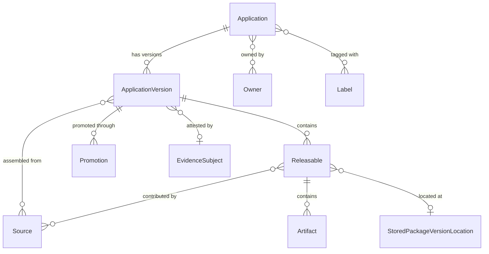
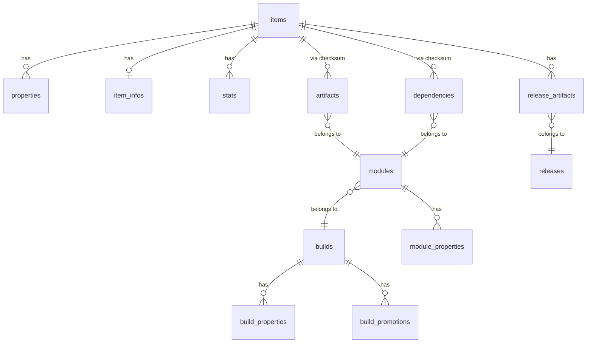
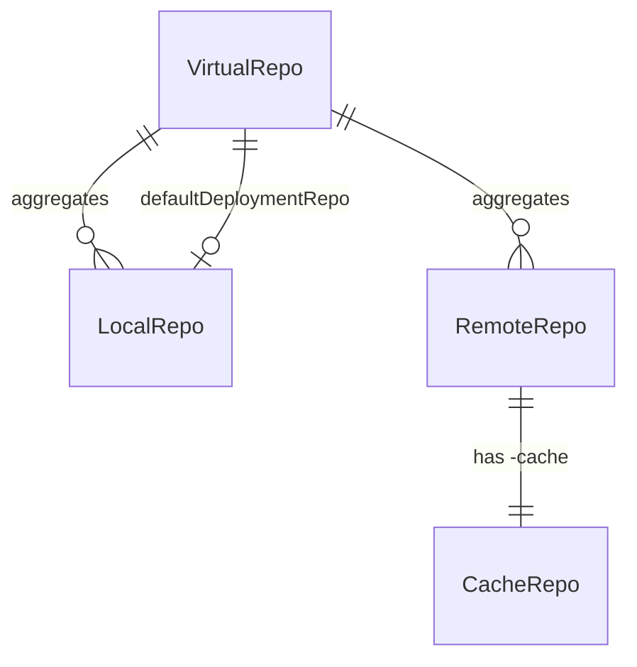
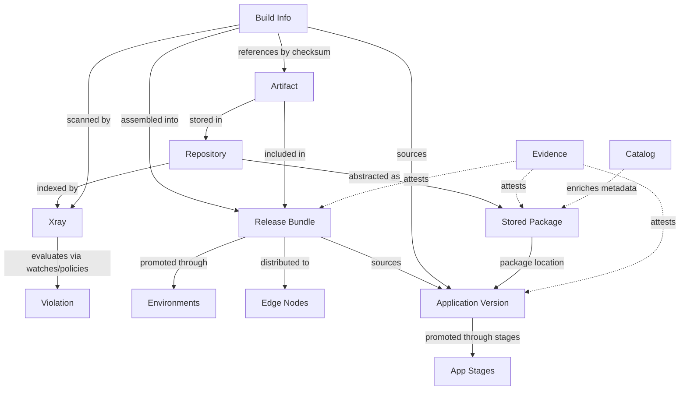
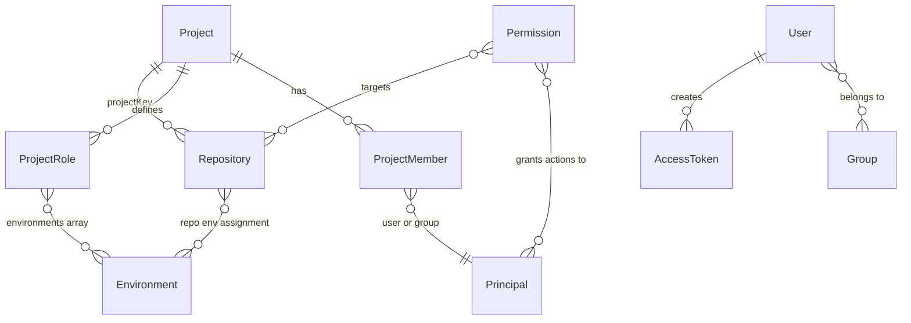
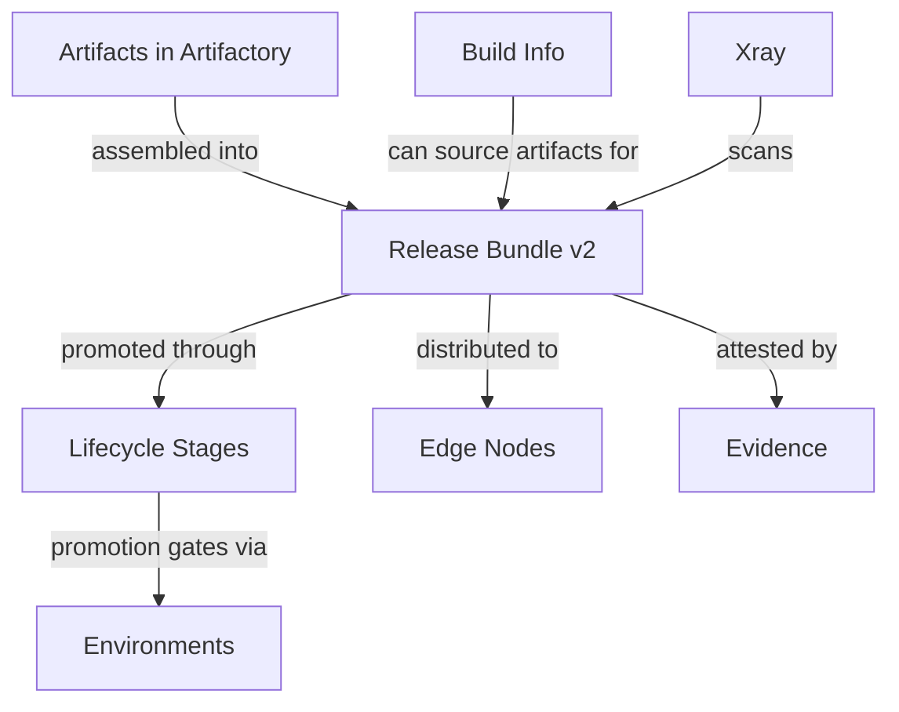
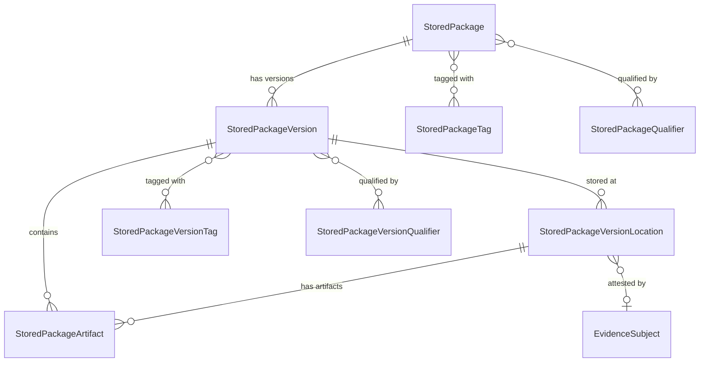
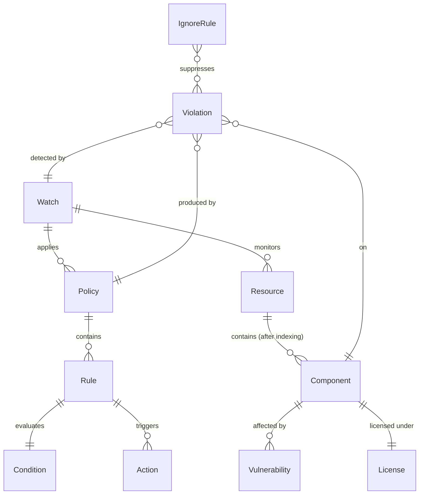

<!-- GENERATED by scripts/gen-steering.mjs from skills/ — do not edit by hand. -->


## INDEX

# Reference index — when to read which file

**Tier A** = `SKILL.md` At-a-glance floor (before first non-exempt `jf`).
**Tier B** = four files below — **MUST** before `jf api` / AQL / advanced CLI
I/O / MCP-via-shell; **not** before every CLI or `jf setup`.
**Tier C** = domain entries — ≤2–3 most specific; skip unused. Login / CLI
install when needed.

Paths relative to skill root. List **every** the `#jfrog-references` steering file (except this
one). CI: `tests/jfrog/test_reference_index_contract.py`.

---

## Tier B — path-gated (MUST before `jf api` / advanced CLI)

Ordinary CLI / `jf setup` → Tier A only. Skipping any below on a Tier B path =
hard-rule violation.

- **Gotchas / caveats / do-don'ts**: **MUST** the `cli-gotchas` section of the `#jfrog-references` steering on Tier B — not replaceable by SKILL.md Tier A floor
- **`jf api` prefixes / flags / GraphQL**: **MUST** the `jf-api` section of the `#jfrog-references` steering before `jf api`
- **Temp files / `$$` / no re-fetch**: **MUST** the `preserving-command-output` section of the `#jfrog-references` steering before advanced I/O
- **Namespaces / top-level cmds / Pipelines sunset**: **MUST** the `cli-command-discovery` section of the `#jfrog-references` steering when discovery beyond `--help`

Tier C (when needed — not Tier B):

- **Login / add server**: the `jfrog-login-flow` section of the `#jfrog-references` steering
- **CLI install / upgrade / `jq` missing**: the `jfrog-cli-install-upgrade` section of the `#jfrog-references` steering

---

## Domain / on-demand (INDEX navigation)

Load the most specific file for the task. Avoid more than 2–3 reference files
for one operation.

## Cross-domain

- **Disambiguating a JFrog entity, understanding entity types, or planning operations that span multiple products**: read the `jfrog-entity-index` section of the `#jfrog-references` steering, then follow pointers to the relevant domain file
- **Looking up documentation URLs**: read the `jfrog-url-references` section of the `#jfrog-references` steering

## Artifactory

- **Repository types, artifacts, builds, properties, or permission targets (concepts)**: read the `artifactory-entities` section of the `#jfrog-references` steering
- **Stored packages, package versions, version locations, or the metadata layer over Artifactory (concepts)**: read the `stored-packages-entities` section of the `#jfrog-references` steering
- **Repo, file, build, permission, user/group, or replication operations**: if the JFrog MCP server exposes a tool for the operation, prefer it. For CLI/API fallback, read the `artifactory-operations` section of the `#jfrog-references` steering (for **listing builds** use AQL with `limit`/`offset` — see § *Listing build names*; for **full build detail** use `GET /api/build/<name>/<number>?project=` — see § *Retrieving full build info*)
- **AQL queries**: read the `artifactory-aql-syntax` section of the `#jfrog-references` steering
- **Artifactory REST beyond the CLI, structured JSON templates (replacing interactive wizards), or any Artifactory API gap**: read the `artifactory-api-gaps` section of the `#jfrog-references` steering

## Xray & security

- **Watches, policies, violations, components, or vulnerability scanning (concepts)**: read the `xray-entities` section of the `#jfrog-references` steering
- **Exposures scanning results (secrets, IaC, service misconfigurations, application security risks)**: read the `xray-entities` section of the `#jfrog-references` steering § Exposures (Advanced Security)
- **Package install/resolve/download failure blamed on Curation — 403 from a curated remote, `ETARGET` / "no matching version", a version missing from the index, "why was package X blocked?", or a waiver after a block**: load the `jfrog-package-curation` workflow skill and follow its "Troubleshoot a failure" section (index-time CVS audit + download-time package audit → root cause + remediation, MCP only). Its "Check & download" section instead handles proactive "is this package safe to download?".
- **Is this package safe / allowed / curated? Downloading npm, Maven, PyPI, Go, or similar packages via JFrog**: load the `jfrog-package-curation` workflow skill and follow its "Check & download" section.
- **Curation audit events (approved/blocked packages, dry-run policy evaluations, curation export) without a failure to triage**: read the `xray-entities` section of the `#jfrog-references` steering § Curation audit events

## Release lifecycle & distribution

- **Release bundles, lifecycle stages, distribution, or evidence (concepts)**: read the `release-lifecycle-entities` section of the `#jfrog-references` steering
- **Applications, application versions, releasables, promotions, or AppTrust (concepts)**: read the `apptrust-entities` section of the `#jfrog-references` steering

## Catalog

- **Public or custom catalog, package metadata, vulnerability advisories, licenses, OpenSSF, or MCP services (concepts)**: if the JFrog MCP server exposes a catalog tool, prefer it for single-package lookups. For deeper queries, read the `catalog-entities` section of the `#jfrog-references` steering
- **CVE details, vulnerability lookup by CVE ID, or severity/affected-packages/fix-versions for a specific CVE**: prefer an MCP vulnerability-lookup tool if the JFrog MCP server exposes one. Otherwise read the `onemodel-query-examples` section of the `#jfrog-references` steering § *Public security domain* for the `searchVulnerabilities` query shape — this is self-contained; do not load the `jfrog-package-curation` skill for pure CVE lookups

## OneModel (GraphQL)

- **GraphQL queries** (applications, packages, evidence, release bundles, catalog, cross-domain, or "list/search my" platform entities): read the `onemodel-graphql` section of the `#jfrog-references` steering
- **Query templates and domain-specific examples**: read the `onemodel-query-examples` section of the `#jfrog-references` steering
- **Pagination, filtering, GraphQL variables, or date formatting**: read the `onemodel-common-patterns` section of the `#jfrog-references` steering

## Platform administration

- **Platform structure, project/repo membership, or project roles vs environments (concepts)**: read the `platform-access-entities` section of the `#jfrog-references` steering
- **Access tokens, stats, projects, or system health**: read the `platform-admin-operations` section of the `#jfrog-references` steering
- **Managing JFrog Projects, members, or environments**: read the `projects-api` section of the `#jfrog-references` steering
- **Platform REST beyond the CLI, or any platform-level API gap**: read the `platform-admin-api-gaps` section of the `#jfrog-references` steering

## General patterns

- **Batching, parallel Shell calls, or launching subagents**: read the `general-parallel-execution` section of the `#jfrog-references` steering
- **Large or parallel data gathering, list-vs-detail APIs, cache hygiene**: read the `general-bulk-operations-and-agent-patterns` section of the `#jfrog-references` steering
- **Standalone HTML report with JFrog-aligned styling**: read the `jfrog-brand-html-report` section of the `#jfrog-references` steering
- **Reusable gotchas from past tasks**: read or extend the `general-use-case-hints` section of the `#jfrog-references` steering


## apptrust-entities

# AppTrust entities

When to read this file:

- Working with **applications**, **application versions**, or **releasables**.
- Querying or managing **application version promotions** through stages.
- Understanding **sources** (builds, release bundles, other app versions) feeding an application version.
- OneModel GraphQL with `applications` query root.

AppTrust via **OneModel GraphQL API** (`/onemodel/api/v1/graphql`). No CLI.

OneModel workflow (credentials, schema fetch, validation, execution):
the `onemodel-graphql` section of the `#jfrog-references` steering.

## Entity relationship overview



## Application

Top-level software application in AppTrust. Belongs to a JFrog Project;
container for versions, ownership, criticality.

| Field | Description |
|-------|-------------|
| `key` | Unique ID (`applicationKey` / `appKey` elsewhere) |
| `projectKey` | JFrog Project |
| `displayName` | Human-readable name |
| `criticality` | `unspecified`, `low`, `medium`, `high`, `critical` |
| `maturityLevel` | `unspecified`, `experimental`, `production`, `end_of_life` |
| `owners` | Owning users/groups |
| `labels` | Key-value categorization |

Query: `applications.getApplication(key: "...")` or
`applications.searchApplications(where: {...})`.

## Application version

Versioned instance of an application — releasable artifacts, sources, promotion
history through lifecycle stages.

| Field | Description |
|-------|-------------|
| `application` | Parent application |
| `version` | Version identifier (semantic or custom) |
| `tag` | Optional tag |
| `status` | Processing status: `STARTED`, `FAILED`, `COMPLETED`, `DELETING` |
| `releaseStatus` | Release maturity: `PRE_RELEASE`, `RELEASED`, `TRUSTED_RELEASE` |
| `currentStageName` | Latest promoted stage (null if never promoted) |
| `createdBy`, `createdAt` | Audit fields |
| `evidenceSubject` | Evidence attestation anchor (shared across domains) |

`releaseStatus` ≠ `status`: `status` = creation process; `releaseStatus` = release maturity.

Query: `applications.getApplicationVersion(applicationKey: "...", version: "...")`
or `applications.searchApplicationVersions(where: {...})`.

## Releasable

Deployable unit within an application version — **package version** or individual **artifact**.

| Field | Description |
|-------|-------------|
| `name` | Package name or artifact file name |
| `version` | Package version (empty for non-package artifacts) |
| `packageType` | Repository package type (docker, maven, generic, etc.) |
| `releasableType` | `artifact` or `package_version` |
| `sha256` | Leading file checksum (e.g. manifest for Docker images) |
| `totalSize` | Sum of all artifact sizes in bytes |
| `sources` | Sources that contributed to this releasable |
| `artifacts` | Individual files that make up the releasable |
| `packageVersionLocation` | Link to `StoredPackageVersionLocation` for package releasables |
| `vcsCommit` | VCS commit details (for AppTrust-bound package versions) |

Releasables bridge application model to Artifactory storage. `packageVersionLocation`
→ Stored Packages domain (`stored-packages-entities.md`).

## Application version promotion

Promotion of application version between stages. All attempts recorded including failures.

| Field | Description |
|-------|-------------|
| `sourceStageName` | Stage being promoted from (empty for first promotion) |
| `targetStageName` | Stage being promoted to |
| `status` | `SUBMITTED`, `STARTED`, `PENDING`, `COMPLETED`, `FAILED`, `REJECTED` |
| `createdBy`, `createdAt` | Who initiated and when |
| `artifacts` | Artifacts included in this promotion (repo + path) |
| `messages` | Error messages if the promotion failed |

Same environment/stage model as Release Bundle promotions
(`release-lifecycle-entities.md`), at application level.

## Sources

How releasables were assembled into an application version. Four types:

| Source type | Fields | Description |
|-------------|--------|-------------|
| **Build** | `name`, `number`, `startedAt`, `repositoryKey` | A CI/CD build that produced releasables |
| **ReleaseBundle** | `name`, `version` | A release bundle whose artifacts were included |
| **ApplicationVersion** | `applicationKey`, `version` | Another application version (composition) |
| **Direct** | (none) | Directly included without an associated build or bundle |

At application version level (all sources) and releasable level (per-releasable sources).

## Artifacts (within application versions)

Individual files within releasables.

| Field | Description |
|-------|-------------|
| `filePath` | Path in the repository (excluding repo key) |
| `downloadPath` | Full path for downloading from a Release Bundle repository |
| `sha256` | Checksum |
| `size` | Size in bytes |
| `evidenceSubject` | Evidence attestation anchor |

## Cross-domain connections

Via OneModel GraphQL:

- **Evidence** — `ApplicationVersion.evidenceSubject` and
  `ApplicationVersionArtifact.evidenceSubject` → Evidence domain via
  `EvidenceSubject.fullPath`.
- **Stored Packages** — `Releasable.packageVersionLocation` →
  `StoredPackageVersionLocation` (physical Artifactory location).
- **Release Bundles** — source type `ReleaseBundle` → Release Lifecycle name/version.
- **Builds** — source type `Build` → Artifactory build-info records.


## artifactory-api-gaps

# Artifactory API Gaps

REST operations without CLI commands. Invoke via `jf api <path> [flags]`
(auth automatic against active `jf config` server; see base skill
*Invoking platform APIs with `jf api`*).

## Repository management

### Get repository configuration
```bash
jf api /artifactory/api/repositories/<repo-key>
```
Full JSON repo config. Useful as template for similar repos.

### List all repositories
```bash
jf api /artifactory/api/repositories
```
Optional query params (combinable): `type` (one of `local`, `remote`,
`virtual`, `federated`), `packageType` (e.g. `docker`, `maven`, `npm`,
`pypi`, `generic`), `project`. Examples:
```bash
jf api "/artifactory/api/repositories?type=local"
jf api "/artifactory/api/repositories?packageType=docker"
jf api "/artifactory/api/repositories?type=remote&packageType=maven&project=my-project"
```

### Get repositories (v2)
```bash
jf api /artifactory/api/repositories/configurations
```
Optional query params (combinable, comma-separated values allowed):
`repoType` (case-insensitive; one of `local`, `remote`, `virtual`,
`federated`) and `packageType` (e.g. `maven`, `docker`, `npm`). Note:
`repo_type` is silently ignored — the correct name is `repoType`.
Examples:
```bash
jf api "/artifactory/api/repositories/configurations?repoType=local"
jf api "/artifactory/api/repositories/configurations?packageType=maven"
jf api "/artifactory/api/repositories/configurations?repoType=local,remote&packageType=docker"
```

### Check if repository exists
```bash
jf api /artifactory/api/repositories/<repo-key> -X HEAD
# 200 = exists, 400 = does not exist
```

## Storage and system

### Get storage summary
```bash
jf api /artifactory/api/storageinfo
```

### Refresh storage summary
```bash
jf api /artifactory/api/storageinfo/calculate -X POST
```

### Get storage item info
```bash
jf api "/artifactory/api/storage/<repo>/<path>"
```

### System ping
```bash
jf api /artifactory/api/system/ping
```

### System version
```bash
jf api /artifactory/api/system/version
```

### System configuration
```bash
jf api /artifactory/api/system/configuration
```

## Search (beyond CLI)

### AQL queries
```bash
jf api /artifactory/api/search/aql \
  -X POST -H "Content-Type: text/plain" \
  -d 'items.find({"repo":"my-repo","name":{"$match":"*.jar"}})'
```

Remote repo content — query `-cache` suffixed repo:
```bash
jf api /artifactory/api/search/aql \
  -X POST -H "Content-Type: text/plain" \
  -d 'items.find({"repo":"my-remote-cache"})'
```

### Property search
```bash
jf api "/artifactory/api/search/prop?key=value&repos=my-repo"
```

### Checksum search
```bash
jf api "/artifactory/api/search/checksum?sha256=<sha256>"
```

### GAVC search (Maven)
```bash
jf api "/artifactory/api/search/gavc?g=com.example&a=mylib&v=1.0"
```

## User and group management

User/group operations via Access service. See
`platform-admin-api-gaps.md` (Users / Groups sections).

## Metadata calculation

Trigger metadata recalculation for various package types:
```bash
# Maven
jf api /artifactory/api/maven/calculateMetaData/<repo-key> -X POST

# npm
jf api /artifactory/api/npm/<repo-key>/reindex -X POST

# Docker
# (automatic, no manual trigger)

# PyPI
jf api /artifactory/api/pypi/<repo-key>/reindex -X POST

# Helm
jf api /artifactory/api/helm/<repo-key>/reindex -X POST

# Debian
jf api /artifactory/api/deb/reindex/<repo-key> -X POST
```

## Trash can and garbage collection

### Empty trash
```bash
jf api /artifactory/api/trash/empty -X POST
```

### Restore from trash
```bash
jf api "/artifactory/api/trash/restore/<repo>/<path>" -X POST
```

### Run garbage collection
```bash
jf api /artifactory/api/system/storage/gc -X POST
```

## Federated repositories (beyond basic CRUD)

### Get federation status
```bash
jf api /artifactory/api/federation/status/<repo-key>
```

### Trigger full sync
```bash
jf api "/artifactory/api/federation/fullSyncAll/<repo-key>" -X POST
```

## Build info (beyond CLI)

### List builds (prefer scoped queries)

**Unscoped** `GET /artifactory/api/build` can **time out** on busy instances.
Prefer project- or repo-scoped listing + detail GETs. Flow: `artifactory-operations.md`
§ *Listing build names*.

```bash
# Project scope — build names (latest per name)
jf api "/artifactory/api/build?project=<project-key>"

# Project scope — all run numbers for one build name (response: buildsNumbers)
jf api "/artifactory/api/build/<build-name>?project=<project-key>"

# Build-info repo scope — alternative when you know the repo key
jf api "/artifactory/api/build?buildRepo=<build-info-repo-key>"
```

### Get build info
```bash
# Default build-info repo only (no project / non-default repo)
jf api "/artifactory/api/build/<build-name>/<build-number>"

# Project or custom build-info repo
jf api "/artifactory/api/build/<build-name>/<build-number>?project=<project-key>"
jf api "/artifactory/api/build/<build-name>/<build-number>?buildRepo=<build-info-repo-key>"
```

### Delete builds
```bash
jf api /artifactory/api/build/delete \
  -X POST -H "Content-Type: application/json" \
  -d '{"buildName":"my-build","buildNumbers":["1","2"]}'
```


## artifactory-aql-syntax

# AQL (Artifactory Query Language)

AQL queries are sent as POST requests with `Content-Type: text/plain`:

```bash
jf api /artifactory/api/search/aql \
  -X POST -H "Content-Type: text/plain" -d '<query>'
```

## Query structure

```
<domain>.find(<criteria>)
  .include(<fields>)
  .sort(<sort>)
  .offset(<n>)
  .limit(<n>)
  .distinct(<boolean>)
```

Only `.find()` is required; others optional and chainable.
**Server enforces the chain order above.** `.include()` before `.sort()`,
`.sort()` before `.offset()`, etc. Out of order (e.g. `.sort()` before
`.include()`) → parse error.

**Mandatory include fields:** `items` → `"repo","path","name"`; `builds` →
`"name","number","repo"`. Always include these even when you need a subset —
narrow with `jq` post-query:

```
items.find({"name":"commons-lang3-3.12.0.jar"})
  .include("repo","path","name")
  .distinct(true)
```

## Domains

13 queryable domains — each entity type has its own fields.

| Domain               | Query name          | Description                                    |
| -------------------- | ------------------- | ---------------------------------------------- |
| Items                | `items`             | Artifacts stored in repositories (most common) |
| Properties           | `properties`        | Key-value properties on items                  |
| Item infos           | `item.infos`        | Property modification metadata                 |
| Statistics           | `stats`             | Download statistics (local and remote)         |
| Builds               | `builds`            | Build info records                             |
| Build modules        | `modules`           | Modules within a build                         |
| Build artifacts      | `artifacts`         | Artifacts produced by a build module           |
| Build dependencies   | `dependencies`      | Dependencies consumed by a build module        |
| Build properties     | `build.properties`  | Key-value properties on builds                 |
| Build promotions     | `build.promotions`  | Build promotion records                        |
| Module properties    | `module.properties` | Key-value properties on build modules          |
| Release bundles      | `releases`          | Release bundle records                         |
| Release bundle files | `release_artifacts` | Files within a release bundle                  |

## Domain relationships

Join paths below. Cross-domain queries traverse these links — related-domain
fields in criteria/includes use a prefixed domain path.



**Key:** Items ↔ build artifacts/dependencies via SHA-1 checksum match (not
a direct key). Path items → builds: items → artifacts → modules → builds.

### Cross-domain field paths

Related-domain field → dot-separated domain path:

```
items.find({"artifact.module.build.name":"my-build"})
  .include("name","repo","path","artifact.module.build.number")
```

Common cross-domain paths from items:

- `stat.downloads`, `stat.downloaded` — download statistics
- `property.key`, `property.value` — item properties
- `artifact.module.build.name` — build that produced the item
- `artifact.module.build.number` — build number

From builds:

- `module.artifact.name` — artifacts in build modules
- `module.dependency.name` — dependencies of build modules

## Fields by domain

Types: `string`, `date`, `int`, `long`, `itemType` (`file`, `folder`, `any`).
"Default" = returned without explicit `.include()`.

### items

| Field           | Type     | Default |
| --------------- | -------- | ------- |
| `repo`          | string   | yes     |
| `path`          | string   | yes     |
| `name`          | string   | yes     |
| `type`          | itemType | yes     |
| `size`          | long     | yes     |
| `depth`         | int      | yes     |
| `created`       | date     | yes     |
| `created_by`    | string   | yes     |
| `modified`      | date     | yes     |
| `modified_by`   | string   | yes     |
| `updated`       | date     | yes     |
| `actual_md5`    | string   | no      |
| `actual_sha1`   | string   | no      |
| `sha256`        | string   | no      |
| `original_md5`  | string   | no      |
| `original_sha1` | string   | no      |

Computed: `virtual_repos` — virtual repos that include the item's actual
repo. Requires `.include("virtual_repos")` plus `repo`,`path`,`name` in
the result set.

### properties

| Field   | Type   | Default |
| ------- | ------ | ------- |
| `key`   | string | yes     |
| `value` | string | yes     |

### stats

| Field                  | Type   | Default |
| ---------------------- | ------ | ------- |
| `downloads`            | int    | yes     |
| `downloaded`           | date   | yes     |
| `downloaded_by`        | string | yes     |
| `remote_downloads`     | int    | yes     |
| `remote_downloaded`    | date   | yes     |
| `remote_downloaded_by` | string | yes     |
| `remote_origin`        | string | yes     |
| `remote_path`          | string | yes     |

### item.infos

| Field               | Type   | Default |
| ------------------- | ------ | ------- |
| `props_modified`    | date   | yes     |
| `props_modified_by` | string | yes     |
| `props_md5`         | string | yes     |

### builds

| Field         | Type   | Default |
| ------------- | ------ | ------- |
| `url`         | string | yes     |
| `name`        | string | yes     |
| `number`      | string | yes     |
| `started`     | date   | yes     |
| `created`     | date   | yes     |
| `created_by`  | string | yes     |
| `modified`    | date   | yes     |
| `modified_by` | string | yes     |
| `repo`        | string | no      |

### modules

| Field  | Type   | Default |
| ------ | ------ | ------- |
| `name` | string | yes     |

### artifacts

| Field  | Type   | Default |
| ------ | ------ | ------- |
| `name` | string | yes     |
| `type` | string | yes     |
| `sha1` | string | yes     |
| `md5`  | string | yes     |

### dependencies

| Field   | Type   | Default |
| ------- | ------ | ------- |
| `name`  | string | yes     |
| `scope` | string | yes     |
| `type`  | string | yes     |
| `sha1`  | string | yes     |
| `md5`   | string | yes     |

### build.properties

| Field   | Type   | Default |
| ------- | ------ | ------- |
| `key`   | string | yes     |
| `value` | string | yes     |

### build.promotions

| Field        | Type   | Default |
| ------------ | ------ | ------- |
| `created`    | date   | yes     |
| `created_by` | string | yes     |
| `status`     | string | yes     |
| `repo`       | string | yes     |
| `comment`    | string | yes     |
| `user`       | string | yes     |

### module.properties

| Field   | Type   | Default |
| ------- | ------ | ------- |
| `key`   | string | yes     |
| `value` | string | yes     |

### releases

| Field          | Type                        | Default |
| -------------- | --------------------------- | ------- |
| `name`         | string                      | yes     |
| `version`      | string                      | yes     |
| `status`       | string                      | yes     |
| `created`      | date                        | yes     |
| `signature`    | string                      | yes     |
| `type`         | string (`SOURCE`, `TARGET`) | yes     |
| `storing_repo` | string                      | yes     |

### release_artifacts

| Field  | Type   | Default |
| ------ | ------ | ------- |
| `path` | string | yes     |

## Comparators

| Operator   | Meaning                          | Example                              |
| ---------- | -------------------------------- | ------------------------------------ |
| `$eq`      | Equals (default if omitted)      | `{"type":"file"}`                    |
| `$ne`      | Not equals                       | `{"type":{"$ne":"folder"}}`          |
| `$eqic`    | Equals, case-insensitive         | `{"name":{"$eqic":"README.md"}}`     |
| `$match`   | Wildcard match (`*`, `?`)        | `{"name":{"$match":"*.jar"}}`        |
| `$matchic` | Wildcard match, case-insensitive | `{"name":{"$matchic":"*.JAR"}}`      |
| `$nmatch`  | Wildcard not-match               | `{"name":{"$nmatch":"*-SNAPSHOT*"}}` |
| `$gt`      | Greater than                     | `{"size":{"$gt":"1000000"}}`         |
| `$gte`     | Greater than or equal            | `{"stat.downloads":{"$gte":"10"}}`   |
| `$lt`      | Less than                        | `{"size":{"$lt":"5000"}}`            |
| `$lte`     | Less than or equal               | `{"modified":{"$lte":"2025-01-01"}}` |

### Boolean operators

| Operator | Description                                                            |
| -------- | ---------------------------------------------------------------------- |
| `$and`   | All conditions must match (implicit when fields are at the same level) |
| `$or`    | Any condition must match                                               |

```
items.find({"$and":[
  {"repo":"my-repo"},
  {"$or":[
    {"name":{"$match":"*.jar"}},
    {"name":{"$match":"*.war"}}
  ]}
]})
```

### Relative date comparators

`$last` / `$before` for relative dates:

| Operator  | Meaning                                                 | Example                         |
| --------- | ------------------------------------------------------- | ------------------------------- |
| `$last`   | Within the last N period (equivalent to `$gt` from now) | `{"modified":{"$last":"7d"}}`   |
| `$before` | Before the last N period (equivalent to `$lt` from now) | `{"created":{"$before":"3mo"}}` |

Units: `d`, `w`, `mo`, `y`, `s`, `mi`, `ms`.

### Multi-property AND

Match property A=1 **and** B=2 (different property rows) with `$and` + `@`:

```
items.find({"$and":[
  {"@build.name":"my-build"},
  {"@build.number":"42"}
]})
```

`$msp` (multi-set property) is **unreliable in practice** — often 0 results
even when matches exist. Prefer `$and` + `@` (verified).

## Date queries

Absolute dates → ISO 8601:

```
items.find({"modified":{"$gt":"2025-06-01T00:00:00.000Z"}})
```

Or relative dates (preferred — no hardcoded timestamps):

```
items.find({"modified":{"$last":"30d"}})
items.find({"created":{"$before":"6mo"}})
```

## Property queries

Two equivalent property-filter syntaxes:

**`@key` shorthand** — concise, single property conditions:

```
items.find({"repo":"my-repo","@build.name":"my-build","type":"file"})
```

**Explicit form** — `property.key`/`property.value` pairs:

```
items.find({
  "repo":"my-repo",
  "property.key":"build.name",
  "property.value":"my-build"
})
```

**Multi-property AND** — same `$and` + `@` pattern as
[Multi-property AND](#multi-property-and) above (do not re-copy here).

> **Note:** The `@key` shorthand works inside `$and`. For `$or`, use the
> explicit `property.key`/`property.value` form if the shorthand does not
> return expected results.

## Include

Fields to return. No `.include()` → domain defaults.

**`.include()` replaces defaults — list every required field:**

- `items`: always `"repo","path","name"` (else server rejects)
- `builds`: always `"name","number","repo"`

```
items.find({"repo":"my-repo"})
  .include("name","repo","path","size","sha256","stat.downloads")
```

Cross-domain includes use dot-separated paths:

```
items.find({"repo":"my-repo"})
  .include("name","repo","path","property.key","property.value")
```

## Sort and pagination

```
items.find({"repo":"my-repo"})
  .sort({"$desc":["modified"]})
  .offset(0)
  .limit(50)
```

Sort: `$asc` / `$desc`. Sort fields must appear in the result set
(explicit `.include()` or defaults). See
[Before constructing a query](#before-constructing-a-query) for sort
performance rules.

## Distinct

Deduplicate rows:

```
items.find({"repo":"my-repo"}).distinct(true)
```

## Validation rules

Server constraints — violations → error:

**Non-admin:**

- `items` results must include `repo`, `path`, `name` (permission filtering)
- `builds` results must include `name`, `number`, `repo`

**Transitive** (`.transitive()` through virtual repos):

- `items` domain only
- Include subdomains limited to `items` and `properties`
- Repo criteria: `$eq` only, single repository
- No `offset` or `sort`

## Before constructing a query

Checks before writing AQL:

1. **Never `.sort()` without a `repo` filter** — full table scan. Sort
   client-side with `jq`. Cross-domain sort fields (e.g. `stat.downloads` in
   `items.find()`) are silently ignored — fetch all + sort client-side.
2. **Always `.limit()`** — no default; unbounded queries can time out / OOM.
   Broad queries without `repo` are especially expensive.
3. **`range.total` = returned count, not total matching** — no count-only
   mode. True total → paginate `.offset()` until a page returns fewer than
   the limit.
4. **No repo-type field** — local-only: pre-query
   `GET /api/repositories?type=local` and add names to criteria (small lists),
   or query without repo filter and drop `-cache`/`-virtual` via `jq`.
5. **Narrow server-side first** — add every applicable filter (`created_by`,
   `created`, `type`, `name`) before client-side `jq`.

## Common query patterns

### Find all JARs in a repo

```
items.find({"repo":"libs-release","name":{"$match":"*.jar"}})
```

### Find large files (> 100 MB)

```
items.find({"repo":"my-repo","size":{"$gt":"104857600"},"type":"file"})
```

### Find Maven SNAPSHOT JARs

Use `*-SNAPSHOT*.jar` (not `*-SNAPSHOT.jar`) to also match classifiers
(`-sources.jar`, `-javadoc.jar`):

```
items.find({"repo":"libs-snapshot","name":{"$match":"*-SNAPSHOT*.jar"},"type":"file"})
```

### Find artifacts modified in the last 7 days

```
items.find({"repo":"my-repo","modified":{"$last":"7d"},"type":"file"})
  .sort({"$desc":["modified"]})
  .limit(100)
```

### Docker queries

`"name":"manifest.json"` → **list tags** (one per tag).
`"name":{"$match":"*manifest.json"}` → **all manifests** (includes
`list.manifest.json` for multi-arch — see [Gotchas](#gotchas)).

```
items.find({"repo":"docker-local","path":{"$match":"my-image/*"},"name":"manifest.json"})
```

### Docker image size

**Do not use AQL** — layer blobs live at `<image>/sha256:<digest>/`, not
under `<image>/<tag>/`. Use the V2 manifest API (returns `layers[].size`):

```bash
jf api "/artifactory/api/docker/<repo>/v2/<image>/manifests/<tag>" \
  -H "Accept: application/vnd.docker.distribution.manifest.v2+json"
```

For multi-arch: response is an image index — fetch each platform manifest
by digest for layers.

### Find artifacts with a specific property

See [Property queries](#property-queries) (`@key` shorthand and explicit form).

### Find never-downloaded files (zero download count)

Zero-download items lack a stats row — filter client-side
(see [Gotchas](#gotchas)):

```bash
jf api /artifactory/api/search/aql \
  -X POST -H "Content-Type: text/plain" -d '
items.find({"repo":"my-repo","type":"file"})
  .include("repo","path","name","size","stat.downloads")
' | jq '[.results[] | select((.stats[0].downloads // 0) == 0) | {repo, path, name, size}]'
```

### Find artifacts not downloaded in 90 days

Only previously-downloaded items (see [Gotchas](#gotchas)). Combine with
never-downloaded pattern above for full coverage.

```
items.find({
  "repo":"my-repo",
  "type":"file",
  "stat.downloaded":{"$before":"90d"}
}).include("name","repo","path","stat.downloaded","size")
```

### Find items by build name (cross-domain)

```
items.find({"artifact.module.build.name":"my-service"})
  .include("name","repo","path","artifact.module.build.number")
  .sort({"$desc":["modified"]})
  .limit(50)
```

### Find builds by name

Non-admin must include `name`, `number`, `repo` — omit any → error.

```
builds.find({"name":{"$match":"*my-service*"}})
  .include("name","number","repo","started")
  .sort({"$desc":["started"]})
  .limit(10)
```

### Find build artifacts

```
artifacts.find({"module.build.name":"my-service","module.build.number":"42"})
  .include("name","type","sha1","md5")
```

### Find build dependencies

```
dependencies.find({"module.build.name":"my-service","module.build.number":"42"})
  .include("name","scope","type","sha1")
```

### Remote repository content

Remote artifacts live in a `-cache` suffixed repo. Query the cache, not the
remote itself:

```
items.find({"repo":"npm-remote-cache","name":{"$match":"*.tgz"}})
```

## Gotchas

- The request body is **plain text**, not JSON — use
`Content-Type: text/plain`.
- String values in criteria must be quoted, including numeric comparisons
(`"size":{"$gt":"1000"}` not `"size":{"$gt":1000}`).
- Remote repo content lives in `<repo>-cache`, not `<repo>`.
- Sort fields must appear in the result set (included explicitly or by
default).
- Non-admin `items` queries must return `repo`, `path`, `name`.
- Non-admin `builds` queries must return `name`, `number`, `repo`.
- Items connect to builds through checksum matching (SHA-1), so cross-domain
queries between items and builds are valid but traverse multiple joins.
- The `path` value for items at the **root** of a repository is `"."`, not
`""` or `"/"`. Use `"path":"."` to match root-level files.
- **Docker `list.manifest.json`** — multi-arch images store two manifest files per
  tag: `manifest.json` (platform-specific manifest) and `list.manifest.json` (OCI
  image index). Filtering by `"name":"manifest.json"` is correct for tag listing
  (one result per tag), but silently excludes `list.manifest.json` entries. Use
  `"name":{"$match":"*manifest.json"}` when querying by uploader, date range, or
  any context where all manifest pushes should be counted.
- **`stat.downloads` filters do not match zero-download items** — never-downloaded
  items lack a stats row so the join finds nothing. Use the client-side `jq`
  approach in "Find never-downloaded files" above.
- `$match` uses SQL-style wildcards: `*` matches any characters, `?` matches
exactly one character. It is **not** regex. Literal `_` and `%` in patterns
are escaped automatically.
- The `builds.number` field is a **string**, not an integer. Build numbers
like `"42"`, `"1.0.3"`, and `"SNAPSHOT-1"` are all valid.
- Release bundle `type` values are uppercase strings: `"SOURCE"` or
`"TARGET"`.
- Dates accept both ISO 8601 format (`"2025-06-01T00:00:00.000Z"`) and
epoch milliseconds as a string (`"1719792000000"`).
- The server silently excludes trash, support-bundle, and in-transit
repository content from AQL results. If an item exists but doesn't appear
in results, it may be in one of these hidden repos.
- Virtual repo queries are rewritten to search the underlying physical repos.
The `repo` field in results shows the physical repo name, not the virtual
repo name you queried.

## Official documentation

- https://docs.jfrog.com/artifactory/docs/artifactory-query-language
- https://docs.jfrog.com/artifactory/docs/aql-syntax
- https://docs.jfrog.com/artifactory/docs/aql-search-criteria
- https://docs.jfrog.com/artifactory/docs/aql-entities-fields-reference
- https://docs.jfrog.com/artifactory/docs/aql-query-output
- https://docs.jfrog.com/artifactory/docs/aql-query-execution
- https://docs.jfrog.com/artifactory/docs/aql-examples
- https://docs.jfrog.com/artifactory/docs/aql-repository-queries
- https://docs.jfrog.com/artifactory/docs/aql-performance


## artifactory-entities

# Artifactory entities

When to read this file:

- Working with **repositories** — need local/remote/virtual/federated type differences.
- Managing **artifacts**, **properties**, or **package types**.
- Working with **builds**, **build promotion**, or **permission targets**.
- Debugging repo-type issues (e.g. upload failures, missing search results).

CLI: `artifactory-operations.md`. API gaps: `artifactory-api-gaps.md`. AQL: `artifactory-aql-syntax.md`.

## Repositories

Repository = primary storage/resolution unit in Artifactory. Each repo has **key** (unique id), **package type** (immutable after creation), **repository class** (`rclass`) determining behavior.

### Repository types

| Type | `rclass` | Behavior | Stores artifacts? |
|------|----------|----------|-------------------|
| **Local** | `local` | Hosts artifacts deployed directly (upload, promote, copy, move) | Yes |
| **Remote** | `remote` | Proxies external URL; downloads cached in companion `-cache` repo | Only in `-cache` repo |
| **Virtual** | `virtual` | Aggregates local + remote repos under single URL for resolution | No (resolves from underlying repos) |
| **Federated** | `federated` | Local repo bi-directionally syncs across Platform Deployments | Yes (replicated across sites) |

### Key relationships and fields

- `key` — unique repo identifier (e.g. `libs-release-local`)
- `packageType` — layout + protocol (see Package types below)
- `rclass` — `local`, `remote`, `virtual`, or `federated`
- `url` — (remote only) external source URL being proxied
- `repositories` — (virtual only) ordered list of local/remote repos to aggregate
- `projectKey` — links repo to JFrog Project (see `platform-access-entities.md`)
- `environments` — repo environment assignment (RBAC + lifecycle)

### System repositories

Artifactory + Xray maintain **system repositories** for internal platform metadata. Not user-created — exclude when iterating repos for reporting, scanning, or auditing:

| Pattern | Purpose |
|---------|---------|
| `release-bundles` | Release Bundles V1 metadata |
| `release-bundles-v2` | Release Bundles V2 metadata |
| `artifactory-build-info` | Default build info storage |
| `*-release-bundles` | Project-scoped Release Bundles V1 |
| `*-release-bundles-v2` | Project-scoped Release Bundles V2 |
| `*-build-info` | Project-scoped build info storage |
| `*-application-versions` | AppTrust application version metadata |

Including these in aggregate queries (violation counts, storage reports, etc.) produces misleading results — platform metadata, not user artifacts.

### Remote repository cache

When Artifactory downloads via remote repo, cached copy stored in **separate local repo** named `<remote-key>-cache`. Critical for:

- **AQL queries** — search `-cache` repo, not remote repo key
- **Properties** — cached artifact properties live on `-cache` repo
- **Storage calculations** — cached artifacts consume storage under `-cache` repo

Remote repo key used for **configuration** (URL, credentials, inclusion/exclusion patterns) — does not directly contain artifacts.

### Virtual repository resolution

Virtual repo aggregates **local + remote repos** under single URL. Resolves by searching underlying repos in configured **order** — same artifact in multiple repos → first match wins.

Virtual repo may designate underlying **local** repo as **default deployment repository**. Uploads through virtual URL routed there. Without default deployment repo → read-only.



## Artifacts

Artifact = file in repository. Uniquely identified by **repo + path + name**.

Key attributes:
- `repo`, `path`, `name` — location identifier
- `size` — bytes
- `sha256`, `sha1`, `md5` — checksums (build-info records all three; Xray cross-references by sha256, AQL item↔build joins by sha1)
- `created`, `modified`, `created_by`, `modified_by` — audit fields

Artifacts are **content-addressable** — build info + Xray reference by checksum, not path. Move/copy changes path, not checksum → build associations follow artifact.

## Properties

Key-value metadata on artifacts or folders.

- Keys = strings; values = strings or string arrays
- Set via `jf rt set-props`, query via AQL or properties API
- Common uses: build metadata, maturity labels, promotion tracking, cleanup policies
- Remote-cached artifact properties live on `-cache` repo

## Package types

`packageType` on repo determines how Artifactory interprets contents — directory layout, metadata extraction, client protocols (Docker registry API, npm registry, Maven layout).

Common types: `maven`, `gradle`, `npm`, `docker`, `pypi`, `nuget`, `go`,
`helm`, `rpm`, `debian`, `generic`.

Package type **immutable** — cannot change after repo creation. Use `generic` when no specific type applies.

## Build info

Build info record captures CI/CD metadata: produced artifacts, consumed dependencies, build environment.

| Field | Description |
|-------|-------------|
| `name` + `number` | Unique build run identifier |
| `modules` | Modules, each with artifacts + dependencies |
| `vcs` | VCS metadata (revision, URL, branch) |
| `buildAgent`, `agent` | CI tool info |
| `properties` | Custom build-level properties |

Build info references artifacts **by checksum** (AQL item↔build joins by sha1; Xray cross-references by sha256):
- Build can reference artifacts across multiple repos
- Moving artifact does not break build association
- Xray scans build info by resolving checksums → components

Lifecycle: collect → publish → (optionally) promote → (optionally) scan.

## Build promotion

Promotion changes build **status**; can copy/move artifacts from source repo → target repo.

| Field | Description |
|-------|-------------|
| `status` | Target status label (e.g. `staged`, `released`) |
| `sourceRepo` | Where artifacts currently reside |
| `targetRepo` | Where artifacts should be moved/copied |
| `copy` | If `true`, copy instead of move |

Promotion records queryable via AQL (`build.promotions` domain) + build promotion API.

## Permissions

Permissions = RBAC policies mapping **resources** + **principals** (users, groups) → **actions**. Two models:

### Permissions V2 (Access Permissions) — current model

**Access service** (since 7.72.0, recommended 7.77.2+). All resource types.

| Component | Description |
|-----------|-------------|
| `name` | Permission name |
| `resources` | Map of resource type → targets + actions |

Resource types: `artifact` (repositories), `build`, `release_bundle`,
`destination` (Edge nodes), `pipeline_source`.

Each resource contains:
- `targets` — target names/patterns → include/exclude patterns
- `actions.users` — username → action list
- `actions.groups` — group name → action list

Actions uppercase: `READ`, `ANNOTATE`, `DEPLOY/CACHE`, `DELETE/OVERWRITE`,
`MANAGE_XRAY_METADATA`, `MANAGE`.

API: `POST/PUT/GET/DELETE /access/api/v2/permissions/{permissionName}`.

Documentation: [Permissions](https://docs.jfrog.com/administration/docs/permissions).

### Permission targets (V1) — legacy model

**Artifactory**-managed. Functional + backwards compatible; prefer V2 for new work. CLI: `jf rt permission-target-*`.

| Component | Description |
|-----------|-------------|
| `repositories` | Repo keys or patterns |
| `actions.users` | Username → action list |
| `actions.groups` | Group name → action list |

Actions lowercase: `read`, `write`, `annotate`, `delete`, `manage`.

Does **not** support `destination` or `pipeline_source` resource types.

API: `PUT /artifactory/api/security/permissions/{permissionName}`.

### Key differences

| Aspect | V1 (Permission Targets) | V2 (Access Permissions) |
|--------|------------------------|------------------------|
| Managed by | Artifactory | Access service |
| API base | `/artifactory/api/security/permissions/` | `/access/api/v2/permissions/` |
| Actions | lowercase (`read`, `write`) | uppercase (`READ`, `WRITE`) |
| Resource types | repos, builds, release bundles | + destinations, pipeline sources |
| Pattern fields | `includes_pattern` / `excludes_pattern` | `include_patterns` / `exclude_patterns` |
| CLI support | `jf rt permission-target-*` | No direct CLI commands (use REST) |

Project-scoped RBAC: see Project roles in `platform-access-entities.md`.

## Replication

Replication syncs artifacts + properties between repos — same instance or across Platform Deployments.

| Type | Direction | Trigger |
|------|-----------|---------|
| **Push** | Source → target | Scheduled or event-based |
| **Pull** | Target ← source | Scheduled |

Replication configs = JSON templates per repository. Both artifact content + properties replicated. Federated repos → automatic bi-directional replication across member nodes.


## artifactory-operations

# Artifactory Operations

CLI for Artifactory resources — `jf rt` namespace. Run `jf rt --help` for subcommands not listed here.

## Repository management

Repos from JSON templates:

1. Get template: existing config via
   `jf api /artifactory/api/repositories/<repo-key>`
   and modify, or craft JSON manually.
   Note: `jf rt repo-template` is interactive and cannot be used by agents.
2. Create: `jf rt repo-create <template.json>`
3. Update: `jf rt repo-update <template.json>`
4. Delete: `jf rt repo-delete <repo-pattern> --quiet`

List: `jf api /artifactory/api/repositories`

## File operations

- Upload: `jf rt upload <source> <target>`
- Download: `jf rt download <source> [target]`
- Search: `jf rt search <pattern>`
- Move: `jf rt move <source> <target>`
- Copy: `jf rt copy <source> <target>`
- Delete: `jf rt delete <pattern>`
- Set properties: `jf rt set-props <pattern> "key=value"`
- Delete properties: `jf rt delete-props <pattern> "key"`

### Searching across repositories

`jf rt search` expects `<repo>/<pattern>`. When repo unknown, agents often use
leading wildcard (`jf rt search "*/path/..."`) → unscoped AQL internally →
timeouts on large instances.

Use direct AQL with `name` and `path` — omitting `repo` searches all accessible
repos via indexed columns:

```bash
jf api /artifactory/api/search/aql \
  -X POST -H "Content-Type: text/plain" \
  -d 'items.find({
    "name":"<artifact-filename>",
    "path":"<directory/path/within/repo>"
  }).include("repo","path","name","size","sha256")'
```

Add `"repo":"<repo-name>"` when target repo is known.

## Build info

**Project scoping:** `?project=<key>` on **every** build detail call. User key
→ use it; else `?project=default`. AQL: `"repo":"<project-key>-build-info"` or
`"repo":"artifactory-build-info"` for default.

**Server rule:** 404 on `?project=<key>` ≠ try another server. Resolved server
only; on failure report and stop. See `SKILL.md` § *Server selection rules*.

### Publishing builds

- Collect env: `jf rt build-collect-env <name> <number>`
- Add git info: `jf rt build-add-git <name> <number>`
- Publish: `jf rt build-publish <name> <number>`
- Promote: `jf rt build-promote <name> <number> <target-repo>`
- Discard: `jf rt build-discard <name>`

### Listing build names

**Do not use `GET /api/build`** — no pagination; times out on large instances.
Always AQL with `limit` and `offset`.

**All builds** (no project scope):

```bash
jf api /artifactory/api/search/aql \
  -X POST -H "Content-Type: text/plain" \
  -d 'builds.find().include("name","number","repo","created").sort({"$desc":["created"]}).offset(0).limit(100)'
```

**Project-scoped** — filter by build-info repo
(`<project-key>-build-info`, or `artifactory-build-info` for default project):

```bash
jf api /artifactory/api/search/aql \
  -X POST -H "Content-Type: text/plain" \
  -d 'builds.find({"repo":"<project-key>-build-info"}).include("name","number","repo","created").sort({"$desc":["created"]}).offset(0).limit(100)'
```

**Pagination:** `range.total` vs `limit` → if exceeded, tell user: *"Showing
first 100 of N results (paginated). Ask for the next batch if needed."*
Increment `offset` by 100 per page.

**Output rule (mandatory):** AQL = one row per name+number. Extract **unique
build names** client-side (e.g. `jq '[.results[].builds.name] | unique'`). Present
**only deduplicated names** — no numbers, timestamps, run counts, or per-run
details (not even "bonus"/"most recent" table). Run details only if explicitly requested.

### Listing runs of a specific build

```bash
jf api /artifactory/api/search/aql \
  -X POST -H "Content-Type: text/plain" \
  -d 'builds.find({"name":"<build-name>"}).include("name","number","repo","created").sort({"$desc":["created"]}).offset(0).limit(100)'
```

Add `"repo":"<project-key>-build-info"` when project key known. Same pagination rules.

### Retrieving full build info

REST detail endpoint for a **single** run. Always include `?project=<key>`
(or `?project=default` when no key):

```bash
jf api "/artifactory/api/build/<name>/<number>?project=<key>"
```

Only `/api/build` endpoint to use — single record, no pagination.

### When a build is not found

404 on detail call → build likely in different project. **Ask user for project
key** — do not search across repos or servers.

### Repository listing vs build-info

`GET /artifactory/api/repositories?project=<key>&type=buildinfo` may return
empty list even when project-scoped build info exists (e.g. under `*-build-info`).
Prefer AQL to discover builds; empty repository list ≠ no builds.

## Permissions

Permission targets use JSON templates.
Note: `jf rt permission-target-template` is interactive.

- Create: `jf rt permission-target-create <template.json>`
- Update: `jf rt permission-target-update <template.json>`
- Delete: `jf rt permission-target-delete <name>`

## Users and groups

- Create users: `jf rt users-create --csv <file>`
- Create single user: `jf rt user-create` (check `--help` for options)
- Delete users: `jf rt users-delete <pattern>`
- Create group: `jf rt group-create <name>`
- Delete group: `jf rt group-delete <name>`
- Add users to group: `jf rt group-add-users <group> <users-list>`

User details/update via `jf api`:
```
jf api /access/api/v2/users/<username>
```

## Replication

Replication configs use JSON templates.
Note: `jf rt replication-template` is interactive.

- Create: `jf rt replication-create <template.json>`
- Delete: `jf rt replication-delete <repo-key>`


## catalog-entities

# Catalog entities

When to read this file:

- Querying **public package metadata** (descriptions, vulnerabilities, licenses, operational info).
- Working with **Custom Catalog** (org-specific labels, package views, federation).
- Looking up **vulnerability details** beyond Xray (advisories, EPSS, CWE, known exploits).
- Querying **OpenSSF scorecards**, **ML model metadata**, or **MCP service** registries.
- Using OneModel GraphQL with `publicPackages`, `customPackages`,
  `publicSecurityInfo`, `publicLegalInfo`, `publicOperationalInfo`,
  `publicCatalogLabels`, or `publicRemoteServices` query roots.

Catalog entities via **OneModel GraphQL API** (`/onemodel/api/v1/graphql`).

OneModel query workflow (credentials, schema fetch, validation, execution): the `onemodel-graphql` section of the `#jfrog-references` steering.

## Two catalog layers

| Layer | Scope | Description |
|-------|-------|-------------|
| **Public Catalog** | Global | JFrog global package DB — security, legal, operational metadata across ecosystems |
| **Custom Catalog** | Organization | Org overlay: custom labels, per-org views, federation config |

Custom Catalog overlays Public Catalog — org labels/metadata without changing public data.

## Public Catalog entities

### PublicPackage

Package in JFrog global package database.

| Field | Description |
|-------|-------------|
| `name` | Package name (`lodash`, `spring-boot-starter-web`) |
| `type` | Package type (`npm`, `maven`, `pypi`) |
| `ecosystem` | Ecosystem identifier |
| `description` | Rich-text description |
| `homepage`, `vcsUrl` | Package URLs |
| `vendor` | Maintainer or organization |
| `latestVersion` | Most recent version |
| `trendingScore` | Popularity score |
| `publishedAt`, `modifiedAt` | Timestamps |
| `mlModel` | ML model metadata (for HuggingFace etc.) |

Connections: `versionsConnection`, `publicLabelsConnection`, `legalInfo`,
`operationalInfo`, `securityInfo`.

Query: `publicPackages.searchPackages(where: {...})`.

### PublicPackageVersion

Specific version with security, legal, operational analysis.

| Field | Description |
|-------|-------------|
| `version` | Version string |
| `isLatest` | Whether latest version |
| `isListedVersion` | Whether visible in Catalog UI |
| `publishedAt`, `modifiedAt` | Timestamps |
| `trendingScore` | Version-level popularity |
| `dependencies` | Dependency information |
| `mlModelMetadata`, `mlInfo` | ML/AI-related metadata |

Each version carries three info blocks:
- `securityInfo` — vulnerability data, maliciousness, contextual analysis
- `legalInfo` — licenses, copyrights
- `operationalInfo` — end-of-life, OpenSSF scores, popularity metrics

### PublicVulnerability

Richer vulnerability data than Xray violations — deep-dive analysis + advisory lookups.

| Field | Description |
|-------|-------------|
| `name` | CVE id (`CVE-2021-44228`) |
| `ecosystem` | Affected ecosystem |
| `severity` | `CRITICAL`, `HIGH`, `MEDIUM`, `LOW` |
| `description` | Detailed impact description |
| `cvss` | CVSS scores — v2, v3, **and v4** |
| `epss` | EPSS exploit likelihood |
| `knownExploit` | Known exploit info |
| `withdrawn` | CVE retracted |
| `aliases` | Alternative identifiers |
| `references` | Advisory URLs |
| `publishedAt`, `modifiedAt` | Timestamps |

Advisory sources (`advisories` connection):
- **NVD** — NIST vulnerability DB
- **GHSA** — GitHub Security Advisory
- **JFrog Advisory** — JFrog research (impact reasons)
- **Debian Security Tracker**
- **RedHat OVAL**

Additional connections: `cwesConnection` (CWE entries), `cpesConnection`
(CPE entries), `publicPackageInfo` (affected packages + versions).

Query: `publicSecurityInfo.searchVulnerabilities(where: {...})`.

#### Filtering limitations

`searchVulnerabilities` filters by CVE name, ecosystem, severity, CVSS,
EPSS, known exploit status, publication date — but **not** by affected
package name. No `hasPublicPackageInfoWith` or similar filter on
`PublicVulnerabilityWhereInput`. To find vulnerabilities affecting specific
package, use alternatives:

- **Version-level security info** (GraphQL): query
  `publicPackages.getPackage(type, name)` →
  `versionsConnection → securityInfo → vulnerabilitiesConnection` for
  CVEs affecting specific versions.
- **Individual CVE lookup**: `searchVulnerabilities(where: { name: "<CVE>" })`
  → inspect `publicPackageInfo.vulnerablePublicPackagesConnection` on
  `generic` ecosystem entry.

#### Ecosystem multiplicity

Single CVE → multiple `PublicVulnerability` entries (one per ecosystem). `ecosystem` field determines entry:

| Ecosystem | Contains |
|-----------|----------|
| `generic` | Non-OS package-level data (npm, maven, pypi, go, etc.) — includes `publicPackageInfo` with vulnerable + fix versions |
| `debian`, `redhat`, `ubuntu`, etc. | OS-specific advisory data — severity may differ from NVD; `publicPackageInfo` typically empty (OS packages tracked separately) |

CVE lookup by name: `searchVulnerabilities(where: { name: "<CVE>" })`
returns all ecosystem entries. For npm/maven library affected packages + fix versions → filter/focus on `generic` entry. `getVulnerability` requires `name` + `ecosystem` — use `searchVulnerabilities` when ecosystem unknown.

### PublicLicense

License metadata with permission, condition, limitation details.

| Field | Description |
|-------|-------------|
| `name` | License name (`Apache-2.0`, `MIT`) |
| `spdxId` | SPDX identifier |
| `permissions` | What license permits |
| `limitations` | Restrictions imposed |
| `patentConditions` | Patent grant conditions |
| `noticeFiles` | Required notices |

Query: `publicLegalInfo.searchLicenses(where: {...})`.

### PublicPackageOperationalInfo

Operational risk assessment for packages + versions.

| Entity | Key data |
|--------|----------|
| **OpenSSF scorecard** | Overall score + check scores/pass-fail |
| **End-of-life** | Package/version EOL status + justification |
| **Popularity** | JFrog popularity by segment/tier, download counts |

### MCP services and tools

Public Catalog also indexes MCP (Model Context Protocol) services:

| Entity | Description |
|--------|-------------|
| `PublicMcpService` | MCP service: name, description, version |
| `PublicMcpTool` | MCP service tool + arguments |
| `PublicMcpRemote` | Remote MCP server config |

Query: `publicRemoteServices.searchMcpServices(where: {...})`.

## Custom Catalog entities

### CustomPackage

Package in org private catalog view.

| Field | Description |
|-------|-------------|
| `customCatalogId` | Org-scoped identifier |
| `name`, `type`, `ecosystem`, `namespace` | Package identity |
| `isListedPackage` | Whether visible in Catalog UI |
| `customCatalogAddedAt`, `customCatalogModifiedAt` | Org-specific timestamps |

Connections: `versionsConnection`, `legalInfo`,
`customCatalogLabelsConnection`.

### CustomCatalogLabel

Org-defined labels for categorizing packages.

| Field | Description |
|-------|-------------|
| `name` | Label name |
| `description` | What label represents |
| `color` | Display color |
| `labelType` | `MANUAL` or `AUTOMATIC` |
| `assignmentInfo` | How/when label assigned |

Labels assignable to custom packages + public packages/versions within org catalog scope. Custom Catalog mutations: create, update, delete labels.

### CustomCatalogFederation

Config for federating catalog data across JFrog deployments.

## Catalog vs. Xray vs. Stored Packages

Three domains, different views of package + security data:

| Aspect | Catalog | Xray | Stored Packages |
|--------|---------|------|-----------------|
| **Scope** | Global knowledge base + org overlay | Instance-scoped scanning | Instance-scoped storage |
| **Security** | CVE advisories, EPSS, CVSS v2/v3/v4, known exploits | Watches, policies, violations | Vulnerability summary (deprecated) |
| **Packages** | Public metadata (description, homepage, OpenSSF) | Components identified during scanning | Packages/versions stored in Artifactory |
| **Access** | GraphQL only | REST + CLI (`jf api /xray/...`) | GraphQL only |
| **Use case** | Research, compliance reporting, package evaluation | Runtime enforcement, CI/CD gating | Inventory, location queries |


## cli-command-discovery

# CLI command discovery

> **Tier B MUST** when discovery beyond `--help` is needed. Not every CLI / setup.

Use `--help` to verify uncertain options. Do not rely on memorized commands
outside this skill — they may be outdated.

1. `jf --help` — namespaces and top-level commands
2. `jf <namespace> --help` — subcommands in a namespace
3. `jf <command> --help` — usage, arguments, options

## CLI namespaces

| Namespace | Alias | Product |
|-----------|-------|---------|
| `rt` | | Artifactory |
| `xr` | | Xray |
| `ds` | | Distribution V1 |
| `at` | `apptrust` | AppTrust |
| `evd` | | Evidence |
| `mc` | | Mission Control |
| `worker` | | Workers |
| `config` | `c` | CLI server configuration |
| `plugin` | | CLI plugin management |
| `ide` | | IDE integration |

> **Sunset notice:** JFrog Pipelines has been sunset and is no longer supported.
> Do not use the `pl` CLI namespace or the Pipelines REST API
> (`/pipelines/api/...`). If a user asks about Pipelines, inform them the
> product has been sunset.

Top-level lifecycle commands (no namespace): `rbc`, `rbp`, `rbd`, `rba`,
`rbf`, `rbe`, `rbi`, `rbs`, `rbu`, `rbdell`, `rbdelr`.

Top-level security commands: `audit`, `scan`, `build-scan`, `curation-audit`,
`sbom-enrich`.

Top-level other: `access-token-create` (`atc`), `login`, `how`, `stats`,
`generate-summary-markdown`, `exchange-oidc-token`, `completion`.


## cli-gotchas

# CLI and `jf api` gotchas

> **Tier B MUST** before `jf api` / AQL / advanced CLI I/O / MCP-via-shell.
> Not tips. Not required for every CLI / `jf setup` (use SKILL.md Tier A floor).
> Tier A bullets do **not** replace this file on Tier B paths.

Hard rules and known failure modes:

## MCP tools

- MCP tools return structured data in the tool result. Read response fields
  directly; do not pipe MCP output through shell commands or `jq`.

## CLI and `jf api`

- `jf api` requires the **product prefix** in the path. Omitting it returns
  404. See the `jf-api` section of the `#jfrog-references` steering for the full product-prefix table.
- `jf api` writes the body (success or error JSON) to **stdout** and
  `[Info] Http Status: NNN` to **stderr** on every call; non-2xx also exits
  1 and adds `[Warn] jf api: <method> <url> returned NNN`. Pipe stdout to
  `jq` directly; **never `2>&1 | jq`** — stderr corrupts the JSON. To keep
  diagnostics: `jf api <path> 2>/tmp/err-$$.log | jq .`.
- `jf api` has **no `-L`** (follow redirects) and **no `-o`** (output file).
  Save bodies with shell redirection
  (`jf api ... > /tmp/out-$$.json`); for
  binary downloads through the Artifactory remote proxy prefer `jf rt dl`,
  which handles the cache and redirect semantics natively.
- Remote repository content is stored in a `-cache` suffixed repo. Properties
  and AQL queries for remote repo artifacts must target the cache repo.
  Conversely, `/api/repositories/<key>` only accepts the parent remote key
  (without `-cache`) — strip the suffix for configuration lookups.
- **Do not use `jf rt search`** — always use a direct AQL query via
  `jf api /artifactory/api/search/aql -X POST -H "Content-Type: text/plain" -d '<aql>'`.
  See the `artifactory-aql-syntax` section of the `#jfrog-references` steering.
- Use `--quiet` flag for non-interactive execution (suppresses confirmation
  prompts). **Caution:** `--quiet` is not a global flag — commands that do not
  support it (e.g. `jf rt s`, `jf rt ping`) will fail with misleading errors
  like "Wrong number of arguments" or "flag provided but not defined". Check
  `--help` for a command before adding `--quiet`.
- Use `--server-id` when targeting a non-default server. If a command fails
  with `--server-id`, do not retry without it — that silently targets the
  default server instead. See `SKILL.md` → Server selection rules.
- Never use interactive commands. All JFrog CLI operations must be performed
  non-interactively. Known interactive commands to avoid: `jf config add`,
  `jf login`, `jf rt repo-template`, `jf rt permission-target-template`, and
  `jf rt replication-template`. For server setup, follow the `jfrog-login-flow` section of the `#jfrog-references` steering.
  For templates, use JSON schemas or REST API. If a command prompts for input
  unexpectedly, find the non-interactive alternative via `--help` or REST API.
- `jf config export` output is base64-encoded JSON. Decode with
  `base64 -d | jq` to extract fields.
- Build info lookups require a scope (`?buildRepo=` or `?project=`) —
  resolve it before calling the API. See the `artifactory-operations` section of the `#jfrog-references` steering
  §Retrieving build info for the full workflow.
- If a `jf api` call returns 401, the configured token may have expired or
  been rotated — ask the user to re-run the login flow (see
  the `jfrog-login-flow` section of the `#jfrog-references` steering) for the **same** server. If 403, the
  token lacks required permissions. If 404, verify the endpoint path
  (especially the product prefix) and target server version. On any of
  these errors, do not try a different configured server as a workaround —
  that targets a different environment. Report the error and ask the user.
- **Xray contextual analysis:** the summary artifact response has two
  applicability fields — `applicability` (top-level, often null) and
  `applicability_details` (always present with a `result` string). **Use
  `applicability_details[].result` for counts and summaries.** Using the
  top-level `applicability` field for aggregation produces wrong counts because
  it is null when no scanner exists. See the `xray-entities` section of the `#jfrog-references` steering
  §Contextual analysis for the eight possible result values and jq snippets.
- **OneModel GraphQL:** always fetch the supergraph schema from the **same**
  server you query before building operations (schemas differ by deployment);
  cache, validate, and execute per the `onemodel-graphql` section of the `#jfrog-references` steering.
- Never duplicate a network-fetching command to retry `jq` parsing — save the
  response to a temp file first (see the `preserving-command-output` section of the `#jfrog-references` steering).
- When collecting detail responses in a loop (e.g. per-repo GETs), validate
  each body with `jq -e .` before appending to a results file. One non-JSON
  or empty response corrupts a downstream `jq -s` slurp. Write validated
  lines to an NDJSON file, then `jq -s '.' file.ndjson` to produce the final
  array. See the `general-bulk-operations-and-agent-patterns` section of the `#jfrog-references` steering.
- Accumulated edge cases from real tasks live in the `general-use-case-hints` section of the `#jfrog-references` steering
  — read when debugging odd failures; **append** a short entry when you confirm
  a new, reusable gotcha.


## general-bulk-operations-and-agent-patterns

# Bulk operations and agent execution patterns

Platform-wide guidance for agents gathering data from multiple JFrog products
(Artifactory, Xray, Access, Distribution, etc.), long shell sequences, or
parallel work. Product field names/endpoints in other the `#jfrog-references` steering files;
this document = **patterns**, not one workflow.

## List vs detail responses

REST: **light list** + **detail GET**. Audit/join/permission fields often
detail-only — confirm via docs or sample GET before building on list alone.

## Volume, batching, and timeouts

- Estimate **N** round-trips before starting.
- Batch independent reads in one Shell when credentials/tier match (SKILL.md
  **Batch and parallel execution**).
- Large work → chunks, parallel Shell, or subagents per tiering.
- N+1 loop: wall time ≈ `N * 1.5s`; `block_until_ms` ≥ estimate + 30s.
- > ~60 items: Shell + progress log (`>> /tmp/jf-progress-$$.log`).
- Read-only independent items: Tier 2/3 (`general-parallel-execution.md`);
  rate limits; 4-8 parallel calls.

## Parallelism and shared files

**Unsafe:** Concurrent processes appending to **same** file (JSONL, logs, ndjson)
without sync → interleaved lines, broken parsers (JSON "Extra data" errors).

**Safer:**

- Write sequentially to one file; or
- One temp file per worker or chunk, then concatenate; or
- Advisory locking (`flock`) if one file must be shared.

Bulk API/CLI output: `/tmp` or `mktemp`; not `~/.jfrog/skills-cache/` except
`jfrog-skill-state.json` and OneModel schema (main SKILL.md).

## Shell hygiene

- `set -euo pipefail` in non-trivial scripts — failures not silent.
- Unique temp paths (`$$` in filename) + **echo expanded path** for cross-call
  reuse (SKILL.md **Preserving command output** — `$$` + echo, session ID, hardcoded patterns).
- Parse CLI/API JSON with **`jq`**.

## Safe multi-response collection

Looping items (repos, builds, users) + per-item detail:

1. Save each response to variable or per-item file.
2. Validate with `jq -e . >/dev/null 2>&1` before appending.
3. On validation failure, structured error line → partial results without crash.
4. After loop, `jq -s '.' results.ndjson` → single array.

```bash
: >results.ndjson
while read -r key; do
  body=$(jf api "/artifactory/api/repositories/$key" || true)
  if echo "$body" | jq -e . >/dev/null 2>&1; then
    echo "$body" | jq -c . >>results.ndjson
  else
    printf '{"key":"%s","_error":"invalid_response"}\n' "$key" >>results.ndjson
  fi
done < <(jq -r '.[].key' list.json)
jq -s '.' results.ndjson > details.json
```

Never pipe loop of `jf api` calls directly into `jq -s` without per-body validation.

## Where to find product specifics

- Artifactory REST nuances: the `artifactory-api-gaps` section of the `#jfrog-references` steering
- Platform admin / Access: the `platform-admin-api-gaps` section of the `#jfrog-references` steering
- JFrog Projects (endpoints): the `projects-api` section of the `#jfrog-references` steering
- Joining Artifactory repos to Projects (`projectKey`, roles, environments):
  the `platform-access-entities` section of the `#jfrog-references` steering
- Platform API invocation (all products through `jf api`): see
  `SKILL.md` § *Invoking platform APIs with `jf api`*


## general-parallel-execution

# Batch and Parallel Execution

Multiple independent operations → use lightest parallelism tier:

| Tier | Mechanism | Best for |
|------|-----------|----------|
| 1 | Single Shell call with `&&` | Few commands, same credentials |
| 2 | Parallel Shell tool calls | Independent commands, concurrency helps |
| 3 | Parallel subagents (Task tool) | Large multi-step jobs, each branch needs reasoning |

## Tier 1: Batch within a single Shell call

Combine independent commands with `&&`. All JFrog API calls share `jf api` +
`jf config` server — batching is safe and efficient:

```bash
jf api /artifactory/api/repositories > /tmp/jf-repos-$$.json && \
jf api /artifactory/api/system/ping    > /tmp/jf-ping-$$.json && \
jf api /artifactory/api/storageinfo    > /tmp/jf-storage-$$.json
```

Cross-product reads (Access, Xray, etc.) batch the same way — same `jf api`
command, just a different path per call.

## Tier 2: Parallel Shell tool calls

Multiple Shell tool calls in one message when commands are independent and
concurrency cuts runtime:

```bash
# Shell call 1 — echo the expanded path so the agent can reference it later
OUT=/tmp/jf-repos-$$.json
jf api /artifactory/api/repositories > "$OUT" && echo "$OUT"

# Shell call 2 (parallel) — same pattern, different PID
OUT=/tmp/jf-users-$$.json
jf api /access/api/v2/users/ > "$OUT" && echo "$OUT"
```

Each parallel Shell call gets different PID → `$$` differs. Echo path for
cross-call use (see SKILL.md **Preserving command output**).

## Tier 3: Parallel subagents

Multi-branch tasks (health reports, audits, user-named cross-server compare)
→ Task tool subagents. Each runs autonomously; parent merges results.

### Example — platform audit with three parallel subagents

```
Subagent 1 (shell): "Collect repository data"
  → jf api /artifactory/api/repositories
  → jf api /artifactory/api/storageinfo
  → Return repo count, types, total size

Subagent 2 (shell): "Collect security configuration"
  → jf api /xray/api/v2/policies
  → jf api /xray/api/v2/watches
  → Return policy count, watch count, coverage gaps

Subagent 3 (shell): "Collect user and permission data"
  → jf api /access/api/v2/users/
  → jf api /access/api/v2/groups/
  → jf api /access/api/v2/permissions/
  → Return user count, group count, admin users
```

All three run concurrently. Parent merges into unified report.

### How to structure a subagent prompt

1. State goal clearly (e.g. "Collect all Xray policies and watches").
2. Exact commands, or API tier + `--help` discovery.
3. Save to `/tmp/jf-<label>-$$.json`, echo expanded path, return structured summary.
4. Specify return fields (counts, lists) so parent need not re-read raw data.

### Subagent type selection

- `subagent_type="shell"` — known command sequences.
- `subagent_type="generalPurpose"` — needs skill references, `--help` discovery,
  or adaptive approach from intermediate results.

## When to use each tier

| Scenario | Tier |
|----------|------|
| 2–5 independent reads, same server | 1 (single Shell) |
| Many independent reads where concurrency cuts total runtime | 2 (parallel Shell) |
| Full platform audit, multi-section report, cross-server comparison | 3 (subagents) |
| Task branches need different reference files or reasoning | 3 (subagents) |
| Simple one-shot data fetch | 1 (single Shell) |

## When NOT to parallelize

- Later command depends on earlier output → sequential calls.
- **Mutating operations** — keep separate for user review.
- Different servers — only user-named (or default). Never fallback/iterate
  configured servers. See SKILL.md **Server selection rules**.
- Small task completing in seconds — subagent overhead not justified.

## Aggregating many outputs (JSONL, logs, ndjson)

Do **not** have multiple background processes append **unsynchronized** to the
same file — lines interleave, corrupt machine-readable output. Prefer sequential
writes, one file per worker/chunk then concatenate, or file locking.
See the `general-bulk-operations-and-agent-patterns` section of the `#jfrog-references` steering.


## general-use-case-hints

# Use-case hints (living log)

Symptoms, causes, and mitigations discovered while using this skill on real
tasks. **Append** a new row when you confirm a novel issue (any product or
workflow). Keep entries short and actionable.

| Area | Symptom | Cause | Mitigation | Notes |
|------|---------|-------|------------|-------|
| Parallel I/O | JSONL or ndjson parse errors ("Extra data", merged objects on one line) | Concurrent unsynchronized `>>` to the same file from parallel jobs | Sequential writes, one file per worker then `cat`, or `flock` | Generic pattern for any bulk CLI output |
| APIs (general) | Report or script missing fields that appear in the UI or docs | List endpoint omitted fields; detail GET has the full record | List then GET by id/key when needed; see `general-bulk-operations-and-agent-patterns.md` | Applies across products |
| Access / Projects | Project groups list looks empty in code | Response may use `members` for the group entries, not `groups` | Accept both keys when parsing | See `projects-api.md` |
| Bulk detail fetches | `jq` parse error ("Extra data" or "Invalid ...") on slurped detail array | One or more detail GETs returned empty/HTML/error body; `jq -s` chokes on non-JSON mixed in | Validate each response with `jq -e .` before appending; write error placeholder for failures; see `general-bulk-operations-and-agent-patterns.md` | Applies to any per-item loop (repos, builds, users) |
| Agent timeouts | Shell job silently moves to background; no captured output | `block_until_ms` too low for N sequential API calls (~1-2s each) | Estimate `N * 1.5s + 30s` buffer; set `block_until_ms` accordingly; or use parallel execution | Default 30s insufficient for >20 items |
| Sandbox + workspace writes | Generated report JSON or HTML not written; script exits 0 but file missing | Sandbox blocks some paths; agents sometimes wrongly target `~/.jfrog/skills-cache/` for scratch files (disallowed — only state + schema belong there) | Write reports and API responses under `/tmp` or the user workspace; only the two allowed cache files (`jfrog-skill-state.json`, `onemodel-schema-<id>.graphql`) belong in `~/.jfrog/skills-cache/` | `skills-cache/` is not a temp directory; see SKILL.md **`~/.jfrog/skills-cache/` — allowed files only** |
| `jf api` and redirects | Responses are empty or contain redirect HTML instead of expected content | `jf api` does not expose `-L`; it follows the redirect chain the Artifactory REST API returns by default but will not transparently hop across an unexpected 3xx to a binary URL | For remote-repo artifact content (e.g. fetching a file via `/artifactory/<repo>/<path>`), use `jf rt dl` instead of `jf api` — it handles 302s to CDN hosts. Reserve `jf api` for REST metadata/operation endpoints. | Applies when reading artifact **content**, not REST metadata |
| Curation testing | `jf curation-audit` or `jf npm install` through a curated remote shows 1 download for the tested package even though no user downloaded it | The curation test itself fetches the package through Artifactory, which creates a cache entry and increments download stats | Account for this in download history analysis — the download was the curation test, not a real consumer pull | Also applies to `jf npmc` + `jf npm install` flows |
| Agent-invented mutations | Agent copies or moves artifacts into a local repo to satisfy a precondition for a different operation (e.g., copy a package so evidence can be created on it) | Requested operation failed because the artifact was not in the specified repo; agent treated "put it there" / "make it work" as permission to invent the artifact | **Never** copy, move, upload, or create-repo to work around a failed precondition — stop and report the gap. A workaround ask is not permission. See SKILL.md Cautious execution rule 5 | Copying into a local repo can silently change virtual repo resolution for all consumers, trigger replication, and affect Xray indexing |

## How to extend this file

1. Reproduce the issue once on a real server or fixture.
2. Add one table row (or a short new subsection if the table is a poor fit).
3. Prefer general wording so the next use case on a different product still benefits.
4. Before appending, scan existing entries for duplicates or near-duplicates —
   update the existing row instead of adding a new one.
5. Keep this file under 80 rows. If it grows beyond that, consolidate related
   entries or promote recurring patterns into the relevant reference file.


## jf-api

# Invoking platform APIs with `jf api`

> **Tier B MUST** before `jf api`. Not domain on-demand; not required for every CLI / setup.

`jf api` is the Tier 3 entry point for JFrog Platform REST and GraphQL
endpoints, auto-authenticated against the resolved server. **Do not use
`jf rt curl` or `jf xr curl`** — superseded by `jf api`.

## Product-prefix table

`jf api` requires the **full** path including the product prefix; omitting it
returns 404.

| Product | Path prefix |
|---------|-------------|
| Artifactory | `/artifactory/api/...` |
| Xray | `/xray/api/...` |
| Access (users, groups, tokens, permissions, projects) | `/access/api/...` |
| Evidence | `/evidence/api/...` |
| Release Lifecycle | `/lifecycle/api/...` |
| AppTrust | `/apptrust/api/...` |
| Distribution | `/distribution/api/...` |
| OneModel (GraphQL) | `/onemodel/api/v1/graphql`, `/onemodel/api/v1/supergraph/schema` |
| Mission Control | `/mc/api/...` |
| Curation | `/xray/api/v1/curation/...` (lives under Xray) |

## Examples

```bash
jf api /artifactory/api/repositories
jf api --server-id <SID> /artifactory/api/system/version

# AQL (POST with text/plain body)
jf api /artifactory/api/search/aql \
  -X POST -H "Content-Type: text/plain" -d '<aql-query>'
```

Common flags: `-X/--method`, `-H/--header`, `-d/--data`, `--input <file>`,
`--server-id`, `--timeout`. Body on stdout, status on stderr — see
the `cli-gotchas` section of the `#jfrog-references` steering.

## GraphQL (OneModel)

OneModel is the unified GraphQL API. **Do not** embed the query inside a JSON
literal (`-d '{"query":"..."}'`) — escaping breaks requests. Build the payload
with `jq -n --arg`, pass it via `--input`, and save the response to a file
before running `jq` on it.

```bash
QUERY='{ evidence { searchEvidence(first: 5, where: { hasSubjectWith: { repositoryKey: "my-repo-local" } }) { totalCount } } }'
PAYLOAD=/tmp/onemodel-payload-$$.json RESPONSE=/tmp/onemodel-$$.json
jq -n --arg q "$QUERY" '{query:$q}' > "$PAYLOAD"
jf api /onemodel/api/v1/graphql -X POST \
  -H "Content-Type: application/json" --input "$PAYLOAD" > "$RESPONSE"
jq . "$RESPONSE"
```

Schema discovery: `jf api /onemodel/api/v1/supergraph/schema > "$SCHEMA_FILE"`
(store only under `~/.jfrog/skills-cache/`, never query responses). Read
the `onemodel-graphql` section of the `#jfrog-references` steering for the full workflow (schema fetch,
validation, pagination, errors), plus the `onemodel-query-examples` section of the `#jfrog-references` steering
and the `onemodel-common-patterns` section of the `#jfrog-references` steering for query shapes, pagination,
variables, and dates.


## jfrog-brand-html-report

# JFrog-aligned styling for standalone HTML reports

Use this reference when producing a **pretty, self-contained HTML file** (single file with embedded CSS) that presents data fetched from the JFrog Platform. It complements the operational steps in `SKILL.md`; it does not replace [JFrog Brand Guidelines](https://jfrog.com/brand-guidelines/).

## When this applies

- The user asked for HTML output (not only Markdown).
- The report should feel **professionally aligned** with JFrog’s public brand (terminology, palette, restraint) without impersonating JFrog or implying endorsement.

## Authoritative source

- **Brand guidelines**: https://jfrog.com/brand-guidelines/ — rules for JFrog Marks, nominative use, naming, and what not to do (e.g. do not copy JFrog’s site “look and feel” wholesale, do not modify official logos, do not use the favicon on your pages).
- **Media Kit**: linked from that page (logos in AI/PNG). Use official assets only if the user needs a logo; scale proportionally and add clarifying context per the guidelines.

## Naming and copy

- Use **JFrog** with a capital **JF** in prose. For the CLI command name, use lowercase **`jfrog`** where that matches actual command-line usage (per JFrog’s own spelling note on the brand page).
- Use **correct product names**: JFrog Artifactory, JFrog Xray, JFrog Platform, etc., when referring to those products.
- Give the report a **distinct title** that describes the content (e.g. “Repository inventory — Acme Corp — 2026-03-24”). Do **not** name the file or the document as if it were an official JFrog publication.
- Add a short **footer or subtitle** when helpful, e.g. that the document was generated from the user’s environment for their analysis, and is **not** sponsored or endorsed by JFrog (nominative use only).

## Visual design (aligned, not a clone)

The brand page asks users not to imitate JFrog’s proprietary layout and marks. For HTML reports:

- Prefer a **clean, neutral layout**: plenty of whitespace, readable line length, clear hierarchy (one `<h1>`, logical `<h2>`/`h3>`).
- Use **one accent color** associated with JFrog’s digital brand (green) for links, key metrics, or section rules — not for large solid backgrounds that mimic marketing hero sections.
- Use **system or widely available fonts** (`system-ui`, sensible fallbacks) unless the user asks for a specific font. Do not claim typography is “the official JFrog font” unless taken from approved assets.
- Avoid decorative elements that could be confused with JFrog logos, patterns, or the jfrog.com chrome.

## Suggested CSS tokens (embedded in `<style>`)

These are **practical defaults** for internal or technical reports. Adjust if the user’s org has its own template; verify accent against current brand materials if the output is customer-facing.

```css
:root {
  /* Accent — common on JFrog digital properties; confirm vs Media Kit / brand updates */
  --jfrog-accent: #40be46;
  --text-primary: #1a1a1a;
  --border-subtle: #e4e4e4;
  --bg-page: #ffffff;
  --bg-muted: #f7f8f8;
}
body {
  font-family: system-ui, -apple-system, "Segoe UI", Roboto, Ubuntu, sans-serif;
  color: var(--text-primary);
  background: var(--bg-page);
  line-height: 1.5;
  max-width: 56rem;
}
a { color: var(--jfrog-accent); }
h1 { border-bottom: 3px solid var(--jfrog-accent); }
table { border-collapse: collapse; width: 100%; }
th, td { border: 1px solid var(--border-subtle); padding: 0.5rem 0.65rem; text-align: left; }
thead { background: var(--bg-muted); }
code, pre { font-family: ui-monospace, "Cascadia Code", "SF Mono", Menlo, monospace; }
```

Derive the rest (spacing, hover states, font sizing) from ordinary CSS
judgment — these tokens are the only brand-specific values worth
pinning verbatim.

## Optional logo

Only if the user explicitly wants a logo: use files from the **JFrog Media Kit**, do not alter colors or geometry, and include nearby text that this report is **about** their JFrog deployment, not **by** JFrog — consistent with nominative-use expectations on the brand page.

## Markdown alternative

If the user prefers **Markdown** only, follow normal project conventions; apply this file when the deliverable is **standalone HTML** with branding-aligned styling.


## jfrog-cli-install-upgrade

# JFrog CLI Install & Upgrade

## Minimum version for skills

Skills that call `jf api` require JFrog CLI **2.100.0** or later. On an older CLI
`jf api` is an unknown command, so the login flow stops as a prerequisite failure
rather than reaching the platform. Web login itself needs **2.86.0** or later.

Check with `jf --version`, and upgrade below that floor using the steps below.

## Installing the JFrog CLI

If `jf` is not installed (environment check exits with code 2), guide the user:

```bash
# macOS
brew install jfrog-cli

# Linux / generic
curl -fL https://install-cli.jfrog.io | sh
```

After installation, run `jf --version` to confirm, then
`bash ~/.kiro/jfrog-scripts/jfrog/check-environment.sh <model-slug> --force`.

## Upgrading the JFrog CLI

If the environment check reports a newer version is available, inform the user
and offer to upgrade:

```bash
# macOS
brew upgrade jfrog-cli

# Linux / generic (reinstall)
curl -fL https://install-cli.jfrog.io | sh
```

After upgrading, run `jf --version` to confirm, then
`bash ~/.kiro/jfrog-scripts/jfrog/check-environment.sh <model-slug> --force`.


## jfrog-entity-index

# JFrog entity index

When to read this file:

- User mentions JFrog entity — need to identify **domain**.
- Planning operation spanning **multiple products** (e.g. build → scan → release).
- Need quick **one-line definition** before loading full domain reference.
- Need **GraphQL (OneModel)** entry points (workflow, examples, patterns) —
  see [GraphQL (OneModel)](#graphql-onemodel) below.

After identifying domain, follow **Reference** column pointer for detailed definitions, relationships, agent rules.

## Cross-product flow



Key takeaway: **artifacts** = atomic unit. Builds reference them, Xray scans them, release bundles collect them, distribution delivers them. **Applications** orchestrate top-level release flow. **Stored Packages** bridge artifacts → package abstraction. **Catalog** enriches packages with global security, legal, operational metadata. **Evidence** attests entities across all domains.

## GraphQL (OneModel)

Unified **OneModel GraphQL** API (cross-product list/search over applications, packages, evidence, release bundles, catalog, related entities on platform base URL):

- **Workflow** — mandatory per-server supergraph schema, validation, execution, errors: `onemodel-graphql.md`
- **Query templates + domain examples** — `onemodel-query-examples.md`
- **Pagination, variables, date formats** — `onemodel-common-patterns.md`

Also see **GraphQL (OneModel)** in base `SKILL.md` (Tier 3 curl).

## Entity lookup

| Entity | Domain | Definition | Reference |
|--------|--------|------------|-----------|
| **Local repository** | Artifactory | Direct artifact storage (upload, promote, move) | `artifactory-entities.md` |
| **Remote repository** | Artifactory | External proxy/cache; artifacts in `-cache` repo | `artifactory-entities.md` |
| **Virtual repository** | Artifactory | Aggregates local + remote repos under one resolution URL | `artifactory-entities.md` |
| **Federated repository** | Artifactory | Local repo synced across Platform Deployments | `artifactory-entities.md` |
| **Artifact** | Artifactory | Repo file; id = repo + path + name | `artifactory-entities.md` |
| **Property** | Artifactory | Key-value metadata on artifact/folder | `artifactory-entities.md` |
| **Package type** | Artifactory | Repo setting: layout, indexing, client protocol | `artifactory-entities.md` |
| **Build info** | Artifactory | CI/CD build metadata → produced artifacts | `artifactory-entities.md` |
| **Build promotion** | Artifactory | Build status change; move/copy artifacts between repos | `artifactory-entities.md` |
| **Permission** | Artifactory / Access | RBAC: resources → user/group actions. V2=Access, V1=Artifactory permission targets | `artifactory-entities.md` |
| **Replication** | Artifactory | Sync config for artifacts/properties between repos | `artifactory-entities.md` |
| **Indexed resource** | Xray | Repo, build, or release bundle indexed for scanning | `xray-entities.md` |
| **Component** | Xray | Package identified + tracked during Xray scan | `xray-entities.md` |
| **Vulnerability** | Xray | Known CVE on component version | `xray-entities.md` |
| **Contextual analysis** | Xray | Vulnerability reachability in usage context | `xray-entities.md` |
| **License** | Xray | Component license metadata for compliance | `xray-entities.md` |
| **Watch** | Xray | Links repos/builds → policies for monitoring | `xray-entities.md` |
| **Policy** | Xray | Component rules → violations when matched | `xray-entities.md` |
| **Violation** | Xray | Component in watched resource matches policy rule | `xray-entities.md` |
| **Ignore rule** | Xray | Suppresses violations by component, CVE, path, etc. | `xray-entities.md` |
| **Exposure** | Xray (Advanced Security) | Exposures scan finding — secrets, IaC, misconfigs, appsec risks | `xray-entities.md` |
| **Curation audit event** | Xray (Curation) | Curated repo package check — approved/blocked + policy; dry-run supported | `xray-entities.md` |
| **Report** | Xray | On-demand security/license/operational analysis | `xray-entities.md` |
| **Release Bundle** | Release Lifecycle | Immutable versioned artifact set for promotion + distribution | `release-lifecycle-entities.md` |
| **Lifecycle stage** | Release Lifecycle | Bundle progression through environments (DEV → PROD) | `release-lifecycle-entities.md` |
| **Distribution** | Release Lifecycle | Bundle delivery to Edge nodes / Platform Deployments | `release-lifecycle-entities.md` |
| **Evidence** | Release Lifecycle | Crypto attestation on bundles, apps, packages (cross-domain) | `release-lifecycle-entities.md` |
| **Evidence subject** | Release Lifecycle | Cross-domain evidence anchor via `fullPath` | `release-lifecycle-entities.md` |
| **Application** | AppTrust | App with versions, owners, criticality, maturity | `apptrust-entities.md` |
| **Application version** | AppTrust | Versioned instance: releasables, sources, promotion history, status | `apptrust-entities.md` |
| **Releasable** | AppTrust | Deployable unit — package version or artifact | `apptrust-entities.md` |
| **Application version promotion** | AppTrust | Stage-to-stage app version progression + status | `apptrust-entities.md` |
| **Application version source** | AppTrust | Releasable source: Build, ReleaseBundle, ApplicationVersion, Direct | `apptrust-entities.md` |
| **Stored package** | Stored Packages | Artifactory metadata package (name + type + versions) | `stored-packages-entities.md` |
| **Stored package version** | Stored Packages | Version: locations, artifacts, tags, qualifiers, stats | `stored-packages-entities.md` |
| **Stored package version location** | Stored Packages | Package version location (repo key + path); bridge to Apps + Evidence | `stored-packages-entities.md` |
| **Stored package artifact** | Stored Packages | Package version binary (checksums, size, mime type) | `stored-packages-entities.md` |
| **Public package** | Catalog | JFrog global package + security/legal/operational metadata | `catalog-entities.md` |
| **Public package version** | Catalog | Version: vulns, licenses, operational info, dependencies | `catalog-entities.md` |
| **Public vulnerability** | Catalog | CVE: CVSS v2/v3/v4, EPSS, advisories (NVD, GHSA, JFrog), exploits | `catalog-entities.md` |
| **Public license** | Catalog | License: permissions, limitations, patent conditions | `catalog-entities.md` |
| **Custom package** | Catalog | Org private catalog package + custom labels | `catalog-entities.md` |
| **Custom catalog label** | Catalog | Org label for packages (manual/automatic) | `catalog-entities.md` |
| **MCP service** | Catalog | MCP service in public catalog | `catalog-entities.md` |
| **Project** | Platform / Access | Org container: members, roles, resources | `platform-access-entities.md` |
| **Project role** | Platform / Access | Per-project role scoped to environments | `platform-access-entities.md` |
| **Project member** | Platform / Access | User/group + project role | `platform-access-entities.md` |
| **Environment** | Platform / Access | Resource grouping + RBAC scope; projects + lifecycle | `platform-access-entities.md` |
| **User** | Platform / Access | Platform identity + permissions | `platform-access-entities.md` |
| **Group** | Platform / Access | User collection for permission management | `platform-access-entities.md` |
| **Access token** | Platform / Access | Scoped bearer credential + optional expiry | `platform-access-entities.md` |


## jfrog-login-flow

# Server Login Flow

Add or authenticate a JFrog Platform server. Agent drives flow — user interacts via browser.

Requires Artifactory 7.64.0+ and JFrog CLI (`jf`).

## Security rules

- Never print, echo, or display access tokens in terminal output or chat.
- Confirm auth: "authenticated as user X" — never show the token.
- `jf config` = sole credential store. Never store tokens in files, env var
  profiles, or project directories.
- Validate URLs with ping endpoint before shell use.

## Resolve the active environment

```bash
jf config show 2>/dev/null
```

- **Command errors** (nonzero exit / config unreadable) — stop and report; do **not** treat empty output as 0 servers.
- **0 servers** (success, empty) — ask user for JFrog Platform URL → Web Login.
- **1 server** — use it: `jf config use <server-id>`, done.
- **2+ servers** — user named specific server → use it. Else current default.
  No default → list server IDs/URLs, ask user. **Never iterate servers or
  fallback on error** — see SKILL.md **Server selection rules**.

## Web login (preferred)

### 1. Verify server and register session

```bash
bash ~/.kiro/jfrog-scripts/jfrog/jfrog-login-register-session.sh "https://mycompany.jfrog.io"
```

Pings server, generates session UUID, registers with Access API. On success:

```
SESSION_UUID=<uuid>
VERIFY_CODE=<last 4 chars>
```

Exit codes: 0 = success, 2 = server unreachable, 3 = registration failed.

### 2. Open the login link and show the verification code

Build login URL:

```
${JFROG_PLATFORM_URL}/ui/login?jfClientSession=${SESSION_UUID}&jfClientName=JFrog-Skills&jfClientCode=1
```

Open it in the user's default browser automatically — don't just print
the link and ask them to click it. OS-appropriate opener:

```bash
open "<login-url>"          # macOS
xdg-open "<login-url>"      # Linux
start "" "<login-url>"      # Windows (cmd) / `Start-Process "<login-url>"` in PowerShell
```

Opener fails or unavailable (headless/remote, no `$DISPLAY`) → fall back
to showing the link as text; not a hard failure.

Show verification code prominently, then confirm the link was opened
(or provide it, on fallback):

> ## Verification code: `<last 4 chars of SESSION_UUID>`
>
> I've opened the login page in your browser — enter the code above.
>
> Let me know when you're done.

Wait for user confirmation. Do not poll automatically.

### 3. Retrieve token, save credentials, verify

```bash
bash ~/.kiro/jfrog-scripts/jfrog/jfrog-login-save-credentials.sh \
  "https://mycompany.jfrog.io" \
  "<SESSION_UUID from step 1>"
```

Substitute literal platform URL and session UUID from step 1 output.

Retrieves one-time token, derives server ID from URL, saves via `jf config add`,
verifies with Artifactory version check. Leaves default `jf` server unchanged —
pass `--server-id=<id>` on subsequent calls (SKILL.md "Server selection rules").
On success:

```
SERVER_ID=<derived-id>
--- Verifying authentication ---
{ "version" : "7.x.x", ... }
```

Exit codes: 0 = success, 2 = token retrieval failed (user may not have
completed browser login — HTTP 400), 3 = empty token, 4 = config save or
verification failed. The token is one-time-use — see Gotchas below.

## Post-login handoff (mandatory gate)

Before any other JFrog operation against the new server, ask the user:

> Logged in to `<SERVER_ID>`. Do you want to make it the default `jf`
> server? (If you say no, I'll keep using `--server-id=<SERVER_ID>`
> explicitly for follow-up calls.)

- Confirm → `jf config use <SERVER_ID>`, then resume the original task.
- Decline or no answer → keep `--server-id=<SERVER_ID>` on every `jf` call.

## Fallback: manual token setup

Web login fails (old server, network restrictions):

1. Ask user to generate token in JFrog UI:
  **Administration > Identity and Access > Access Tokens > Generate Token**
2. Save non-interactively:

```bash
jf config add <server-id> \
  --url=https://<jfrog-url> \
  --access-token=<token> \
  --interactive=false
```

## Gotchas

- Token endpoint (`/token/{uuid}`) **one-time-use**. Consumed (even failed save)
  → session UUID invalidated → restart step 1. save-credentials script handles
  cleanup; non-zero exit after token consumed → restart step 1.
- Server ID from hostname: `https://mycompany.jfrog.io` → `mycompany`.
  Self-hosted slugified: `https://artifactory.internal.corp` → `artifactory-internal-corp`.
- `**jf**`, `**uuidgen**` (register-session), and `**jq**` (save-credentials) must be on PATH.


## jfrog-url-references

# JFrog Documentation URLs

## CLI and Integrations

- JFrog CLI: https://docs.jfrog.com/integrations/docs/jfrog-cli
- JFrog CLI Quick Start: https://docs.jfrog.com/integrations/docs/quick-start
- JFrog CLI Install: https://docs.jfrog.com/integrations/docs/install-jfrog-cli
- JFrog CLI Configuration: https://docs.jfrog.com/integrations/docs/cli-configuration
- JFrog CLI Command Reference: https://docs.jfrog.com/integrations/docs/jfrog-cli-command-reference
- JFrog API Overview: https://docs.jfrog.com/integrations/docs/jfrog-api
- JFrog OneModel GraphQL: https://docs.jfrog.com/integrations/docs/jfrog-one-model-graphql
- JFrog Integrations: https://docs.jfrog.com/integrations/docs

## API References (interactive OpenAPI)

- Artifactory API Reference: https://docs.jfrog.com/artifactory/reference
- Security/Xray API Reference: https://docs.jfrog.com/security/reference
- Governance/Lifecycle API Reference: https://docs.jfrog.com/governance/reference
- Administration API Reference: https://docs.jfrog.com/administration/reference
- Projects API Reference: https://docs.jfrog.com/projects/reference

## Product Documentation (Guides)

- Binary Management (Artifactory): https://docs.jfrog.com/artifactory/docs
- Security (Xray, Curation, Advanced Security): https://docs.jfrog.com/security/docs
- Security CLI: https://docs.jfrog.com/security/docs/cli
- Security APIs: https://docs.jfrog.com/security/docs/apis
- Governance and Lifecycle: https://docs.jfrog.com/governance/docs
- AI/ML: https://docs.jfrog.com/ai-ml/docs
- User Management: https://docs.jfrog.com/user-management/docs
- Projects: https://docs.jfrog.com/projects/docs
- Basic Projects Terminology: https://docs.jfrog.com/projects/docs/basic-projects-terminology
- Administration: https://docs.jfrog.com/administration/docs
- Environments (Administration): https://docs.jfrog.com/administration/docs/environments

## Brand and legal

- JFrog Brand Guidelines: https://jfrog.com/brand-guidelines/

## Specific Topics

- Artifactory AQL: https://docs.jfrog.com/artifactory/docs/artifactory-query-language
- Repository Management: https://docs.jfrog.com/artifactory/docs/get-started-with-repositories
- Build Integration: https://docs.jfrog.com/integrations/docs/about-build-info
- Xray Watches: https://docs.jfrog.com/security/docs/watches-in-jfrog-xray
- Xray Policies: https://docs.jfrog.com/security/docs/create-policies
- Evidence Management: https://docs.jfrog.com/governance/docs/evidence-management
- Release Lifecycle: https://docs.jfrog.com/governance/docs/release-lifecycle-management
- AppTrust: https://docs.jfrog.com/governance/docs/apptrust-overview
- Access Tokens: https://docs.jfrog.com/administration/docs/access-tokens
- Permissions: https://docs.jfrog.com/administration/docs/permissions


## onemodel-common-patterns

# OneModel GraphQL common patterns

General GraphQL patterns and conventions that apply across OneModel domains.
Concrete field names and filter arguments **always** come from the resolved
schema at `GET /onemodel/api/v1/supergraph/schema`.

**When to read this file:** Pagination, filtering, ordering, variables, date
formatting, or interpreting OneModel JSON responses. For the end-to-end
workflow, read `onemodel-graphql.md`.

In shell examples below, `<skill_path>` is this skill's directory.

## Pagination

OneModel uses cursor-based pagination following the Relay specification.

### Forward pagination

Use `first` (page size) and `after` (cursor):

```graphql
query {
  evidence {
    searchEvidence(
      first: 20
      after: "<endCursor-from-previous-page>"
      where: { hasSubjectWith: { repositoryKey: "my-repo-local" } }
    ) {
      edges {
        node {
          predicateSlug
          verified
        }
        cursor
      }
      pageInfo {
        hasNextPage
        endCursor
      }
    }
  }
}
```

**To fetch all pages:**

1. First request: omit `after` for the first page.
2. If `pageInfo.hasNextPage` is true, pass `pageInfo.endCursor` as `after`.
3. Repeat until `hasNextPage` is false.

### Backward pagination

Some connections support `last` and `before` (for example `publicPackages.searchPackages`). **`evidence.searchEvidence` does not** — it only accepts `first` and `after`; use forward pagination for evidence.

Example (public catalog):

```graphql
query {
  publicPackages {
    searchPackages(last: 10, before: "<cursor>", where: { type: "npm" }) {
      pageInfo {
        hasPreviousPage
        startCursor
      }
      edges {
        node {
          name
          type
        }
      }
    }
  }
}
```

**Rules:**

- `first/after` and `last/before` are mutually exclusive on the same field when both are supported.
- If no pagination args are provided, the first page is returned (server default
  page size applies).
- Always confirm pagination arguments on the specific field in the supergraph schema.

## Filtering

Use `where` arguments to narrow results. Look up each query's `WhereInput` type
in the schema for available fields.

### Evidence domain

```graphql
searchEvidence(
  where: {
    hasSubjectWith: {
      repositoryKey: "my-repo-local"
      path: "path/to"
      name: "file.ext"
    }
  }
) { ... }
```

### Applications domain

```graphql
searchApplications(
  where: {
    projectKey: "my-project"
    nameContains: "store"
    criticality: "high"
  }
  first: 25
) { ... }
```

### Stored packages domain

`type` is often required; add `name`, `projectKey`, etc. per schema:

```graphql
searchPackages(
  where: { type: "docker", name: "my-image" }
  first: 20
) { ... }
```

To search **versions** of a package, use `searchPackageVersions` with package criteria under `hasPackageWith` (not top-level `type` / `name` on the version filter):

```graphql
searchPackageVersions(
  where: { hasPackageWith: [{ type: "npm", name: "@scope/pkg" }] }
  first: 20
) { ... }
```

### Public packages domain

```graphql
searchPackages(
  where: { type: "npm", nameContains: "lodash" }
  first: 20
) { ... }
```

### Release lifecycle domain

Some filters apply on connection fields:

```graphql
artifactsConnection(
  first: 50
  where: { hasEvidence: true }
) { ... }
```

## Ordering

Use `orderBy` only where the schema defines it. **`evidence.searchEvidence` has no `orderBy` argument.**

Example (applications):

```graphql
query {
  applications {
    searchApplications(
      first: 20
      orderBy: { field: NAME, direction: DESC }
      where: { projectKey: "my-project" }
    ) {
      edges {
        node {
          key
          displayName
        }
      }
    }
  }
}
```

- `field` — sort field (enum or type per schema)
- `direction` — `ASC` or `DESC`

Not every query supports `orderBy` — verify in the schema.

## Variables

Use GraphQL variables instead of string interpolation in the query text.

### Query definition

```graphql
query GetEvidence($repoKey: String!, $path: String!, $name: String!) {
  evidence {
    getEvidence(
      repositoryKey: $repoKey
      path: $path
      name: $name
    ) {
      evidenceId
      verified
    }
  }
}
```

### `jf api` with variables

Build the JSON body with `jq -n` into a **file**, then pass the file to
`jf api` with `--input` — do not hand-escape quotes inside the query:

```bash
QUERY='query GetEvidence($repoKey: String!, $path: String!, $name: String!) { evidence { getEvidence(repositoryKey: $repoKey, path: $path, name: $name) { evidenceId verified } } }'

PAYLOAD_FILE="/tmp/onemodel-payload-$$.json"
RESPONSE_FILE="/tmp/onemodel-response-$$.json"

jq -n \
  --arg q "$QUERY" \
  --arg repoKey "example-repo-local" \
  --arg path "path/to" \
  --arg name "file.ext" \
  '{"query": $q, "variables": {"repoKey": $repoKey, "path": $path, "name": $name}}' \
  > "$PAYLOAD_FILE"

jf api /onemodel/api/v1/graphql \
  -X POST -H "Content-Type: application/json" \
  --input "$PAYLOAD_FILE" \
  > "$RESPONSE_FILE"

jq . "$RESPONSE_FILE"
```

Pass `--server-id <id>` to `jf api` when targeting a non-default server
(see `onemodel-graphql.md` step 1).

Echo `$RESPONSE_FILE` if a follow-up Shell call must read it (see SKILL.md
*Preserving command output*).

## Date formatting

Fields ending in `...At` (e.g. `createdAt`) default to ISO-8601 UTC:
`2024-11-05T13:15:30.972Z`

Use the `@dateFormat` directive where supported:

```graphql
query {
  evidence {
    searchEvidence(
      first: 5
      where: { hasSubjectWith: { repositoryKey: "my-repo-local" } }
    ) {
      edges {
        node {
          createdAt @dateFormat(format: DD_MMM_YYYY)
        }
      }
    }
  }
}
```

Common formats (verify enum values in schema):

- Default: ISO-8601 UTC
- `DD_MMM_YYYY` — e.g. `05 Nov 2024`
- `ISO8601_DATE_ONLY` — e.g. `2024-11-05`

## Response structure

### Successful response

```json
{
  "data": {
    "<namespace>": {
      "<queryName>": {
        "edges": [
          {
            "node": {},
            "cursor": "abc123"
          }
        ],
        "pageInfo": {
          "hasNextPage": true,
          "endCursor": "abc123"
        },
        "totalCount": 42
      }
    }
  }
}
```

- `edges` — each item has `node` and optional `cursor`
- `pageInfo` — pagination metadata
- `totalCount` — not every connection exposes it; if validation fails, omit it
  and use `pageInfo` only

### Error response

```json
{
  "errors": [
    {
      "message": "description of what went wrong",
      "path": ["evidence", "searchEvidence"],
      "extensions": {
        "code": "GRAPHQL_VALIDATION_FAILED"
      }
    }
  ]
}
```

Errors and `data` can coexist — partial success is possible.

## Experimental and deprecated fields

- `@experimental` — may change; use with caution.
- `@deprecated` — migrate to replacements listed in the schema.

Check directives when exploring the supergraph schema file.


## onemodel-graphql

# OneModel GraphQL (JFrog Platform)

Run OneModel GraphQL against the JFrog Platform for applications, release
bundles, artifacts, builds, evidence, packages, catalog data, and more via
the unified endpoint.

**Read when:** OneModel GraphQL query, schema discovery, or list/search
platform entities via GraphQL. Domain shapes → `onemodel-query-examples.md`.
Pagination / variables / dates → `onemodel-common-patterns.md`.

In examples, `<skill_path>` is this skill's directory (parent of the `#jfrog-references` steering).

## `~/.jfrog/skills-cache/` policy

Cache: `${JFROG_CLI_HOME_DIR:-$HOME/.jfrog}/skills-cache/` (with `jf config`,
**not** inside the installed skill). Holds **only**:

1. **`onemodel-schema-${JFROG_SERVER_ID}.graphql`** — this workflow (supergraph
   SDL). **Always** use [Fetch the schema](#2-fetch-the-schema); never mirror
   under `/tmp`.
2. **`jfrog-skill-state.json`** — env check (main SKILL.md); scripts own it;
   do not delete/replace casually.

**Never** store GraphQL **responses**, REST bodies, reports, or scratch under
`skills-cache/`. Responses → `/tmp` with unique name (`$$`, `mktemp -d`) as in
[Execute the query](#6-execute-the-query). `RESPONSE_FILE` must stay outside
`skills-cache/`.

## Prerequisites

- **JFrog CLI** (`jf`) with ≥1 server — main SKILL.md env check + **Server
  selection rules** before querying.
- **Artifactory 7.104.1+** — OneModel GraphQL minimum.
- **`jq`** on `PATH` (base skill). HTTP via `jf api`; no standalone `curl`.

## Workflow

Follow in order. Skipping schema fetch (step 2) is the top error source —
assumed/cached shapes fail when the server schema differs.

1. **Resolve the target server** — `JFROG_SERVER_ID` from `jf config`
2. **Fetch the schema** — always fetch supergraph from the server
3. **Understand the query intent** — map request → domains/types
4. **Construct the GraphQL query** — from resolved schema only
5. **Validate against the schema** — every field and type
6. **Execute** — POST OneModel; save response to a file
7. **Handle the response** — paginate if needed; present clearly

### 1. Resolve the target server

`jf api` authenticates against the active (or `--server-id`) server. You only
need the server-id locally — for per-server schema cache. From `jf config`:

```bash
# User-specified server:
JFROG_SERVER_ID="<server-id>"

# Or the current default:
JFROG_SERVER_ID=$(jf config show --server-id 2>/dev/null \
  || jf config export | base64 -d | jq -r '.servers[] | select(.isDefault==true).serverId')
```

If the user named a server, pass `--server-id "$JFROG_SERVER_ID"` on every
`jf api` in steps 2 and 6 (SKILL.md § *Server selection rules*).

### 2. Fetch the schema

**Mandatory for custom/novel queries.** Need the supergraph from this server.

#### Shortcut for well-known query patterns

Query shape from `onemodel-query-examples.md` **without modifications** (same
fields, filters, arg types) → may skip full schema fetch and execute. Those
examples track real servers; stable domains (`publicPackages`,
`storedPackages`, `evidence`) rarely drift.

**Fallback:** `GRAPHQL_VALIDATION_FAILED` or unexpected empty → fetch schema
(below), verify, retry. Never more than one execution without schema check.

Schema is large. Cache under skill cache (CLI home, outside installed skill),
keyed by concrete `JFROG_SERVER_ID` from step 1 (CLI `serverId`, never a
placeholder like `default`).

**Always this exact path** — not `/tmp/` or elsewhere:

`${JFROG_CLI_HOME_DIR:-$HOME/.jfrog}/skills-cache/onemodel-schema-${JFROG_SERVER_ID}.graphql`

Run as-is — uses cache when present, fetches when missing:

```bash
SCHEMA_FILE="${JFROG_CLI_HOME_DIR:-$HOME/.jfrog}/skills-cache/onemodel-schema-${JFROG_SERVER_ID}.graphql"
if [ -s "$SCHEMA_FILE" ]; then
  echo "Schema cache hit: $SCHEMA_FILE ($(wc -l < "$SCHEMA_FILE") lines)"
else
  mkdir -p "$(dirname "$SCHEMA_FILE")"
  jf api /onemodel/api/v1/supergraph/schema \
    --server-id "$JFROG_SERVER_ID" \
    > "$SCHEMA_FILE"
  echo "Schema fetched: $SCHEMA_FILE ($(wc -l < "$SCHEMA_FILE") lines)"
fi
```

(Omit `--server-id "$JFROG_SERVER_ID"` for the active default server.)

After the block: **read `$SCHEMA_FILE` from disk** for all schema lookups —
never re-fetch to a different path.

Fetch fails (401/403/404, network, timeout) → **stop and report**; fix
token / wildcard audience / base URL (host only, no trailing path) / server
version first — do not blind-retry. Retry the block only after a **successful**
call left an empty file or HTML error page (delete it first).

Schema is SDL — namespaces, types, fields, args, enums, directives for **this**
server.

#### Navigating the schema

Large (typically 10,000+ lines). Do not read in full. Targeted search:

1. **Namespaces** — lines matching `: ...Queries!` near root `Query`
   (e.g. `applications: ApplicationsQueries!`).
2. **Operations** — search `...Queries` type for `get...` / `search...`.
3. **Input/filter types** — from op signature, look up `WhereInput`.
4. **Output fields** — look up node type for selectable fields.

**Ignore `@inaccessible`** — internal federation; not queryable via OneModel.

#### Never assume — always verify in the schema

Before constructing, look up every type you will use. Common mistakes:

- **Scalars vs enums** — `FooType` may be `scalar` (quoted string) or `enum`
  (bare id). Search `scalar FooType` vs `enum FooType`.
- **Connection vs plain** — look for `...Connection`; verify field names and
  required args on the parent.
- **Nested types** — look up returned complex types for subfields; do not guess.

#### Read the descriptions

Schema `"""..."""` above types/fields/args encode accepted values, matching,
constraints. Read a few lines above each definition you use.

**Why:** Supergraph is per-server (products, entitlements, license). Domains
differ. Resolved schema is the only reliable source of truth.

**Do NOT rely on:**

- Public docs alone — may omit domains on your server.
- Hardcoded examples without schema check — `onemodel-query-examples.md` =
  patterns only.
- Legacy metadata GraphiQL (`/metadata/api/v1/query/graphiql`) — deprecated;
  not OneModel.

### 3. Understand the query intent

From step-2 schema, map the request to domains. Search root `Query` and
`: ...Queries!` for namespaces on this server.

Domains you **may** find (always verify):

- **Applications** — apps, versions, bound package versions
- **Release lifecycle** — release bundle versions, artifacts, source builds
- **Evidence** — evidence on artifacts, repos, or release bundles
- **Stored packages** — packages/versions in Artifactory repos
- **Public / custom catalog** — public registry metadata, catalog packages,
  security/legal/operational info

No matching types → tell the user the capability is not on this server.

**Note:** Legacy metadata GraphQL (`packages` at `/metadata/api/v1/query`) is
deprecated and **not** OneModel. Use `/onemodel/api/v1/graphql` only.

### 4. Construct the GraphQL query

Build using **only** types, fields, and args from the resolved schema.

#### Pre-construction checklist

1. Look up every argument type (`where`, `orderBy`, …).
2. Look up every output type and required subfield selections for objects.
3. Look up every `WhereInput` and nested filter shape.
4. Trace root→leaf; confirm each hop exists.

#### Principles

- Prefer **one query** with nested fields/filters (fewer round-trips).
- Request **only needed fields**.
- On validation errors, **simplify** (e.g. one scalar per connection) to
  isolate the bad filter/field. Request `totalCount` only if the connection
  type defines it (many metadata connections do not).
- Prefer **`where`** over fetch-all + client filter.
- **Pagination** — `first`/`last` + `pageInfo { hasNextPage endCursor }` for
  large sets.
- **GraphQL variables** for dynamic values (`onemodel-common-patterns.md`).

#### Naming convention

- `get...` — single item
- `search...` — list / connection-style

### 5. Validate the query against the schema

Before execute, verify:

1. Every field name matches schema (casing, `...Connection` suffixes).
2. Every object-typed field has a subfield selection.
3. Every arg value matches scalar vs enum vs input rules.
4. Nested `where` paths exist end-to-end on input types.
5. Connection fields include required pagination args.
6. **Brace balance** — every `{` has one matching `}`. Prefer `.graphql` file
   or heredoc over a single-line shell string (see below).

### 6. Execute the query

POST to `/onemodel/api/v1/graphql`:

```bash
jf api /onemodel/api/v1/graphql \
  -X POST -H "Content-Type: application/json" \
  --input "$PAYLOAD_FILE" \
  --server-id "$JFROG_SERVER_ID" \
  > "$RESPONSE_FILE"
```

#### Always save the response to a file

Redirect `jf api` stdout → `$RESPONSE_FILE` so you can re-`jq` without
re-querying. **Do not pipe `jf api` to `jq`** — wrong filter loses the
response. **Do not** put `RESPONSE_FILE` under `~/.jfrog/skills-cache/` —
schema + `jfrog-skill-state.json` only (see
[`~/.jfrog/skills-cache/` policy](#jfrogskills-cache-policy)).

Multiple queries in one shell → temp dir under `/tmp` + sequential names:

```bash
ONEMODEL_TMPDIR=$(mktemp -d)
ONEMODEL_QUERY_NUM=0
```

Before each query:

```bash
ONEMODEL_QUERY_NUM=$((ONEMODEL_QUERY_NUM + 1))
RESPONSE_FILE="$ONEMODEL_TMPDIR/response-$ONEMODEL_QUERY_NUM.json"
```

#### Always use `jq` to build the JSON payload

Do **not** hand-embed GraphQL inside a JSON literal — escaping breaks easily.
Build payload with `jq` → **file** → `jf api --input`. `jf api` has no stdin
`--data`; `--input` expects a path.

##### Avoid `PARSING_ERROR` (broken GraphQL documents)

`extensions.code: PARSING_ERROR` (often `expected a StringValue, Name or
OperationDefinition` at **line 1, column N**) → **document text** invalid —
usually **too many/few `}`** — before schema field checks. Common with long
`QUERY='...'` one-liners: braces hard to count; typo near end → high column.

**Do this instead:**

| Query size | How to build the payload |
|------------|-------------------------|
| Tiny (few fields, one level) | `QUERY='...'` plus `jq -n --arg q "$QUERY"` into a file is OK. |
| Anything nested (connections, `where: { ... }`, multiple roots) | Put the document in a **`.graphql` file** (or a **quoted heredoc**) and use **`jq --rawfile`**. Never maintain a 400+ character one-liner in bash. |

Example — **small** query with `jq --arg`:

```bash
QUERY='{ evidence { searchEvidence(first: 5, where: { hasSubjectWith: { repositoryKey: "my-repo-local" } }) { totalCount } } }'
PAYLOAD_FILE="$ONEMODEL_TMPDIR/payload-$ONEMODEL_QUERY_NUM.json"
jq -n --arg q "$QUERY" '{"query": $q}' > "$PAYLOAD_FILE"

jf api /onemodel/api/v1/graphql \
  -X POST -H "Content-Type: application/json" \
  --input "$PAYLOAD_FILE" \
  --server-id "$JFROG_SERVER_ID" \
  > "$RESPONSE_FILE"

jq . "$RESPONSE_FILE"
```

Example — **nested** query from a file (preferred for real OneModel calls):

```bash
# my-query.graphql contains a normal multi-line GraphQL document
PAYLOAD_FILE="$ONEMODEL_TMPDIR/payload-$ONEMODEL_QUERY_NUM.json"
jq -n --rawfile q my-query.graphql \
  '{"query": ($q | gsub("#.*"; "") | gsub("\\s+"; " ") | sub("^ +"; "") | sub(" +$"; ""))}' \
  > "$PAYLOAD_FILE"

jf api /onemodel/api/v1/graphql \
  -X POST -H "Content-Type: application/json" \
  --input "$PAYLOAD_FILE" \
  --server-id "$JFROG_SERVER_ID" \
  > "$RESPONSE_FILE"
```

Strip `#` comments / collapse whitespace only if you need a single-line
payload; often pass file content as-is when comment-free.

With variables: more `--arg` flags + `variables` object
(`onemodel-common-patterns.md`).

### 7. Handle the response

Always read `$RESPONSE_FILE` for further extraction/formatting.

#### Success shape

```json
{
  "data": {
    "<namespace>": {
      "<queryName>": { ... }
    }
  }
}
```

#### Errors

Errors in `errors` array. Partial data may coexist.

| Symptom | Likely cause | Action |
|--------|---------------|--------|
| 401 | Invalid or expired token | Re-run the login flow (the `jfrog-login-flow` section of the `#jfrog-references` steering) for the same server |
| 403 | Insufficient permissions | User/token lacks access to the resource |
| `GRAPHQL_VALIDATION_FAILED` | Bad field or argument | Re-check schema |
| `PARSING_ERROR` / syntax at **line 1, column N** | Invalid document (often extra/missing `}`); common with long `QUERY='...'` one-liners | Reformat in a `.graphql` file or heredoc; verify brace balance; use `jq --rawfile` |
| Empty results | Filters or no data | Broaden filters or verify data exists |

#### Pagination

`pageInfo.hasNextPage` → pass `endCursor` as `after`. Save each page to a new
`response-N.json`. Details: `onemodel-common-patterns.md`.

## GraphQL Playground

Platform UI: **Integrations > GraphQL Playground**, or
`$JFROG_URL/ui/onemodel/playground`.

Suggest when:

- Deep/cross-domain queries hard to get right in one turn
- Multiple failed attempts; autocomplete would help
- User wants to explore capabilities, not one fixed query
- User asks for a UI / visual GraphQL explorer

Include the resolved base URL so they can open it immediately.

### Official documentation

- https://jfrog.com/help/r/jfrog-rest-apis/jfrog-one-model-graphql
- https://jfrog.com/help/r/jfrog-rest-apis/one-model-graphql-common-patterns-and-conventions
- https://jfrog.com/help/r/jfrog-rest-apis/get-release-bundle-v2-version-graphql-use-cases-examples
- https://graphql.org/learn/

## Gotchas

- **`PARSING_ERROR` at a high column** — almost always mismatched `{` / `}` in
  the document. Use a `.graphql` file and `jq --rawfile`, not a long
  `QUERY='...'` one-liner (see step 6).
- **Schema varies per server** — never assume a domain or field exists; verify in
  the fetched supergraph schema.
- **Ignore `@inaccessible`** — not queryable through OneModel.
- **Scalars vs enums** — wrong literal form can yield empty results without a
  clear error; check the type definition and descriptions.
- **`PackageType` vs `StoredPackageRepositoryType`** — these are both "package
  type" fields but they differ in kind and purpose.
  `PackageType` is a **scalar** (a quoted string like `"npm"`, `"maven"`,
  `"docker"`). It identifies the **package or version** itself and appears on
  `StoredPackage.type`, `PublicPackage.type`, `getPackage(type:)`,
  `searchPackages`, and `searchPackageVersions` where-inputs.
  `StoredPackageRepositoryType` is an **enum** (bare uppercase identifiers like
  `NPM`, `MAVEN`, `DOCKER`). It identifies the **Artifactory repository type**
  that hosts stored packages and appears on `StoredPackage.repositoryPackageType`
  and as an alternative argument on `storedPackages.getPackage(repositoryPackageType:)`.
  The `getPackage` operation on `storedPackages` accepts either — its schema
  description says "At least one of type or repositoryPackageType must be
  provided." Using an enum value where a string is expected (or vice versa) causes
  `GRAPHQL_VALIDATION_FAILED` errors, so always verify which field you are
  targeting before choosing the literal form.
- **OneModel endpoint only:** `POST /onemodel/api/v1/graphql` (full path
  passed to `jf api`). Do not use legacy
  `/metadata/api/v1/query` or its `packages` root for OneModel.
- **Token audience** — wildcard `*@*` is required for typical OneModel use;
  narrow tokens may fail with auth errors.
- **`jf api` handles auth and URL** — it authenticates against the active
  (or `--server-id`-named) server and prepends the configured platform base
  URL. Do not construct OneModel URLs manually or attach bearer tokens
  yourself.
- **Content-Type** — `application/json` on POST.
- **Pagination** — do not mix `first/after` with `last/before` in the same field.
- **Dates** — fields ending in `...At` default to ISO-8601 UTC; `@dateFormat`
  can change output (see `onemodel-common-patterns.md`).
- **`@experimental` / `@deprecated`** — treat per schema directives.
- **Save responses before `jq`** — same rule as SKILL.md *Preserving command
  output* for network-backed calls.

## Related reference files

- `onemodel-query-examples.md` — domain templates (verify against schema).
- `onemodel-common-patterns.md` — Relay pagination, filters, variables, dates,
  response shapes.


## onemodel-query-examples

# OneModel GraphQL query examples

**Important:** These are illustrative query patterns, not guaranteed templates.
The OneModel schema is a federated supergraph that varies per server based on
products, entitlements, and license. **Always fetch the actual schema** from
`GET /onemodel/api/v1/supergraph/schema` and verify that the domains, types,
fields, and arguments used below exist on the specific server before running
any query. Replace placeholder values (in angle brackets) with actual values.

**When to read this file:** You are constructing OneModel queries and need
domain-specific shapes. For the full workflow (credentials, schema cache,
execution), read `onemodel-graphql.md`. For pagination and variables, read
`onemodel-common-patterns.md`.

## Applications domain

The `applications` namespace queries applications, versions, and bound package
versions.

### List all applications

```graphql
query {
  applications {
    searchApplications(where: {}, first: 50) {
      totalCount
      edges {
        node {
          key
          displayName
          description
          projectKey
          criticality
          maturityLevel
        }
      }
      pageInfo {
        hasNextPage
        endCursor
      }
    }
  }
}
```

### Get a single application by key

```graphql
query {
  applications {
    getApplication(key: "<app-key>") {
      key
      displayName
      description
      projectKey
      criticality
      maturityLevel
      owners {
        name
        type
      }
      labels {
        key
        value
      }
    }
  }
}
```

### Search applications with filters

```graphql
query {
  applications {
    searchApplications(
      where: {
        projectKey: "<project-key>"
        criticality: "high"
        maturityLevel: "production"
      }
      first: 25
      orderBy: { field: NAME, direction: ASC }
    ) {
      totalCount
      edges {
        node {
          key
          displayName
          criticality
          maturityLevel
        }
      }
    }
  }
}
```

### Get application versions

```graphql
query {
  applications {
    getApplication(key: "<app-key>") {
      displayName
      versionsConnection(first: 20) {
        totalCount
        edges {
          node {
            version
            status
          }
        }
        pageInfo {
          hasNextPage
          endCursor
        }
      }
    }
  }
}
```

### Get application with bound package versions

```graphql
query {
  applications {
    getApplication(key: "<app-key>") {
      displayName
      packageVersionsConnection(first: 25) {
        edges {
          node {
            type
            name
            version
          }
        }
      }
    }
  }
}
```

## Stored packages domain

The `storedPackages` namespace queries packages and versions in Artifactory
repositories.

### Search stored packages

`StoredPackageConnection` exposes `edges` and `pageInfo` only (no `totalCount`). `StoredPackageTag` has a single field `name` (not key/value pairs).

```graphql
query {
  storedPackages {
    searchPackages(
      where: { type: "docker" }
      first: 20
    ) {
      edges {
        node {
          name
          type
          description
          tags {
            name
          }
        }
      }
      pageInfo {
        hasNextPage
        endCursor
      }
    }
  }
}
```

### Get a stored package by name

`StoredPackageVersionConnection` has no `totalCount`. A version’s repos are modeled as `locationsConnection` on `StoredPackageVersion` (e.g. `repositoryKey`, `leadArtifactPath`), not a `repos` field.

```graphql
query {
  storedPackages {
    getPackage(name: "<package-name>", type: "<PACKAGE_TYPE>") {
      name
      type
      description
      versionsConnection(first: 10) {
        edges {
          node {
            version
            locationsConnection(first: 5) {
              edges {
                node {
                  repositoryKey
                  leadArtifactPath
                }
              }
              pageInfo {
                hasNextPage
                endCursor
              }
            }
          }
        }
        pageInfo {
          hasNextPage
          endCursor
        }
      }
    }
  }
}
```

### Search stored package versions

`StoredPackageVersionWhereInput` does not take package `type` / `name` at the top level — filter via `hasPackageWith` and `StoredPackageWhereInput`.

```graphql
query {
  storedPackages {
    searchPackageVersions(
      where: {
        hasPackageWith: [{ type: "npm", name: "<package-name>" }]
      }
      first: 20
    ) {
      edges {
        node {
          version
          locationsConnection(first: 5) {
            edges {
              node {
                repositoryKey
                leadArtifactPath
              }
            }
          }
        }
      }
      pageInfo {
        hasNextPage
        endCursor
      }
    }
  }
}
```

## Public packages domain

The `publicPackages` namespace queries packages from public registries (npm,
Maven Central, PyPI, etc.).

### Search public packages

```graphql
query {
  publicPackages {
    searchPackages(
      where: { type: "npm", nameContains: "<search-term>" }
      first: 20
    ) {
      totalCount
      edges {
        node {
          name
          type
          description
          latestVersion {
            version
          }
        }
      }
      pageInfo {
        hasNextPage
        endCursor
      }
    }
  }
}
```

### Get a public package

```graphql
query {
  publicPackages {
    getPackage(type: "maven", name: "<package-name>") {
      name
      type
      description
      latestVersion {
        version
      }
      versionsConnection(first: 10) {
        edges {
          node {
            version
          }
        }
      }
    }
  }
}
```

### Get a public package version with security and legal info

Version-level `securityInfo` and `legalInfo` use dedicated types
(`PublicPackageVersionSecurityInfo` and `PublicPackageVersionLegalInfo`) whose
subfields differ from the package-level counterparts. Use the subfield
selections shown here — they are verified against the schema.

```graphql
query {
  publicPackages {
    getPackage(type: "npm", name: "<package-name>") {
      name
      versionsConnection(first: 5) {
        edges {
          node {
            version
            securityInfo {
              vulnerabilities: vulnerabilitiesConnection(first: 100) {
                edges {
                  node {
                    name
                    severity
                    cvss {
                      preferredBaseScore
                    }
                    aliases
                    advisories {
                      name
                    }
                    epss {
                      date @dateFormat(format: DD_MMM_YYYY)
                      score
                      percentile
                    }
                  }
                }
              }
              maliciousnessInfo {
                knownToBeMalicious
                disclosedByJFrog
                removedFromIndexAt @dateFormat(format: DD_MMM_YYYY)
              }
            }
            legalInfo {
              licenseInfo {
                expression
                licenses {
                  name
                }
              }
              copyrights(first: 5) {
                edges {
                  node {
                    content
                  }
                }
              }
            }
          }
        }
      }
    }
  }
}
```

## Public security domain

The `publicSecurityInfo` namespace queries vulnerability advisories from JFrog's
global catalog. A single CVE appears once per ecosystem — use the `name` filter
to find all ecosystem entries for a CVE, or add `ecosystem` to narrow results.

### Search vulnerability by CVE name

`getVulnerability` requires both `name` and `ecosystem`. When the ecosystem is
unknown, use `searchVulnerabilities` with a `name` filter instead — it returns
all ecosystem entries for the CVE.

**Cannot filter by affected package:** `PublicVulnerabilityWhereInput` has no
package-name filter (e.g. no `hasPublicPackageInfoWith`). To find CVEs
affecting a specific package, use `publicPackages.getPackage` → version →
`securityInfo.vulnerabilitiesConnection`, or the Xray REST component summary
API. See `catalog-entities.md` § *Filtering limitations*.

**Ecosystem entries:** A CVE typically appears across multiple ecosystems
(e.g. `generic`, `debian`, `redhat`, `ubuntu`). The `generic` ecosystem
entry contains the actual vulnerable public package list; OS-specific entries
are for OS-level tracking and usually have `totalCount: 0` in
`vulnerablePublicPackagesConnection`.

**Pagination:** Popular CVEs can have hundreds of vulnerable versions (e.g.
lodash CVE-2021-23337 has 395). The example below uses `first: 500` to capture
most CVEs in a single page. If `totalCount` exceeds the page size, paginate
with `after:` and `pageInfo` on `vulnerablePublicPackagesConnection`.

```graphql
query {
  publicSecurityInfo {
    searchVulnerabilities(
      where: { name: "<CVE-ID>" }
      first: 10
    ) {
      totalCount
      edges {
        node {
          name
          ecosystem
          severity
          description
          withdrawn
          publishedAt
          modifiedAt
          cvss {
            preferredBaseScore
            v2 { baseScore accessVector accessComplexity }
            v3 {
              baseScore attackVector attackComplexity
              privilegesRequired userInteraction scope
              confidentialityImpact integrityImpact availabilityImpact
            }
          }
          epss { score percentile date }
          knownExploit { addedAt dueDateAt }
          aliases
          cwesConnection(first: 10) {
            edges {
              node { identifier name }
            }
          }
          advisories {
            name
            url
            ... on PublicVulnerabilityNvdAdvisory {
              severity shortDescription publishedAt
            }
            ... on PublicVulnerabilityGhsaAdvisory {
              severity summary description publishedAt
            }
            ... on PublicVulnerabilityJFrogAdvisory {
              severity shortDescription fullDescription
              impact vulnerabilityType resolution
              impactReasons { name description isPositive }
            }
          }
          publicPackageInfo {
            vulnerablePublicPackagesConnection(first: 500) {
              totalCount
              edges {
                node {
                  publicPackageVersion {
                    version
                    publicPackage { name type }
                  }
                  fixVersionsConnection(first: 5) {
                    edges {
                      node { version }
                    }
                  }
                }
              }
            }
          }
        }
      }
    }
  }
}
```

## Release lifecycle domain

The `releaseBundleVersion` namespace queries release bundle versions and
contents.

### Get release bundle version basic info

```graphql
query {
  releaseBundleVersion {
    getVersion(name: "<bundle-name>", version: "<version>") {
      createdBy
      createdAt
    }
  }
}
```

Optional arguments for `getVersion`:

- `repositoryKey` — defaults to `release-bundles-v2`
- `projectKey` — scopes to a specific project

### Get release bundle artifacts

```graphql
query {
  releaseBundleVersion {
    getVersion(name: "<bundle-name>", version: "<version>") {
      artifactsConnection(first: 50) {
        totalCount
        edges {
          node {
            name
            path
            sha256
            packageType
            packageName
            packageVersion
            size
            sourceRepositoryPath
            properties {
              key
              values
            }
          }
        }
        pageInfo {
          hasNextPage
          endCursor
        }
      }
    }
  }
}
```

### Get release bundle source builds

```graphql
query {
  releaseBundleVersion {
    getVersion(name: "<bundle-name>", version: "<version>") {
      fromBuilds {
        name
        number
        startedAt
        repositoryKey
      }
    }
  }
}
```

### Get release bundle with artifact evidence

```graphql
query {
  releaseBundleVersion {
    getVersion(name: "<bundle-name>", version: "<version>") {
      artifactsConnection(first: 50, where: { hasEvidence: true }) {
        edges {
          node {
            name
            packageType
            evidenceConnection(first: 5) {
              edges {
                node {
                  predicateType
                  sha256
                }
              }
            }
          }
        }
      }
    }
  }
}
```

### Full traceability — release to build evidence

```graphql
query {
  releaseBundleVersion {
    getVersion(name: "<bundle-name>", version: "<version>") {
      createdBy
      createdAt
      fromBuilds {
        name
        number
        startedAt
        evidenceConnection(first: 10) {
          edges {
            node {
              predicateType
              sha256
              createdBy
              createdAt
            }
          }
        }
      }
    }
  }
}
```

## Evidence domain

The `evidence` namespace searches evidence attached to artifacts in repositories.

### Search evidence in a repository

```graphql
query {
  evidence {
    searchEvidence(
      first: 10
      where: {
        hasSubjectWith: {
          repositoryKey: "<repo-key>"
        }
      }
    ) {
      totalCount
      edges {
        node {
          predicateSlug
          predicateType
          predicate
          verified
          downloadPath
          subject {
            path
            name
          }
        }
      }
      pageInfo {
        hasNextPage
        endCursor
      }
    }
  }
}
```

### Search evidence for a specific artifact

Same shape as above, scoped to one artifact by adding `path` and `name`
to `hasSubjectWith`: `hasSubjectWith: { repositoryKey: "<repo-key>",
path: "<path/to>", name: "<filename>" }` — repository-level search
alone can't isolate a single file.

### Get evidence by location

```graphql
query {
  evidence {
    getEvidence(
      repositoryKey: "<repo-key>"
      path: "<path/to>"
      name: "<filename>"
    ) {
      evidenceId
      verified
    }
  }
}
```

### Search evidence with variables

```graphql
query GetEvidence($repoKey: String!, $path: String!, $name: String!) {
  evidence {
    getEvidence(
      repositoryKey: $repoKey
      path: $path
      name: $name
    ) {
      evidenceId
      verified
    }
  }
}
```

Variables:

```json
{
  "repoKey": "example-repo-local",
  "path": "path/to",
  "name": "file.ext"
}
```

## Cross-domain queries

OneModel can combine domains in a single query.

### Release bundle artifacts with evidence

```graphql
query {
  releaseBundleVersion {
    getVersion(name: "<bundle-name>", version: "<version>") {
      createdBy
      createdAt
      artifactsConnection(first: 20) {
        edges {
          node {
            name
            path
            packageType
            evidenceConnection(first: 5) {
              edges {
                node {
                  predicateSlug
                  verified
                }
              }
            }
          }
        }
      }
    }
  }
}
```


## platform-access-entities

# Platform / Access entities

When to read this file:

- Explaining how **Projects**, **repositories**, **members**, **roles**,
  **environments** fit together.
- Working with **users**, **groups**, or **access tokens** at platform level.
- Building **inventories or reports** joining Artifactory data with Access / Projects.
- Avoiding two common mistakes: inferring project membership from
  **repository name**, or assuming **roles** identical across projects.

Endpoint-level curl examples: `projects-api.md`. List-vs-detail API patterns + batching: `general-bulk-operations-and-agent-patterns.md`.

## Entity relationship overview



## Project

Organizational container grouping members, roles, resources.

| Field | Description |
|-------|-------------|
| `project_key` | Unique identifier (short string; APIs + repo assignment) |
| `display_name` | Human-readable name |
| `description` | Project description |
| `admin_privileges` | Project-level admin behavior flags |
| `storage_quota` | Storage limits |

Project hosts **members** (users/groups with roles) + **resources**
(repositories, builds, Release Bundles) assigned to it.

API: `GET /access/api/v1/projects`, `GET /access/api/v1/projects/<project-key>`.

Documentation: [Get Started with Projects](https://docs.jfrog.com/projects/docs),
[Basic Projects Terminology](https://docs.jfrog.com/projects/docs/basic-projects-terminology).

## Project role

Per-project role scoping what members may do.

| Field | Description |
|-------|-------------|
| `name` | Role name (e.g. `Developer`, `Release Manager`) |
| `type` | `PREDEFINED` or `CUSTOM` |
| `environments` | Environments where role applies (e.g. `["DEV", "PROD"]`) |
| `actions` | Permitted actions in those environments |

Predefined role templates exist; projects can define **custom roles**.
Two projects may have different custom roles or different definitions for
same-named roles — always fetch per project when reporting.

API: `GET /access/api/v1/projects/<project-key>/roles`.

## Project member

User or group with role in project.

| Field | Description |
|-------|-------------|
| `name` | Username or group name |
| `roles` | Role names assigned in this project |

Membership ≠ global platform administration. Roles evaluated in project context — user can be Developer in one project, Release Manager in another.

API: `GET /access/api/v1/projects/<project-key>/users`,
`GET /access/api/v1/projects/<project-key>/groups`.

## Environment

Environments group resources + scope RBAC so roles have different permissions per environment (e.g. separate DEV vs PROD behavior).

| Field | Description |
|-------|-------------|
| `name` | Environment name (e.g. `DEV`, `STAGING`, `PROD`) |

Defined at **global** scope (cross-project) or **project** scope. Repositories assignable to one or more environments. Also used in release bundle promotion + application version promotion (see `release-lifecycle-entities.md`, `apptrust-entities.md`).

API: `GET /access/api/v1/environments`.

Documentation: [Environments](https://docs.jfrog.com/administration/docs/environments).

## User

Platform identity authenticating + granted permissions.

| Field | Description |
|-------|-------------|
| `username` | Unique login name |
| `email` | Email address |
| `status` | `enabled` or `disabled` |
| `admin` | Platform admin privileges |
| `groups` | User's groups |
| `realm` | Authentication realm (e.g. `internal`, `ldap`, `saml`) |

Managed via REST API or synced from external IdPs (LDAP, SAML, SCIM).

API: `GET /access/api/v2/users/`, `GET /access/api/v2/users/<username>`.

## Group

Named user collection simplifying permission management.

| Field | Description |
|-------|-------------|
| `name` | Group name |
| `description` | Group description |
| `auto_join` | Whether new users auto-join |
| `admin_privileges` | Whether members have admin privileges |
| `realm` | Source realm (e.g. `internal`, `ldap`) |
| `external_id` | External IdP ID (synced groups) |

Groups assignable to permissions + project roles — applies to all members at once.

API: `GET /access/api/v2/groups/`, `GET /access/api/v2/groups/<group-name>`.

## Access token

Bearer credential with scoped permissions + optional expiry.

| Field | Description |
|-------|-------------|
| `token_id` | Unique token identifier |
| `subject` | User or service token represents |
| `scope` | Permission scope (e.g. `applied-permissions/admin`, `applied-permissions/groups:readers`) |
| `expires_in` | TTL in seconds (0 = non-expiring) |
| `refreshable` | Whether token refreshable |
| `description` | Human-readable description |

Primary auth mechanism for API + CLI. Scopeable to specific groups, projects, or admin-level permissions.

CLI: `jf access-token-create [username] [options]`.

API: `POST /access/api/v1/tokens`.

## Repository–Project assignment

Repository linked to **at most one** project via `projectKey` in configuration.

| Rule | Detail |
|------|--------|
| **Authoritative field** | `projectKey` on repository configuration |
| **Not authoritative** | Repository name — pattern like `<project-key>-<suffix>` = convention, not guarantee |
| **Unassigned** | Missing/empty `projectKey` = not tied to any project |

## Agent rules

### 1. Repository to project (authoritative)

1. Obtain repo keys from `GET /api/repositories` (lite list).
2. Per key: `GET /api/repositories/<repo-key>` → read `projectKey`.
3. Missing/empty `projectKey` = **unassigned**, regardless of name looking like `<project-key>-...`.

Do **not** infer project membership from naming alone. Name-prefix filter = heuristic only when detail calls impossible — not authoritative.

Cost: one list + N detail calls. Batch in one Shell invocation; reuse captured JSON per SKILL.md "Preserving command output" when iterating with `jq`.

### 2. Project roles (per project)

Per `project_key` in multi-project report/comparison:

`GET /access/api/v1/projects/<project-key>/roles`

Do **not** reuse one project's role payload as representative of all projects.

## Further reading

See `jfrog-url-references.md`, the inline Documentation links above
(Projects, Environments), the Projects API interactive reference at
`docs.jfrog.com/projects/reference`, and [Projects API (this skill)](projects-api.md).


## platform-admin-api-gaps

# Platform Administration API Gaps

Operations available through REST API but not (or only partially) through the
CLI. Invoke all of them via `jf api` (see the base skill's *Invoking platform
APIs with `jf api`* section). Authentication is handled automatically from
the configured `jf` server — no token extraction needed. Every path includes
the product prefix (`/access/...`, `/artifactory/...`, `/xray/...`,
`/worker/...`).

## Users (full CRUD)

The CLI has `users-create` and `users-delete` but lacks GET and UPDATE.

### Get user details
```bash
jf api /access/api/v2/users/<username>
```

### List users
```bash
jf api /access/api/v2/users/
```

### Update user (partial)
```bash
jf api /access/api/v2/users/<username> \
  -X PATCH -H "Content-Type: application/json" \
  -d '{"email": "newemail@example.com"}'
```

### Create user
```bash
jf api /access/api/v2/users/ \
  -X POST -H "Content-Type: application/json" \
  -d '{"username": "newuser", "email": "user@example.com", "password": "...", "admin": false}'
```

## Groups (full CRUD)

### Get group details
```bash
jf api /access/api/v2/groups/<groupname>
```

### List groups
```bash
jf api /access/api/v2/groups/
```

## Permissions (full CRUD)

### List permissions
```bash
jf api /access/api/v2/permissions/
```

### Get permission details
```bash
jf api /access/api/v2/permissions/<permission-name>
```

## Access tokens (beyond CLI)

The CLI has `access-token-create` but not list or revoke.

### List tokens
```bash
jf api /access/api/v1/tokens
```

### Revoke token by ID
```bash
jf api /access/api/v1/tokens/<token-id> -X DELETE
```

## Environments

### List global environments
```bash
jf api /access/api/v1/environments
```

### Create global environment
```bash
jf api /access/api/v1/environments \
  -X POST -H "Content-Type: application/json" \
  -d '{"name": "STAGING"}'
```

## Projects

See the `projects-api` section of the `#jfrog-references` steering for full project CRUD, members, roles, and
environments.

## Webhooks

### List webhooks
```bash
jf api /access/api/v1/webhooks
```

### Create webhook
```bash
jf api /access/api/v1/webhooks \
  -X POST -H "Content-Type: application/json" \
  -d '{"key": "my-webhook", "url": "https://example.com/hook", "event_types": ["uploaded"]}'
```

## System health

### Platform ping
```bash
jf api /artifactory/api/system/ping
```

### Artifactory version
```bash
jf api /artifactory/api/system/version
```

### Xray ping
```bash
jf api /xray/api/v1/system/ping
```

### Xray version
```bash
jf api /xray/api/v1/system/version
```

## OIDC configuration

### List OIDC providers
```bash
jf api /access/api/v1/oidc
```

### Create OIDC configuration
```bash
jf api /access/api/v1/oidc \
  -X POST -H "Content-Type: application/json" \
  -d '{"name": "my-oidc", "issuer_url": "https://...", "provider_type": "generic"}'
```

## SCIM (user provisioning)

### Get SCIM users
```bash
jf api /access/api/v1/scim/v2/Users
```

## Workers (beyond CLI)

The CLI covers most worker operations. These are API-only:

### Get available actions
```bash
jf api /worker/api/v1/actions
```

### Get actions metadata
```bash
jf api /worker/api/v1/actions/metadata
```


## platform-admin-operations

# Platform Administration Operations

CLI and REST commands for platform-wide administration: access tokens, login,
stats, projects, and system health.

## Access tokens

```bash
jf access-token-create [username] [options]
```

Key options: `--groups`, `--scope`, `--expiry`, `--refreshable`, `--description`.

## Login

For login, see the `jfrog-login-flow` section of the `#jfrog-references` steering.

## Stats

```bash
jf stats rt [--server-id <id>] [--format json|table]
```

## Projects

Projects are managed via the Access API (no CLI subcommand). Invoke the
endpoints through `jf api` (see the base skill's *Invoking platform APIs
with `jf api`* section). Authentication is handled automatically:

```bash
jf api /access/api/v1/projects
```

- **List projects**: `GET /access/api/v1/projects`
- **Get project**: `GET /access/api/v1/projects/<project-key>`
- **List members**: `GET /access/api/v1/projects/<project-key>/users`
- **List groups**: `GET /access/api/v1/projects/<project-key>/groups`
- **List roles**: `GET /access/api/v1/projects/<project-key>/roles`
- **List environments**: `GET /access/api/v1/environments`

When querying multiple projects, batch the calls in a single Shell invocation
to avoid per-project round-trips:

```bash
for proj in proj1 proj2 proj3; do
  jf api "/access/api/v1/projects/$proj/users"
done
```

Read the `projects-api` section of the `#jfrog-references` steering for detailed endpoint patterns including
creating/updating projects, managing members, and assigning repositories.

## System health

Not available as a dedicated CLI subcommand. Use:
```bash
jf api /artifactory/api/system/ping
```


## preserving-command-output

# Preserving command output

> **Tier B MUST** before advanced CLI/API I/O. Not domain on-demand; not every CLI / setup.

When a CLI command or API call returns data, redirect output to a temp file so
you can re-read it without re-executing the call:

```bash
OUT=/tmp/jf-repos-$$.json
jf api /artifactory/api/repositories > "$OUT"
echo "$OUT"
```

Use `$$` (the shell PID) in the filename to prevent collisions across
concurrent sessions or processes.

**Cross-call gotcha:** each Shell tool invocation runs in a new process with a
different PID, so `$$` expands to a different value in each call. Always
**echo the expanded filename** so the agent can read it from the output and
reuse the literal path in subsequent calls. Three patterns, in priority order:

1. **`$$` + echo** (preferred): use `$$` for collision safety, echo the path
   as shown above. The agent reads `/tmp/jf-repos-12345.json` from the output
   and passes that literal value to the next Shell call.
2. **Session ID**: when many files share a prefix across calls, generate an ID
   once (`SID=$(date +%s)-$$`), echo it, and reuse in later calls.
3. **Hardcoded names**: last resort — risks collisions when parallel calls or
   subagents write to the same path.

This protects against wasted round-trips when you need to retry parsing — for
example, if a `jq` filter fails or you extract the wrong field on the first
attempt. Re-read the file instead of hitting the server again.

Do **not** duplicate the same **network** request in a shell pipeline (e.g. with
`||`) only to re-run `jq` or to reveal jq diagnostics—the duplicate call
adds load on JFrog without fetching new data. Run
`jq '<filter>' /tmp/jf-*-$$.json` (or redirect stdin from the file) instead
of re-running the same `jf api` or other identical network-backed command.

Do **not** reuse saved output across unrelated steps or changed contexts (different
server, user, or intent). The file is only valid for the immediate sequence of
operations that motivated the original call.


## projects-api

# JFrog Projects API

**See also:** the `platform-access-entities` section of the `#jfrog-references` steering.

Projects via Access API — no CLI; use `jf api` (base skill *Invoking platform
APIs with `jf api`*). Paths: `/access/api/...`, `/artifactory/api/...`.

## Authentication

`jf api` resolves credentials from active `jf config` — no manual token/`curl`.

## Projects

### List all projects

```bash
jf api /access/api/v1/projects
```

Returns project objects: `project_key`, `display_name`, `description`,
`admin_privileges`, `storage_quota_bytes`, etc.

### Get a single project

```bash
jf api /access/api/v1/projects/<project-key>
```

### Create a project

```bash
jf api /access/api/v1/projects \
  -X POST -H "Content-Type: application/json" \
  -d '{
    "display_name": "My Project",
    "description": "Project description",
    "admin_privileges": {
      "manage_members": true,
      "manage_resources": true,
      "index_resources": true
    },
    "project_key": "myproj"
  }'
```

`project_key`: 2-32 lowercase alphanumeric (hyphens allowed, no leading/trailing hyphen).

### Update a project

```bash
jf api /access/api/v1/projects/<project-key> \
  -X PUT -H "Content-Type: application/json" \
  -d '{"display_name": "Updated Name", "description": "Updated description"}'
```

### Delete a project

```bash
jf api /access/api/v1/projects/<project-key> -X DELETE
```

## Members

### List project members (users)

```bash
jf api /access/api/v1/projects/<project-key>/users
```

Returns `{"members": [{"name": "<username>", "roles": ["<role-name>"]}]}`.

### Add a member

```bash
jf api /access/api/v1/projects/<project-key>/users/<username> \
  -X PUT -H "Content-Type: application/json" \
  -d '{"name": "<username>", "roles": ["Developer"]}'
```

### Remove a member

```bash
jf api /access/api/v1/projects/<project-key>/users/<username> -X DELETE
```

### List project groups

```bash
jf api /access/api/v1/projects/<project-key>/groups
```

Response may list groups under **`members`**, **`groups`**, or both (platform
version dependent; same shape as users: `name`, `roles`). Accept whichever key present.

### Add a group

```bash
jf api /access/api/v1/projects/<project-key>/groups/<group-name> \
  -X PUT -H "Content-Type: application/json" \
  -d '{"name": "<group-name>", "roles": ["Contributor"]}'
```

## Roles

### List project roles

```bash
jf api /access/api/v1/projects/<project-key>/roles
```

Returns role objects: `name`, `description`, `type`
(`PREDEFINED`, `ADMIN`, or `CUSTOM`), `environments` (e.g. `["DEV","PROD"]`),
`actions` (permission strings).

Predefined: Project Admin, Developer, Contributor, Viewer, Release Manager,
Security Manager, AppTrust Manager, Model Governor, Model Developer.

**Multi-project reports:** one call per `project_key` — roles differ by project.
See the `platform-access-entities` section of the `#jfrog-references` steering.

### Create a custom role

```bash
jf api /access/api/v1/projects/<project-key>/roles \
  -X POST -H "Content-Type: application/json" \
  -d '{
    "name": "QA Engineer",
    "description": "Read and annotate repos in DEV",
    "type": "CUSTOM",
    "environments": ["DEV"],
    "actions": ["READ_REPOSITORY", "ANNOTATE_REPOSITORY", "READ_BUILD"]
  }'
```

## Environments

**Global** and **project-scoped** environment concepts for RBAC and resource
grouping; see
[Environments (Administration)](https://docs.jfrog.com/administration/docs/environments)
and the `platform-access-entities` section of the `#jfrog-references` steering.

### List environments (platform API)

```bash
jf api /access/api/v1/environments
```

Returns `[{"name": "DEV"}, {"name": "PROD"}, ...]` — platform environment list.

### Create an environment

```bash
jf api /access/api/v1/environments \
  -X POST -H "Content-Type: application/json" \
  -d '{"name": "STAGING"}'
```

Environment names uppercase by convention.

## Repository assignment

### Assign a repository to a project

Update repo configuration:

```bash
jf api /artifactory/api/repositories/<repo-key> \
  -X POST -H "Content-Type: application/json" \
  -d '{"projectKey": "<project-key>"}'
```

### List repositories for a project

`GET /artifactory/api/repositories` — optional combinable query params:

| Parameter | Values | Example |
|-----------|--------|---------|
| `project` | project key | `?project=myproj` |
| `type` | `local`, `remote`, `virtual` | `?type=local` |
| `packageType` | `docker`, `maven`, `npm`, etc. | `?packageType=docker` |

```bash
# All repos in a project
jf api "/artifactory/api/repositories?project=<project-key>"

# Only local Docker repos in a project
jf api "/artifactory/api/repositories?project=<project-key>&type=local&packageType=docker"

# All remote repos (no project filter)
jf api "/artifactory/api/repositories?type=remote"
```

Lite list: `key`, `type`, `packageType`, `url` per repo.
See the `artifactory-api-gaps` section of the `#jfrog-references` steering for filter examples.

### Get repository detail

Full configuration (including `projectKey`, `description`, storage settings
absent from lite list):

```bash
jf api "/artifactory/api/repositories/<repo-key>"
```

For specific repo or short list — not for filtering large sets. Filter via query params above.

### Name-prefix heuristic (unreliable -- last resort)

Project-scoped repos often follow `<project-key>-*` naming, but API does **not**
enforce. Repos can belong without prefix, or carry prefix without belonging.
Prefer `?project=<project-key>`. Name-prefix only when `project` param unavailable
(e.g. older Artifactory).

## Common error responses

- **Empty members/groups**: no members → `{"members": []}`, not 404. Groups
  endpoint may use same `members` key; empty = `{"members": []}`. Check array,
  not status code alone.
- **Invalid project key on create**: 400 if `project_key` outside 2-32 chars,
  uppercase, or leading/trailing hyphens.
- **Project not found**: 404 with `{"errors": [{"message": "..."}]}`.
- **Insufficient permissions**: `jf api` exits 1 on non-2xx; stderr
  `[Warn] jf api: ... returned 403` when token lacks project/platform admin.


## release-lifecycle-entities

# Release lifecycle entities

When to read this file:

- Working with **release bundles** (create, promote, distribute, delete).
- Understanding **lifecycle stages** release bundle passes through.
- Setting up **distribution** to Edge nodes or other Platform Deployments.
- Working with **evidence** (supply chain attestations).
- Mapping CLI commands (`rbc`, `rbp`, `rbd`, etc.) → lifecycle meaning.

## Entity relationship overview



## Release Bundles (v2)

Release bundle = **immutable, versioned artifact collection** assembled from Artifactory. Releasable unit moving through lifecycle stages → production.

| Field | Description |
|-------|-------------|
| `name` | Bundle name (e.g. `my-app`) |
| `version` | Semantic or custom version string (e.g. `1.2.0`) |
| `artifacts` | Artifacts by repo path + checksum |
| `created` | Creation timestamp |
| `status` | Current lifecycle status |

Assembly sources:
- **AQL queries** — dynamically select matching artifacts
- **Build info** — all artifacts from published build
- **Explicit list** — specify repo paths directly

Once created, artifact list **immutable** — same version = exact same artifacts (enforced by checksums).

> **v1 vs v2:** Release Bundle v1 managed by Distribution service — deprecated. v2 managed by Lifecycle service — current model. CLI `rbc`/`rbp`/`rbd` default to v2.

### CLI commands

| Command | Operation | Description |
|---------|-----------|-------------|
| `jf rbc` | Create | Assemble new release bundle version |
| `jf rbp` | Promote | Move bundle to next lifecycle stage |
| `jf rbd` | Distribute | Deliver bundle to target nodes |
| `jf rbs` | Sign | (v1 only — v2 signs on creation) |
| `jf rbdell` | Delete local | Remove bundle version locally |
| `jf rbdelr` | Delete remote | Remove distributed bundle from targets |

## Lifecycle stages

Release bundle progresses through **stages** typically matching environments (DEV → STAGING → PROD). Each transition = **promotion**.

```
Created ──promote──▶ DEV ──promote──▶ STAGING ──promote──▶ PROD
                                                    │
                                              distribute
                                                    ▼
                                              Edge Nodes
```

Promotion (`jf rbp`):
- Moves bundle to target **environment**
- Requires bundle passed required quality gates (Xray scans, approvals)
- Each promotion **recorded** with timestamp, user, source + target environment
- Promotions auditable — full history preserved

Promotion environments = platform environments (see `platform-access-entities.md`). Scope repo access + roles per stage.

## Distribution

Distribution delivers release bundle to **Edge nodes** or other JFrog Platform Deployments.

| Concept | Description |
|---------|-------------|
| **Distribution target** | JFrog Edge node or Platform Deployment registered to receive bundles |
| **Distribution rules** | Config mapping targets → bundle version being delivered |
| **Site** | Named destination in distribution rule |

Distribution (`jf rbd`) copies bundle artifacts to target nodes, preserving checksums + metadata. Target nodes receive artifacts in local repositories.

Typically **final step** after bundle promoted to production-ready stage.

## Release Bundles in GraphQL (OneModel)

Release bundle versions also queryable via OneModel GraphQL — additional relationships beyond CLI:

| Field | Description |
|-------|-------------|
| `createdBy`, `createdAt` | Audit fields |
| `artifactsConnection` | Paginated artifacts with path, name, sha256, packageType, packageName, packageVersion, size, properties |
| `evidenceConnection` | Evidence on bundle version |
| `fromBuilds` | Builds sourcing bundle (name, number, startedAt, repositoryKey) |

Each bundle artifact has own `evidenceConnection` — per-artifact attestation queries.

OneModel query workflow (credentials, schema fetch, validation, execution): the `onemodel-graphql` section of the `#jfrog-references` steering.

Query: `releaseBundleVersion.getReleaseBundleVersion(name: "...", version: "...", ...)`.

## Evidence

Evidence = **cryptographic attestations** about artifacts, builds, release bundles, application versions, stored packages for supply chain integrity.

### Evidence entity

| Field | Description |
|-------|-------------|
| `evidenceId` | Unique identifier |
| `subject` | Entity attested (see Evidence subjects below) |
| `predicateCategory` | Category (e.g. `distribution`) |
| `predicateType` | Full type URI (e.g. `https://jfrog.com/evidence/distribution/v1`) |
| `predicateSlug` | Short form (e.g. `distribution-v1`) |
| `predicate` | Predicate data as JSON |
| `verified` | Whether evidence signature verified |
| `signingKey` | Signing key with `alias` + `publicKey` for DSSE verification |
| `providerId` | Evidence provider ID |
| `stageName` | Stage evidence created (release bundles + app versions) |
| `createdBy`, `createdAt` | Audit fields |
| `attachments` | File attachments (e.g. legal documents) with name, sha256, type, downloadPath |

Evidence records = verifiable chain of trust:
- Build systems → build provenance
- Test frameworks → test results
- Approvers → manual reviews
- Security scans → vulnerability status
- Distribution → delivery records

### Evidence subjects

Evidence subjects **cross-domain** — `EvidenceSubject` type shared across domains via `fullPath` key:

| Subject type | Domain | Example |
|-------------|--------|---------|
| Release bundle version | Release Lifecycle | Bundle attestation before distribution |
| Release bundle artifact | Release Lifecycle | Per-artifact attestation in bundle |
| Application version | AppTrust | App version attestation before promotion |
| Application version artifact | AppTrust | Per-artifact attestation in app version |
| Stored package version location | Stored Packages | Package attestation at specific repo location |

Evidence queryable from any entry point — no need to start from Evidence query root. Example: `applications.getApplicationVersion(...).evidenceSubject` = same evidence as `evidence.searchEvidence(where: {...})`.

### CLI and GraphQL access

- **CLI**: `jf evd` namespace. `jf evd --help` for commands.
- **GraphQL**: `evidence.searchEvidence(where: {...})`,
  `evidence.getEvidenceById(id: "...")`, or
  `evidence.getEvidence(repositoryKey: "...", path: "...", name: "...")`.

Query evidence to verify required attestations exist before promotion or distribution.


## stored-packages-entities

# Stored Packages entities (Metadata)

When to read this file:

- Querying **packages stored in Artifactory** at package level (not raw artifacts).
- Finding **where a package version lives** (repository, path).
- **Download statistics**, **tags**, or **qualifiers** on packages.
- OneModel GraphQL with `storedPackages` query root.
- How **Metadata layer bridges** Artifactory storage with Applications and Catalog.

Stored Packages via **OneModel GraphQL API** (`/onemodel/api/v1/graphql`).

OneModel workflow (credentials, schema fetch, validation, execution):
the `onemodel-graphql` section of the `#jfrog-references` steering.

## Entity relationship overview



## StoredPackage

Package in Artifactory metadata — **package-centric abstraction** over raw storage.

| Field | Description |
|-------|-------------|
| `name` | Package name (e.g. `lodash`, `spring-boot-starter-web`) |
| `type` | Package type (`npm`, `maven`, `docker`, `pypi`, etc.) |
| `repositoryPackageType` | Canonicalized Artifactory repo type enum (see below) |
| `description` | Package description |
| `versionsCount` | Number of known versions |
| `latestVersionName` | Most recent version string |
| `respectsSemver` | Whether versions follow semver |
| `tags` | Package-level tags |
| `qualifiers` | Key-value qualifiers |
| `stats` | Download count |
| `createdAt`, `modifiedAt` | Timestamps |

Query: `storedPackages.getPackage(name: "...", type: "...")` or
`storedPackages.searchPackages(where: {...})`.

### Repository package type mapping

`repositoryPackageType` canonicalizes Artifactory repo types. Notable aliases:

| Artifactory type | Enum value |
|------------------|------------|
| `golang` | `GO` |
| `rpm` | `YUM` |
| `rubygems` | `GEMS` |
| `deb`, `dsc` | `DEBIAN` |
| `terraformprovider`, `terraformmodule` | `TERRAFORM` |
| `hfdataset` | `HUGGINGFACEML` |

Full enum: 40+ types. Use `repositoryPackageType` when Artifactory repo type
≠ canonical form.

## StoredPackageVersion

Specific package version with location and artifact details.

| Field | Description |
|-------|-------------|
| `package` | Parent StoredPackage |
| `version` | Version string |
| `versionSize` | Total size in bytes |
| `tags` | Version-level tags |
| `qualifiers` | Version-level key-value qualifiers |
| `stats` | Download count |
| `createdAt`, `modifiedAt` | Timestamps |

Connections:
- `locationsConnection` — where this version is stored (repos + paths)
- `artifactsConnection` — binary artifacts in this version

Query: `storedPackages.searchPackageVersions(where: {...})`.

### Filtering capabilities

Filter by: version (exact/prefix/contains), project key, date ranges, size,
tags, qualifiers, locations, artifacts, licenses; `ignorePreRelease` excludes pre-release.

## StoredPackageVersionLocation

**Bridge entity** — package version → physical repository location. Key for
"where does package X version Y live?"

| Field | Description |
|-------|-------------|
| `repositoryKey` | Artifactory repository key |
| `repositoryType` | Repository class |
| `packageVersion` | Parent version |
| `leadArtifactPath` | Path of the primary artifact |
| `leadArtifactSha256` | Checksum of the primary artifact |
| `evidenceSubject` | Evidence attestation anchor (shared across domains) |
| `stats` | Location-specific download count and last-downloaded timestamps |

`evidenceSubject` → Evidence domain — evidence per package version in specific repo.

`stats`: `downloadCount`, `lastDownloadedAt`, `remoteLastDownloadedAt` (last fetch from remote source).

## StoredPackageArtifact

Individual binary file within a package version.

| Field | Description |
|-------|-------------|
| `name` | File name |
| `sha256` | SHA-256 checksum (primary identifier) |
| `sha1`, `md5` | Additional checksums |
| `size` | Size in bytes |
| `mimeType` | Content type |
| `qualifiers` | Artifact-level key-value qualifiers |

Filtering: `isLeadArtifact` (primary artifact), `projectKey` (project-scoped queries).

## Cross-domain connections

Stored Packages bridge Artifactory storage to higher-level domains:

- **Applications (AppTrust)** — `ApplicationVersionReleasable.packageVersionLocation`
  → `StoredPackageVersionLocation` (where package releasables reside).
- **Evidence** — `StoredPackageVersionLocation.evidenceSubject` → Evidence via
  `EvidenceSubject.fullPath` (attestation at specific repo location).
- **Catalog** — Stored Packages = what's *in Artifactory*; Catalog = global
  knowledge *about* packages. Join on `type` + `name`.

## Stored Packages vs. raw Artifactory

| Aspect | Stored Packages | Artifactory (REST/CLI) |
|--------|------------------------|------------------------|
| **Abstraction** | Package-centric (name + type + version) | File-centric (repo + path + name) |
| **Access** | GraphQL only | REST + CLI (`jf rt`) |
| **Versioning** | Built-in version model | Directory conventions per package type |
| **Locations** | Explicit location entity per version | Implicit via file path |
| **Use case** | Package inventory, cross-repo queries, application binding | File operations, repo management, builds |


## xray-entities

# Xray entities

Read when working with:

- **Security scanning**, **vulnerabilities**, or **license compliance**
- **Watches**, **policies**, or **violations** (configure / query / debug missing results)
- **Security reports** or **SBOM** data
- **Artifacts impacted by a CVE** or containing a specific package

CLI: `jf xr --help`, `jf audit --help`, `jf scan --help`.
REST: `jf api /xray/api/v2/...` (see base skill *Invoking platform APIs with `jf api`*).

## Entity relationship overview



Core chain: **Watch** monitors **Resources** via **Policies**. When a
**Component** matches a policy **Rule** → Xray generates a **Violation**.

## Indexed resources

Xray must **index** a resource before scan/monitor. Indexing decomposes
artifacts into components and tracks them continuously.

Indexable types:
- **Repositories** — local and remote (Xray indexes the `-cache` for remotes)
- **Builds** — build info published to Artifactory
- **Release Bundles** — release bundle versions

Configure via Xray UI or `PUT /api/v1/binMgr/builds` / `PUT /api/v1/binMgr/repos`.

## Components

Software package Xray identifies during scanning. Artifacts (JARs, Docker
layers, npm tarballs, …) decompose into components mapped to vulnerability
and license data.

IDs by package type:
- Maven: `gav://group:artifact:version`
- npm: `npm://package:version`
- Docker: `docker://image:tag`
- Python: `pypi://package:version`
- Go: `go://module:version`
- Generic: by checksum

## Vulnerabilities

Known security issue tied to specific component versions.

| Field | Description |
|-------|-------------|
| `cve` | CVE identifier (e.g. `CVE-2021-44228`) |
| `xray_id` | JFrog-assigned identifier |
| `severity` | `Critical`, `High`, `Medium`, `Low`, `Unknown` |
| `cvss_v3` | Numeric score from CVSS v3 string (e.g. `"7.2/CVSS:3.1/..."` → `7.2`) |
| `fixed_versions` | Component versions where the vulnerability is resolved |
| `references` | Links to advisories and patches |

CVSS score → always use `cvss_v3`. Xray maintains its own continuously updated DB.

## Contextual analysis

Evaluates whether a vulnerability is **actually reachable** in this usage
context (beyond raw CVE data): invoked code paths, mitigating configs,
exposure via how the component is used.

**Applicability** status drives remediation priority: Critical + not
applicable ≺ High + confirmed applicable.

Coverage varies by package/vulnerability type — check Xray docs.

### Response fields: `applicability` vs `applicability_details`

Summary artifact API returns **two** contextual fields per issue — not
interchangeable:

| Field | Scope | Use for |
|-------|-------|---------|
| `applicability` | Top-level array; only populated when a scanner ran and produced a definitive `true`/`false` result. Many issues have `applicability: null`. | Checking whether a specific CVE is confirmed applicable or not applicable, and reading the `info` field for the human-readable reason. |
| `applicability_details` | Array present on every issue with exactly one entry per component-vulnerability pair. Always has a `result` string. | **Counting and summarizing** contextual analysis across all issues. This is the authoritative source for breakdowns. |

**Always use `applicability_details[].result` for counts and summaries.**
Top-level `applicability` is null when no scanner exists or result is
undetermined — aggregating on it mis-buckets "not analyzed".

### `applicability_details` result values

| `result` | Meaning | Action |
|----------|---------|--------|
| `applicable` | Vulnerable code path is confirmed reachable | Prioritize remediation |
| `not_applicable` | Vulnerable code path is confirmed unreachable (reason in `applicability[].info`) | Deprioritize; document reason |
| `undetermined` | Scanner ran but could not determine applicability | Investigate manually |
| `rescan_required` | Scanner exists but needs a fresh scan to produce a result | Trigger rescan |
| `upgrade_required` | Scanner needs an Xray version upgrade to analyze this CVE | Upgrade Xray |
| `not_scanned` | Artifact has not been scanned for contextual analysis yet | Trigger scan |
| `technology_unsupported` | The artifact's technology/language is not supported by contextual analysis | Rely on severity alone |
| `not_covered` | No contextual analysis scanner exists for this specific CVE | Rely on severity alone |

Report all eight values as distinct categories — do not merge them.

### Summarizing contextual analysis with jq

```bash
jq '[.artifacts[0].issues[] | .applicability_details[]? | .result]
    | group_by(.) | map({result: .[0], count: length})
    | sort_by(.count) | reverse' /tmp/xray-summary.json
```

For Docker images, the path format is
`default/<repo>/<image>/<tag>/manifest.json`:

```bash
jf api /xray/api/v2/summary/artifact \
  -X POST -H "Content-Type: application/json" \
  -d '{"paths": ["default/my-docker-repo/my-image/my-tag/manifest.json"]}'
```

## Licenses

Component license metadata (SPDX ID or name, e.g. `Apache-2.0`, `MIT`,
`GPL-3.0`). Feeds **license compliance policies** — approved / restricted /
banned lists enforced via watches and policies.

## Watches

Central **monitoring config** linking resources to policies.

| Field | Description |
|-------|-------------|
| `name` | Unique watch identifier |
| `resources` | List of resources to monitor (repos, builds, release bundles, or `all-repos`/`all-builds`) |
| `assigned_policies` | List of policies to evaluate against the watched resources |
| `active` | Whether the watch is enabled |
| `project_key` | Optional project scope |

Indexed resource change (new artifact, updated component data) → Xray
re-evaluates watches that include that resource.

API: `GET/POST/PUT/DELETE /api/v2/watches`

## Policies

**Rules** Xray evaluates against components in watched resources.

| Policy type | Rule evaluates | Common conditions |
|-------------|---------------|-------------------|
| **Security** | Vulnerabilities | Min severity, specific CVEs, CVSS score range |
| **License** | Licenses | Allowed/banned license list |
| **Operational risk** | Package metadata | End-of-life, no new versions, low activity |

Each rule:
- **Condition** — trigger (severity ≥ High, license in banned list, …)
- **Actions** — on match: violation, block download, fail build, notify

API: `GET/POST/PUT/DELETE /api/v2/policies`

## Violations

Generated when a watched component matches a policy rule.

| Field | Description |
|-------|-------------|
| `violation_type` | `Security`, `License`, or `Operational_Risk` |
| `watch_name` | Watch that detected the violation |
| `policy_name` | Policy whose rule matched |
| `infected_components` | Array of affected component IDs (e.g. `["npm://lodash:4.17.19"]`) |
| `impacted_artifacts` | Array of artifact paths affected |
| `severity` | Inherited from the vulnerability or rule |
| `issue_id` | Xray issue ID (e.g. `XRAY-140562`) |
| `created` | Timestamp |
| `description` | Violation description (markdown from Xray 3.42.3+) |
| `matched_policies` | Policies that matched |

Primary security-team output. Accumulates until the component is updated, the
artifact is removed, or an ignore rule suppresses it.

From Xray 3.42.3+: JFrog Security CVE Research/Enrichment in the response;
`short_description`, `full_description`, `remediation` are markdown.

### API: `POST /api/v1/violations`

Search with filters + pagination. Requires Read permissions.

**Performance warning:** On large/shared instances, violations API can hang
indefinitely without narrowing filters. Always include at least `watch_name`
or `created_from` (or both). No server-side query timeout — request may never
return. For all watches: iterate per-watch; do not issue one unfiltered call.
No `package_type` filter — filter client-side on `infected_components`, or
query watches covering specific repo types.

```bash
jf api /xray/api/v1/violations \
  -X POST -H "Content-Type: application/json" \
  -d '{
    "filters": {
      "violation_type": "Security",
      "watch_name": "<watch-name>",
      "min_severity": "High",
      "cve_id": "CVE-2021-23337"
    },
    "pagination": {
      "limit": 50,
      "offset": 1
    }
  }'
```

To scope to a project, add `?projectKey=<key>` as a query parameter.

#### Filter fields

| Filter | Type | Description |
|--------|------|-------------|
| `name_contains` | string | Filter where description contains this string |
| `include_details` | boolean | Include additional violation detail properties |
| `violation_type` | enum | `Security`, `License`, or `Operational_Risk` |
| `watch_name` | string | Filter by watch name |
| `min_severity` | enum | `Critical`, `High`, `Medium`, `Low`, `Information`, `Unknown` |
| `created_from` | date-time | RFC 3339 timestamp — violations created after this time |
| `created_until` | date-time | RFC 3339 timestamp — violations created before this time |
| `issue_id` | string | Filter by Xray issue ID (e.g. `XRAY-94620`) |
| `cve_id` | string | Filter by CVE ID (e.g. `CVE-2019-17531`) |
| `resources` | object | Filter by specific resources (see below) |

#### Resource filters

Narrow violations to specific artifacts, builds, or release bundles:

```json
{
  "filters": {
    "violation_type": "Security",
    "resources": {
      "artifacts": [{ "repo": "npm-local", "path": "lodash/-/lodash-4.17.19.tgz" }],
      "builds": [{ "name": "my-build", "number": "42", "project": "my-proj" }],
      "release_bundles_v2": [{ "name": "my-rb", "version": "1.0", "project": "my-proj" }]
    }
  }
}
```

| Resource type | Fields |
|---------------|--------|
| `artifacts` | `repo`, `path` |
| `builds` | `name`, `number`, `project` |
| `release_bundles` | `name`, `version` |
| `release_bundles_v2` | `name`, `version`, `project` |

**No `component` filter.** For a component (e.g. `npm://lodash:4.17.19`),
filter by containing resource (artifact path, build, release bundle) or by
`cve_id`/`issue_id`, then inspect `infected_components`.

## Ignore rules

Suppress specific violations so they no longer surface or block downloads.

Scope by: **Vulnerability** (CVE / Xray ID), **Component**, **Artifact**,
**Docker layer**, **Build**, **Release bundle**. Optional `expires_at`, `notes`.

API: `GET/POST/DELETE /api/v1/ignore_rules`

**Version note:** Ignore rules are **v1 only**. `/api/v2/ignore_rules` → 404.

## Summary APIs

On-demand security, license, and operational-risk lookups for Artifactory
artifacts. Use **only for security/compliance queries**.

**Which endpoint:**
- Know Artifactory path + repo indexed → `/api/v2/summary/artifact`
- Know component ID (GAV, npm, pypi) or artifact not indexed → `/api/v1/summary/component`
- Unsure if indexed → try component summary first (works if component is in Xray DB)

**Prerequisite — Xray indexing:** Data only if the repo is indexed **and**
Xray has scanned the artifact. Artifact may exist in Artifactory while Xray
knows nothing (repo not marked for indexing, or not yet processed). Empty
results ≠ clean — means no Xray data. Report possibly not indexed; do not
declare vulnerability-free.

### `/api/v1/summary/component`

**v1 only — no `/api/v2/summary/component`.** v2 → 404.

Query by component ID. Returns `issues[]`, `licenses[]`,
`operational_risks[]` per component. Use when you know the package version
but not the Artifactory path, or when the repo is not indexed (artifact
summary would be empty).

Body uses `component_details` (array of `{component_id}`), **not**
`component_ids`.

```bash
jf api /xray/api/v1/summary/component \
  -X POST -H "Content-Type: application/json" \
  -d '{"component_details": [{"component_id": "npm://lodash:4.17.19"}]}'
```

Component ID format matches [Components](#components) above:
- npm: `npm://package:version`
- Maven: `gav://group:artifact:version`
- Python: `pypi://package:version`
- Go: `go://module:version`
- Docker: `docker://image:tag`

### `/api/v1/summary/artifact` and `/api/v2/summary/artifact`

Query by Artifactory path or SHA-256. Returns `issues[]`, `licenses[]`,
`operational_risks[]` per artifact.

- **v1** — vulnerability, license, operational risk
- **v2** — same + `components[]` per issue (`component_id`, `version`,
  `pkg_type`, `fixed_versions[]`)

Prefer v2 when you need affected component + fix version; v1 otherwise.

Provide `paths` or `checksums` (if both, checksums ignored).

**Paths must be specific artifacts, not repos.**
`default/my-repo/com/example/lib-1.0.jar` works; `default/my-repo` → empty.
For a whole repo: query individual paths (AQL / `jf rt search`) or use
violations / reports APIs.

```bash
# v1 — by path
jf api /xray/api/v1/summary/artifact \
  -X POST -H "Content-Type: application/json" \
  -d '{"paths": ["default/npm-local/moment-2.29.3.tar.gz"]}'

# v2 — by checksum
jf api /xray/api/v2/summary/artifact \
  -X POST -H "Content-Type: application/json" \
  -d '{"checksums": ["8240b88c..."]}'
```

See `SKILL.md` § *Invoking platform APIs with `jf api`* for the full response schema.

## Impacted resources search

`GET /api/v2/search/impactedResources` — resources (artifacts, builds, release
bundles) impacted by a CVE **or** containing a package. **Prefer over
`/api/v1/component/searchByCves`** when you need paths, repos, scan dates
(not just component IDs).

Needs **Reports Manager** + **SBOM Service** (403 if SBOM disabled
self-hosted). Since Xray 3.131.

### Search modes

| Mode | Required params | Use case |
|------|----------------|----------|
| By vulnerability | `vulnerability` | "Which artifacts are affected by CVE-2021-23337?" |
| By package version | `name` + `type` + `version` | "Where is log4j-core 2.14.1 used?" |
| By package (all versions) | `name` + `type` | "Where is lodash used, any version?" |

All params are **query string** (not body):

| Param | Description |
|-------|-------------|
| `vulnerability` | CVE ID (`CVE-YYYY-NNNNN`) or Xray ID (`XRAY-N`) |
| `name` | Package name |
| `type` | Package type (`npm`, `maven`, `pypi`, `go`, etc.) |
| `version` | Package version (optional — omit for all versions) |
| `namespace` | Package namespace (default: `public`; use for Maven group IDs) |
| `ecosystem` | Package ecosystem (default: `generic`) |
| `limit` | Max results per page (default 1000, max 10000) |
| `last_key` | Pagination cursor from previous response |

### Response structure

```json
{
  "result": [
    {
      "type": "Artifact",
      "name": "app.jar",
      "path": "libs-release-local/com/example/app/1.0.0/app-1.0.0.jar",
      "repo": "libs-release-local",
      "scan_date": "2024-01-15T10:30:00Z",
      "artifact_pkg_version": {
        "type": "maven",
        "name": "app",
        "namespace": "com.example",
        "version": "1.0.0",
        "ecosystem": "generic"
      },
      "impacted_pkg_version": {
        "type": "maven",
        "name": "log4j-core",
        "namespace": "org.apache.logging.log4j",
        "version": "2.14.1",
        "ecosystem": "generic"
      }
    }
  ],
  "last_key": "eyJwcmltYXJ5S2V5..."
}
```

Key response fields:

| Field | Description |
|-------|-------------|
| `type` | `Artifact`, `Build`, `ReleaseBundle`, `ReleaseBundleV2`, `AppVersion`, or `Component` |
| `name` | Resource name |
| `path` | Artifact path in repo (artifacts only) |
| `repo` | Repository name (artifacts only) |
| `scan_date` | ISO 8601 timestamp of last scan |
| `artifact_pkg_version` | Package identity of the artifact itself |
| `impacted_pkg_version` | The vulnerable/searched package found inside the artifact |
| `last_key` | Pagination cursor — empty string means no more pages |

### CLI examples

```bash
# Mode 1: all artifacts affected by a CVE
jf api "/xray/api/v2/search/impactedResources?vulnerability=CVE-2021-23337&limit=100"

# Mode 2: artifacts containing a specific package version
jf api "/xray/api/v2/search/impactedResources?name=log4j-core&type=maven&version=2.14.1&namespace=org.apache.logging.log4j"

# Mode 3: artifacts containing any version of a package
jf api "/xray/api/v2/search/impactedResources?name=lodash&type=npm"
```

### Pagination

Page with `last_key`:

```bash
# First page
RESP=$(jf api "/xray/api/v2/search/impactedResources?vulnerability=CVE-2021-23337&limit=1000")
LAST_KEY=$(echo "$RESP" | jq -r '.last_key')

# Subsequent pages (loop until last_key is empty)
jf api "/xray/api/v2/search/impactedResources?vulnerability=CVE-2021-23337&limit=1000&last_key=$LAST_KEY"
```

## Exposures (Advanced Security)

Actionable findings from JFrog Advanced Security beyond CVE scanning:
hard-coded secrets, insecure IaC, service misconfigs — real exploitable
threats in binaries, source, and configs (vs theoretical CVEs).

Requires **JFrog Advanced Security** enabled. Artifact must be in an indexed
repo and already scanned.

After results: keep only `status==to_fix` unless asked otherwise.

### Exposure categories

| Category | Path segment | What it detects |
|----------|-------------|-----------------|
| **Secrets** | `secrets` | Hard-coded credentials, API keys, tokens, private keys embedded in code or binaries |
| **Applications** | `applications` | Application-level security risks (e.g. insecure code patterns, vulnerable configurations) |
| **Services** | `services` | Service misconfigurations (e.g. open ports, insecure protocols, weak TLS settings) |
| **IaC** | `iac` | Infrastructure-as-Code issues in Terraform, CloudFormation, Kubernetes manifests, etc. |

### Exposure result fields

| Field | Description |
|-------|-------------|
| `id` | Exposure identifier (e.g. `EXP-1519-00001`) |
| `status` | Current status (e.g. `to_fix`) |
| `jfrog_severity` | JFrog-assigned severity: `critical`, `high`, `medium`, `low` |
| `description` | Human-readable description of the finding |
| `abbreviation` | Short rule identifier (e.g. `REQ.PYTHON.HARDCODED-SECRETS`) |
| `cwe` | Associated CWE (`cwe_id` and `cwe_name`) |
| `outcomes` | Potential impact if exploited (e.g. `["Credential extraction"]`) |
| `fix_cost` | Estimated remediation effort: `low`, `medium`, `high` |

### API: Get exposure results

`GET /api/v1/{category}/results` — paginated exposure results for one
artifact. Since Xray 3.59.4.

| Parameter | Required | Description |
|-----------|----------|-------------|
| `{category}` (path) | Yes | One of: `secrets`, `applications`, `services`, `iac` |
| `repo` (query) | Yes | Repository name |
| `path` (query) | Yes | Path to the artifact within the repository |
| `page_num` (query) | No | Page number, starting from 1 (default: 1) |
| `num_of_rows` (query) | No | Results per page (default: 10) |
| `order_by` (query) | No | Sort field: `status`, `jfrog_severity`, `exposure_id`, `description`, `file_path`, `cve`, `fix_cost`, `outcomes` |
| `direction` (query) | No | Sort direction: `asc` or `desc` |
| `search` (query) | No | Free-text search matched against descriptions |

Response:

```json
{
  "data": [
    {
      "status": "to_fix",
      "jfrog_severity": "low",
      "id": "EXP-1519-00001",
      "description": "Hardcoded random buffer was found (Python)",
      "abbreviation": "REQ.PYTHON.HARDCODED-SECRETS",
      "cwe": { "cwe_id": "CWE-798", "cwe_name": "Use of Hard-coded Credentials" },
      "outcomes": ["Credential extraction"],
      "fix_cost": "low"
    }
  ],
  "total_count": 1
}
```

### CLI examples

```bash
# Secrets exposures for an artifact
jf api "/xray/api/v1/secrets/results?repo=my-docker-local&path=my-image/latest/manifest.json&num_of_rows=50"

# IaC exposures, sorted by severity descending
jf api "/xray/api/v1/iac/results?repo=my-repo&path=terraform/main.tf&order_by=jfrog_severity&direction=desc"

# Application exposures with search filter
jf api "/xray/api/v1/applications/results?repo=npm-local&path=app-1.0.0.tgz&search=injection"

# Service misconfigurations
jf api "/xray/api/v1/services/results?repo=docker-local&path=my-service/1.0/manifest.json"
```

### Paginating exposure results

```bash
PAGE=1
while true; do
  RESP=$(jf api "/xray/api/v1/secrets/results?repo=my-repo&path=my-artifact&page_num=$PAGE&num_of_rows=100")
  echo "$RESP" | jq '.data[]'
  TOTAL=$(echo "$RESP" | jq '.total_count')
  COUNT=$(echo "$RESP" | jq '.data | length')
  [ "$COUNT" -eq 0 ] && break
  PAGE=$((PAGE + 1))
done
```

### Discovering artifact paths for exposures

Exposures API needs a specific artifact `path` — cannot scan a whole repo in
one call. Docker: scannable artifact is the **manifest**
`<image>/<tag>/manifest.json`. Other types: artifact filename
(e.g. `app-1.0.0.tgz`, `lib-2.3.jar`).

Unknown paths → discover with AQL, then fan out to exposures.

**Docker repos** — find all manifests:

```bash
OUT=/tmp/manifests-$$.json
jf api /artifactory/api/search/aql \
  -X POST -H "Content-Type: text/plain" \
  -d 'items.find({"repo":"my-docker-local","name":"manifest.json","path":{"$nmatch":"*_uploads*"}}).include("repo","path","name")' \
  > "$OUT"
echo "$OUT"
jq -r '.results[] | .path + "/" + .name' "$OUT"
```

`$nmatch` excludes temporary upload layers. Each result path
(e.g. `my-image/latest/manifest.json`) → exposures API `path` param.

**Non-Docker repos** — find scannable artifacts:

```bash
jf api /artifactory/api/search/aql \
  -X POST -H "Content-Type: text/plain" \
  -d 'items.find({"repo":"npm-local","type":"file"}).include("repo","path","name").sort({"$desc":["size"]}).limit(20)'
```

## Curation audit events

Curation logs every package check through a curated repo as **approved** or
**blocked**, plus **dry-run** policy evaluations.

### Get audit logs

```
GET /xray/api/v1/curation/audit/packages
```

Since 3.82.x. Requires `VIEW_POLICIES`.

**Time-range limit:** Max window `created_at_start`→`created_at_end` is
**168 hours (7 days)**. Longer → error `"Maximum allowed duration is 168 hours"`.
Split into ≤7-day chunks (prefer 6-day to avoid hour-rounding overflow) and
merge client-side.

| Parameter | Type | Default | Description |
|-----------|------|---------|-------------|
| `order_by` | string | `id` | Column to sort by |
| `direction` | string | `desc` | Sort direction (`asc` / `desc`) |
| `num_of_rows` | int | `100` | Max rows (1–2000) |
| `created_at_start` | datetime | 7 days ago | Start of time range (ISO 8601, e.g. `2023-08-13T22:00:00.000Z`). Max span to `created_at_end`: 168 hours |
| `created_at_end` | datetime | today | End of time range. Max span from `created_at_start`: 168 hours |
| `offset` | int | `0` | Pagination offset |
| `include_total` | boolean | `false` | Include `total_count` in response metadata |
| `dry_run` | boolean | `false` | `false` = real audit events (non-dry-run policies, including blocking/bypassed/waived — the Blocked/Approved tab in the UI). `true` = dry-run policy events (one per policy — the Dry Run tab in the UI) |
| `format` | string | `json` | `json` or `csv`. With `csv`: response is a zip containing `audit_packages.csv` (or `audit_packages_incomplete.csv` if >500k events). `include_total=true` is not allowed with csv. Pagination counts events, not csv rows — each event can flatten into multiple rows (one per policy) |

Example request:

```bash
jf api "/xray/api/v1/curation/audit/packages?order_by=id&direction=desc&num_of_rows=100&created_at_start=2023-07-20T22:00:00.000Z&created_at_end=2023-07-26T22:00:00.000Z&include_total=true&offset=0"
```

Response shape (key fields):

```json
{
  "data": [
    {
      "id": 174,
      "created_at": "2023-08-30T05:45:52Z",
      "action": "blocked",
      "package_type": "Docker",
      "package_name": "pumevnezdiroorg/drupal",
      "package_version": "latest",
      "curated_repository_name": "aviv-docker1",
      "username": "admin",
      "origin_repository_server_name": "z0curdocktest",
      "public_repo_url": "https://registry-1.docker.io",
      "public_repo_name": "Docker Hub",
      "policies": [
        {
          "policy_name": "onlyOffical",
          "policy_id": 3,
          "dry_run": false,
          "condition_name": "Image is not Docker Hub official",
          "condition_category": "operational"
        }
      ]
    }
  ],
  "meta": {
    "total_count": 174,
    "result_count": 1,
    "next_offset": 1,
    "order_by": "id",
    "direction": "desc",
    "num_of_rows": 1,
    "offset": 0,
    "include_total": true
  }
}
```

`action` is `"blocked"` or `"approved"`. `policies` lists every non-dry-run
policy that affected the decision (blocking, bypassed, waived).

### Pagination

`offset` + `num_of_rows`. `meta.next_offset` → next page. First request:
`include_total=true` for total event count.

### Common use cases

- **Export blocked packages**: paginate `num_of_rows=2000`, filter
  `action == "blocked"`.
- **Dry-run analysis**: `dry_run=true` → what *would* block if enforced.
- **CSV export**: `format=csv`. Narrow time range if
  `audit_packages_incomplete.csv`.

## Reports

On-demand scoped analysis, async.

| Report type | Analyzes |
|-------------|----------|
| **Vulnerabilities** | CVEs affecting components in scope |
| **Licenses** | License compliance across components |
| **Violations** | Policy violations across watched resources |
| **Operational risks** | Package health metrics |

Scope: repos, builds, release bundles, or projects.
`POST /api/v1/reports/{type}` → retrieve after completion.
