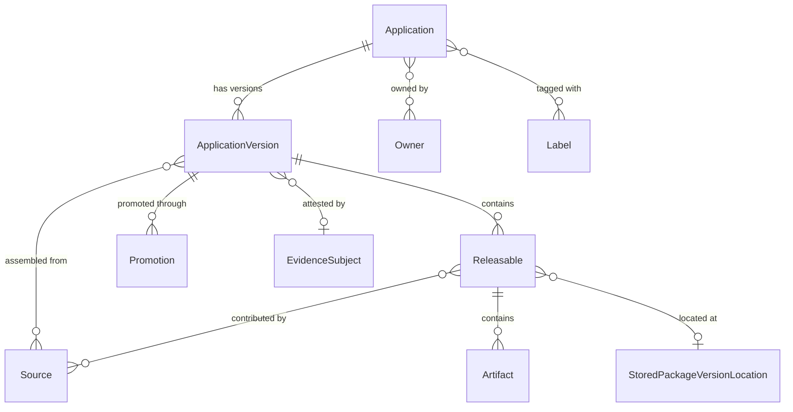
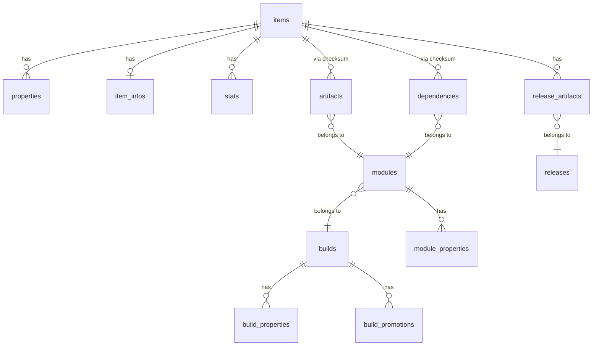
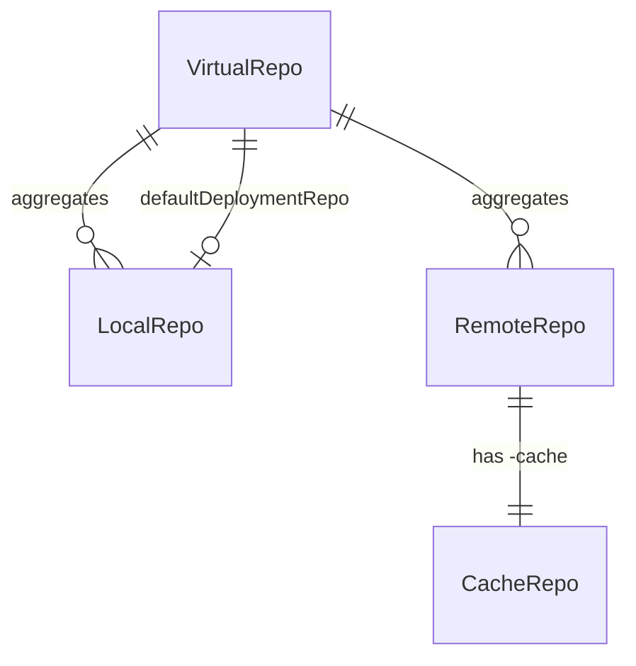
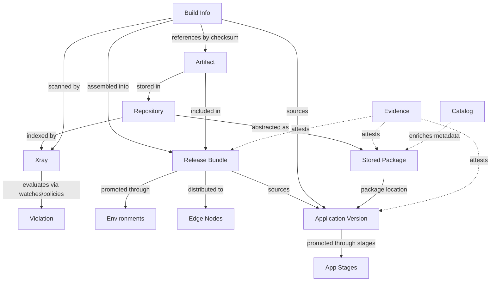
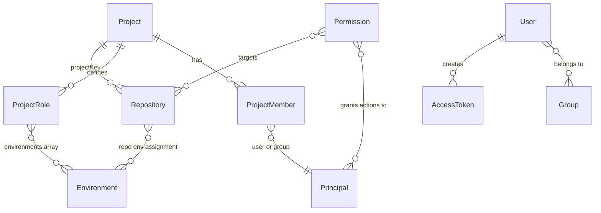
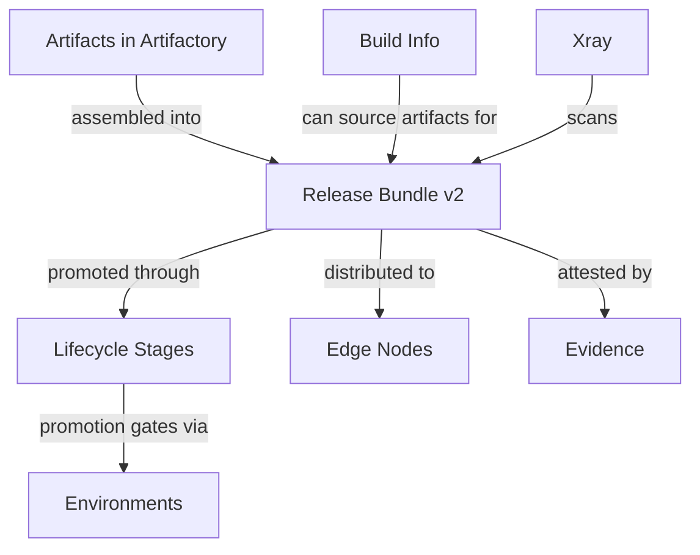
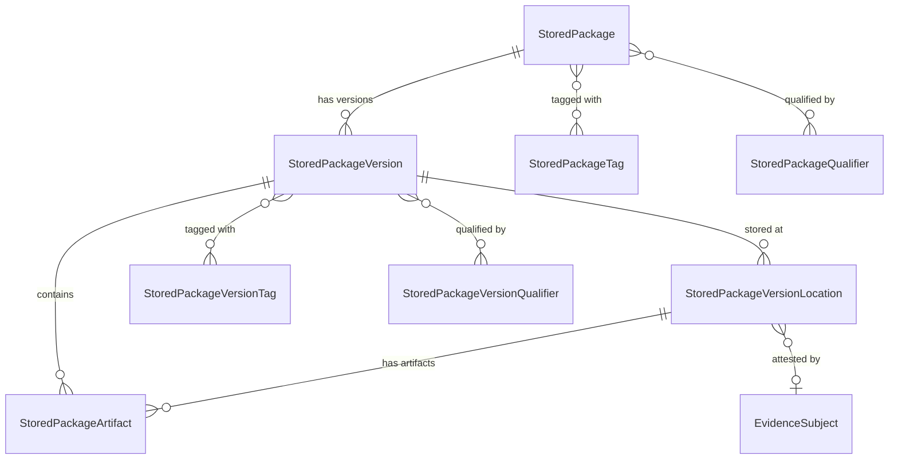
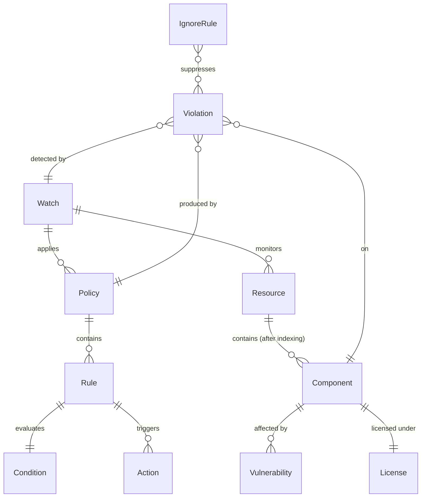

<!-- GENERATED by scripts/gen-steering.mjs from skills/ — do not edit by hand. -->


## apptrust-entities

# AppTrust entities

When to read this file:

- Working with **applications**, **application versions**, or **releasables**.
- Querying or managing **application version promotions** through stages.
- Understanding what **sources** (builds, release bundles, other app versions) feed into an application version.
- Using the OneModel GraphQL API with the `applications` query root.

AppTrust entities are accessed exclusively via the **OneModel GraphQL API**
(`/onemodel/api/v1/graphql`). There are no CLI commands for this domain.

For the OneModel query workflow (credentials, schema fetch, validation,
execution), read the `onemodel-graphql` section of the `#jfrog-references` steering.

## Entity relationship overview



## Application

The top-level entity representing a software application registered in
AppTrust. Applications belong to a JFrog Project and serve as the
organizational container for tracking versions, ownership, and criticality.

| Field | Description |
|-------|-------------|
| `key` | Unique identifier (referenced as `applicationKey` or `appKey` elsewhere) |
| `projectKey` | JFrog Project this application belongs to |
| `displayName` | Human-readable name |
| `criticality` | `unspecified`, `low`, `medium`, `high`, `critical` |
| `maturityLevel` | `unspecified`, `experimental`, `production`, `end_of_life` |
| `owners` | List of users or groups that own the application |
| `labels` | Key-value pairs for custom categorization |

Query: `applications.getApplication(key: "...")` or
`applications.searchApplications(where: {...})`.

## Application version

A versioned instance of an application. Each version captures a specific set
of releasable artifacts, their sources, and a promotion history through
lifecycle stages.

| Field | Description |
|-------|-------------|
| `application` | Parent application |
| `version` | Version identifier (semantic or custom) |
| `tag` | Optional tag |
| `status` | Processing status: `STARTED`, `FAILED`, `COMPLETED`, `DELETING` |
| `releaseStatus` | Release maturity: `PRE_RELEASE`, `RELEASED`, `TRUSTED_RELEASE` |
| `currentStageName` | Most recent stage the version has been promoted to (null if never promoted) |
| `createdBy`, `createdAt` | Audit fields |
| `evidenceSubject` | Evidence attestation anchor (shared across domains) |

The `releaseStatus` field is distinct from `status`: `status` tracks the
version creation process, while `releaseStatus` tracks its release maturity.

Query: `applications.getApplicationVersion(applicationKey: "...", version: "...")`
or `applications.searchApplicationVersions(where: {...})`.

## Releasable

A deployable unit within an application version — either a **package version**
or an individual **artifact**.

| Field | Description |
|-------|-------------|
| `name` | Package name or artifact file name |
| `version` | Package version (empty for non-package artifacts) |
| `packageType` | Repository package type (docker, maven, generic, etc.) |
| `releasableType` | `artifact` or `package_version` |
| `sha256` | Leading file checksum (e.g. manifest for Docker images) |
| `totalSize` | Sum of all artifact sizes in bytes |
| `sources` | Sources that contributed to this releasable |
| `artifacts` | Individual files that make up the releasable |
| `packageVersionLocation` | Link to `StoredPackageVersionLocation` for package releasables |
| `vcsCommit` | VCS commit details (for AppTrust-bound package versions) |

Releasables bridge the application model to the underlying Artifactory
storage. The `packageVersionLocation` field connects to the Stored Packages
domain (see `stored-packages-entities.md`).

## Application version promotion

Records the promotion of an application version from one stage to another.
All promotions are recorded including failed attempts.

| Field | Description |
|-------|-------------|
| `sourceStageName` | Stage being promoted from (empty for first promotion) |
| `targetStageName` | Stage being promoted to |
| `status` | `SUBMITTED`, `STARTED`, `PENDING`, `COMPLETED`, `FAILED`, `REJECTED` |
| `createdBy`, `createdAt` | Who initiated and when |
| `artifacts` | Artifacts included in this promotion (repo + path) |
| `messages` | Error messages if the promotion failed |

Promotions use the same environment/stage model as Release Bundle promotions
(see `release-lifecycle-entities.md`) but at the application level.

## Sources

Sources describe how releasables were assembled into an application version.
Four types exist:

| Source type | Fields | Description |
|-------------|--------|-------------|
| **Build** | `name`, `number`, `startedAt`, `repositoryKey` | A CI/CD build that produced releasables |
| **ReleaseBundle** | `name`, `version` | A release bundle whose artifacts were included |
| **ApplicationVersion** | `applicationKey`, `version` | Another application version (composition) |
| **Direct** | (none) | Directly included without an associated build or bundle |

Sources appear at both the application version level (all sources) and the
individual releasable level (sources for that specific releasable).

## Artifacts (within application versions)

Individual files within releasables.

| Field | Description |
|-------|-------------|
| `filePath` | Path in the repository (excluding repo key) |
| `downloadPath` | Full path for downloading from a Release Bundle repository |
| `sha256` | Checksum |
| `size` | Size in bytes |
| `evidenceSubject` | Evidence attestation anchor |

## Cross-domain connections

AppTrust entities connect to other domains via the OneModel GraphQL API:

- **Evidence** — `ApplicationVersion.evidenceSubject` and
  `ApplicationVersionArtifact.evidenceSubject` link to the Evidence domain
  via `EvidenceSubject.fullPath`. This allows querying evidence attached to
  app versions and their artifacts.
- **Stored Packages** — `Releasable.packageVersionLocation` links to
  `StoredPackageVersionLocation`, connecting the application model to where
  packages physically reside in Artifactory.
- **Release Bundles** — source type `ReleaseBundle` references release bundle
  name/version from the Release Lifecycle domain.
- **Builds** — source type `Build` references build-info records from
  Artifactory.


## artifactory-api-gaps

# Artifactory API Gaps

Operations available through REST API but not through CLI commands.
Invoke them via `jf api <path> [flags]` (authentication is handled
automatically against the active `jf config` server; see the base skill's
*Invoking platform APIs with `jf api`* section).

## Repository management

### Get repository configuration
```bash
jf api /artifactory/api/repositories/<repo-key>
```
Returns the full JSON configuration of a repository. Useful as a template
for creating similar repos.

### List all repositories
```bash
jf api /artifactory/api/repositories
```
Optional query params (combinable): `type` (one of `local`, `remote`,
`virtual`, `federated`), `packageType` (e.g. `docker`, `maven`, `npm`,
`pypi`, `generic`), `project`. Examples:
```bash
jf api "/artifactory/api/repositories?type=local"
jf api "/artifactory/api/repositories?packageType=docker"
jf api "/artifactory/api/repositories?type=remote&packageType=maven&project=my-project"
```

### Get repositories (v2)
```bash
jf api /artifactory/api/repositories/configurations
```
Optional query params (combinable, comma-separated values allowed):
`repoType` (case-insensitive; one of `local`, `remote`, `virtual`,
`federated`) and `packageType` (e.g. `maven`, `docker`, `npm`). Note:
`repo_type` is silently ignored — the correct name is `repoType`.
Examples:
```bash
jf api "/artifactory/api/repositories/configurations?repoType=local"
jf api "/artifactory/api/repositories/configurations?packageType=maven"
jf api "/artifactory/api/repositories/configurations?repoType=local,remote&packageType=docker"
```

### Check if repository exists
```bash
jf api /artifactory/api/repositories/<repo-key> -X HEAD
# 200 = exists, 400 = does not exist
```

## Storage and system

### Get storage summary
```bash
jf api /artifactory/api/storageinfo
```

### Refresh storage summary
```bash
jf api /artifactory/api/storageinfo/calculate -X POST
```

### Get storage item info
```bash
jf api "/artifactory/api/storage/<repo>/<path>"
```

### System ping
```bash
jf api /artifactory/api/system/ping
```

### System version
```bash
jf api /artifactory/api/system/version
```

### System configuration
```bash
jf api /artifactory/api/system/configuration
```

## Search (beyond CLI)

### AQL queries
```bash
jf api /artifactory/api/search/aql \
  -X POST -H "Content-Type: text/plain" \
  -d 'items.find({"repo":"my-repo","name":{"$match":"*.jar"}})'
```

For remote repository content, query the `-cache` suffixed repo:
```bash
jf api /artifactory/api/search/aql \
  -X POST -H "Content-Type: text/plain" \
  -d 'items.find({"repo":"my-remote-cache"})'
```

### Property search
```bash
jf api "/artifactory/api/search/prop?key=value&repos=my-repo"
```

### Checksum search
```bash
jf api "/artifactory/api/search/checksum?sha256=<sha256>"
```

### GAVC search (Maven)
```bash
jf api "/artifactory/api/search/gavc?g=com.example&a=mylib&v=1.0"
```

## User and group management

User and group operations are handled by the Access service. See
`platform-admin-api-gaps.md` (Users / Groups sections) for the full set.

## Metadata calculation

Trigger metadata recalculation for various package types:
```bash
# Maven
jf api /artifactory/api/maven/calculateMetaData/<repo-key> -X POST

# npm
jf api /artifactory/api/npm/<repo-key>/reindex -X POST

# Docker
# (automatic, no manual trigger)

# PyPI
jf api /artifactory/api/pypi/<repo-key>/reindex -X POST

# Helm
jf api /artifactory/api/helm/<repo-key>/reindex -X POST

# Debian
jf api /artifactory/api/deb/reindex/<repo-key> -X POST
```

## Trash can and garbage collection

### Empty trash
```bash
jf api /artifactory/api/trash/empty -X POST
```

### Restore from trash
```bash
jf api "/artifactory/api/trash/restore/<repo>/<path>" -X POST
```

### Run garbage collection
```bash
jf api /artifactory/api/system/storage/gc -X POST
```

## Federated repositories (beyond basic CRUD)

### Get federation status
```bash
jf api /artifactory/api/federation/status/<repo-key>
```

### Trigger full sync
```bash
jf api "/artifactory/api/federation/fullSyncAll/<repo-key>" -X POST
```

## Build info (beyond CLI)

### List builds (prefer scoped queries)

**Unscoped** `GET /artifactory/api/build` (no query parameters) can **time
out** on busy instances. Prefer **project-scoped** or **repo-scoped**
listing, then detail GETs. Full flow: read `artifactory-operations.md`
§ *Listing builds when the project key is known*.

```bash
# Project scope — build names (latest per name)
jf api "/artifactory/api/build?project=<project-key>"

# Project scope — all run numbers for one build name (response: buildsNumbers)
jf api "/artifactory/api/build/<build-name>?project=<project-key>"

# Build-info repo scope — alternative when you know the repo key
jf api "/artifactory/api/build?buildRepo=<build-info-repo-key>"
```

### Get build info
```bash
# Default build-info repo only (no project / non-default repo)
jf api "/artifactory/api/build/<build-name>/<build-number>"

# Project or custom build-info repo
jf api "/artifactory/api/build/<build-name>/<build-number>?project=<project-key>"
jf api "/artifactory/api/build/<build-name>/<build-number>?buildRepo=<build-info-repo-key>"
```

### Delete builds
```bash
jf api /artifactory/api/build/delete \
  -X POST -H "Content-Type: application/json" \
  -d '{"buildName":"my-build","buildNumbers":["1","2"]}'
```


## artifactory-aql-syntax

# AQL (Artifactory Query Language)

AQL queries are sent as POST requests with `Content-Type: text/plain`:

```bash
jf api /artifactory/api/search/aql \
  -X POST -H "Content-Type: text/plain" -d '<query>'
```

## Query structure

```
<domain>.find(<criteria>)
  .include(<fields>)
  .sort(<sort>)
  .offset(<n>)
  .limit(<n>)
  .distinct(<boolean>)
```

Only `.find()` is required. The others are optional and chainable.
**The chain order above is enforced by the server.** `.include()` must come
before `.sort()`, `.sort()` before `.offset()`, etc. Putting them out of
order (e.g. `.sort()` before `.include()`) produces a parse error.

**Mandatory include fields:** `items` requires `"repo","path","name"`;
`builds` requires `"name","number","repo"`. Always include these even when
you only need a subset — narrow results with `jq` post-query instead:

```
items.find({"name":"commons-lang3-3.12.0.jar"})
  .include("repo","path","name")
  .distinct(true)
```

## Domains

AQL has 13 queryable domains. Each domain represents a different entity type
and has its own set of fields.


| Domain               | Query name          | Description                                    |
| -------------------- | ------------------- | ---------------------------------------------- |
| Items                | `items`             | Artifacts stored in repositories (most common) |
| Properties           | `properties`        | Key-value properties on items                  |
| Item infos           | `item.infos`        | Property modification metadata                 |
| Statistics           | `stats`             | Download statistics (local and remote)         |
| Builds               | `builds`            | Build info records                             |
| Build modules        | `modules`           | Modules within a build                         |
| Build artifacts      | `artifacts`         | Artifacts produced by a build module           |
| Build dependencies   | `dependencies`      | Dependencies consumed by a build module        |
| Build properties     | `build.properties`  | Key-value properties on builds                 |
| Build promotions     | `build.promotions`  | Build promotion records                        |
| Module properties    | `module.properties` | Key-value properties on build modules          |
| Release bundles      | `releases`          | Release bundle records                         |
| Release bundle files | `release_artifacts` | Files within a release bundle                  |


## Domain relationships

Domains connect through the following join paths. Cross-domain queries
traverse these links — fields from related domains can appear in criteria
and include clauses by prefixing the domain path.




**Key:** Items connect to build artifacts and dependencies through SHA-1
checksum matching, not a direct key. This means a cross-domain query from
items to builds traverses: items → artifacts → modules → builds.

### Cross-domain field paths

To reference a field from a related domain, use dot-separated domain paths:

```
items.find({"artifact.module.build.name":"my-build"})
  .include("name","repo","path","artifact.module.build.number")
```

Common cross-domain paths from items:

- `stat.downloads`, `stat.downloaded` — download statistics
- `property.key`, `property.value` — item properties
- `artifact.module.build.name` — build that produced the item
- `artifact.module.build.number` — build number

From builds:

- `module.artifact.name` — artifacts in build modules
- `module.dependency.name` — dependencies of build modules

## Fields by domain

Field types: `string`, `date`, `int`, `long`, `itemType` (`file`, `folder`,
or `any`). Fields marked "default" are returned without explicit `.include()`.

### items


| Field           | Type     | Default |
| --------------- | -------- | ------- |
| `repo`          | string   | yes     |
| `path`          | string   | yes     |
| `name`          | string   | yes     |
| `type`          | itemType | yes     |
| `size`          | long     | yes     |
| `depth`         | int      | yes     |
| `created`       | date     | yes     |
| `created_by`    | string   | yes     |
| `modified`      | date     | yes     |
| `modified_by`   | string   | yes     |
| `updated`       | date     | yes     |
| `actual_md5`    | string   | no      |
| `actual_sha1`   | string   | no      |
| `sha256`        | string   | no      |
| `original_md5`  | string   | no      |
| `original_sha1` | string   | no      |


Computed field: `virtual_repos` — returns virtual repositories that include
the item's actual repository. Must use `.include("virtual_repos")` explicitly;
requires `repo`, `path`, `name` in the result set.

### properties


| Field   | Type   | Default |
| ------- | ------ | ------- |
| `key`   | string | yes     |
| `value` | string | yes     |


### stats


| Field                  | Type   | Default |
| ---------------------- | ------ | ------- |
| `downloads`            | int    | yes     |
| `downloaded`           | date   | yes     |
| `downloaded_by`        | string | yes     |
| `remote_downloads`     | int    | yes     |
| `remote_downloaded`    | date   | yes     |
| `remote_downloaded_by` | string | yes     |
| `remote_origin`        | string | yes     |
| `remote_path`          | string | yes     |


### item.infos


| Field               | Type   | Default |
| ------------------- | ------ | ------- |
| `props_modified`    | date   | yes     |
| `props_modified_by` | string | yes     |
| `props_md5`         | string | yes     |


### builds


| Field         | Type   | Default |
| ------------- | ------ | ------- |
| `url`         | string | yes     |
| `name`        | string | yes     |
| `number`      | string | yes     |
| `started`     | date   | yes     |
| `created`     | date   | yes     |
| `created_by`  | string | yes     |
| `modified`    | date   | yes     |
| `modified_by` | string | yes     |
| `repo`        | string | no      |


### modules


| Field  | Type   | Default |
| ------ | ------ | ------- |
| `name` | string | yes     |


### artifacts


| Field  | Type   | Default |
| ------ | ------ | ------- |
| `name` | string | yes     |
| `type` | string | yes     |
| `sha1` | string | yes     |
| `md5`  | string | yes     |


### dependencies


| Field   | Type   | Default |
| ------- | ------ | ------- |
| `name`  | string | yes     |
| `scope` | string | yes     |
| `type`  | string | yes     |
| `sha1`  | string | yes     |
| `md5`   | string | yes     |


### build.properties


| Field   | Type   | Default |
| ------- | ------ | ------- |
| `key`   | string | yes     |
| `value` | string | yes     |


### build.promotions


| Field        | Type   | Default |
| ------------ | ------ | ------- |
| `created`    | date   | yes     |
| `created_by` | string | yes     |
| `status`     | string | yes     |
| `repo`       | string | yes     |
| `comment`    | string | yes     |
| `user`       | string | yes     |


### module.properties


| Field   | Type   | Default |
| ------- | ------ | ------- |
| `key`   | string | yes     |
| `value` | string | yes     |


### releases


| Field          | Type                        | Default |
| -------------- | --------------------------- | ------- |
| `name`         | string                      | yes     |
| `version`      | string                      | yes     |
| `status`       | string                      | yes     |
| `created`      | date                        | yes     |
| `signature`    | string                      | yes     |
| `type`         | string (`SOURCE`, `TARGET`) | yes     |
| `storing_repo` | string                      | yes     |


### release_artifacts


| Field  | Type   | Default |
| ------ | ------ | ------- |
| `path` | string | yes     |


## Comparators


| Operator   | Meaning                          | Example                              |
| ---------- | -------------------------------- | ------------------------------------ |
| `$eq`      | Equals (default if omitted)      | `{"type":"file"}`                    |
| `$ne`      | Not equals                       | `{"type":{"$ne":"folder"}}`          |
| `$eqic`    | Equals, case-insensitive         | `{"name":{"$eqic":"README.md"}}`     |
| `$match`   | Wildcard match (`*`, `?`)        | `{"name":{"$match":"*.jar"}}`        |
| `$matchic` | Wildcard match, case-insensitive | `{"name":{"$matchic":"*.JAR"}}`      |
| `$nmatch`  | Wildcard not-match               | `{"name":{"$nmatch":"*-SNAPSHOT*"}}` |
| `$gt`      | Greater than                     | `{"size":{"$gt":"1000000"}}`         |
| `$gte`     | Greater than or equal            | `{"stat.downloads":{"$gte":"10"}}`   |
| `$lt`      | Less than                        | `{"size":{"$lt":"5000"}}`            |
| `$lte`     | Less than or equal               | `{"modified":{"$lte":"2025-01-01"}}` |


### Boolean operators


| Operator | Description                                                            |
| -------- | ---------------------------------------------------------------------- |
| `$and`   | All conditions must match (implicit when fields are at the same level) |
| `$or`    | Any condition must match                                               |


```
items.find({"$and":[
  {"repo":"my-repo"},
  {"$or":[
    {"name":{"$match":"*.jar"}},
    {"name":{"$match":"*.war"}}
  ]}
]})
```

### Relative date comparators

AQL supports relative date queries with `$last` and `$before`:


| Operator  | Meaning                                                 | Example                         |
| --------- | ------------------------------------------------------- | ------------------------------- |
| `$last`   | Within the last N period (equivalent to `$gt` from now) | `{"modified":{"$last":"7d"}}`   |
| `$before` | Before the last N period (equivalent to `$lt` from now) | `{"created":{"$before":"3mo"}}` |


Supported units: `d` (days), `w` (weeks), `mo` (months), `y` (years),
`s` (seconds), `mi` (minutes), `ms` (milliseconds).

### Multi-property AND

To match items that have property A=1 **and** property B=2 (different
property rows), use `$and` with `@` shorthand:

```
items.find({"$and":[
  {"@build.name":"my-build"},
  {"@build.number":"42"}
]})
```

AQL also documents a `$msp` (multi-set property) operator for this purpose,
but `$msp` is **unreliable in practice** — it returns 0 results on many
server versions even when matching items exist. Prefer `$and` with `@`
shorthand, which is verified to work correctly.

## Date queries

Dates use ISO 8601 format for absolute dates:

```
items.find({"modified":{"$gt":"2025-06-01T00:00:00.000Z"}})
```

Or use relative dates (preferred — avoids hardcoding timestamps):

```
items.find({"modified":{"$last":"30d"}})
items.find({"created":{"$before":"6mo"}})
```

## Property queries

Two equivalent syntaxes for property filtering:

**`@key` shorthand** — concise, works for single property conditions:

```
items.find({"repo":"my-repo","@build.name":"my-build","type":"file"})
```

**Explicit form** — `property.key`/`property.value` pairs:

```
items.find({
  "repo":"my-repo",
  "property.key":"build.name",
  "property.value":"my-build"
})
```

**Multi-property AND** — use `$and` with `@` shorthand to match across
different property rows:

```
items.find({"$and":[
  {"@build.name":"my-build"},
  {"@build.number":"42"}
]})
```

> **Note:** The `@key` shorthand works inside `$and`. For `$or`, use the
> explicit `property.key`/`property.value` form if the shorthand does not
> return expected results.

## Include

Select which fields to return. Without `.include()`, AQL returns each
domain's default field set.

**When you use `.include()`, you replace the defaults — so you must
explicitly list any required fields:**

- `items` domain: always include `"repo","path","name"` (server rejects
the query otherwise)
- `builds` domain: always include `"name","number","repo"`

```
items.find({"repo":"my-repo"})
  .include("name","repo","path","size","sha256","stat.downloads")
```

Cross-domain includes use dot-separated paths:

```
items.find({"repo":"my-repo"})
  .include("name","repo","path","property.key","property.value")
```

## Sort and pagination

```
items.find({"repo":"my-repo"})
  .sort({"$desc":["modified"]})
  .offset(0)
  .limit(50)
```

Sort directions: `$asc`, `$desc`. Sort fields must also appear in the result
set (explicit `.include()` or default fields). See
[Before constructing a query](#before-constructing-a-query) for sort
performance rules.

## Distinct

Deduplicate result rows:

```
items.find({"repo":"my-repo"}).distinct(true)
```

## Validation rules

The server enforces these constraints — violating them produces an error:

**Non-admin users:**

- `items` domain queries must include `repo`, `path`, `name` in results
(needed for permission filtering)
- `builds` domain queries must include `name`, `number`, `repo` in results

**Transitive mode** (`.transitive()` for querying through virtual repos):

- Only works with `items` domain
- Include subdomains limited to `items` and `properties`
- Repo criteria must use `$eq` (exact match) with a single repository
- No `offset` or `sort` allowed

## Before constructing a query

Run through these checks before writing any AQL query:

1. **Never `.sort()` without a `repo` filter** — forces a full table scan
   across all repositories. Sort client-side with `jq` instead. Also,
   `.sort()` on cross-domain fields (e.g. `stat.downloads` in `items.find()`)
   is silently ignored — fetch all rows and sort client-side.
2. **Always set `.limit()`** — no built-in default limit; unbounded queries
   can time out or OOM. Broad queries without a `repo` filter are especially
   expensive.
3. **`range.total` = returned count, not total matching** — AQL has no
   count-only mode. To find the true total, paginate with `.offset()` until
   a page returns fewer results than the limit.
4. **AQL has no repo-type field** — to restrict to local repos, either
   pre-query `GET /api/repositories?type=local` and add repo names to
   criteria (practical when count is small), or query without a repo filter
   and exclude `-cache` / `-virtual` suffixed repos client-side with `jq`.
5. **Narrow server-side first** — add every applicable filter (`created_by`,
   `created`, `type`, `name`) before relying on client-side `jq` filtering.

## Common query patterns

### Find all JARs in a repo

```
items.find({"repo":"libs-release","name":{"$match":"*.jar"}})
```

### Find large files (> 100 MB)

```
items.find({"repo":"my-repo","size":{"$gt":"104857600"},"type":"file"})
```

### Find Maven SNAPSHOT JARs

Use `*-SNAPSHOT*.jar` (not `*-SNAPSHOT.jar`) to also match classifier
artifacts like `-sources.jar` and `-javadoc.jar`:

```
items.find({"repo":"libs-snapshot","name":{"$match":"*-SNAPSHOT*.jar"},"type":"file"})
```

### Find artifacts modified in the last 7 days

```
items.find({"repo":"my-repo","modified":{"$last":"7d"},"type":"file"})
  .sort({"$desc":["modified"]})
  .limit(100)
```

### Docker queries

Use `"name":"manifest.json"` to **list tags** (one per tag). Use
`"name":{"$match":"*manifest.json"}` to **query all manifests** (includes
`list.manifest.json` for multi-arch tags — see [Gotchas](#gotchas)).

```
items.find({"repo":"docker-local","path":{"$match":"my-image/*"},"name":"manifest.json"})
```

### Docker image size

**Do not use AQL** — layer blobs live at `<image>/sha256:<digest>/`, not
under `<image>/<tag>/`. Use the V2 manifest API (returns `layers[].size`):

```bash
jf api "/artifactory/api/docker/<repo>/v2/<image>/manifests/<tag>" \
  -H "Accept: application/vnd.docker.distribution.manifest.v2+json"
```

For multi-arch images the response is an image index; fetch each platform
manifest by digest to get its layers.

### Find artifacts with a specific property

```
items.find({"repo":"my-repo","@build.name":"my-build","type":"file"})
```

### Find never-downloaded files (zero download count)

Zero-download items lack a stats row — filter client-side instead
(see [Gotchas](#gotchas)):

```bash
jf api /artifactory/api/search/aql \
  -X POST -H "Content-Type: text/plain" -d '
items.find({"repo":"my-repo","type":"file"})
  .include("repo","path","name","size","stat.downloads")
' | jq '[.results[] | select((.stats[0].downloads // 0) == 0) | {repo, path, name, size}]'
```

### Find artifacts not downloaded in 90 days

Only matches previously-downloaded items (see [Gotchas](#gotchas)).
Combine with the never-downloaded pattern above for full coverage.

```
items.find({
  "repo":"my-repo",
  "type":"file",
  "stat.downloaded":{"$before":"90d"}
}).include("name","repo","path","stat.downloaded","size")
```

### Find items by build name (cross-domain)

```
items.find({"artifact.module.build.name":"my-service"})
  .include("name","repo","path","artifact.module.build.number")
  .sort({"$desc":["modified"]})
  .limit(50)
```

### Find builds by name

Non-admin users must include `name`, `number`, `repo` — omitting any
produces an error.

```
builds.find({"name":{"$match":"*my-service*"}})
  .include("name","number","repo","started")
  .sort({"$desc":["started"]})
  .limit(10)
```

### Find build artifacts

```
artifacts.find({"module.build.name":"my-service","module.build.number":"42"})
  .include("name","type","sha1","md5")
```

### Find build dependencies

```
dependencies.find({"module.build.name":"my-service","module.build.number":"42"})
  .include("name","scope","type","sha1")
```

### Remote repository content

Remote repo artifacts are stored in a `-cache` suffixed repo. Always query
the cache repo, not the remote repo itself:

```
items.find({"repo":"npm-remote-cache","name":{"$match":"*.tgz"}})
```

## Gotchas

- The request body is **plain text**, not JSON — use
`Content-Type: text/plain`.
- String values in criteria must be quoted, including numeric comparisons
(`"size":{"$gt":"1000"}` not `"size":{"$gt":1000}`).
- Remote repo content lives in `<repo>-cache`, not `<repo>`.
- Sort fields must appear in the result set (included explicitly or by
default).
- Non-admin `items` queries must return `repo`, `path`, `name`.
- Non-admin `builds` queries must return `name`, `number`, `repo`.
- Items connect to builds through checksum matching (SHA-1), so cross-domain
queries between items and builds are valid but traverse multiple joins.
- The `path` value for items at the **root** of a repository is `"."`, not
`""` or `"/"`. Use `"path":"."` to match root-level files.
- **Docker `list.manifest.json`** — multi-arch images store two manifest files per
  tag: `manifest.json` (platform-specific manifest) and `list.manifest.json` (OCI
  image index). Filtering by `"name":"manifest.json"` is correct for tag listing
  (one result per tag), but silently excludes `list.manifest.json` entries. Use
  `"name":{"$match":"*manifest.json"}` when querying by uploader, date range, or
  any context where all manifest pushes should be counted.
- **`stat.downloads` filters do not match zero-download items** — never-downloaded
  items lack a stats row so the join finds nothing. Use the client-side `jq`
  approach in "Find never-downloaded files" above.
- `$match` uses SQL-style wildcards: `*` matches any characters, `?` matches
exactly one character. It is **not** regex. Literal `_` and `%` in patterns
are escaped automatically.
- The `builds.number` field is a **string**, not an integer. Build numbers
like `"42"`, `"1.0.3"`, and `"SNAPSHOT-1"` are all valid.
- Release bundle `type` values are uppercase strings: `"SOURCE"` or
`"TARGET"`.
- Dates accept both ISO 8601 format (`"2025-06-01T00:00:00.000Z"`) and
epoch milliseconds as a string (`"1719792000000"`).
- The server silently excludes trash, support-bundle, and in-transit
repository content from AQL results. If an item exists but doesn't appear
in results, it may be in one of these hidden repos.
- Virtual repo queries are rewritten to search the underlying physical repos.
The `repo` field in results shows the physical repo name, not the virtual
repo name you queried.

## Official documentation

- [Artifactory Query Language](https://docs.jfrog.com/artifactory/docs/artifactory-query-language) — overview and architecture
- [Query Structure and Syntax](https://docs.jfrog.com/artifactory/docs/aql-syntax) — domain queries, field references, JSON-like syntax rules
- [Search Criteria and Operators](https://docs.jfrog.com/artifactory/docs/aql-search-criteria) — comparators, wildcards, `$msp`, relative time
- [AQL Entities and Fields Reference](https://docs.jfrog.com/artifactory/docs/aql-entities-fields-reference) — complete field list for all domains
- [Query Output and Modifiers](https://docs.jfrog.com/artifactory/docs/aql-query-output) — `.include()`, `.sort()`, `.offset()`, `.limit()`, `.distinct()`
- [Query Execution and Permissions](https://docs.jfrog.com/artifactory/docs/aql-query-execution) — authentication, scoped tokens, HTTP errors, streaming
- [AQL Examples and Common Patterns](https://docs.jfrog.com/artifactory/docs/aql-examples) — ready-to-use queries by use case
- [Repository-Specific Queries](https://docs.jfrog.com/artifactory/docs/aql-repository-queries) — `.transitive()`, virtual repos, remote search
- [Performance and Operational Controls](https://docs.jfrog.com/artifactory/docs/aql-performance) — result limits, timeouts, rate limiting, optimization


## artifactory-entities

# Artifactory entities

When to read this file:

- Working with **repositories** and you need to understand the difference between local, remote, virtual, and federated types.
- Managing **artifacts**, **properties**, or **package types**.
- Working with **builds**, **build promotion**, or **permission targets**.
- Debugging unexpected behavior related to repo types (e.g. upload failures, missing search results).

For CLI commands see `artifactory-operations.md`. For API gaps see
`artifactory-api-gaps.md`. For AQL syntax see `artifactory-aql-syntax.md`.

## Repositories

A repository is the primary storage and resolution unit in Artifactory. Every
repo has a **key** (unique identifier), a **package type** (immutable after
creation), and a **repository class** (`rclass`) that determines its behavior.

### Repository types

| Type | `rclass` | Behavior | Stores artifacts? |
|------|----------|----------|-------------------|
| **Local** | `local` | Hosts artifacts deployed directly (upload, promote, copy, move) | Yes |
| **Remote** | `remote` | Proxies an external URL; downloads are cached in a companion `-cache` repo | Only in the `-cache` repo |
| **Virtual** | `virtual` | Aggregates multiple local and remote repos under a single URL for resolution | No (resolves from underlying repos) |
| **Federated** | `federated` | Local repo that bi-directionally synchronizes across Platform Deployments | Yes (replicated across sites) |

### Key relationships and fields

- `key` — unique repo identifier (e.g. `libs-release-local`)
- `packageType` — determines layout and protocol (see Package types below)
- `rclass` — `local`, `remote`, `virtual`, or `federated`
- `url` — (remote only) the external source URL being proxied
- `repositories` — (virtual only) ordered list of local/remote repos to aggregate
- `projectKey` — links repo to a JFrog Project (see `platform-access-entities.md`)
- `environments` — environments the repo is assigned to (used in RBAC and lifecycle)

### System repositories

Artifactory and Xray maintain several **system repositories** for internal
platform metadata. These are not user-created and should be excluded when
iterating over repositories for reporting, scanning, or auditing:

| Pattern | Purpose |
|---------|---------|
| `release-bundles` | Release Bundles V1 metadata |
| `release-bundles-v2` | Release Bundles V2 metadata |
| `artifactory-build-info` | Default build info storage |
| `*-release-bundles` | Project-scoped Release Bundles V1 |
| `*-release-bundles-v2` | Project-scoped Release Bundles V2 |
| `*-build-info` | Project-scoped build info storage |
| `*-application-versions` | AppTrust application version metadata |

Including these in aggregate queries (violation counts, storage reports, etc.)
produces misleading results because they contain platform metadata rather than
user artifacts.

### Remote repository cache

When Artifactory downloads an artifact through a remote repo, it stores the
cached copy in a **separate local repo** named `<remote-key>-cache`. This is
critical for:

- **AQL queries** — search the `-cache` repo, not the remote repo key
- **Properties** — properties on cached artifacts live on the `-cache` repo
- **Storage calculations** — cached artifacts consume storage under the `-cache` repo

The remote repo key itself is used for **configuration** (URL, credentials,
inclusion/exclusion patterns) but does not directly contain artifacts.

### Virtual repository resolution

A virtual repo aggregates **both local and remote repos** under a single URL.
It resolves artifacts by searching its underlying repos in the configured
**order** — when the same artifact exists in multiple underlying repos, the
first match wins.

A virtual repo may designate one of its underlying **local** repos as the
**default deployment repository**. Uploads through the virtual URL are routed
to that local repo. Without a default deployment repo, the virtual repo is
read-only.



## Artifacts

An artifact is a file stored in a repository. Each artifact is uniquely
identified by the triple **repo + path + name**.

Key attributes:
- `repo`, `path`, `name` — location identifier
- `size` — bytes
- `sha256`, `sha1`, `md5` — checksums (sha256 is the primary identifier for cross-referencing with builds and Xray)
- `created`, `modified`, `created_by`, `modified_by` — audit fields

Artifacts are **content-addressable** — build info and Xray reference them by
checksum, not by path. Moving or copying an artifact changes its path but not
its checksum, so build associations follow the artifact.

## Properties

Key-value metadata pairs attached to artifacts or folders.

- Keys are strings; values are strings or arrays of strings
- Set via `jf rt set-props`, queried via AQL or the properties API
- Commonly used for: build metadata, maturity labels, promotion tracking, cleanup policies
- Properties on remote-cached artifacts live on the `-cache` repo

## Package types

The `packageType` field on a repository determines how Artifactory interprets
its contents. It controls directory structure conventions, metadata extraction,
and which client protocols are supported (e.g. Docker registry API, npm
registry, Maven layout).

Common types: `maven`, `gradle`, `npm`, `docker`, `pypi`, `nuget`, `go`,
`helm`, `rpm`, `debian`, `generic`.

Package type is **immutable** — it cannot be changed after repo creation. Use
`generic` when no specific package type applies.

## Build info

A build info record captures CI/CD metadata: which artifacts were produced,
which dependencies were consumed, and the build environment.

| Field | Description |
|-------|-------------|
| `name` + `number` | Unique identifier for a build run |
| `modules` | List of modules, each with its own artifacts and dependencies |
| `vcs` | Version control metadata (revision, URL, branch) |
| `buildAgent`, `agent` | CI tool info |
| `properties` | Custom build-level properties |

Build info references artifacts **by checksum** (sha256). This means:
- A build can reference artifacts across multiple repositories
- Moving an artifact does not break the build association
- Xray scans build info by resolving checksums to components

Lifecycle: collect → publish → (optionally) promote → (optionally) scan.

## Build promotion

Promotion changes a build's **status** and can copy or move its artifacts
from a source repo to a target repo.

| Field | Description |
|-------|-------------|
| `status` | Target status label (e.g. `staged`, `released`) |
| `sourceRepo` | Where artifacts currently reside |
| `targetRepo` | Where artifacts should be moved/copied |
| `copy` | If `true`, copy instead of move |

Promotion records are queryable via AQL (`build.promotions` domain) and the
build promotion API.

## Permissions

Permissions define RBAC policies mapping **resources** and **principals**
(users and groups) to **actions**. Two models exist:

### Permissions V2 (Access Permissions) — current model

Managed by the **Access service** (since Artifactory 7.72.0, recommended from
7.77.2). Supports all resource types.

| Component | Description |
|-----------|-------------|
| `name` | Permission name |
| `resources` | Map of resource type → targets + actions |

Resource types: `artifact` (repositories), `build`, `release_bundle`,
`destination` (Edge nodes), `pipeline_source`.

Each resource contains:
- `targets` — map of target names/patterns to include/exclude patterns
- `actions.users` — map of username → list of actions
- `actions.groups` — map of group name → list of actions

Actions use uppercase: `READ`, `ANNOTATE`, `DEPLOY/CACHE`, `DELETE/OVERWRITE`,
`MANAGE_XRAY_METADATA`, `MANAGE`.

API: `POST/PUT/GET/DELETE /access/api/v2/permissions/{permissionName}`.

Documentation: [Permissions](https://docs.jfrog.com/administration/docs/permissions).

### Permission targets (V1) — legacy model

Managed by **Artifactory**. Still functional and backwards compatible, but
V2 is recommended for new implementations. The CLI `jf rt permission-target-*`
commands use this API.

| Component | Description |
|-----------|-------------|
| `repositories` | List of repo keys or patterns |
| `actions.users` | Map of username → list of actions |
| `actions.groups` | Map of group name → list of actions |

Actions use lowercase: `read`, `write`, `annotate`, `delete`, `manage`.

Does **not** support `destination` or `pipeline_source` resource types.

API: `PUT /artifactory/api/security/permissions/{permissionName}`.

### Key differences

| Aspect | V1 (Permission Targets) | V2 (Access Permissions) |
|--------|------------------------|------------------------|
| Managed by | Artifactory | Access service |
| API base | `/artifactory/api/security/permissions/` | `/access/api/v2/permissions/` |
| Actions | lowercase (`read`, `write`) | uppercase (`READ`, `WRITE`) |
| Resource types | repos, builds, release bundles | + destinations, pipeline sources |
| Pattern fields | `includes_pattern` / `excludes_pattern` | `include_patterns` / `exclude_patterns` |
| CLI support | `jf rt permission-target-*` | No direct CLI commands (use REST) |

For project-scoped RBAC, see Project roles in `platform-access-entities.md`.

## Replication

Replication synchronizes artifacts and properties between repositories, either
within the same instance or across Platform Deployments.

| Type | Direction | Trigger |
|------|-----------|---------|
| **Push** | Source pushes to target | Scheduled or event-based |
| **Pull** | Target pulls from source | Scheduled |

Replication configs are JSON templates applied per repository. Both artifact
content and properties are replicated. For federated repos, replication is
automatic and bi-directional across all member nodes.


## artifactory-operations

# Artifactory Operations

CLI commands for managing Artifactory resources. All commands use the `jf rt`
namespace. Run `jf rt --help` to discover subcommands not listed here.

## Repository management

Repositories are created from JSON templates. The workflow is:

1. Get a template: retrieve an existing repo config via
   `jf api /artifactory/api/repositories/<repo-key>`
   and modify it, or craft JSON manually.
   Note: `jf rt repo-template` is interactive and cannot be used by agents.
2. Create: `jf rt repo-create <template.json>`
3. Update: `jf rt repo-update <template.json>`
4. Delete: `jf rt repo-delete <repo-pattern> --quiet`

To list repositories, use:
`jf api /artifactory/api/repositories`

## File operations

- Upload: `jf rt upload <source> <target>`
- Download: `jf rt download <source> [target]`
- Search: `jf rt search <pattern>`
- Move: `jf rt move <source> <target>`
- Copy: `jf rt copy <source> <target>`
- Delete: `jf rt delete <pattern>`
- Set properties: `jf rt set-props <pattern> "key=value"`
- Delete properties: `jf rt delete-props <pattern> "key"`

### Searching across repositories

`jf rt search` expects a `<repo>/<pattern>` argument. When the repo is unknown,
agents tend to use a leading wildcard (`jf rt search "*/path/..."`), which
generates an unscoped AQL internally and can time out on large instances.

Use a direct AQL query with `name` and `path` criteria instead — omitting the
`repo` field searches all accessible repos via indexed columns:

```bash
jf api /artifactory/api/search/aql \
  -X POST -H "Content-Type: text/plain" \
  -d 'items.find({
    "name":"<artifact-filename>",
    "path":"<directory/path/within/repo>"
  }).include("repo","path","name","size","sha256")'
```

Add `"repo":"<repo-name>"` to the criteria when the target repo is known, to
narrow the search further.

## Build info

**Project scoping rule:** Append `?project=<key>` to **every** build detail
API call. When the user provides a project key, use it. When no project key
is provided, use `?project=default` (the built-in default project that covers
the `artifactory-build-info` repo). For AQL queries, scope by
`"repo":"<project-key>-build-info"` (or `"repo":"artifactory-build-info"` for
the default project).

**Server rule:** A 404 from a `?project=<key>` build call is **not** a signal
to try a different server. Use only the resolved server; on any failure,
report and stop. See `SKILL.md` § *Server selection rules*.

### Publishing builds

- Collect env: `jf rt build-collect-env <name> <number>`
- Add git info: `jf rt build-add-git <name> <number>`
- Publish: `jf rt build-publish <name> <number>`
- Promote: `jf rt build-promote <name> <number> <target-repo>`
- Discard: `jf rt build-discard <name>`

### Listing build names

**Do not use `GET /api/build`** — it has no pagination and times out on large
instances. Always use AQL with `limit` and `offset`.

**All builds** (no project scope):

```bash
jf api /artifactory/api/search/aql \
  -X POST -H "Content-Type: text/plain" \
  -d 'builds.find().include("name","number","repo","created").sort({"$desc":["created"]}).offset(0).limit(100)'
```

**Project-scoped** — filter by the project's build-info repository
(`<project-key>-build-info`, or `artifactory-build-info` for the default
project):

```bash
jf api /artifactory/api/search/aql \
  -X POST -H "Content-Type: text/plain" \
  -d 'builds.find({"repo":"<project-key>-build-info"}).include("name","number","repo","created").sort({"$desc":["created"]}).offset(0).limit(100)'
```

**Pagination:** The response includes a `range` object with `total` (total
matching records). If `total` exceeds the `limit`, tell the user: *"Showing
first 100 of N results (paginated). Ask for the next batch if needed."*
For subsequent pages, increment `offset` by 100.

**Output rule (mandatory):** AQL returns one row per name+number pair.
Extract **unique build names** client-side (e.g.
`jq '[.[].builds.name] | unique'`). Present **only the deduplicated list of
build names** to the user. **Do not** include build numbers, timestamps, run
counts, or any per-run details in the response — not even as a "bonus" or
"most recent" table. The user is asking "what builds exist", not "what runs
happened". Only show run-level details if the user explicitly asks for them
in a follow-up.

### Listing runs of a specific build

```bash
jf api /artifactory/api/search/aql \
  -X POST -H "Content-Type: text/plain" \
  -d 'builds.find({"name":"<build-name>"}).include("name","number","repo","created").sort({"$desc":["created"]}).offset(0).limit(100)'
```

Add `"repo":"<project-key>-build-info"` to the criteria when a project key
is known. Apply the same pagination rules as above.

### Retrieving full build info

Use the REST detail endpoint for a **single** build run. Always include
`?project=<key>` (or `?project=default` when no key is provided):

```bash
jf api "/artifactory/api/build/<name>/<number>?project=<key>"
```

This is the only `/api/build` endpoint that should be used — it returns a
single record and does not need pagination.

### When a build is not found

If the detail call returns 404, the build likely belongs to a different
project. **Ask the user for the project key** rather than searching across
repos or servers.

### Repository listing vs build-info

`GET /artifactory/api/repositories?project=<key>&type=buildinfo` may return
an empty list even when project-scoped build info exists (for example under
a `*-build-info` repository). Prefer AQL to
discover builds; do not treat an empty repository
list as proof that no
builds exist.

## Permissions

Permission targets use JSON templates.
Note: `jf rt permission-target-template` is interactive.

- Create: `jf rt permission-target-create <template.json>`
- Update: `jf rt permission-target-update <template.json>`
- Delete: `jf rt permission-target-delete <name>`

## Users and groups

- Create users: `jf rt users-create --csv <file>`
- Create single user: `jf rt user-create` (check `--help` for options)
- Delete users: `jf rt users-delete <pattern>`
- Create group: `jf rt group-create <name>`
- Delete group: `jf rt group-delete <name>`
- Add users to group: `jf rt group-add-users <group> <users-list>`

To get user details or update users, use `jf api`:
```
jf api /access/api/v2/users/<username>
```

## Replication

Replication configs use JSON templates.
Note: `jf rt replication-template` is interactive.

- Create: `jf rt replication-create <template.json>`
- Delete: `jf rt replication-delete <repo-key>`


## catalog-entities

# Catalog entities

When to read this file:

- Querying **public package metadata** (descriptions, vulnerabilities, licenses, operational info).
- Working with the **Custom Catalog** (org-specific labels, package views, federation).
- Looking up **vulnerability details** beyond what Xray provides (advisories, EPSS, CWE, known exploits).
- Querying **OpenSSF scorecards**, **ML model metadata**, or **MCP service** registries.
- Using the OneModel GraphQL API with `publicPackages`, `customPackages`,
  `publicSecurityInfo`, `publicLegalInfo`, `publicOperationalInfo`,
  `publicCatalogLabels`, or `publicRemoteServices` query roots.

Catalog entities are accessed via the **OneModel GraphQL API**
(`/onemodel/api/v1/graphql`).

For the OneModel query workflow (credentials, schema fetch, validation,
execution), read the `onemodel-graphql` section of the `#jfrog-references` steering.

## Two catalog layers

| Layer | Scope | Description |
|-------|-------|-------------|
| **Public Catalog** | Global | JFrog's curated package database — security, legal, and operational metadata for public packages across ecosystems |
| **Custom Catalog** | Organization | Org-specific overlay — custom labels, per-org package views, federation config |

The Custom Catalog builds on top of the Public Catalog. A public package
can be enriched with org-specific labels and metadata through the Custom
Catalog without altering the underlying public data.

## Public Catalog entities

### PublicPackage

A package as known to JFrog's global package database.

| Field | Description |
|-------|-------------|
| `name` | Package name (e.g. `lodash`, `spring-boot-starter-web`) |
| `type` | Package type (e.g. `npm`, `maven`, `pypi`) |
| `ecosystem` | Ecosystem identifier |
| `description` | Rich-text description |
| `homepage`, `vcsUrl` | Package URLs |
| `vendor` | Maintainer or organization |
| `latestVersion` | Most recent version |
| `trendingScore` | Popularity score |
| `publishedAt`, `modifiedAt` | Timestamps |
| `mlModel` | ML model metadata (for HuggingFace etc.) |

Connections: `versionsConnection`, `publicLabelsConnection`, `legalInfo`,
`operationalInfo`, `securityInfo`.

Query: `publicPackages.searchPackages(where: {...})`.

### PublicPackageVersion

A specific version with security, legal, and operational analysis.

| Field | Description |
|-------|-------------|
| `version` | Version string |
| `isLatest` | Whether this is the latest version |
| `isListedVersion` | Whether visible in Catalog UI |
| `publishedAt`, `modifiedAt` | Timestamps |
| `trendingScore` | Version-level popularity |
| `dependencies` | Dependency information |
| `mlModelMetadata`, `mlInfo` | ML/AI-related metadata |

Each version carries three info blocks:
- `securityInfo` — vulnerability data, maliciousness, contextual analysis
- `legalInfo` — licenses, copyrights
- `operationalInfo` — end-of-life, OpenSSF scores, popularity metrics

### PublicVulnerability

Vulnerability data richer than what Xray violations expose. Useful for
deep-dive security analysis and advisory lookups.

| Field | Description |
|-------|-------------|
| `name` | CVE identifier (e.g. `CVE-2021-44228`) |
| `ecosystem` | Affected ecosystem |
| `severity` | `CRITICAL`, `HIGH`, `MEDIUM`, `LOW` |
| `description` | Detailed impact description |
| `cvss` | CVSS scores — v2, v3, **and v4** |
| `epss` | EPSS (Exploit Prediction Scoring System) — exploit likelihood |
| `knownExploit` | Known exploit information |
| `withdrawn` | Whether the CVE has been retracted |
| `aliases` | Alternative identifiers |
| `references` | Advisory URLs |
| `publishedAt`, `modifiedAt` | Timestamps |

Advisory sources (via `advisories` connection):
- **NVD** — NIST National Vulnerability Database
- **GHSA** — GitHub Security Advisory
- **JFrog Advisory** — JFrog's own research (includes impact reasons)
- **Debian Security Tracker**
- **RedHat OVAL**

Additional connections: `cwesConnection` (CWE entries), `cpesConnection`
(CPE entries), `publicPackageInfo` (affected packages and versions).

Query: `publicSecurityInfo.searchVulnerabilities(where: {...})`.

#### Filtering limitations

`searchVulnerabilities` can filter by CVE name, ecosystem, severity, CVSS,
EPSS, known exploit status, and publication date — but **not** by affected
package name. There is no `hasPublicPackageInfoWith` or similar filter on
`PublicVulnerabilityWhereInput`. To find vulnerabilities affecting a specific
package, use one of these alternatives:

- **Version-level security info** (GraphQL): query
  `publicPackages.getPackage(type, name)` and navigate to
  `versionsConnection → securityInfo → vulnerabilitiesConnection` to get
  CVEs affecting specific versions.
- **Individual CVE lookup**: use `searchVulnerabilities(where: { name: "<CVE>" })`
  and inspect `publicPackageInfo.vulnerablePublicPackagesConnection` on the
  `generic` ecosystem entry.

#### Ecosystem multiplicity

A single CVE appears as multiple `PublicVulnerability` entries — one per
ecosystem. The `ecosystem` field determines which entry you see:

| Ecosystem | Contains |
|-----------|----------|
| `generic` | Non-OS package-level data (npm, maven, pypi, go, etc.) — includes `publicPackageInfo` with vulnerable versions and fix versions |
| `debian`, `redhat`, `ubuntu`, etc. | OS-specific advisory data — severity may differ from NVD; `publicPackageInfo` is typically empty (OS packages are tracked separately) |

When looking up a CVE by name, `searchVulnerabilities(where: { name: "<CVE>" })`
returns all ecosystem entries. To get affected packages and fix versions for
libraries like npm or maven, filter for or focus on the `generic` ecosystem
entry. `getVulnerability` requires both `name` and `ecosystem` — use
`searchVulnerabilities` when the ecosystem is unknown.

### PublicLicense

License metadata with permission, condition, and limitation details.

| Field | Description |
|-------|-------------|
| `name` | License name (e.g. `Apache-2.0`, `MIT`) |
| `spdxId` | SPDX identifier |
| `permissions` | What the license permits |
| `limitations` | Restrictions imposed |
| `patentConditions` | Patent grant conditions |
| `noticeFiles` | Required notices |

Query: `publicLegalInfo.searchLicenses(where: {...})`.

### PublicPackageOperationalInfo

Operational risk assessment for packages and versions.

| Entity | Key data |
|--------|----------|
| **OpenSSF scorecard** | Overall score, individual checks with scores and pass/fail |
| **End-of-life** | Whether the package or version is EOL, justification |
| **Popularity** | JFrog popularity by segment and subscription tier, download counts |

### MCP services and tools

The Public Catalog also indexes MCP (Model Context Protocol) services:

| Entity | Description |
|--------|-------------|
| `PublicMcpService` | An MCP service with name, description, version |
| `PublicMcpTool` | A tool exposed by an MCP service with arguments |
| `PublicMcpRemote` | Remote MCP server configuration |

Query: `publicRemoteServices.searchMcpServices(where: {...})`.

## Custom Catalog entities

### CustomPackage

A package in the organization's private catalog view.

| Field | Description |
|-------|-------------|
| `customCatalogId` | Org-scoped identifier |
| `name`, `type`, `ecosystem`, `namespace` | Package identity |
| `isListedPackage` | Whether visible in Catalog UI |
| `customCatalogAddedAt`, `customCatalogModifiedAt` | Org-specific timestamps |

Connections: `versionsConnection`, `legalInfo`,
`customCatalogLabelsConnection`.

### CustomCatalogLabel

Organization-defined labels for categorizing packages.

| Field | Description |
|-------|-------------|
| `name` | Label name |
| `description` | What the label represents |
| `color` | Display color |
| `labelType` | `MANUAL` or `AUTOMATIC` |
| `assignmentInfo` | How and when the label was assigned |

Labels can be assigned to both custom packages and public packages/versions
within the org's catalog scope. The Custom Catalog mutations allow
creating, updating, and deleting labels.

### CustomCatalogFederation

Configuration for federating catalog data across JFrog deployments.

## Catalog vs. Xray vs. Stored Packages

These three domains provide different views of package and security data:

| Aspect | Catalog | Xray | Stored Packages |
|--------|---------|------|-----------------|
| **Scope** | Global knowledge base + org overlay | Instance-scoped scanning | Instance-scoped storage |
| **Security** | CVE advisories, EPSS, CVSS v2/v3/v4, known exploits | Watches, policies, violations | Vulnerability summary (deprecated) |
| **Packages** | Public metadata (description, homepage, OpenSSF) | Components identified during scanning | Packages/versions stored in Artifactory |
| **Access** | GraphQL only | REST + CLI (`jf api /xray/...`) | GraphQL only |
| **Use case** | Research, compliance reporting, package evaluation | Runtime enforcement, CI/CD gating | Inventory, location queries |


## general-bulk-operations-and-agent-patterns

# Bulk operations and agent execution patterns

Platform-wide guidance for agents that gather data from multiple JFrog products
(Artifactory, Xray, Access, Distribution, etc.), run long shell
sequences, or parallelize work. Product-specific field names and endpoints live
in the other the `#jfrog-references` steering files; this document describes **patterns**, not
one workflow.

## List vs detail responses

Many REST surfaces expose a **light list** (keys, names, minimal fields) and a
**richer GET by id or key**. Fields needed for audits, reporting, joins, or
permission checks may appear **only** on the detail response. Before building a
multi-step flow on a single list call, confirm in API docs or with a sample GET
whether the fields you need are present.

## Volume, batching, and timeouts

- Estimate **N** round-trips (list + per-item GETs, paginated APIs, etc.) before
  starting so execution time and tool timeouts stay predictable.
- Prefer batching independent reads in one Shell invocation when credentials and
  tier match (see SKILL.md **Batch and parallel execution**).
- Split very large work across chunks, parallel Shell calls, or subagents when
  the skill's tiering guidance says so.
- Before starting an N+1 loop (list + per-item detail), **estimate wall time**
  as roughly `N * 1.5s` for sequential calls. Set `block_until_ms` to at
  least that estimate plus a 30-second buffer.
- For loops exceeding ~60 items, prefer a single Shell invocation that writes
  progress to a log file (`>> /tmp/jf-progress-$$.log`) so partial results
  are visible even if the job is interrupted.
- If the task is read-only and items are independent, consider Tier 2 or
  Tier 3 parallelism (see `general-parallel-execution.md`) to reduce total time —
  but respect rate limits and keep concurrency modest (4-8 parallel calls).

## Parallelism and shared files

**Unsafe:** Multiple concurrent processes appending lines to the **same** file
(JSONL, logs, ndjson) without synchronization. Output can interleave on one
line and break parsers (e.g. JSON "Extra data" errors).

**Safer:**

- Write sequentially to one file; or
- One temp file per worker or chunk, then concatenate; or
- Use advisory locking (`flock`) if one file must be shared.

For bulk API or CLI output files, use `/tmp` or `mktemp`; do not use
`~/.jfrog/skills-cache/` except for `jfrog-skill-state.json` and the OneModel
schema file (see main SKILL.md).

## Shell hygiene

- Use `set -euo pipefail` in non-trivial scripts so failures are not silent.
- Use unique temp paths (e.g. `$$` in the filename) and **echo the expanded
  path** so it can be reused across Shell calls (see SKILL.md **Preserving
  command output** for the `$$` + echo, session ID, and hardcoded patterns).
- Parse CLI and API JSON with **`jq`**.

## Safe multi-response collection

When looping over items (repos, builds, users) and fetching detail for each:

1. Save each response to a variable or per-item file.
2. Validate with `jq -e . >/dev/null 2>&1` before appending.
3. On validation failure, write a structured error line so the caller can
   report partial results instead of crashing.
4. After the loop, `jq -s '.' results.ndjson` to produce a single array.

```bash
: >results.ndjson
while read -r key; do
  body=$(jf api "/artifactory/api/repositories/$key" || true)
  if echo "$body" | jq -e . >/dev/null 2>&1; then
    echo "$body" | jq -c . >>results.ndjson
  else
    printf '{"key":"%s","_error":"invalid_response"}\n' "$key" >>results.ndjson
  fi
done < <(jq -r '.[].key' list.json)
jq -s '.' results.ndjson > details.json
```

Never pipe a loop of `jf api` calls directly into `jq -s` without
per-body validation.

## Where to find product specifics

- Artifactory REST nuances: the `artifactory-api-gaps` section of the `#jfrog-references` steering
- Platform admin / Access: the `platform-admin-api-gaps` section of the `#jfrog-references` steering
- JFrog Projects (endpoints): the `projects-api` section of the `#jfrog-references` steering
- Joining Artifactory repos to Projects (`projectKey`, roles, environments):
  the `platform-access-entities` section of the `#jfrog-references` steering
- Platform API invocation (all products through `jf api`): see
  `SKILL.md` § *Invoking platform APIs with `jf api`*


## general-parallel-execution

# Batch and Parallel Execution

When a task requires multiple independent operations, use the lightest
parallelism mechanism that fits. Three tiers are available, from lightest to
heaviest:

| Tier | Mechanism | Best for |
|------|-----------|----------|
| 1 | Single Shell call with `&&` | Few commands, same credentials |
| 2 | Parallel Shell tool calls | Independent commands that can run concurrently |
| 3 | Parallel subagents (Task tool) | Large multi-step jobs where each branch needs its own reasoning |

## Tier 1: Batch within a single Shell call

Combine independent commands with `&&`. All JFrog API calls go through the
same `jf api` command and the same `jf config` server, so batching them
together is both safe and efficient:

```bash
jf api /artifactory/api/repositories > /tmp/jf-repos-$$.json && \
jf api /artifactory/api/system/ping    > /tmp/jf-ping-$$.json && \
jf api /artifactory/api/storageinfo    > /tmp/jf-storage-$$.json
```

Cross-product reads batch the same way:

```bash
jf api /access/api/v2/users/        > /tmp/jf-users-$$.json && \
jf api /access/api/v2/groups/       > /tmp/jf-groups-$$.json && \
jf api /access/api/v2/permissions/  > /tmp/jf-perms-$$.json
```

## Tier 2: Parallel Shell tool calls

Use multiple Shell tool calls in the same message when the commands are
independent and the total runtime benefits from concurrency:

```bash
# Shell call 1 — echo the expanded path so the agent can reference it later
OUT=/tmp/jf-repos-$$.json
jf api /artifactory/api/repositories > "$OUT" && echo "$OUT"

# Shell call 2 (parallel) — same pattern, different PID
OUT=/tmp/jf-users-$$.json
jf api /access/api/v2/users/ > "$OUT" && echo "$OUT"
```

Each parallel Shell call gets a different PID, so `$$` expands to different
values. Echo the path so the agent knows the literal filename for cross-call
use (see SKILL.md **Preserving command output**).

## Tier 3: Parallel subagents

For tasks with multiple independent branches that each require several steps
or their own reasoning — such as generating a platform health report with
separate sections, auditing both repository config and security policies, or
comparing configurations across servers the user explicitly named — launch
parallel subagents using the Task tool.

Each subagent runs autonomously, executes its own CLI/API calls, and returns
a structured result. The parent agent assembles the final answer.

### Example — platform audit with three parallel subagents

```
Subagent 1 (shell): "Collect repository data"
  → jf api /artifactory/api/repositories
  → jf api /artifactory/api/storageinfo
  → Return repo count, types, total size

Subagent 2 (shell): "Collect security configuration"
  → jf api /xray/api/v2/policies
  → jf api /xray/api/v2/watches
  → Return policy count, watch count, coverage gaps

Subagent 3 (shell): "Collect user and permission data"
  → jf api /access/api/v2/users/
  → jf api /access/api/v2/groups/
  → jf api /access/api/v2/permissions/
  → Return user count, group count, admin users
```

All three subagents run concurrently. Once all complete, the parent agent
merges their results into a unified report.

### How to structure a subagent prompt

1. State the goal clearly (e.g. "Collect all Xray policies and watches").
2. Provide the exact commands to run, or name the API tier and let the
   subagent discover via `--help`.
3. Tell the subagent to save output to `/tmp/jf-<label>-$$.json`, echo the
   expanded path, and return a structured summary.
4. Specify what to return (counts, lists, specific fields) so the parent can
   assemble the final output without re-reading raw data.

### Subagent type selection

- Use `subagent_type="shell"` for straightforward command sequences where the
  commands are known ahead of time.
- Use `subagent_type="generalPurpose"` when the subagent needs to read skill
  references, discover commands via `--help`, or adapt its approach based on
  intermediate results.

## When to use each tier

| Scenario | Tier |
|----------|------|
| 2–5 independent reads, same server | 1 (single Shell) |
| Many independent reads where concurrency cuts total runtime | 2 (parallel Shell) |
| Full platform audit, multi-section report, cross-server comparison | 3 (subagents) |
| Task branches need different reference files or reasoning | 3 (subagents) |
| Simple one-shot data fetch | 1 (single Shell) |

## When NOT to parallelize

- A later command depends on the output of an earlier one (use sequential
  calls instead and process the output in between).
- The calls include **mutating operations** — keep those separate so the user
  can review each one.
- Commands would target different servers — only operate on the server(s) the
  user explicitly named (or the default). Never fall back to or iterate
  through other configured servers. See SKILL.md **Server selection rules**.
- The task is small enough that a single Shell call completes in seconds — the
  overhead of launching subagents is not justified.

## Aggregating many outputs (JSONL, logs, ndjson)

Do **not** have multiple background processes append **unsynchronized** to the
same file — lines can interleave and corrupt machine-readable output. Prefer
sequential writes, one file per worker or chunk then concatenate, or file
locking. See the `general-bulk-operations-and-agent-patterns` section of the `#jfrog-references` steering.


## general-use-case-hints

# Use-case hints (living log)

Symptoms, causes, and mitigations discovered while using this skill on real
tasks. **Append** a new row when you confirm a novel issue (any product or
workflow). Keep entries short and actionable.

| Area | Symptom | Cause | Mitigation | Notes |
|------|---------|-------|------------|-------|
| Parallel I/O | JSONL or ndjson parse errors ("Extra data", merged objects on one line) | Concurrent unsynchronized `>>` to the same file from parallel jobs | Sequential writes, one file per worker then `cat`, or `flock` | Generic pattern for any bulk CLI output |
| APIs (general) | Report or script missing fields that appear in the UI or docs | List endpoint omitted fields; detail GET has the full record | List then GET by id/key when needed; see `general-bulk-operations-and-agent-patterns.md` | Applies across products |
| Access / Projects | Project groups list looks empty in code | Response may use `members` for the group entries, not `groups` | Accept both keys when parsing | See `projects-api.md` |
| Bulk detail fetches | `jq` parse error ("Extra data" or "Invalid ...") on slurped detail array | One or more detail GETs returned empty/HTML/error body; `jq -s` chokes on non-JSON mixed in | Validate each response with `jq -e .` before appending; write error placeholder for failures; see `general-bulk-operations-and-agent-patterns.md` | Applies to any per-item loop (repos, builds, users) |
| Agent timeouts | Shell job silently moves to background; no captured output | `block_until_ms` too low for N sequential API calls (~1-2s each) | Estimate `N * 1.5s + 30s` buffer; set `block_until_ms` accordingly; or use parallel execution | Default 30s insufficient for >20 items |
| Sandbox + workspace writes | Generated report JSON or HTML not written; script exits 0 but file missing | Sandbox blocks some paths; agents sometimes wrongly target `~/.jfrog/skills-cache/` for scratch files (disallowed — only state + schema belong there) | Write reports and API responses under `/tmp` or the user workspace; only the two allowed cache files (`jfrog-skill-state.json`, `onemodel-schema-<id>.graphql`) belong in `~/.jfrog/skills-cache/` | `skills-cache/` is not a temp directory; see SKILL.md **`~/.jfrog/skills-cache/` — allowed files only** |
| `jf api` and redirects | Responses are empty or contain redirect HTML instead of expected content | `jf api` does not expose `-L`; it follows the redirect chain the Artifactory REST API returns by default but will not transparently hop across an unexpected 3xx to a binary URL | For remote-repo artifact content (e.g. fetching a file via `/artifactory/<repo>/<path>`), use `jf rt dl` instead of `jf api` — it handles 302s to CDN hosts. Reserve `jf api` for REST metadata/operation endpoints. | Applies when reading artifact **content**, not REST metadata |
| Curation testing | `jf curation-audit` or `jf npm install` through a curated remote shows 1 download for the tested package even though no user downloaded it | The curation test itself fetches the package through Artifactory, which creates a cache entry and increments download stats | Account for this in download history analysis — the download was the curation test, not a real consumer pull | Also applies to `jf npmc` + `jf npm install` flows |
| Agent-invented mutations | Agent copies or moves artifacts into a local repo to satisfy a precondition for a different operation (e.g., copy a package so evidence can be created on it) | Requested operation failed because the artifact was not in the specified repo; agent autonomously performed a copy/move/upload to "fix" the gap | **Never** perform unrequested copy, move, upload, or create-repo to work around a failed precondition — stop and report the gap to the user. See SKILL.md § Cautious execution rule 6 | Copying into a local repo can silently change virtual repo resolution for all consumers, trigger replication, and affect Xray indexing |

## How to extend this file

1. Reproduce the issue once on a real server or fixture.
2. Add one table row (or a short new subsection if the table is a poor fit).
3. Prefer general wording so the next use case on a different product still benefits.
4. Before appending, scan existing entries for duplicates or near-duplicates —
   update the existing row instead of adding a new one.
5. Keep this file under 80 rows. If it grows beyond that, consolidate related
   entries or promote recurring patterns into the relevant reference file.


## jfrog-brand-html-report

# JFrog-aligned styling for standalone HTML reports

Use this reference when producing a **pretty, self-contained HTML file** (single file with embedded CSS) that presents data fetched from the JFrog Platform. It complements the operational steps in `SKILL.md`; it does not replace [JFrog Brand Guidelines](https://jfrog.com/brand-guidelines/).

## When this applies

- The user asked for HTML output (not only Markdown).
- The report should feel **professionally aligned** with JFrog’s public brand (terminology, palette, restraint) without impersonating JFrog or implying endorsement.

## Authoritative source

- **Brand guidelines**: [https://jfrog.com/brand-guidelines/](https://jfrog.com/brand-guidelines/) — rules for JFrog Marks, nominative use, naming, and what not to do (e.g. do not copy JFrog’s site “look and feel” wholesale, do not modify official logos, do not use the favicon on your pages).
- **Media Kit**: linked from that page (logos in AI/PNG). Use official assets only if the user needs a logo; scale proportionally and add clarifying context per the guidelines.

## Naming and copy

- Use **JFrog** with a capital **JF** in prose. For the CLI command name, use lowercase **`jfrog`** where that matches actual command-line usage (per JFrog’s own spelling note on the brand page).
- Use **correct product names**: JFrog Artifactory, JFrog Xray, JFrog Platform, etc., when referring to those products.
- Give the report a **distinct title** that describes the content (e.g. “Repository inventory — Acme Corp — 2026-03-24”). Do **not** name the file or the document as if it were an official JFrog publication.
- Add a short **footer or subtitle** when helpful, e.g. that the document was generated from the user’s environment for their analysis, and is **not** sponsored or endorsed by JFrog (nominative use only).

## Visual design (aligned, not a clone)

The brand page asks users not to imitate JFrog’s proprietary layout and marks. For HTML reports:

- Prefer a **clean, neutral layout**: plenty of whitespace, readable line length, clear hierarchy (one `<h1>`, logical `<h2>`/`h3>`).
- Use **one accent color** associated with JFrog’s digital brand (green) for links, key metrics, or section rules — not for large solid backgrounds that mimic marketing hero sections.
- Use **system or widely available fonts** (`system-ui`, sensible fallbacks) unless the user asks for a specific font. Do not claim typography is “the official JFrog font” unless taken from approved assets.
- Avoid decorative elements that could be confused with JFrog logos, patterns, or the jfrog.com chrome.

## Suggested CSS tokens (embedded in `<style>`)

These are **practical defaults** for internal or technical reports. Adjust if the user’s org has its own template; verify accent against current brand materials if the output is customer-facing.

```css
:root {
  /* Accent — common on JFrog digital properties; confirm vs Media Kit / brand updates */
  --jfrog-accent: #40be46;
  --jfrog-accent-hover: #36a63d;
  /* Neutrals */
  --text-primary: #1a1a1a;
  --text-muted: #5c5c5c;
  --border-subtle: #e4e4e4;
  --bg-page: #ffffff;
  --bg-muted: #f7f8f8;
}

body {
  font-family: system-ui, -apple-system, "Segoe UI", Roboto, Ubuntu, sans-serif;
  color: var(--text-primary);
  background: var(--bg-page);
  line-height: 1.5;
  margin: 0;
  padding: 2rem clamp(1rem, 4vw, 3rem);
  max-width: 56rem;
}

a {
  color: var(--jfrog-accent);
}
a:hover {
  color: var(--jfrog-accent-hover);
}

h1 {
  font-weight: 700;
  font-size: 1.75rem;
  border-bottom: 3px solid var(--jfrog-accent);
  padding-bottom: 0.35rem;
}

table {
  border-collapse: collapse;
  width: 100%;
  font-size: 0.95rem;
}
th, td {
  border: 1px solid var(--border-subtle);
  padding: 0.5rem 0.65rem;
  text-align: left;
}
thead {
  background: var(--bg-muted);
}

code, pre {
  font-family: ui-monospace, "Cascadia Code", "SF Mono", Menlo, monospace;
  font-size: 0.9em;
}
```

## Optional logo

Only if the user explicitly wants a logo: use files from the **JFrog Media Kit**, do not alter colors or geometry, and include nearby text that this report is **about** their JFrog deployment, not **by** JFrog — consistent with nominative-use expectations on the brand page.

## Markdown alternative

If the user prefers **Markdown** only, follow normal project conventions; apply this file when the deliverable is **standalone HTML** with branding-aligned styling.


## jfrog-cli-install-upgrade

# JFrog CLI Install & Upgrade

## Installing the JFrog CLI

If `jf` is not installed (environment check exits with code 2), guide the user:

```bash
# macOS
brew install jfrog-cli

# Linux / generic
curl -fL https://install-cli.jfrog.io | sh
```

After installation, run `jf --version` to confirm and refresh the cache.

## Upgrading the JFrog CLI

If the environment check reports a newer version is available, inform the user
and offer to upgrade:

```bash
# macOS
brew upgrade jfrog-cli

# Linux / generic (reinstall)
curl -fL https://install-cli.jfrog.io | sh
```

After upgrading, run `jf --version` to confirm and refresh the cache.


## jfrog-entity-index

# JFrog entity index

When to read this file:

- The user mentions a JFrog entity and you need to identify which **domain** it belongs to.
- You are planning an operation that spans **multiple products** (e.g. build → scan → release).
- You need a quick **one-line definition** before deciding whether to load the full domain reference.
- You need **GraphQL (OneModel)** entry points (workflow, examples, patterns) —
  see [GraphQL (OneModel)](#graphql-onemodel) below.

After identifying the domain, follow the pointer in the **Reference** column for
detailed definitions, relationships, and agent rules.

## Cross-product flow



Key takeaway: **artifacts** are the atomic unit. Builds reference them,
Xray scans them, release bundles collect them, distribution delivers them.
**Applications** orchestrate the top-level release flow. **Stored Packages**
bridge artifacts to the package abstraction. **Catalog** enriches packages
with global security, legal, and operational metadata. **Evidence** attests
to entities across all domains.

## GraphQL (OneModel)

For the unified **OneModel GraphQL** API (cross-product list/search over
applications, packages, evidence, release bundles, catalog, and related
entities on the platform base URL):

- **Workflow** — mandatory per-server supergraph schema, validation, execution,
  errors: `onemodel-graphql.md`
- **Query templates and domain examples** — `onemodel-query-examples.md`
- **Pagination, variables, date formats** — `onemodel-common-patterns.md`

Also see **GraphQL (OneModel)** in the base `SKILL.md` (Tier 3 curl).

## Entity lookup

| Entity | Domain | Definition | Reference |
|--------|--------|------------|-----------|
| **Local repository** | Artifactory | Stores artifacts deployed directly (upload, promote, move) | `artifactory-entities.md` |
| **Remote repository** | Artifactory | Proxy/cache for an external source; cached artifacts live in its `-cache` repo | `artifactory-entities.md` |
| **Virtual repository** | Artifactory | Aggregates local and remote repos under a single resolution URL | `artifactory-entities.md` |
| **Federated repository** | Artifactory | Local repo that synchronizes across multiple Platform Deployments | `artifactory-entities.md` |
| **Artifact** | Artifactory | A file stored in a repository, identified by repo + path + name | `artifactory-entities.md` |
| **Property** | Artifactory | Key-value metadata attached to an artifact or folder | `artifactory-entities.md` |
| **Package type** | Artifactory | Repo-level setting that determines layout, metadata indexing, and client protocol | `artifactory-entities.md` |
| **Build info** | Artifactory | Metadata record linking a CI/CD build to the artifacts it produced | `artifactory-entities.md` |
| **Build promotion** | Artifactory | Status change on a build that can move/copy artifacts between repos | `artifactory-entities.md` |
| **Permission** | Artifactory / Access | RBAC policy mapping resources (repos, builds, bundles, destinations) to user/group actions. V2 via Access, V1 (permission targets) via Artifactory | `artifactory-entities.md` |
| **Replication** | Artifactory | Sync configuration that copies artifacts/properties between repos | `artifactory-entities.md` |
| **Indexed resource** | Xray | A repository, build, or release bundle that Xray indexes for scanning | `xray-entities.md` |
| **Component** | Xray | A software package identified and tracked by Xray during scanning | `xray-entities.md` |
| **Vulnerability** | Xray | A known security issue (CVE) associated with a component version | `xray-entities.md` |
| **Contextual analysis** | Xray | Assessment of whether a vulnerability is reachable in the usage context | `xray-entities.md` |
| **License** | Xray | License metadata associated with a component, used for compliance policies | `xray-entities.md` |
| **Watch** | Xray | Links resources (repos, builds) to policies for continuous monitoring | `xray-entities.md` |
| **Policy** | Xray | Rules that evaluate components and produce violations when matched | `xray-entities.md` |
| **Violation** | Xray | Generated when a component in a watched resource matches a policy rule | `xray-entities.md` |
| **Ignore rule** | Xray | Suppresses specific violations by component, CVE, path, or other criteria | `xray-entities.md` |
| **Exposure** | Xray (Advanced Security) | Actionable finding from exposures scanning — secrets, IaC issues, service misconfigurations, or application security risks detected in artifacts | `xray-entities.md` |
| **Curation audit event** | Xray (Curation) | Record of a package check through a curated repository — approved or blocked, with policy details; supports dry-run analysis | `xray-entities.md` |
| **Report** | Xray | On-demand security, license, or operational analysis over a defined scope | `xray-entities.md` |
| **Release Bundle** | Release Lifecycle | Immutable, versioned collection of artifacts for promotion and distribution | `release-lifecycle-entities.md` |
| **Lifecycle stage** | Release Lifecycle | Progression of a release bundle through environments (e.g. DEV → PROD) | `release-lifecycle-entities.md` |
| **Distribution** | Release Lifecycle | Delivery of a release bundle to Edge nodes or other Platform Deployments | `release-lifecycle-entities.md` |
| **Evidence** | Release Lifecycle | Cryptographic attestation attached to release bundles, apps, or packages (cross-domain) | `release-lifecycle-entities.md` |
| **Evidence subject** | Release Lifecycle | Cross-domain anchor linking evidence to its target entity via `fullPath` | `release-lifecycle-entities.md` |
| **Application** | AppTrust | Software application with versions, owners, criticality, and maturity level | `apptrust-entities.md` |
| **Application version** | AppTrust | Versioned instance with releasables, sources, promotion history, and release status | `apptrust-entities.md` |
| **Releasable** | AppTrust | Deployable unit within an app version — a package version or individual artifact | `apptrust-entities.md` |
| **Application version promotion** | AppTrust | Stage-to-stage progression of an app version (with status tracking) | `apptrust-entities.md` |
| **Application version source** | AppTrust | What produced releasables: Build, ReleaseBundle, ApplicationVersion, or Direct | `apptrust-entities.md` |
| **Stored package** | Stored Packages | Package as known to Artifactory's metadata layer (name + type + versions) | `stored-packages-entities.md` |
| **Stored package version** | Stored Packages | Specific version with locations, artifacts, tags, qualifiers, and stats | `stored-packages-entities.md` |
| **Stored package version location** | Stored Packages | Where a package version lives (repo key + path) — bridge to Applications and Evidence | `stored-packages-entities.md` |
| **Stored package artifact** | Stored Packages | Binary file within a package version (checksums, size, mime type) | `stored-packages-entities.md` |
| **Public package** | Catalog | Package in JFrog's global database with security, legal, and operational metadata | `catalog-entities.md` |
| **Public package version** | Catalog | Version with vulnerability, license, operational info, and dependencies | `catalog-entities.md` |
| **Public vulnerability** | Catalog | CVE with CVSS v2/v3/v4, EPSS, advisories (NVD, GHSA, JFrog), known exploits | `catalog-entities.md` |
| **Public license** | Catalog | License metadata with permissions, limitations, and patent conditions | `catalog-entities.md` |
| **Custom package** | Catalog | Package in the organization's private catalog view with custom labels | `catalog-entities.md` |
| **Custom catalog label** | Catalog | Organization-defined label for categorizing packages (manual or automatic) | `catalog-entities.md` |
| **MCP service** | Catalog | Model Context Protocol service registered in the public catalog | `catalog-entities.md` |
| **Project** | Platform / Access | Organizational container with its own members, roles, and resources | `platform-access-entities.md` |
| **Project role** | Platform / Access | Per-project role definition scoping actions to environments | `platform-access-entities.md` |
| **Project member** | Platform / Access | User or group assigned a role within a project | `platform-access-entities.md` |
| **Environment** | Platform / Access | Groups resources and scopes RBAC; used in projects and release lifecycle | `platform-access-entities.md` |
| **User** | Platform / Access | Platform identity that authenticates and is granted permissions | `platform-access-entities.md` |
| **Group** | Platform / Access | Named collection of users; simplifies permission management | `platform-access-entities.md` |
| **Access token** | Platform / Access | Bearer credential with scoped permissions and optional expiry | `platform-access-entities.md` |


## jfrog-login-flow

# Server Login Flow

How to add or authenticate a JFrog Platform server. The agent drives this
flow — the user only interacts via their browser.

Requires Artifactory 7.64.0+ and the JFrog CLI (`jf`).

## Security rules

- Never print, echo, or display access tokens in terminal output or chat.
- When confirming auth status, say "authenticated as user X" — never show
the token.
- `jf config` is the sole credential store. Never store tokens in files,
env var profiles, or project directories.
- Validate URLs with the ping endpoint before using them in shell commands.

## Resolve the active environment

```bash
jf config show 2>/dev/null
```

- **0 servers** — ask the user for their JFrog Platform URL, then go to
Web Login.
- **1 server** — use it: `jf config use <server-id>`, done.
- **2+ servers** — if the user named a specific server, use that one. Otherwise
use the current default. If no default is set, list server IDs and URLs and
ask the user which to use. **Never iterate through servers or fall back to
another server on error** — see SKILL.md **Server selection rules**.

## Web login (preferred)

### 1. Verify server and register session

```bash
bash <skill_path>/scripts/jfrog-login-register-session.sh "https://mycompany.jfrog.io"
```

The script pings the server, generates a session UUID, and registers it with
the Access API. On success it outputs:

```
SESSION_UUID=<uuid>
VERIFY_CODE=<last 4 chars>
```

Exit codes: 0 = success, 2 = server unreachable, 3 = registration failed.

### 2. Show the user the verification code and login link

Build the login URL:

```
${JFROG_PLATFORM_URL}/ui/login?jfClientSession=${SESSION_UUID}&jfClientName=JFrog-Skills&jfClientCode=1
```

Show the verification code prominently, then the clickable link:

> ## Verification code: `<last 4 chars of SESSION_UUID>`
>
> Open the login link from above, then enter the code.
>
> Let me know when you're done.

Wait for the user to confirm. Do not poll automatically.

### 3. Retrieve token, save credentials, verify

```bash
bash <skill_path>/scripts/jfrog-login-save-credentials.sh \
  "https://mycompany.jfrog.io" \
  "<SESSION_UUID from step 1>"
```

Substitute the literal platform URL and session UUID from step 1 output.

The script retrieves the one-time token, derives a server ID from the URL,
saves credentials via `jf config add`, and verifies with an Artifactory
version check. It leaves the current default `jf` server unchanged — pass
`--server-id=<id>` explicitly on subsequent calls (the SKILL.md "Server
selection rules" require this anyway). On success it outputs:

```
SERVER_ID=<derived-id>
--- Verifying authentication ---
{ "version" : "7.x.x", ... }
```

Exit codes: 0 = success, 2 = token retrieval failed (user may not have
completed browser login — HTTP 400), 3 = empty token, 4 = config save or
verification failed.

**The token endpoint is one-time-use.** If consumed (even in a failed save),
the session UUID is invalidated and the flow must restart from step 1.

## Post-login handoff (mandatory gate)

Before any other JFrog operation against the new server, ask the user:

> Logged in to `<SERVER_ID>`. Do you want to make it the default `jf`
> server? (If you say no, I'll keep using `--server-id=<SERVER_ID>`
> explicitly for follow-up calls.)

- Confirm → `jf config use <SERVER_ID>`, then resume the original task.
- Decline or no answer → keep `--server-id=<SERVER_ID>` on every `jf` call.

## Fallback: manual token setup

If web login fails (server too old, network restrictions):

1. Ask the user to generate a token in the JFrog UI:
  **Administration > Identity and Access > Access Tokens > Generate Token**
2. Save it non-interactively:

```bash
jf config add <server-id> \
  --url=https://<jfrog-url> \
  --access-token=<token> \
  --interactive=false
```

## Gotchas

- The token endpoint (`/token/{uuid}`) is **one-time-use**. If consumed
(even in a failed save), the session UUID is invalidated and the flow
must restart from step 1. The save-credentials script handles cleanup,
but if it exits non-zero after consuming the token, restart from step 1.
- Server ID is derived from the hostname: `https://mycompany.jfrog.io`
becomes `mycompany`. Self-hosted URLs are slugified:
`https://artifactory.internal.corp` becomes `artifactory-internal-corp`.
- `**jf`**, `**uuidgen**` (register-session), and `**jq**` (save-credentials) must be on PATH.


## jfrog-url-references

# JFrog Documentation URLs

## CLI and Integrations

- JFrog CLI: https://docs.jfrog.com/integrations/docs/jfrog-cli
- JFrog CLI Quick Start: https://docs.jfrog.com/integrations/docs/quick-start
- JFrog CLI Install: https://docs.jfrog.com/integrations/docs/install-jfrog-cli
- JFrog CLI Configuration: https://docs.jfrog.com/integrations/docs/cli-configuration
- JFrog CLI Command Reference: https://docs.jfrog.com/integrations/docs/jfrog-cli-command-reference
- JFrog API Overview: https://docs.jfrog.com/integrations/docs/jfrog-api
- JFrog OneModel GraphQL: https://docs.jfrog.com/integrations/docs/jfrog-one-model-graphql
- JFrog Integrations: https://docs.jfrog.com/integrations/docs

## API References (interactive OpenAPI)

- Artifactory API Reference: https://docs.jfrog.com/artifactory/reference
- Security/Xray API Reference: https://docs.jfrog.com/security/reference
- Governance/Lifecycle API Reference: https://docs.jfrog.com/governance/reference
- Administration API Reference: https://docs.jfrog.com/administration/reference
- Projects API Reference: https://docs.jfrog.com/projects/reference

## Product Documentation (Guides)

- Binary Management (Artifactory): https://docs.jfrog.com/artifactory/docs
- Security (Xray, Curation, Advanced Security): https://docs.jfrog.com/security/docs
- Security CLI: https://docs.jfrog.com/security/docs/cli
- Security APIs: https://docs.jfrog.com/security/docs/apis
- Governance and Lifecycle: https://docs.jfrog.com/governance/docs
- AI/ML: https://docs.jfrog.com/ai-ml/docs
- User Management: https://docs.jfrog.com/user-management/docs
- Projects: https://docs.jfrog.com/projects/docs
- Basic Projects Terminology: https://docs.jfrog.com/projects/docs/basic-projects-terminology
- Administration: https://docs.jfrog.com/administration/docs
- Environments (Administration): https://docs.jfrog.com/administration/docs/environments

## Brand and legal

- JFrog Brand Guidelines: https://jfrog.com/brand-guidelines/

## Specific Topics

- Artifactory AQL: https://docs.jfrog.com/artifactory/docs/artifactory-query-language
- Repository Management: https://docs.jfrog.com/artifactory/docs/get-started-with-repositories
- Build Integration: https://docs.jfrog.com/integrations/docs/about-build-info
- Xray Watches: https://docs.jfrog.com/security/docs/watches-in-jfrog-xray
- Xray Policies: https://docs.jfrog.com/security/docs/create-policies
- Evidence Management: https://docs.jfrog.com/governance/docs/evidence-management
- Release Lifecycle: https://docs.jfrog.com/governance/docs/release-lifecycle-management
- AppTrust: https://docs.jfrog.com/governance/docs/apptrust-overview
- Access Tokens: https://docs.jfrog.com/administration/docs/access-tokens
- Permissions: https://docs.jfrog.com/administration/docs/permissions


## onemodel-common-patterns

# OneModel GraphQL common patterns

General GraphQL patterns and conventions that apply across OneModel domains.
Concrete field names and filter arguments **always** come from the resolved
schema at `GET /onemodel/api/v1/supergraph/schema`.

**When to read this file:** Pagination, filtering, ordering, variables, date
formatting, or interpreting OneModel JSON responses. For the end-to-end
workflow, read `onemodel-graphql.md`.

In shell examples below, `<skill_path>` is this skill's directory.

## Pagination

OneModel uses cursor-based pagination following the Relay specification.

### Forward pagination

Use `first` (page size) and `after` (cursor):

```graphql
query {
  evidence {
    searchEvidence(
      first: 20
      after: "<endCursor-from-previous-page>"
      where: { hasSubjectWith: { repositoryKey: "my-repo-local" } }
    ) {
      edges {
        node {
          predicateSlug
          verified
        }
        cursor
      }
      pageInfo {
        hasNextPage
        endCursor
      }
    }
  }
}
```

**To fetch all pages:**

1. First request: omit `after` for the first page.
2. If `pageInfo.hasNextPage` is true, pass `pageInfo.endCursor` as `after`.
3. Repeat until `hasNextPage` is false.

### Backward pagination

Some connections support `last` and `before` (for example `publicPackages.searchPackages`). **`evidence.searchEvidence` does not** — it only accepts `first` and `after`; use forward pagination for evidence.

Example (public catalog):

```graphql
query {
  publicPackages {
    searchPackages(last: 10, before: "<cursor>", where: { type: "npm" }) {
      pageInfo {
        hasPreviousPage
        startCursor
      }
      edges {
        node {
          name
          type
        }
      }
    }
  }
}
```

**Rules:**

- `first/after` and `last/before` are mutually exclusive on the same field when both are supported.
- If no pagination args are provided, the first page is returned (server default
  page size applies).
- Always confirm pagination arguments on the specific field in the supergraph schema.

## Filtering

Use `where` arguments to narrow results. Look up each query's `WhereInput` type
in the schema for available fields.

### Evidence domain

```graphql
searchEvidence(
  where: {
    hasSubjectWith: {
      repositoryKey: "my-repo-local"
      path: "path/to"
      name: "file.ext"
    }
  }
) { ... }
```

### Applications domain

```graphql
searchApplications(
  where: {
    projectKey: "my-project"
    nameContains: "store"
    criticality: "high"
  }
  first: 25
) { ... }
```

### Stored packages domain

`type` is often required; add `name`, `projectKey`, etc. per schema:

```graphql
searchPackages(
  where: { type: "docker", name: "my-image" }
  first: 20
) { ... }
```

To search **versions** of a package, use `searchPackageVersions` with package criteria under `hasPackageWith` (not top-level `type` / `name` on the version filter):

```graphql
searchPackageVersions(
  where: { hasPackageWith: [{ type: "npm", name: "@scope/pkg" }] }
  first: 20
) { ... }
```

### Public packages domain

```graphql
searchPackages(
  where: { type: "npm", nameContains: "lodash" }
  first: 20
) { ... }
```

### Release lifecycle domain

Some filters apply on connection fields:

```graphql
artifactsConnection(
  first: 50
  where: { hasEvidence: true }
) { ... }
```

## Ordering

Use `orderBy` only where the schema defines it. **`evidence.searchEvidence` has no `orderBy` argument.**

Example (applications):

```graphql
query {
  applications {
    searchApplications(
      first: 20
      orderBy: { field: NAME, direction: DESC }
      where: { projectKey: "my-project" }
    ) {
      edges {
        node {
          key
          displayName
        }
      }
    }
  }
}
```

- `field` — sort field (enum or type per schema)
- `direction` — `ASC` or `DESC`

Not every query supports `orderBy` — verify in the schema.

## Variables

Use GraphQL variables instead of string interpolation in the query text.

### Query definition

```graphql
query GetEvidence($repoKey: String!, $path: String!, $name: String!) {
  evidence {
    getEvidence(
      repositoryKey: $repoKey
      path: $path
      name: $name
    ) {
      evidenceId
      verified
    }
  }
}
```

### `jf api` with variables

Build the JSON body with `jq -n` into a **file**, then pass the file to
`jf api` with `--input` — do not hand-escape quotes inside the query:

```bash
QUERY='query GetEvidence($repoKey: String!, $path: String!, $name: String!) { evidence { getEvidence(repositoryKey: $repoKey, path: $path, name: $name) { evidenceId verified } } }'

PAYLOAD_FILE="/tmp/onemodel-payload-$$.json"
RESPONSE_FILE="/tmp/onemodel-response-$$.json"

jq -n \
  --arg q "$QUERY" \
  --arg repoKey "example-repo-local" \
  --arg path "path/to" \
  --arg name "file.ext" \
  '{"query": $q, "variables": {"repoKey": $repoKey, "path": $path, "name": $name}}' \
  > "$PAYLOAD_FILE"

jf api /onemodel/api/v1/graphql \
  -X POST -H "Content-Type: application/json" \
  --input "$PAYLOAD_FILE" \
  > "$RESPONSE_FILE"

jq . "$RESPONSE_FILE"
```

Pass `--server-id <id>` to `jf api` when targeting a non-default server
(see `onemodel-graphql.md` step 1).

Echo `$RESPONSE_FILE` if a follow-up Shell call must read it (see SKILL.md
*Preserving command output*).

## Date formatting

Fields ending in `...At` (e.g. `createdAt`) default to ISO-8601 UTC:
`2024-11-05T13:15:30.972Z`

Use the `@dateFormat` directive where supported:

```graphql
query {
  evidence {
    searchEvidence(
      first: 5
      where: { hasSubjectWith: { repositoryKey: "my-repo-local" } }
    ) {
      edges {
        node {
          createdAt @dateFormat(format: DD_MMM_YYYY)
        }
      }
    }
  }
}
```

Common formats (verify enum values in schema):

- Default: ISO-8601 UTC
- `DD_MMM_YYYY` — e.g. `05 Nov 2024`
- `ISO8601_DATE_ONLY` — e.g. `2024-11-05`

## Response structure

### Successful response

```json
{
  "data": {
    "<namespace>": {
      "<queryName>": {
        "edges": [
          {
            "node": {},
            "cursor": "abc123"
          }
        ],
        "pageInfo": {
          "hasNextPage": true,
          "endCursor": "abc123"
        },
        "totalCount": 42
      }
    }
  }
}
```

- `edges` — each item has `node` and optional `cursor`
- `pageInfo` — pagination metadata
- `totalCount` — not every connection exposes it; if validation fails, omit it
  and use `pageInfo` only

### Error response

```json
{
  "errors": [
    {
      "message": "description of what went wrong",
      "path": ["evidence", "searchEvidence"],
      "extensions": {
        "code": "GRAPHQL_VALIDATION_FAILED"
      }
    }
  ]
}
```

Errors and `data` can coexist — partial success is possible.

## Experimental and deprecated fields

- `@experimental` — may change; use with caution.
- `@deprecated` — migrate to replacements listed in the schema.

Check directives when exploring the supergraph schema file.


## onemodel-graphql

# OneModel GraphQL (JFrog Platform)

Run OneModel GraphQL queries against the JFrog Platform to fetch information
about applications, release bundles, artifacts, builds, evidence, packages,
catalog data, and more through the unified OneModel endpoint.

**When to read this file:** Any OneModel GraphQL query, schema discovery, or
when the user asks to list or search platform entities via GraphQL. For
domain-specific query shapes, read `onemodel-query-examples.md`. For
pagination, variables, and date formatting, read `onemodel-common-patterns.md`.

In examples below, `<skill_path>` is this skill's directory (parent of
the `#jfrog-references` steering).

## `~/.jfrog/skills-cache/` policy

The skill cache lives under `${JFROG_CLI_HOME_DIR:-$HOME/.jfrog}/skills-cache/`
(co-located with `jf config`, **not** inside the installed skill tree). It holds
**only**:

1. **`onemodel-schema-${JFROG_SERVER_ID}.graphql`** — this workflow (supergraph
   SDL cache). **Always** use the path in [Fetch the schema](#2-fetch-the-schema);
   do not mirror the schema under `/tmp`.
2. **`jfrog-skill-state.json`** — environment check (see main SKILL.md); scripts
   manage it; do not delete or replace it casually.

**Never** store GraphQL **query responses**, REST bodies, reports, or other
scratch files under `skills-cache/`. For responses, use `/tmp` with a unique name
(`$$`, `mktemp -d`) as in [Execute the query](#6-execute-the-query) — the
example `RESPONSE_FILE` paths must stay outside `skills-cache/`.

## Prerequisites

- **JFrog CLI** (`jf`) configured with at least one server — follow the main
  SKILL.md environment check and **Server selection rules** before querying.
- **Artifactory 7.104.1+** — OneModel GraphQL requires this minimum version.
- **`jq`** on `PATH` (same as the base skill). HTTP calls go through
  `jf api`; no standalone `curl` is needed.

## Workflow

Follow these steps in order. Skipping the schema fetch (step 2) is the most
common source of errors — queries built from assumptions or cached knowledge
will fail on servers whose schema differs from what you expect.

1. **Resolve the target server** — derive `JFROG_SERVER_ID` from `jf config`
2. **Fetch the schema** — always fetch the supergraph schema from the server
3. **Understand the query intent** — map the user's request to domains and types
4. **Construct the GraphQL query** — build from the resolved schema only
5. **Validate the query against the schema** — verify every field and type
6. **Execute the query** — POST to the OneModel endpoint; save response to a file
7. **Handle the response** — paginate if needed; present results clearly

### 1. Resolve the target server

Authentication is handled automatically by `jf api` against the active (or
`--server-id`-specified) server. You only need the server-id locally — for
caching the schema file per server. Derive it from `jf config`:

```bash
# User-specified server:
JFROG_SERVER_ID="<server-id>"

# Or the current default:
JFROG_SERVER_ID=$(jf config show --server-id 2>/dev/null \
  || jf config export | base64 -d | jq -r '.servers[] | select(.isDefault==true).serverId')
```

If the user named a specific server, pass `--server-id "$JFROG_SERVER_ID"` to
every `jf api` invocation in steps 2 and 6 so the query hits that server
(see SKILL.md § *Server selection rules*).

### 2. Fetch the schema

**This step is mandatory for custom or novel queries.** You need the supergraph
schema from the specific JFrog server you are working with.

#### Shortcut for well-known query patterns

When using a query shape that comes directly from `onemodel-query-examples.md`
**without modifications** (same fields, same filters, same argument types), you
may skip the full schema fetch and execute immediately. The example queries in
that file are maintained against real servers and are unlikely to drift for
stable domains like `publicPackages`, `storedPackages`, and `evidence`.

**Fallback rule:** If the query returns `GRAPHQL_VALIDATION_FAILED` or
unexpected empty results, fetch the schema (as described below), verify the
query against it, and retry. Do not attempt more than one execution without
schema verification.

The schema is large. Cache it under the skill cache directory (the JFrog CLI
home — outside the installed skill tree) keyed by the concrete
`JFROG_SERVER_ID` from step 1 (the CLI `serverId`, never a placeholder like
`default`).

**Always use this exact path** — do not save the schema to `/tmp/` or any other
location. The cache path is:

`${JFROG_CLI_HOME_DIR:-$HOME/.jfrog}/skills-cache/onemodel-schema-${JFROG_SERVER_ID}.graphql`

Run the following block as-is. It checks for an existing cached file and only
fetches when missing:

```bash
SCHEMA_FILE="${JFROG_CLI_HOME_DIR:-$HOME/.jfrog}/skills-cache/onemodel-schema-${JFROG_SERVER_ID}.graphql"
if [ -s "$SCHEMA_FILE" ]; then
  echo "Schema cache hit: $SCHEMA_FILE ($(wc -l < "$SCHEMA_FILE") lines)"
else
  mkdir -p "$(dirname "$SCHEMA_FILE")"
  jf api /onemodel/api/v1/supergraph/schema \
    --server-id "$JFROG_SERVER_ID" \
    > "$SCHEMA_FILE"
  echo "Schema fetched: $SCHEMA_FILE ($(wc -l < "$SCHEMA_FILE") lines)"
fi
```

(Omit `--server-id "$JFROG_SERVER_ID"` to target the active default server.)

After the block runs, **read `$SCHEMA_FILE` from disk** for all subsequent
schema lookups — never re-fetch to a different path.

If the fetch fails (HTTP 401/403, empty file, or network error), verify the
access token, wildcard audience, base URL (no trailing path beyond the host), and
server version. If the schema file is empty or contains an HTML error page,
delete it and retry the block above.

The schema file is SDL — namespaces, types, fields, arguments, enums, and
directives for **this** server.

#### Navigating the schema

The schema is large (typically 10,000+ lines). Do not read it in full. Use
targeted searches:

1. **Find available namespaces** — search for lines matching `: ...Queries!`
   near the root `Query` definition (e.g. `applications: ApplicationsQueries!`).
2. **Find operations for a namespace** — search for the `...Queries` type name
   to see `get...` and `search...` methods.
3. **Find input/filter types** — from the operation signature, look up the
   `WhereInput` type to see available filters.
4. **Find output fields** — look up the node type to see which fields you can
   request.

When reading the schema, **ignore types and fields annotated with
`@inaccessible`.** These are internal federation artifacts and are not queryable
through the OneModel endpoint.

#### Never assume — always verify in the schema

Before constructing any query, look up every type you intend to use. Common
mistakes:

- **Scalars vs enums** — A name like `FooType` may be a `scalar` (string)
  or an `enum`. Search for `scalar FooType` vs `enum FooType` to know
  whether to pass a quoted string (`"something"`) or a bare identifier.
- **Connection fields vs plain fields** — Look for `...Connection` naming;
  verify exact field names and required arguments on the parent type.
- **Nested types** — When a field returns a complex type, look up that type's
  definition for subfields; do not guess names.

#### Read the descriptions

Schema descriptions (`"""..."""` above types, fields, and arguments) encode
accepted values, matching behavior, and constraints. Read a few lines above
each definition you use.

**Why this matters:** The OneModel supergraph is composed per server from
products, entitlements, and license. Different servers expose different domains.
The resolved schema is the only reliable source of truth.

**Do NOT rely on:**

- Public documentation alone — it may not list every domain on your server.
- Hardcoded examples without schema verification — see
  `onemodel-query-examples.md` as patterns only.
- Legacy metadata GraphiQL (`/metadata/api/v1/query/graphiql`) — deprecated;
  it does not reflect the OneModel schema.

### 3. Understand the query intent

Using the schema from step 2, map the user's request to available domains.
Search for root `Query` and `: ...Queries!` lines to see namespaces on this
server.

Common domains you **may** find (always verify in the schema):

- **Applications** — applications, versions, bound package versions
- **Release lifecycle** — release bundle versions, artifacts, source builds
- **Evidence** — evidence on artifacts, repos, or release bundles
- **Stored packages** — packages and versions in Artifactory repos
- **Public / custom catalog** — public registry metadata, catalog packages,
  security/legal/operational info

If no matching types exist, tell the user the capability is not exposed on this
server.

**Note:** Legacy metadata GraphQL (`packages` at `/metadata/api/v1/query`) is
deprecated and **not** part of OneModel. Use `/onemodel/api/v1/graphql` only.

### 4. Construct the GraphQL query

Build the query using **only** types, fields, and arguments from the resolved
schema.

#### Pre-construction checklist

1. Look up every argument type (`where`, `orderBy`, etc.).
2. Look up every output type and required subfield selections for object types.
3. Look up every `WhereInput` and nested filter shape.
4. Trace the full path from root to leaf and confirm each hop exists.

#### Principles

- Prefer **one query** that returns what the user needs (nested fields,
  filters) to minimize round-trips.
- Request **only needed fields**.
- On validation errors, **simplify** the query (e.g. one scalar field per
  connection) to isolate the bad filter or field. Request `totalCount` only if
  that connection type defines it in the schema (many metadata connections do
  not).
- Use **`where`** in the query instead of fetching everything client-side.
- Use **pagination** — include `first` (or `last`) and
  `pageInfo { hasNextPage endCursor }` for large sets.
- Use **GraphQL variables** for dynamic values (see `onemodel-common-patterns.md`).

#### Naming convention

- `get...` — single item
- `search...` — list / connection-style results

### 5. Validate the query against the schema

Before executing, verify:

1. Every field name matches the schema (casing, suffixes like `...Connection`).
2. Every object-typed field has a subfield selection.
3. Every argument value matches scalar vs enum vs input rules.
4. Nested `where` paths exist end-to-end on the corresponding input types.
5. Connection fields include pagination arguments as required.
6. **Brace balance** — every `{` in the document (selection sets and input
   objects) has exactly one matching `}`. Deep nesting is easy to get wrong in
   a single-line shell string; prefer a `.graphql` file or heredoc so structure
   is visible (see below).

### 6. Execute the query

POST to `/onemodel/api/v1/graphql`:

```bash
jf api /onemodel/api/v1/graphql \
  -X POST -H "Content-Type: application/json" \
  --input "$PAYLOAD_FILE" \
  --server-id "$JFROG_SERVER_ID" \
  > "$RESPONSE_FILE"
```

#### Always save the response to a file

Redirect `jf api`'s stdout to `$RESPONSE_FILE` so you can re-`jq` without
re-querying. **Do not pipe `jf api` directly to `jq`** — a wrong filter
loses the response. **Do not** set `RESPONSE_FILE` under
`~/.jfrog/skills-cache/` — that directory is only for the schema cache and
`jfrog-skill-state.json` (see [`~/.jfrog/skills-cache/` policy](#jfrogskills-cache-policy)
above).

For multiple queries in one shell session, use a temp directory under `/tmp` and
sequential names:

```bash
ONEMODEL_TMPDIR=$(mktemp -d)
ONEMODEL_QUERY_NUM=0
```

Before each query:

```bash
ONEMODEL_QUERY_NUM=$((ONEMODEL_QUERY_NUM + 1))
RESPONSE_FILE="$ONEMODEL_TMPDIR/response-$ONEMODEL_QUERY_NUM.json"
```

#### Always use `jq` to build the JSON payload

Do **not** hand-embed the GraphQL string inside a JSON literal — escaping breaks
easily. Build the payload JSON with `jq`, write it to a **file**, and pass the
file to `jf api` with `--input`. `jf api` does not accept stdin for `--data`;
`--input` expects a file path.

##### Avoid `PARSING_ERROR` (broken GraphQL documents)

A response with `extensions.code: PARSING_ERROR` (often `expected a StringValue,
Name or OperationDefinition` at **line 1, column N**) means the **document
text** is invalid — usually **too many or too few `}`** — before the server
checks fields against the schema. This happens most often when a long query is
pasted into `QUERY='...'` as **one bash line**: braces are hard to count, and a
typo near the end surfaces as an error at a **high column number**.

**Do this instead:**

| Query size | How to build the payload |
|------------|-------------------------|
| Tiny (few fields, one level) | `QUERY='...'` plus `jq -n --arg q "$QUERY"` into a file is OK. |
| Anything nested (connections, `where: { ... }`, multiple roots) | Put the document in a **`.graphql` file** (or a **quoted heredoc**) and use **`jq --rawfile`**. Never maintain a 400+ character one-liner in bash. |

Example — **small** query with `jq --arg`:

```bash
QUERY='{ evidence { searchEvidence(first: 5, where: { hasSubjectWith: { repositoryKey: "my-repo-local" } }) { totalCount } } }'
PAYLOAD_FILE="$ONEMODEL_TMPDIR/payload-$ONEMODEL_QUERY_NUM.json"
jq -n --arg q "$QUERY" '{"query": $q}' > "$PAYLOAD_FILE"

jf api /onemodel/api/v1/graphql \
  -X POST -H "Content-Type: application/json" \
  --input "$PAYLOAD_FILE" \
  --server-id "$JFROG_SERVER_ID" \
  > "$RESPONSE_FILE"

jq . "$RESPONSE_FILE"
```

Example — **nested** query from a file (preferred for real OneModel calls):

```bash
# my-query.graphql contains a normal multi-line GraphQL document
PAYLOAD_FILE="$ONEMODEL_TMPDIR/payload-$ONEMODEL_QUERY_NUM.json"
jq -n --rawfile q my-query.graphql \
  '{"query": ($q | gsub("#.*"; "") | gsub("\\s+"; " ") | sub("^ +"; "") | sub(" +$"; ""))}' \
  > "$PAYLOAD_FILE"

jf api /onemodel/api/v1/graphql \
  -X POST -H "Content-Type: application/json" \
  --input "$PAYLOAD_FILE" \
  --server-id "$JFROG_SERVER_ID" \
  > "$RESPONSE_FILE"
```

Strip `#` comments and collapse whitespace only if you need a single-line
payload; often you can pass the file content as-is if it has no comments.

With variables, add more `--arg` flags and a `variables` object (see
`onemodel-common-patterns.md`).

### 7. Handle the response

Always read from `$RESPONSE_FILE` for further extraction or formatting.

#### Success shape

```json
{
  "data": {
    "<namespace>": {
      "<queryName>": { ... }
    }
  }
}
```

#### Errors

Errors appear in an `errors` array. Partial data may coexist with errors.

| Symptom | Likely cause | Action |
|--------|---------------|--------|
| 401 | Invalid or expired token | Re-run the login flow (the `jfrog-login-flow` section of the `#jfrog-references` steering) for the same server |
| 403 | Insufficient permissions | User/token lacks access to the resource |
| `GRAPHQL_VALIDATION_FAILED` | Bad field or argument | Re-check schema |
| `PARSING_ERROR` / syntax at **line 1, column N** | Invalid document (often extra/missing `}`); common with long `QUERY='...'` one-liners | Reformat in a `.graphql` file or heredoc; verify brace balance; use `jq --rawfile` |
| Empty results | Filters or no data | Broaden filters or verify data exists |

#### Pagination

If `pageInfo.hasNextPage` is true, pass `endCursor` as `after` on the next
request. Save each page to a new `response-N.json`. Details:
`onemodel-common-patterns.md`.

## GraphQL Playground

The Platform UI includes a GraphQL Playground: **Integrations > GraphQL
Playground**, or:

`$JFROG_URL/ui/onemodel/playground`

Suggest it when:

- Queries are deeply nested or cross-domain and hard to get right in one turn
- Multiple attempts failed and autocomplete would help
- The user wants to explore capabilities rather than run one fixed query
- The user asks for a UI or visual GraphQL explorer

Include the resolved base URL so they can open it immediately.

### Official documentation

- [JFrog OneModel GraphQL](https://jfrog.com/help/r/jfrog-rest-apis/jfrog-one-model-graphql)
- [OneModel common patterns](https://jfrog.com/help/r/jfrog-rest-apis/one-model-graphql-common-patterns-and-conventions)
- [Release lifecycle GraphQL examples](https://jfrog.com/help/r/jfrog-rest-apis/get-release-bundle-v2-version-graphql-use-cases-examples)
- [GraphQL introduction](https://graphql.org/learn/)

## Gotchas

- **`PARSING_ERROR` at a high column** — almost always mismatched `{` / `}` in
  the document. Use a `.graphql` file and `jq --rawfile`, not a long
  `QUERY='...'` one-liner (see step 6).
- **Schema varies per server** — never assume a domain or field exists; verify in
  the fetched supergraph schema.
- **Ignore `@inaccessible`** — not queryable through OneModel.
- **Scalars vs enums** — wrong literal form can yield empty results without a
  clear error; check the type definition and descriptions.
- **`PackageType` vs `StoredPackageRepositoryType`** — these are both "package
  type" fields but they differ in kind and purpose.
  `PackageType` is a **scalar** (a quoted string like `"npm"`, `"maven"`,
  `"docker"`). It identifies the **package or version** itself and appears on
  `StoredPackage.type`, `PublicPackage.type`, `getPackage(type:)`,
  `searchPackages`, and `searchPackageVersions` where-inputs.
  `StoredPackageRepositoryType` is an **enum** (bare uppercase identifiers like
  `NPM`, `MAVEN`, `DOCKER`). It identifies the **Artifactory repository type**
  that hosts stored packages and appears on `StoredPackage.repositoryPackageType`
  and as an alternative argument on `storedPackages.getPackage(repositoryPackageType:)`.
  The `getPackage` operation on `storedPackages` accepts either — its schema
  description says "At least one of type or repositoryPackageType must be
  provided." Using an enum value where a string is expected (or vice versa) causes
  `GRAPHQL_VALIDATION_FAILED` errors, so always verify which field you are
  targeting before choosing the literal form.
- **OneModel endpoint only:** `POST /onemodel/api/v1/graphql` (full path
  passed to `jf api`). Do not use legacy
  `/metadata/api/v1/query` or its `packages` root for OneModel.
- **Token audience** — wildcard `*@*` is required for typical OneModel use;
  narrow tokens may fail with auth errors.
- **`jf api` handles auth and URL** — it authenticates against the active
  (or `--server-id`-named) server and prepends the configured platform base
  URL. Do not construct OneModel URLs manually or attach bearer tokens
  yourself.
- **Content-Type** — `application/json` on POST.
- **Pagination** — do not mix `first/after` with `last/before` in the same field.
- **Dates** — fields ending in `...At` default to ISO-8601 UTC; `@dateFormat`
  can change output (see `onemodel-common-patterns.md`).
- **`@experimental` / `@deprecated`** — treat per schema directives.
- **Save responses before `jq`** — same rule as SKILL.md *Preserving command
  output* for network-backed calls.

## Related reference files

- `onemodel-query-examples.md` — illustrative templates per domain (verify
  against schema before use).
- `onemodel-common-patterns.md` — Relay-style pagination, filters, variables,
  date formatting, response shapes.


## onemodel-query-examples

# OneModel GraphQL query examples

**Important:** These are illustrative query patterns, not guaranteed templates.
The OneModel schema is a federated supergraph that varies per server based on
products, entitlements, and license. **Always fetch the actual schema** from
`GET /onemodel/api/v1/supergraph/schema` and verify that the domains, types,
fields, and arguments used below exist on the specific server before running
any query. Replace placeholder values (in angle brackets) with actual values.

**When to read this file:** You are constructing OneModel queries and need
domain-specific shapes. For the full workflow (credentials, schema cache,
execution), read `onemodel-graphql.md`. For pagination and variables, read
`onemodel-common-patterns.md`.

## Applications domain

The `applications` namespace queries applications, versions, and bound package
versions.

### List all applications

```graphql
query {
  applications {
    searchApplications(where: {}, first: 50) {
      totalCount
      edges {
        node {
          key
          displayName
          description
          projectKey
          criticality
          maturityLevel
        }
      }
      pageInfo {
        hasNextPage
        endCursor
      }
    }
  }
}
```

### Get a single application by key

```graphql
query {
  applications {
    getApplication(key: "<app-key>") {
      key
      displayName
      description
      projectKey
      criticality
      maturityLevel
      owners {
        name
        type
      }
      labels {
        key
        value
      }
    }
  }
}
```

### Search applications with filters

```graphql
query {
  applications {
    searchApplications(
      where: {
        projectKey: "<project-key>"
        criticality: "high"
        maturityLevel: "production"
      }
      first: 25
      orderBy: { field: NAME, direction: ASC }
    ) {
      totalCount
      edges {
        node {
          key
          displayName
          criticality
          maturityLevel
        }
      }
    }
  }
}
```

### Get application versions

```graphql
query {
  applications {
    getApplication(key: "<app-key>") {
      displayName
      versionsConnection(first: 20) {
        totalCount
        edges {
          node {
            version
            status
          }
        }
        pageInfo {
          hasNextPage
          endCursor
        }
      }
    }
  }
}
```

### Get application with bound package versions

```graphql
query {
  applications {
    getApplication(key: "<app-key>") {
      displayName
      packageVersionsConnection(first: 25) {
        edges {
          node {
            type
            name
            version
          }
        }
      }
    }
  }
}
```

## Stored packages domain

The `storedPackages` namespace queries packages and versions in Artifactory
repositories.

### Search stored packages

`StoredPackageConnection` exposes `edges` and `pageInfo` only (no `totalCount`). `StoredPackageTag` has a single field `name` (not key/value pairs).

```graphql
query {
  storedPackages {
    searchPackages(
      where: { type: "docker" }
      first: 20
    ) {
      edges {
        node {
          name
          type
          description
          tags {
            name
          }
        }
      }
      pageInfo {
        hasNextPage
        endCursor
      }
    }
  }
}
```

### Get a stored package by name

`StoredPackageVersionConnection` has no `totalCount`. A version’s repos are modeled as `locationsConnection` on `StoredPackageVersion` (e.g. `repositoryKey`, `leadArtifactPath`), not a `repos` field.

```graphql
query {
  storedPackages {
    getPackage(name: "<package-name>", type: "<PACKAGE_TYPE>") {
      name
      type
      description
      versionsConnection(first: 10) {
        edges {
          node {
            version
            locationsConnection(first: 5) {
              edges {
                node {
                  repositoryKey
                  leadArtifactPath
                }
              }
              pageInfo {
                hasNextPage
                endCursor
              }
            }
          }
        }
        pageInfo {
          hasNextPage
          endCursor
        }
      }
    }
  }
}
```

### Search stored package versions

`StoredPackageVersionWhereInput` does not take package `type` / `name` at the top level — filter via `hasPackageWith` and `StoredPackageWhereInput`.

```graphql
query {
  storedPackages {
    searchPackageVersions(
      where: {
        hasPackageWith: [{ type: "npm", name: "<package-name>" }]
      }
      first: 20
    ) {
      edges {
        node {
          version
          locationsConnection(first: 5) {
            edges {
              node {
                repositoryKey
                leadArtifactPath
              }
            }
          }
        }
      }
      pageInfo {
        hasNextPage
        endCursor
      }
    }
  }
}
```

## Public packages domain

The `publicPackages` namespace queries packages from public registries (npm,
Maven Central, PyPI, etc.).

### Search public packages

```graphql
query {
  publicPackages {
    searchPackages(
      where: { type: "npm", nameContains: "<search-term>" }
      first: 20
    ) {
      totalCount
      edges {
        node {
          name
          type
          description
          latestVersion {
            version
          }
        }
      }
      pageInfo {
        hasNextPage
        endCursor
      }
    }
  }
}
```

### Get a public package

```graphql
query {
  publicPackages {
    getPackage(type: "maven", name: "<package-name>") {
      name
      type
      description
      latestVersion {
        version
      }
      versionsConnection(first: 10) {
        edges {
          node {
            version
          }
        }
      }
    }
  }
}
```

### Get a public package version with security and legal info

Version-level `securityInfo` and `legalInfo` use dedicated types
(`PublicPackageVersionSecurityInfo` and `PublicPackageVersionLegalInfo`) whose
subfields differ from the package-level counterparts. Use the subfield
selections shown here — they are verified against the schema.

```graphql
query {
  publicPackages {
    getPackage(type: "npm", name: "<package-name>") {
      name
      versionsConnection(first: 5) {
        edges {
          node {
            version
            securityInfo {
              vulnerabilities: vulnerabilitiesConnection(first: 100) {
                edges {
                  node {
                    name
                    severity
                    cvss {
                      preferredBaseScore
                    }
                    aliases
                    advisories {
                      name
                    }
                    epss {
                      date @dateFormat(format: DD_MMM_YYYY)
                      score
                      percentile
                    }
                  }
                }
              }
              maliciousnessInfo {
                knownToBeMalicious
                disclosedByJFrog
                removedFromIndexAt @dateFormat(format: DD_MMM_YYYY)
              }
            }
            legalInfo {
              licenseInfo {
                expression
                licenses {
                  name
                }
              }
              copyrights(first: 5) {
                edges {
                  node {
                    content
                  }
                }
              }
            }
          }
        }
      }
    }
  }
}
```

## Public security domain

The `publicSecurityInfo` namespace queries vulnerability advisories from JFrog's
global catalog. A single CVE appears once per ecosystem — use the `name` filter
to find all ecosystem entries for a CVE, or add `ecosystem` to narrow results.

### Search vulnerability by CVE name

`getVulnerability` requires both `name` and `ecosystem`. When the ecosystem is
unknown, use `searchVulnerabilities` with a `name` filter instead — it returns
all ecosystem entries for the CVE.

**Cannot filter by affected package:** `PublicVulnerabilityWhereInput` has no
package-name filter (e.g. no `hasPublicPackageInfoWith`). To find CVEs
affecting a specific package, use `publicPackages.getPackage` → version →
`securityInfo.vulnerabilitiesConnection`, or the Xray REST component summary
API. See `catalog-entities.md` § *Filtering limitations*.

**Ecosystem entries:** A CVE typically appears across multiple ecosystems
(e.g. `generic`, `debian`, `redhat`, `ubuntu`). The `generic` ecosystem
entry contains the actual vulnerable public package list; OS-specific entries
are for OS-level tracking and usually have `totalCount: 0` in
`vulnerablePublicPackagesConnection`.

**Pagination:** Popular CVEs can have hundreds of vulnerable versions (e.g.
lodash CVE-2021-23337 has 395). The example below uses `first: 500` to capture
most CVEs in a single page. If `totalCount` exceeds the page size, paginate
with `after:` and `pageInfo` on `vulnerablePublicPackagesConnection`.

```graphql
query {
  publicSecurityInfo {
    searchVulnerabilities(
      where: { name: "<CVE-ID>" }
      first: 10
    ) {
      totalCount
      edges {
        node {
          name
          ecosystem
          severity
          description
          withdrawn
          publishedAt
          modifiedAt
          cvss {
            preferredBaseScore
            v2 { baseScore accessVector accessComplexity }
            v3 {
              baseScore attackVector attackComplexity
              privilegesRequired userInteraction scope
              confidentialityImpact integrityImpact availabilityImpact
            }
          }
          epss { score percentile date }
          knownExploit { addedAt dueDateAt }
          aliases
          cwesConnection(first: 10) {
            edges {
              node { identifier name }
            }
          }
          advisories {
            name
            url
            ... on PublicVulnerabilityNvdAdvisory {
              severity shortDescription publishedAt
            }
            ... on PublicVulnerabilityGhsaAdvisory {
              severity summary description publishedAt
            }
            ... on PublicVulnerabilityJFrogAdvisory {
              severity shortDescription fullDescription
              impact vulnerabilityType resolution
              impactReasons { name description isPositive }
            }
          }
          publicPackageInfo {
            vulnerablePublicPackagesConnection(first: 500) {
              totalCount
              edges {
                node {
                  publicPackageVersion {
                    version
                    publicPackage { name type }
                  }
                  fixVersionsConnection(first: 5) {
                    edges {
                      node { version }
                    }
                  }
                }
              }
            }
          }
        }
      }
    }
  }
}
```

## Release lifecycle domain

The `releaseBundleVersion` namespace queries release bundle versions and
contents.

### Get release bundle version basic info

```graphql
query {
  releaseBundleVersion {
    getVersion(name: "<bundle-name>", version: "<version>") {
      createdBy
      createdAt
    }
  }
}
```

Optional arguments for `getVersion`:

- `repositoryKey` — defaults to `release-bundles-v2`
- `projectKey` — scopes to a specific project

### Get release bundle artifacts

```graphql
query {
  releaseBundleVersion {
    getVersion(name: "<bundle-name>", version: "<version>") {
      artifactsConnection(first: 50) {
        totalCount
        edges {
          node {
            name
            path
            sha256
            packageType
            packageName
            packageVersion
            size
            sourceRepositoryPath
            properties {
              key
              values
            }
          }
        }
        pageInfo {
          hasNextPage
          endCursor
        }
      }
    }
  }
}
```

### Get release bundle source builds

```graphql
query {
  releaseBundleVersion {
    getVersion(name: "<bundle-name>", version: "<version>") {
      fromBuilds {
        name
        number
        startedAt
        repositoryKey
      }
    }
  }
}
```

### Get release bundle with artifact evidence

```graphql
query {
  releaseBundleVersion {
    getVersion(name: "<bundle-name>", version: "<version>") {
      artifactsConnection(first: 50, where: { hasEvidence: true }) {
        edges {
          node {
            name
            packageType
            evidenceConnection(first: 5) {
              edges {
                node {
                  predicateType
                  sha256
                }
              }
            }
          }
        }
      }
    }
  }
}
```

### Full traceability — release to build evidence

```graphql
query {
  releaseBundleVersion {
    getVersion(name: "<bundle-name>", version: "<version>") {
      createdBy
      createdAt
      fromBuilds {
        name
        number
        startedAt
        evidenceConnection(first: 10) {
          edges {
            node {
              predicateType
              sha256
              createdBy
              createdAt
            }
          }
        }
      }
    }
  }
}
```

## Evidence domain

The `evidence` namespace searches evidence attached to artifacts in repositories.

### Search evidence in a repository

```graphql
query {
  evidence {
    searchEvidence(
      first: 10
      where: {
        hasSubjectWith: {
          repositoryKey: "<repo-key>"
        }
      }
    ) {
      totalCount
      edges {
        node {
          predicateSlug
          predicateType
          predicate
          verified
          downloadPath
          subject {
            path
            name
          }
        }
      }
      pageInfo {
        hasNextPage
        endCursor
      }
    }
  }
}
```

### Search evidence for a specific artifact

```graphql
query {
  evidence {
    searchEvidence(
      where: {
        hasSubjectWith: {
          repositoryKey: "<repo-key>"
          path: "<path/to>"
          name: "<filename>"
        }
      }
    ) {
      edges {
        node {
          predicateSlug
          predicateType
          verified
          downloadPath
        }
      }
    }
  }
}
```

### Get evidence by location

```graphql
query {
  evidence {
    getEvidence(
      repositoryKey: "<repo-key>"
      path: "<path/to>"
      name: "<filename>"
    ) {
      evidenceId
      verified
    }
  }
}
```

### Search evidence with variables

```graphql
query GetEvidence($repoKey: String!, $path: String!, $name: String!) {
  evidence {
    getEvidence(
      repositoryKey: $repoKey
      path: $path
      name: $name
    ) {
      evidenceId
      verified
    }
  }
}
```

Variables:

```json
{
  "repoKey": "example-repo-local",
  "path": "path/to",
  "name": "file.ext"
}
```

## Cross-domain queries

OneModel can combine domains in a single query.

### Release bundle artifacts with evidence

```graphql
query {
  releaseBundleVersion {
    getVersion(name: "<bundle-name>", version: "<version>") {
      createdBy
      createdAt
      artifactsConnection(first: 20) {
        edges {
          node {
            name
            path
            packageType
            evidenceConnection(first: 5) {
              edges {
                node {
                  predicateSlug
                  verified
                }
              }
            }
          }
        }
      }
    }
  }
}
```


## platform-access-entities

# Platform / Access entities

When to read this file:

- Explaining how **Projects**, **repositories**, **members**, **roles**, and
  **environments** fit together.
- Working with **users**, **groups**, or **access tokens** at the platform level.
- Building **inventories or reports** that join Artifactory data with
  Access / Projects.
- Avoiding two common mistakes: inferring project membership from
  **repository name**, or assuming **roles** are identical across projects.

For endpoint-level curl examples, see `projects-api.md`. For list-vs-detail
API patterns and batching, see `general-bulk-operations-and-agent-patterns.md`.

## Entity relationship overview



## Project

Organizational container for grouping members, roles, and resources.

| Field | Description |
|-------|-------------|
| `project_key` | Unique identifier (short string, used in APIs and repo assignment) |
| `display_name` | Human-readable name |
| `description` | Project description |
| `admin_privileges` | Flags controlling project-level admin behavior |
| `storage_quota` | Storage limits for the project |

A project hosts **members** (users and groups with roles) and **resources**
(repositories, builds, Release Bundles) assigned to it.

API: `GET /access/api/v1/projects`, `GET /access/api/v1/projects/<project-key>`.

Documentation: [Get Started with Projects](https://docs.jfrog.com/projects/docs),
[Basic Projects Terminology](https://docs.jfrog.com/projects/docs/basic-projects-terminology).

## Project role

Per-project role definition that scopes what members may do.

| Field | Description |
|-------|-------------|
| `name` | Role name (e.g. `Developer`, `Release Manager`) |
| `type` | `PREDEFINED` or `CUSTOM` |
| `environments` | List of environments where the role applies (e.g. `["DEV", "PROD"]`) |
| `actions` | Permitted actions within those environments |

Predefined role templates exist, but projects can define **custom roles**.
Two projects may have different custom roles or different definitions for
roles with the same name — always fetch per project when reporting.

API: `GET /access/api/v1/projects/<project-key>/roles`.

## Project member

A user or group assigned a role within a project.

| Field | Description |
|-------|-------------|
| `name` | Username or group name |
| `roles` | List of role names assigned in this project |

Membership is **not** the same as global platform administration. Roles are
evaluated in a project context — a user can be a Developer in one project
and a Release Manager in another.

API: `GET /access/api/v1/projects/<project-key>/users`,
`GET /access/api/v1/projects/<project-key>/groups`.

## Environment

Environments group resources and scope RBAC so that roles can have different
permissions per environment (e.g. separate DEV vs PROD behavior).

| Field | Description |
|-------|-------------|
| `name` | Environment name (e.g. `DEV`, `STAGING`, `PROD`) |

Environments can be defined at **global** scope (available across projects) or
**project** scope. Repositories can be assigned to one or more environments.
Environments are also used in release bundle promotion and application version
promotion (see `release-lifecycle-entities.md` and `apptrust-entities.md`).

API: `GET /access/api/v1/environments`.

Documentation: [Environments](https://docs.jfrog.com/administration/docs/environments).

## User

A platform identity that authenticates and is granted permissions.

| Field | Description |
|-------|-------------|
| `username` | Unique login name |
| `email` | Email address |
| `status` | `enabled` or `disabled` |
| `admin` | Whether the user has platform admin privileges |
| `groups` | Groups the user belongs to |
| `realm` | Authentication realm (e.g. `internal`, `ldap`, `saml`) |

Users can be managed via REST API or synced from external identity providers
(LDAP, SAML, SCIM).

API: `GET /access/api/v2/users/`, `GET /access/api/v2/users/<username>`.

## Group

A named collection of users that simplifies permission management.

| Field | Description |
|-------|-------------|
| `name` | Group name |
| `description` | Group description |
| `auto_join` | Whether new users automatically join this group |
| `admin_privileges` | Whether group members have admin privileges |
| `realm` | Source realm (e.g. `internal`, `ldap`) |
| `external_id` | External identity provider ID (for synced groups) |

Groups can be assigned permissions and project roles, applying them to all
members at once.

API: `GET /access/api/v2/groups/`, `GET /access/api/v2/groups/<group-name>`.

## Access token

A bearer credential with scoped permissions and optional expiry.

| Field | Description |
|-------|-------------|
| `token_id` | Unique token identifier |
| `subject` | The user or service the token represents |
| `scope` | Permission scope (e.g. `applied-permissions/admin`, `applied-permissions/groups:readers`) |
| `expires_in` | TTL in seconds (0 = non-expiring) |
| `refreshable` | Whether the token can be refreshed |
| `description` | Human-readable description |

Tokens are the primary authentication mechanism for API and CLI access.
They can be scoped to specific groups, projects, or admin-level permissions.

CLI: `jf access-token-create [username] [options]`.

API: `POST /access/api/v1/tokens`.

## Repository–Project assignment

A repository is linked to **at most one** project via the `projectKey` field
in its configuration.

| Rule | Detail |
|------|--------|
| **Authoritative field** | `projectKey` on the repository configuration |
| **Not authoritative** | Repository name — a naming pattern like `<project-key>-<suffix>` is a convention, not a guarantee |
| **Unassigned** | Missing or empty `projectKey` means the repo is not tied to any project |

## Agent rules

### 1. Repository to project (authoritative)

1. Obtain repository keys from `GET /api/repositories` (lite list).
2. For each key, call `GET /api/repositories/<repo-key>` and read `projectKey`.
3. Treat missing or empty `projectKey` as **unassigned**, regardless of
   whether the repo name looks like `<project-key>-...`.

Do **not** infer project membership from naming alone. A name-prefix filter is
only a heuristic when detail calls are impossible, and is not authoritative.

Cost: one list plus N detail calls. Batch in one Shell invocation; reuse
captured JSON per SKILL.md "Preserving command output" when iterating with `jq`.

### 2. Project roles (per project)

For each `project_key` in a multi-project report or comparison, call:

`GET /access/api/v1/projects/<project-key>/roles`

Do **not** reuse one project's role payload as representative of all projects.

## Further reading

- [JFrog documentation URLs in this skill](jfrog-url-references.md)
- [Get Started with Projects](https://docs.jfrog.com/projects/docs)
- [Basic Projects Terminology](https://docs.jfrog.com/projects/docs/basic-projects-terminology)
- [Environments (Administration)](https://docs.jfrog.com/administration/docs/environments)
- [Projects API (interactive reference)](https://docs.jfrog.com/projects/reference)
- [Projects API (this skill)](projects-api.md)


## platform-admin-api-gaps

# Platform Administration API Gaps

Operations available through REST API but not (or only partially) through the
CLI. Invoke all of them via `jf api` (see the base skill's *Invoking platform
APIs with `jf api`* section). Authentication is handled automatically from
the configured `jf` server — no token extraction needed. Every path includes
the product prefix (`/access/...`, `/artifactory/...`, `/xray/...`,
`/worker/...`).

## Users (full CRUD)

The CLI has `users-create` and `users-delete` but lacks GET and UPDATE.

### Get user details
```bash
jf api /access/api/v2/users/<username>
```

### List users
```bash
jf api /access/api/v2/users/
```

### Update user (partial)
```bash
jf api /access/api/v2/users/<username> \
  -X PATCH -H "Content-Type: application/json" \
  -d '{"email": "newemail@example.com"}'
```

### Create user
```bash
jf api /access/api/v2/users/ \
  -X POST -H "Content-Type: application/json" \
  -d '{"username": "newuser", "email": "user@example.com", "password": "...", "admin": false}'
```

## Groups (full CRUD)

### Get group details
```bash
jf api /access/api/v2/groups/<groupname>
```

### List groups
```bash
jf api /access/api/v2/groups/
```

## Permissions (full CRUD)

### List permissions
```bash
jf api /access/api/v2/permissions/
```

### Get permission details
```bash
jf api /access/api/v2/permissions/<permission-name>
```

## Access tokens (beyond CLI)

The CLI has `access-token-create` but not list or revoke.

### List tokens
```bash
jf api /access/api/v1/tokens
```

### Revoke token by ID
```bash
jf api /access/api/v1/tokens/<token-id> -X DELETE
```

## Environments

### List global environments
```bash
jf api /access/api/v1/environments
```

### Create global environment
```bash
jf api /access/api/v1/environments \
  -X POST -H "Content-Type: application/json" \
  -d '{"name": "STAGING"}'
```

## Projects

See the `projects-api` section of the `#jfrog-references` steering for full project CRUD, members, roles, and
environments.

## Webhooks

### List webhooks
```bash
jf api /access/api/v1/webhooks
```

### Create webhook
```bash
jf api /access/api/v1/webhooks \
  -X POST -H "Content-Type: application/json" \
  -d '{"key": "my-webhook", "url": "https://example.com/hook", "event_types": ["uploaded"]}'
```

## System health

### Platform ping
```bash
jf api /artifactory/api/system/ping
```

### Artifactory version
```bash
jf api /artifactory/api/system/version
```

### Xray ping
```bash
jf api /xray/api/v1/system/ping
```

### Xray version
```bash
jf api /xray/api/v1/system/version
```

## OIDC configuration

### List OIDC providers
```bash
jf api /access/api/v1/oidc
```

### Create OIDC configuration
```bash
jf api /access/api/v1/oidc \
  -X POST -H "Content-Type: application/json" \
  -d '{"name": "my-oidc", "issuer_url": "https://...", "provider_type": "generic"}'
```

## SCIM (user provisioning)

### Get SCIM users
```bash
jf api /access/api/v1/scim/v2/Users
```

## Workers (beyond CLI)

The CLI covers most worker operations. These are API-only:

### Get available actions
```bash
jf api /worker/api/v1/actions
```

### Get actions metadata
```bash
jf api /worker/api/v1/actions/metadata
```


## platform-admin-operations

# Platform Administration Operations

CLI and REST commands for platform-wide administration: access tokens, login,
stats, projects, and system health.

## Access tokens

```bash
jf access-token-create [username] [options]
```

Key options: `--groups`, `--scope`, `--expiry`, `--refreshable`, `--description`.

## Login

For login, see the `jfrog-login-flow` section of the `#jfrog-references` steering.

## Stats

```bash
jf stats rt [--server-id <id>] [--format json|table]
```

## Projects

Projects are managed via the Access API (no CLI subcommand). Invoke the
endpoints through `jf api` (see the base skill's *Invoking platform APIs
with `jf api`* section). Authentication is handled automatically:

```bash
jf api /access/api/v1/projects
```

- **List projects**: `GET /access/api/v1/projects`
- **Get project**: `GET /access/api/v1/projects/<project-key>`
- **List members**: `GET /access/api/v1/projects/<project-key>/users`
- **List groups**: `GET /access/api/v1/projects/<project-key>/groups`
- **List roles**: `GET /access/api/v1/projects/<project-key>/roles`
- **List environments**: `GET /access/api/v1/environments`

When querying multiple projects, batch the calls in a single Shell invocation
to avoid per-project round-trips:

```bash
for proj in proj1 proj2 proj3; do
  jf api "/access/api/v1/projects/$proj/users"
done
```

Read the `projects-api` section of the `#jfrog-references` steering for detailed endpoint patterns including
creating/updating projects, managing members, and assigning repositories.

## System health

Not available as a dedicated CLI subcommand. Use:
```bash
jf api /artifactory/api/system/ping
```


## projects-api

# JFrog Projects API

**See also:** the `platform-access-entities` section of the `#jfrog-references` steering for how Projects relate to
repositories, members, roles, and environments.

Projects are managed through the Access API. There is no CLI subcommand —
invoke the endpoints via `jf api` (see the base skill's *Invoking platform
APIs with `jf api`* section). Authentication against the resolved JFrog
server is automatic.

All endpoints below use full product-prefixed paths (`/access/api/...`,
`/artifactory/api/...`).

## Authentication

Credentials are resolved automatically by `jf api` from the active `jf config`
server — no token extraction or `curl` wiring is needed.

## Projects

### List all projects

```bash
jf api /access/api/v1/projects
```

Returns an array of project objects with `project_key`, `display_name`,
`description`, `admin_privileges`, `storage_quota_bytes`, etc.

### Get a single project

```bash
jf api /access/api/v1/projects/<project-key>
```

### Create a project

```bash
jf api /access/api/v1/projects \
  -X POST -H "Content-Type: application/json" \
  -d '{
    "display_name": "My Project",
    "description": "Project description",
    "admin_privileges": {
      "manage_members": true,
      "manage_resources": true,
      "index_resources": true
    },
    "project_key": "myproj"
  }'
```

The `project_key` must be 2-32 lowercase alphanumeric characters (hyphens
allowed, no leading/trailing hyphen).

### Update a project

```bash
jf api /access/api/v1/projects/<project-key> \
  -X PUT -H "Content-Type: application/json" \
  -d '{"display_name": "Updated Name", "description": "Updated description"}'
```

### Delete a project

```bash
jf api /access/api/v1/projects/<project-key> -X DELETE
```

## Members

### List project members (users)

```bash
jf api /access/api/v1/projects/<project-key>/users
```

Returns `{"members": [{"name": "<username>", "roles": ["<role-name>"]}]}`.

### Add a member

```bash
jf api /access/api/v1/projects/<project-key>/users/<username> \
  -X PUT -H "Content-Type: application/json" \
  -d '{"name": "<username>", "roles": ["Developer"]}'
```

### Remove a member

```bash
jf api /access/api/v1/projects/<project-key>/users/<username> -X DELETE
```

### List project groups

```bash
jf api /access/api/v1/projects/<project-key>/groups
```

The response may list group entries under **`members`**, **`groups`**, or both,
depending on platform version (same general shape as users: `name` and
`roles`). Parsers should accept whichever key is present.

### Add a group

```bash
jf api /access/api/v1/projects/<project-key>/groups/<group-name> \
  -X PUT -H "Content-Type: application/json" \
  -d '{"name": "<group-name>", "roles": ["Contributor"]}'
```

## Roles

### List project roles

```bash
jf api /access/api/v1/projects/<project-key>/roles
```

Returns an array of role objects. Each has `name`, `description`, `type`
(`PREDEFINED`, `ADMIN`, or `CUSTOM`), `environments` (e.g. `["DEV","PROD"]`),
and `actions` (permission strings).

Predefined roles: Project Admin, Developer, Contributor, Viewer, Release
Manager, Security Manager, AppTrust Manager, Model Governor, Model Developer.

**Multi-project reports:** Call this endpoint **once per `project_key`**. Custom
roles and definitions can differ by project; do not assume one project's role
list matches another. See the `platform-access-entities` section of the `#jfrog-references` steering.

### Create a custom role

```bash
jf api /access/api/v1/projects/<project-key>/roles \
  -X POST -H "Content-Type: application/json" \
  -d '{
    "name": "QA Engineer",
    "description": "Read and annotate repos in DEV",
    "type": "CUSTOM",
    "environments": ["DEV"],
    "actions": ["READ_REPOSITORY", "ANNOTATE_REPOSITORY", "READ_BUILD"]
  }'
```

## Environments

The product supports **global** and **project-scoped** environment concepts for
RBAC and resource grouping; see
[Environments (Administration)](https://docs.jfrog.com/administration/docs/environments)
and the `platform-access-entities` section of the `#jfrog-references` steering.

### List environments (platform API)

```bash
jf api /access/api/v1/environments
```

Returns `[{"name": "DEV"}, {"name": "PROD"}, ...]` -- the platform environment
list available through this Access API path.

### Create an environment

```bash
jf api /access/api/v1/environments \
  -X POST -H "Content-Type: application/json" \
  -d '{"name": "STAGING"}'
```

Environment names are uppercase by convention.

## Repository assignment

### Assign a repository to a project

Assign a repository to a project by updating its configuration:

```bash
jf api /artifactory/api/repositories/<repo-key> \
  -X POST -H "Content-Type: application/json" \
  -d '{"projectKey": "<project-key>"}'
```

### List repositories for a project

`GET /artifactory/api/repositories` supports optional query parameters that can
be combined:

| Parameter | Values | Example |
|-----------|--------|---------|
| `project` | project key | `?project=myproj` |
| `type` | `local`, `remote`, `virtual` | `?type=local` |
| `packageType` | `docker`, `maven`, `npm`, etc. | `?packageType=docker` |

```bash
# All repos in a project
jf api "/artifactory/api/repositories?project=<project-key>"

# Only local Docker repos in a project
jf api "/artifactory/api/repositories?project=<project-key>&type=local&packageType=docker"

# All remote repos (no project filter)
jf api "/artifactory/api/repositories?type=remote"
```

Returns a lite list with `key`, `type`, `packageType`, and `url` per repo.
See the `artifactory-api-gaps` section of the `#jfrog-references` steering for additional filter examples.

### Get repository detail

To retrieve the full configuration of a specific repository (including fields
like `projectKey`, `description`, storage settings, etc. that are absent from
the lite list), use the detail endpoint:

```bash
jf api "/artifactory/api/repositories/<repo-key>"
```

Use this when you have a specific repo or a short list of repos to inspect --
not for filtering large sets. For filtering, use the query parameters above.

### Name-prefix heuristic (unreliable -- last resort)

Project-scoped repos often follow a `<project-key>-*` naming convention, but
the API does **not** enforce this. Repos can belong to a project without the
prefix, or carry the prefix without belonging. Always prefer
`?project=<project-key>` for authoritative results. Use name-prefix matching
only when the `project` query parameter is unavailable (e.g. older Artifactory
versions).

## Common error responses

- **Empty members/groups**: projects with no members return
  `{"members": []}`, not 404. The groups list endpoint may use the same
  `members` key for group entries; empty lists look like `{"members": []}`.
  Always check the array rather than the status code alone.
- **Invalid project key on create**: returns 400 if `project_key` is outside
  2-32 chars, contains uppercase letters, or has leading/trailing hyphens.
- **Project not found**: returns 404 with `{"errors": [{"message": "..."}]}`.
- **Insufficient permissions**: `jf api` exits with code 1 on non-2xx and
  prints `[Warn] jf api: ... returned 403` on stderr when the token lacks
  project admin or platform admin privileges.


## release-lifecycle-entities

# Release lifecycle entities

When to read this file:

- Working with **release bundles** (create, promote, distribute, delete).
- Understanding the **lifecycle stages** a release bundle passes through.
- Setting up **distribution** to Edge nodes or other Platform Deployments.
- Working with **evidence** (supply chain attestations).
- Mapping CLI commands (`rbc`, `rbp`, `rbd`, etc.) to their lifecycle meaning.

## Entity relationship overview



## Release Bundles (v2)

A release bundle is an **immutable, versioned collection of artifacts**
assembled from Artifactory. It represents a releasable unit that moves through
lifecycle stages toward production.

| Field | Description |
|-------|-------------|
| `name` | Bundle name (e.g. `my-app`) |
| `version` | Semantic or custom version string (e.g. `1.2.0`) |
| `artifacts` | Set of artifacts referenced by repo path and checksum |
| `created` | Timestamp of creation |
| `status` | Current lifecycle status |

Bundles can be assembled from:
- **AQL queries** — dynamically select artifacts matching criteria
- **Build info** — include all artifacts from a published build
- **Explicit list** — specify repo paths directly

Once created, a bundle's artifact list is **immutable** — the same version
always refers to the exact same set of artifacts. This is enforced by
checksums.

> **v1 vs v2:** Release Bundle v1 was managed by the Distribution service and
> is deprecated. Release Bundle v2 is managed by the Lifecycle service and is
> the current model. The CLI `rbc`/`rbp`/`rbd` commands default to v2.

### CLI commands

| Command | Operation | Description |
|---------|-----------|-------------|
| `jf rbc` | Create | Assemble a new release bundle version |
| `jf rbp` | Promote | Move a bundle to the next lifecycle stage |
| `jf rbd` | Distribute | Deliver a bundle to target nodes |
| `jf rbs` | Sign | (v1 only — v2 signs on creation) |
| `jf rbdell` | Delete local | Remove a bundle version locally |
| `jf rbdelr` | Delete remote | Remove a distributed bundle from targets |

## Lifecycle stages

A release bundle progresses through **stages** that typically correspond to
environments (DEV → STAGING → PROD). Each stage transition is a **promotion**.

```
Created ──promote──▶ DEV ──promote──▶ STAGING ──promote──▶ PROD
                                                    │
                                              distribute
                                                    ▼
                                              Edge Nodes
```

Promotion (`jf rbp`):
- Moves the bundle to a target **environment**
- Requires the bundle to have passed any required quality gates (Xray scans, approvals)
- Each promotion is **recorded** with timestamp, user, source and target environment
- Promotions are auditable — the full history is preserved

Environments used in promotion are the same environments configured in the
platform (see `platform-access-entities.md`). They scope which repos are
accessible and which roles apply at each stage.

## Distribution

Distribution delivers a release bundle to **Edge nodes** or other JFrog
Platform Deployments.

| Concept | Description |
|---------|-------------|
| **Distribution target** | A JFrog Edge node or Platform Deployment registered to receive bundles |
| **Distribution rules** | Configuration mapping targets to the bundle version being delivered |
| **Site** | A named destination in the distribution rule |

Distribution (`jf rbd`) copies the bundle's artifacts to the target nodes,
preserving checksums and metadata. The target nodes receive the artifacts in
their local repositories.

Distribution is typically the **final step** after a bundle has been promoted
to a production-ready stage.

## Release Bundles in GraphQL (OneModel)

Release bundle versions are also queryable via the OneModel GraphQL API
which exposes additional relationships not available
through the CLI:

| Field | Description |
|-------|-------------|
| `createdBy`, `createdAt` | Audit fields |
| `artifactsConnection` | Paginated artifacts with path, name, sha256, packageType, packageName, packageVersion, size, properties |
| `evidenceConnection` | Evidence attached to the bundle version |
| `fromBuilds` | Builds that sourced the bundle (name, number, startedAt, repositoryKey) |

Each artifact within a bundle also has its own `evidenceConnection`, allowing
per-artifact attestation queries.

For the OneModel query workflow (credentials, schema fetch, validation,
execution), read the `onemodel-graphql` section of the `#jfrog-references` steering.

Query: `releaseBundleVersion.getReleaseBundleVersion(name: "...", version: "...", ...)`.

## Evidence

Evidence provides **cryptographic attestations** about artifacts, builds,
release bundles, application versions, and stored packages for supply chain
integrity.

### Evidence entity

| Field | Description |
|-------|-------------|
| `evidenceId` | Unique identifier |
| `subject` | The entity being attested (see Evidence subjects below) |
| `predicateCategory` | Category (e.g. `distribution`) |
| `predicateType` | Full type URI (e.g. `https://jfrog.com/evidence/distribution/v1`) |
| `predicateSlug` | Short form (e.g. `distribution-v1`) |
| `predicate` | Predicate data as JSON |
| `verified` | Whether the evidence signature has been verified |
| `signingKey` | Signing key with `alias` and `publicKey` for DSSE verification |
| `providerId` | ID of the evidence provider |
| `stageName` | Stage in which evidence was created (for release bundles and app versions) |
| `createdBy`, `createdAt` | Audit fields |
| `attachments` | File attachments (e.g. legal documents) with name, sha256, type, downloadPath |

Evidence records create a verifiable chain of trust:
- Build systems attest to build provenance
- Test frameworks attest to test results
- Approvers attest to manual reviews
- Security scans attest to vulnerability status
- Distribution records attest to delivery

### Evidence subjects

Evidence subjects are **cross-domain** — the `EvidenceSubject` type is shared
across multiple domains via the `fullPath` key:

| Subject type | Domain | Example |
|-------------|--------|---------|
| Release bundle version | Release Lifecycle | Bundle attestation before distribution |
| Release bundle artifact | Release Lifecycle | Per-artifact attestation within a bundle |
| Application version | AppTrust | App version attestation before promotion |
| Application version artifact | AppTrust | Per-artifact attestation within an app version |
| Stored package version location | Stored Packages | Package attestation at a specific repo location |

This means evidence can be queried from any of these entry points — you don't
need to start from the Evidence query root. For example,
`applications.getApplicationVersion(...).evidenceSubject` reaches the same
evidence as `evidence.searchEvidence(where: {...})`.

### CLI and GraphQL access

- **CLI**: `jf evd` namespace. Use `jf evd --help` for available commands.
- **GraphQL**: `evidence.searchEvidence(where: {...})`,
  `evidence.getEvidenceById(id: "...")`, or
  `evidence.getEvidence(repositoryKey: "...", path: "...", name: "...")`.

Evidence can be queried to verify that all required attestations exist before
promotion or distribution.


## stored-packages-entities

# Stored Packages entities (Metadata)

When to read this file:

- Querying **packages stored in Artifactory** at the package level (not raw artifacts).
- Finding **where a package version lives** (which repository, which path).
- Looking up **download statistics**, **tags**, or **qualifiers** on packages.
- Using the OneModel GraphQL API with the `storedPackages` query root.
- Understanding how the **Metadata layer bridges** Artifactory storage with
  Applications and Catalog.

Stored Packages entities are accessed via the **OneModel GraphQL API**
(`/onemodel/api/v1/graphql`).

For the OneModel query workflow (credentials, schema fetch, validation,
execution), read the `onemodel-graphql` section of the `#jfrog-references` steering.

## Entity relationship overview



## StoredPackage

A software package as known to Artifactory's metadata layer. This is the
**package-centric abstraction** over raw artifact storage — it groups related
artifacts into named, typed, versioned packages.

| Field | Description |
|-------|-------------|
| `name` | Package name (e.g. `lodash`, `spring-boot-starter-web`) |
| `type` | Package type (`npm`, `maven`, `docker`, `pypi`, etc.) |
| `repositoryPackageType` | Canonicalized Artifactory repo type enum (see below) |
| `description` | Package description |
| `versionsCount` | Number of known versions |
| `latestVersionName` | Most recent version string |
| `respectsSemver` | Whether versions follow semver |
| `tags` | Package-level tags |
| `qualifiers` | Key-value qualifiers |
| `stats` | Download count |
| `createdAt`, `modifiedAt` | Timestamps |

Query: `storedPackages.getPackage(name: "...", type: "...")` or
`storedPackages.searchPackages(where: {...})`.

### Repository package type mapping

The `repositoryPackageType` enum canonicalizes Artifactory repo types. Notable
aliases:

| Artifactory type | Enum value |
|------------------|------------|
| `golang` | `GO` |
| `rpm` | `YUM` |
| `rubygems` | `GEMS` |
| `deb`, `dsc` | `DEBIAN` |
| `terraformprovider`, `terraformmodule` | `TERRAFORM` |
| `hfdataset` | `HUGGINGFACEML` |

The full enum includes 40+ types. Use `repositoryPackageType` for filtering
when the Artifactory repo type name differs from the canonical form.

## StoredPackageVersion

A specific version of a package, with location and artifact details.

| Field | Description |
|-------|-------------|
| `package` | Parent StoredPackage |
| `version` | Version string |
| `versionSize` | Total size in bytes |
| `tags` | Version-level tags |
| `qualifiers` | Version-level key-value qualifiers |
| `stats` | Download count |
| `createdAt`, `modifiedAt` | Timestamps |

Connections:
- `locationsConnection` — where this version is stored (repos + paths)
- `artifactsConnection` — binary artifacts in this version

Query: `storedPackages.searchPackageVersions(where: {...})`.

### Filtering capabilities

StoredPackageVersion supports rich filtering:
- By version string (exact, prefix, contains)
- By project key
- By creation/modification date ranges
- By version size
- By associated tags, qualifiers, locations, artifacts, licenses
- `ignorePreRelease` flag to exclude pre-release versions

## StoredPackageVersionLocation

The **bridge entity** connecting a package version to a physical repository
location in Artifactory. This is the key entity for answering "where does
package X version Y live?"

| Field | Description |
|-------|-------------|
| `repositoryKey` | Artifactory repository key |
| `repositoryType` | Repository class |
| `packageVersion` | Parent version |
| `leadArtifactPath` | Path of the primary artifact |
| `leadArtifactSha256` | Checksum of the primary artifact |
| `evidenceSubject` | Evidence attestation anchor (shared across domains) |
| `stats` | Location-specific download count and last-downloaded timestamps |

The `evidenceSubject` field connects to the Evidence domain — evidence can be
attached to a specific package version in a specific repo, not just to the
version globally.

The `stats` block includes `downloadCount`, `lastDownloadedAt`, and
`remoteLastDownloadedAt` — the last field tracks when the artifact was last
fetched from a remote repository source.

## StoredPackageArtifact

An individual binary file within a package version.

| Field | Description |
|-------|-------------|
| `name` | File name |
| `sha256` | SHA-256 checksum (primary identifier) |
| `sha1`, `md5` | Additional checksums |
| `size` | Size in bytes |
| `mimeType` | Content type |
| `qualifiers` | Artifact-level key-value qualifiers |

Filtering supports `isLeadArtifact` to identify the primary artifact in a
package version, and `projectKey` for project-scoped queries.

## Cross-domain connections

Stored Packages bridge Artifactory storage to higher-level domains:

- **Applications (AppTrust)** — `ApplicationVersionReleasable.packageVersionLocation`
  links to `StoredPackageVersionLocation`. Applications reference where their
  package releasables physically reside.
- **Evidence** — `StoredPackageVersionLocation.evidenceSubject` connects to
  the Evidence domain via `EvidenceSubject.fullPath`. Evidence can attest to
  a specific package version at a specific repository location.
- **Catalog** — Stored Packages represent what's *in your Artifactory*, while
  the Catalog represents the global knowledge base *about* those packages.
  The package `type` + `name` can join across both.

## Stored Packages vs. raw Artifactory

| Aspect | Stored Packages | Artifactory (REST/CLI) |
|--------|------------------------|------------------------|
| **Abstraction** | Package-centric (name + type + version) | File-centric (repo + path + name) |
| **Access** | GraphQL only | REST + CLI (`jf rt`) |
| **Versioning** | Built-in version model | Directory conventions per package type |
| **Locations** | Explicit location entity per version | Implicit via file path |
| **Use case** | Package inventory, cross-repo queries, application binding | File operations, repo management, builds |


## xray-entities

# Xray entities

When to read this file:

- Working with **security scanning**, **vulnerabilities**, or **license compliance**.
- Configuring or querying **watches**, **policies**, or **violations**.
- Debugging why a scan produced unexpected results or why violations are missing.
- Generating **security reports** or **SBOM** data.
- Searching for **artifacts impacted by a CVE** or containing a specific package.

For CLI commands: `jf xr --help`, `jf audit --help`, `jf scan --help`.
For REST fallback: `jf api /xray/api/v2/...` (see the base skill's *Invoking platform APIs with `jf api`* section).

## Entity relationship overview



The core chain: **Watch** monitors **Resources** using **Policies**. When a
**Component** in a resource matches a policy **Rule**, Xray generates a
**Violation**.

## Indexed resources

Before Xray can scan or monitor a resource, it must be **indexed**. Indexing
tells Xray to decompose artifacts in that resource into components and track
them continuously.

Indexable resource types:
- **Repositories** — local and remote repos (Xray indexes the `-cache` for remote repos)
- **Builds** — build info records published to Artifactory
- **Release Bundles** — release bundle versions

Indexing is configured in the Xray UI or via the
`PUT /api/v1/binMgr/builds` / `PUT /api/v1/binMgr/repos` endpoints.

## Components

A component is a software package that Xray identifies during scanning.
Xray decomposes artifacts (JARs, Docker layers, npm tarballs, etc.) into
their constituent components and maps each to its vulnerability and license
data.

Component identifiers vary by package type:
- Maven: `gav://group:artifact:version`
- npm: `npm://package:version`
- Docker: `docker://image:tag`
- Python: `pypi://package:version`
- Go: `go://module:version`
- Generic: identified by checksum

## Vulnerabilities

A vulnerability is a known security issue associated with specific component
versions.

| Field | Description |
|-------|-------------|
| `cve` | CVE identifier (e.g. `CVE-2021-44228`) |
| `xray_id` | JFrog-assigned identifier |
| `severity` | `Critical`, `High`, `Medium`, `Low`, `Unknown` |
| `cvss_v3` | Numeric score extracted from the CVSS v3 string (e.g. `"7.2/CVSS:3.1/..."` → `7.2`) |
| `fixed_versions` | Component versions where the vulnerability is resolved |
| `references` | Links to advisories and patches |

When asked about CVSS score, always use 'cvss_v3' field. 
Xray maintains its own vulnerability database, updated continuously.

## Contextual analysis

Contextual analysis evaluates whether a vulnerability is **actually
reachable** in the specific usage context, going beyond the raw CVE data.
It considers factors like whether vulnerable code paths are invoked, whether
mitigating configurations are present, and whether the component is used in a
way that exposes the vulnerability.

The result is an **applicability** status that helps prioritize remediation:
a Critical CVE that is not applicable in context is lower priority than a
High CVE that is confirmed applicable.

Available for supported package types and vulnerability types; check Xray
documentation for current coverage.

### Response fields: `applicability` vs `applicability_details`

The summary artifact API returns **two** contextual analysis fields per issue.
They are not interchangeable — use the correct one for the task:

| Field | Scope | Use for |
|-------|-------|---------|
| `applicability` | Top-level array; only populated when a scanner ran and produced a definitive `true`/`false` result. Many issues have `applicability: null`. | Checking whether a specific CVE is confirmed applicable or not applicable, and reading the `info` field for the human-readable reason. |
| `applicability_details` | Array present on every issue with exactly one entry per component-vulnerability pair. Always has a `result` string. | **Counting and summarizing** contextual analysis across all issues. This is the authoritative source for breakdowns. |

**Always use `applicability_details[].result` for counts and summaries.** The
top-level `applicability` field is null for issues where no scanner exists or
where the result is undetermined, which leads to incorrect "not analyzed"
buckets if used for aggregation.

### `applicability_details` result values

| `result` | Meaning | Action |
|----------|---------|--------|
| `applicable` | Vulnerable code path is confirmed reachable | Prioritize remediation |
| `not_applicable` | Vulnerable code path is confirmed unreachable (reason in `applicability[].info`) | Deprioritize; document reason |
| `undetermined` | Scanner ran but could not determine applicability | Investigate manually |
| `rescan_required` | Scanner exists but needs a fresh scan to produce a result | Trigger rescan |
| `upgrade_required` | Scanner needs an Xray version upgrade to analyze this CVE | Upgrade Xray |
| `not_scanned` | Artifact has not been scanned for contextual analysis yet | Trigger scan |
| `technology_unsupported` | The artifact's technology/language is not supported by contextual analysis | Rely on severity alone |
| `not_covered` | No contextual analysis scanner exists for this specific CVE | Rely on severity alone |

Report all eight values as distinct categories — do not merge them.

### Summarizing contextual analysis with jq

```bash
jq '[.artifacts[0].issues[] | .applicability_details[]? | .result]
    | group_by(.) | map({result: .[0], count: length})
    | sort_by(.count) | reverse' /tmp/xray-summary.json
```

For Docker images, the path format is
`default/<repo>/<image>/<tag>/manifest.json`:

```bash
jf api /xray/api/v2/summary/artifact \
  -X POST -H "Content-Type: application/json" \
  -d '{"paths": ["default/my-docker-repo/my-image/my-tag/manifest.json"]}'
```

## Licenses

License metadata associated with a component, identified by SPDX identifier
or license name (e.g. `Apache-2.0`, `MIT`, `GPL-3.0`).

Used in **license compliance policies** — organizations define which licenses
are approved, restricted, or banned, and Xray enforces these rules through
watches and policies.

## Watches

A watch is the central **monitoring configuration** that connects resources to
policies.

| Field | Description |
|-------|-------------|
| `name` | Unique watch identifier |
| `resources` | List of resources to monitor (repos, builds, release bundles, or `all-repos`/`all-builds`) |
| `assigned_policies` | List of policies to evaluate against the watched resources |
| `active` | Whether the watch is enabled |
| `project_key` | Optional project scope |

When an indexed resource changes (new artifact, updated component data), Xray
re-evaluates all watches that include that resource.

API: `GET/POST/PUT/DELETE /api/v2/watches`

## Policies

A policy defines **rules** that Xray evaluates against components found in
watched resources.

| Policy type | Rule evaluates | Common conditions |
|-------------|---------------|-------------------|
| **Security** | Vulnerabilities | Min severity, specific CVEs, CVSS score range |
| **License** | Licenses | Allowed/banned license list |
| **Operational risk** | Package metadata | End-of-life, no new versions, low activity |

Each rule has:
- **Condition** — what triggers the rule (severity ≥ High, license in banned list, etc.)
- **Actions** — what happens on match: generate violation, block download, fail build, send notification

API: `GET/POST/PUT/DELETE /api/v2/policies`

## Violations

A violation is generated when a component in a watched resource matches a
policy rule.

| Field | Description |
|-------|-------------|
| `violation_type` | `Security`, `License`, or `Operational_Risk` |
| `watch_name` | Watch that detected the violation |
| `policy_name` | Policy whose rule matched |
| `infected_components` | Array of affected component IDs (e.g. `["npm://lodash:4.17.19"]`) |
| `impacted_artifacts` | Array of artifact paths affected |
| `severity` | Inherited from the vulnerability or rule |
| `issue_id` | Xray issue ID (e.g. `XRAY-140562`) |
| `created` | Timestamp |
| `description` | Violation description (markdown from Xray 3.42.3+) |
| `matched_policies` | Policies that matched |

Violations are the primary output that security teams act on. They accumulate
until the underlying component is updated, the artifact is removed, or the
violation is suppressed via an ignore rule.

Starting from Xray 3.42.3, JFrog Security CVE Research and Enrichment data is
included in the response. The `short_description`, `full_description`, and
`remediation` fields are markdown.

### API: `POST /api/v1/violations`

Search violations with filters and pagination. Requires Read permissions.

**Performance warning:** On large or shared instances the violations API can
hang indefinitely when called without narrowing filters. Always include at
least one of `watch_name` or `created_from` (or both) to avoid timeouts. There
is no server-side query timeout — the request simply never returns. If you need
violations across all watches, iterate per-watch rather than issuing a single
unfiltered call. The API also has no `package_type` filter, so filtering by
component type (e.g. npm-only) must be done client-side on `infected_components`
or by querying watches that cover specific repository types.

```bash
jf api /xray/api/v1/violations \
  -X POST -H "Content-Type: application/json" \
  -d '{
    "filters": {
      "violation_type": "Security",
      "watch_name": "<watch-name>",
      "min_severity": "High",
      "cve_id": "CVE-2021-23337"
    },
    "pagination": {
      "limit": 50,
      "offset": 1
    }
  }'
```

To scope to a project, add `?projectKey=<key>` as a query parameter.

#### Filter fields

| Filter | Type | Description |
|--------|------|-------------|
| `name_contains` | string | Filter where description contains this string |
| `include_details` | boolean | Include additional violation detail properties |
| `violation_type` | enum | `Security`, `License`, or `Operational_Risk` |
| `watch_name` | string | Filter by watch name |
| `min_severity` | enum | `Critical`, `High`, `Medium`, `Low`, `Information`, `Unknown` |
| `created_from` | date-time | RFC 3339 timestamp — violations created after this time |
| `created_until` | date-time | RFC 3339 timestamp — violations created before this time |
| `issue_id` | string | Filter by Xray issue ID (e.g. `XRAY-94620`) |
| `cve_id` | string | Filter by CVE ID (e.g. `CVE-2019-17531`) |
| `resources` | object | Filter by specific resources (see below) |

#### Resource filters

Narrow violations to specific artifacts, builds, or release bundles:

```json
{
  "filters": {
    "violation_type": "Security",
    "resources": {
      "artifacts": [{ "repo": "npm-local", "path": "lodash/-/lodash-4.17.19.tgz" }],
      "builds": [{ "name": "my-build", "number": "42", "project": "my-proj" }],
      "release_bundles_v2": [{ "name": "my-rb", "version": "1.0", "project": "my-proj" }]
    }
  }
}
```

| Resource type | Fields |
|---------------|--------|
| `artifacts` | `repo`, `path` |
| `builds` | `name`, `number`, `project` |
| `release_bundles` | `name`, `version` |
| `release_bundles_v2` | `name`, `version`, `project` |

**There is no `component` filter.** To find violations for a specific component
(e.g. `npm://lodash:4.17.19`), filter by the resource that contains it
(artifact path, build, or release bundle) or use `cve_id`/`issue_id` to
narrow by vulnerability, then inspect `infected_components` in the response.

## Ignore rules

An ignore rule suppresses specific violations so they no longer surface in
reports or block downloads.

Ignore rules can be scoped by:
- **Vulnerability** — specific CVE or Xray ID
- **Component** — specific component and version
- **Artifact** — specific repo path
- **Docker layer** — specific layer in a Docker image
- **Build** — specific build name
- **Release bundle** — specific bundle name/version

Each rule has optional `expires_at` and `notes` fields.

API: `GET/POST/DELETE /api/v1/ignore_rules`

**Version note:** The ignore rules API uses **v1** only. The `/api/v2/ignore_rules`
endpoint does not exist and returns 404.

## Summary APIs

On-demand security, license, and operational risk lookups for artifacts
stored in Artifactory. Use **only for security and compliance queries**.

**Which endpoint to use:**
- Know the Artifactory path and the repo is indexed → `/api/v2/summary/artifact`
- Know the component ID (GAV, npm, pypi) or the artifact is not indexed → `/api/v1/summary/component`
- Not sure if indexed → try component summary first (always works if the component exists in Xray's DB)

**Prerequisite — Xray indexing:** These endpoints return data only if the
artifact's repository is indexed by Xray **and** Xray has already scanned
the artifact. An artifact can exist in Artifactory while Xray knows nothing
about it — either because the repository was not marked for indexing, or
because Xray has not yet processed it. Empty results do **not** mean the
artifact is clean; they mean Xray has no data. When results are empty,
report that the artifact may not be indexed rather than declaring it
vulnerability-free.

### `/api/v1/summary/component`

**v1 only — there is no `/api/v2/summary/component`.** Calling v2 returns 404.

Query by component identifier. Returns `issues[]`, `licenses[]`, and
`operational_risks[]` per component. Useful for looking up vulnerabilities
affecting a specific package version without needing to know its Artifactory
path, or when the artifact's repository is not indexed by Xray (making the
artifact summary endpoint return empty).

The request body uses `component_details` (an array of objects with
`component_id`), **not** `component_ids`.

```bash
jf api /xray/api/v1/summary/component \
  -X POST -H "Content-Type: application/json" \
  -d '{"component_details": [{"component_id": "npm://lodash:4.17.19"}]}'
```

Component ID format follows the same convention as component identifiers
elsewhere in Xray (see [Components](#components) above):
- npm: `npm://package:version`
- Maven: `gav://group:artifact:version`
- Python: `pypi://package:version`
- Go: `go://module:version`
- Docker: `docker://image:tag`

### `/api/v1/summary/artifact` and `/api/v2/summary/artifact`

Query by Artifactory path or SHA-256 checksum. Returns `issues[]`,
`licenses[]`, and `operational_risks[]` per artifact.

- **v1** — base response with vulnerability, license, and operational risk data
- **v2** — same structure plus `components[]` inside each issue, containing
  `component_id`, `version`, `pkg_type`, and `fixed_versions[]`

Use v2 when you need to know which component is affected and what version
fixes the vulnerability. Use v1 when fixed-version data is not needed.

Either `paths` or `checksums` must be provided in the request body. If both
are provided, checksums are ignored.

**Paths must point to specific artifacts, not repositories.** A path like
`default/my-repo/com/example/lib-1.0.jar` works; a repo-level path like
`default/my-repo` returns empty results. To get a security summary for an
entire repository, query individual artifact paths (discovered via AQL or
`jf rt search`) or use the violations API / reports API instead.

```bash
# v1 — by path
jf api /xray/api/v1/summary/artifact \
  -X POST -H "Content-Type: application/json" \
  -d '{"paths": ["default/npm-local/moment-2.29.3.tar.gz"]}'

# v2 — by checksum
jf api /xray/api/v2/summary/artifact \
  -X POST -H "Content-Type: application/json" \
  -d '{"checksums": ["8240b88c..."]}'
```

See `SKILL.md` § *Invoking platform APIs with `jf api`* for the full response schema.

## Impacted resources search

`GET /api/v2/search/impactedResources` — find all resources (artifacts, builds,
release bundles) impacted by a specific CVE **or** containing a specific
package. **Preferred over `/api/v1/component/searchByCves`** when you need
artifact paths, repos, and scan dates rather than just component identifiers.

Requires the **Reports Manager** permission and the **SBOM Service** (returns
403 if SBOM is disabled on self-hosted). Available since Xray 3.131.

### Search modes

| Mode | Required params | Use case |
|------|----------------|----------|
| By vulnerability | `vulnerability` | "Which artifacts are affected by CVE-2021-23337?" |
| By package version | `name` + `type` + `version` | "Where is log4j-core 2.14.1 used?" |
| By package (all versions) | `name` + `type` | "Where is lodash used, any version?" |

All parameters are **query string** params (not request body):

| Param | Description |
|-------|-------------|
| `vulnerability` | CVE ID (`CVE-YYYY-NNNNN`) or Xray ID (`XRAY-N`) |
| `name` | Package name |
| `type` | Package type (`npm`, `maven`, `pypi`, `go`, etc.) |
| `version` | Package version (optional — omit for all versions) |
| `namespace` | Package namespace (default: `public`; use for Maven group IDs) |
| `ecosystem` | Package ecosystem (default: `generic`) |
| `limit` | Max results per page (default 1000, max 10000) |
| `last_key` | Pagination cursor from previous response |

### Response structure

```json
{
  "result": [
    {
      "type": "Artifact",
      "name": "app.jar",
      "path": "libs-release-local/com/example/app/1.0.0/app-1.0.0.jar",
      "repo": "libs-release-local",
      "scan_date": "2024-01-15T10:30:00Z",
      "artifact_pkg_version": {
        "type": "maven",
        "name": "app",
        "namespace": "com.example",
        "version": "1.0.0",
        "ecosystem": "generic"
      },
      "impacted_pkg_version": {
        "type": "maven",
        "name": "log4j-core",
        "namespace": "org.apache.logging.log4j",
        "version": "2.14.1",
        "ecosystem": "generic"
      }
    }
  ],
  "last_key": "eyJwcmltYXJ5S2V5..."
}
```

Key response fields:

| Field | Description |
|-------|-------------|
| `type` | `Artifact`, `Build`, `ReleaseBundle`, `ReleaseBundleV2`, `AppVersion`, or `Component` |
| `name` | Resource name |
| `path` | Artifact path in repo (artifacts only) |
| `repo` | Repository name (artifacts only) |
| `scan_date` | ISO 8601 timestamp of last scan |
| `artifact_pkg_version` | Package identity of the artifact itself |
| `impacted_pkg_version` | The vulnerable/searched package found inside the artifact |
| `last_key` | Pagination cursor — empty string means no more pages |

### CLI examples

```bash
# Mode 1: all artifacts affected by a CVE
jf api "/xray/api/v2/search/impactedResources?vulnerability=CVE-2021-23337&limit=100"

# Mode 2: artifacts containing a specific package version
jf api "/xray/api/v2/search/impactedResources?name=log4j-core&type=maven&version=2.14.1&namespace=org.apache.logging.log4j"

# Mode 3: artifacts containing any version of a package
jf api "/xray/api/v2/search/impactedResources?name=lodash&type=npm"
```

### Pagination

Page through results using `last_key`:

```bash
# First page
RESP=$(jf api "/xray/api/v2/search/impactedResources?vulnerability=CVE-2021-23337&limit=1000")
LAST_KEY=$(echo "$RESP" | jq -r '.last_key')

# Subsequent pages (loop until last_key is empty)
jf api "/xray/api/v2/search/impactedResources?vulnerability=CVE-2021-23337&limit=1000&last_key=$LAST_KEY"
```

## Exposures (Advanced Security)

Exposures are actionable security findings produced by JFrog Advanced Security
that go beyond traditional vulnerability scanning. While vulnerabilities
identify known CVEs in software components, exposures detect **real-world
exploitable threats** in binaries, source code, and configurations — such as
hard-coded secrets, insecure Infrastructure-as-Code templates, and service
misconfigurations. This helps prioritize critical fixes over theoretical risks.

Exposures require **JFrog Advanced Security** to be enabled on the Xray
instance. Artifacts must be in an indexed repository and already scanned.

After getting results, keep only results with status==`to_fix` unless asked otherwise.

### Exposure categories

| Category | Path segment | What it detects |
|----------|-------------|-----------------|
| **Secrets** | `secrets` | Hard-coded credentials, API keys, tokens, private keys embedded in code or binaries |
| **Applications** | `applications` | Application-level security risks (e.g. insecure code patterns, vulnerable configurations) |
| **Services** | `services` | Service misconfigurations (e.g. open ports, insecure protocols, weak TLS settings) |
| **IaC** | `iac` | Infrastructure-as-Code issues in Terraform, CloudFormation, Kubernetes manifests, etc. |

### Exposure result fields

| Field | Description |
|-------|-------------|
| `id` | Exposure identifier (e.g. `EXP-1519-00001`) |
| `status` | Current status (e.g. `to_fix`) |
| `jfrog_severity` | JFrog-assigned severity: `critical`, `high`, `medium`, `low` |
| `description` | Human-readable description of the finding |
| `abbreviation` | Short rule identifier (e.g. `REQ.PYTHON.HARDCODED-SECRETS`) |
| `cwe` | Associated CWE (`cwe_id` and `cwe_name`) |
| `outcomes` | Potential impact if exploited (e.g. `["Credential extraction"]`) |
| `fix_cost` | Estimated remediation effort: `low`, `medium`, `high` |

### API: Get exposure results

`GET /api/v1/{category}/results` — returns a paginated list of exposure scan
results for a specific artifact. Available since Xray 3.59.4.

| Parameter | Required | Description |
|-----------|----------|-------------|
| `{category}` (path) | Yes | One of: `secrets`, `applications`, `services`, `iac` |
| `repo` (query) | Yes | Repository name |
| `path` (query) | Yes | Path to the artifact within the repository |
| `page_num` (query) | No | Page number, starting from 1 (default: 1) |
| `num_of_rows` (query) | No | Results per page (default: 10) |
| `order_by` (query) | No | Sort field: `status`, `jfrog_severity`, `exposure_id`, `description`, `file_path`, `cve`, `fix_cost`, `outcomes` |
| `direction` (query) | No | Sort direction: `asc` or `desc` |
| `search` (query) | No | Free-text search matched against descriptions |

Response:

```json
{
  "data": [
    {
      "status": "to_fix",
      "jfrog_severity": "low",
      "id": "EXP-1519-00001",
      "description": "Hardcoded random buffer was found (Python)",
      "abbreviation": "REQ.PYTHON.HARDCODED-SECRETS",
      "cwe": { "cwe_id": "CWE-798", "cwe_name": "Use of Hard-coded Credentials" },
      "outcomes": ["Credential extraction"],
      "fix_cost": "low"
    }
  ],
  "total_count": 1
}
```

### CLI examples

```bash
# Secrets exposures for an artifact
jf api "/xray/api/v1/secrets/results?repo=my-docker-local&path=my-image/latest/manifest.json&num_of_rows=50"

# IaC exposures, sorted by severity descending
jf api "/xray/api/v1/iac/results?repo=my-repo&path=terraform/main.tf&order_by=jfrog_severity&direction=desc"

# Application exposures with search filter
jf api "/xray/api/v1/applications/results?repo=npm-local&path=app-1.0.0.tgz&search=injection"

# Service misconfigurations
jf api "/xray/api/v1/services/results?repo=docker-local&path=my-service/1.0/manifest.json"
```

### Paginating exposure results

```bash
PAGE=1
while true; do
  RESP=$(jf api "/xray/api/v1/secrets/results?repo=my-repo&path=my-artifact&page_num=$PAGE&num_of_rows=100")
  echo "$RESP" | jq '.data[]'
  TOTAL=$(echo "$RESP" | jq '.total_count')
  COUNT=$(echo "$RESP" | jq '.data | length')
  [ "$COUNT" -eq 0 ] && break
  PAGE=$((PAGE + 1))
done
```

### Discovering artifact paths for exposures

The exposures API requires a specific artifact `path` — it cannot scan an
entire repository in one call. For Docker images the scannable artifact is
the **manifest**: `<image>/<tag>/manifest.json`. For other package types use
the artifact filename (e.g. `app-1.0.0.tgz`, `lib-2.3.jar`).

When the caller doesn't know the artifact paths, discover them first with AQL
and then fan out to the exposures endpoint.

**Docker repos** — find all manifests:

```bash
OUT=/tmp/manifests-$$.json
jf api /artifactory/api/search/aql \
  -X POST -H "Content-Type: text/plain" \
  -d 'items.find({"repo":"my-docker-local","name":"manifest.json","path":{"$nmatch":"*_uploads*"}}).include("repo","path","name")' \
  > "$OUT"
echo "$OUT"
jq -r '.results[] | .path + "/" + .name' "$OUT"
```

The `$nmatch` filter excludes temporary upload layers. Each result path
(e.g. `my-image/latest/manifest.json`) can be passed directly to the
exposures API's `path` parameter.

**Non-Docker repos** — find scannable artifacts:

```bash
jf api /artifactory/api/search/aql \
  -X POST -H "Content-Type: text/plain" \
  -d 'items.find({"repo":"npm-local","type":"file"}).include("repo","path","name").sort({"$desc":["size"]}).limit(20)'
```

## Curation audit events

Curation audits every package check that passes through a curated repository
and records whether the download was **approved** or **blocked**. The audit
log also captures **dry-run** policy evaluations (policies configured in
dry-run mode).

### Get audit logs

```
GET /xray/api/v1/curation/audit/packages
```

Since 3.82.x. Requires `VIEW_POLICIES` permission.

**Time-range limit:** The maximum allowed window between `created_at_start` and
`created_at_end` is **168 hours (7 days)**. Requests exceeding this return an
error (`"Maximum allowed duration is 168 hours"`). To query longer periods,
split into consecutive 7-day (or shorter) chunks and merge results client-side.
Use 6-day windows to avoid edge-case overflows from hour-level rounding.

| Parameter | Type | Default | Description |
|-----------|------|---------|-------------|
| `order_by` | string | `id` | Column to sort by |
| `direction` | string | `desc` | Sort direction (`asc` / `desc`) |
| `num_of_rows` | int | `100` | Max rows (1–2000) |
| `created_at_start` | datetime | 7 days ago | Start of time range (ISO 8601, e.g. `2023-08-13T22:00:00.000Z`). Max span to `created_at_end`: 168 hours |
| `created_at_end` | datetime | today | End of time range. Max span from `created_at_start`: 168 hours |
| `offset` | int | `0` | Pagination offset |
| `include_total` | boolean | `false` | Include `total_count` in response metadata |
| `dry_run` | boolean | `false` | `false` = real audit events (non-dry-run policies, including blocking/bypassed/waived — the Blocked/Approved tab in the UI). `true` = dry-run policy events (one per policy — the Dry Run tab in the UI) |
| `format` | string | `json` | `json` or `csv`. With `csv`: response is a zip containing `audit_packages.csv` (or `audit_packages_incomplete.csv` if >500k events). `include_total=true` is not allowed with csv. Pagination counts events, not csv rows — each event can flatten into multiple rows (one per policy) |

Example request:

```bash
jf api "/xray/api/v1/curation/audit/packages?order_by=id&direction=desc&num_of_rows=100&created_at_start=2023-07-20T22:00:00.000Z&created_at_end=2023-07-26T22:00:00.000Z&include_total=true&offset=0"
```

Response shape (key fields):

```json
{
  "data": [
    {
      "id": 174,
      "created_at": "2023-08-30T05:45:52Z",
      "action": "blocked",
      "package_type": "Docker",
      "package_name": "pumevnezdiroorg/drupal",
      "package_version": "latest",
      "curated_repository_name": "aviv-docker1",
      "username": "admin",
      "origin_repository_server_name": "z0curdocktest",
      "public_repo_url": "https://registry-1.docker.io",
      "public_repo_name": "Docker Hub",
      "policies": [
        {
          "policy_name": "onlyOffical",
          "policy_id": 3,
          "dry_run": false,
          "condition_name": "Image is not Docker Hub official",
          "condition_category": "operational"
        }
      ]
    }
  ],
  "meta": {
    "total_count": 174,
    "result_count": 1,
    "next_offset": 1,
    "order_by": "id",
    "direction": "desc",
    "num_of_rows": 1,
    "offset": 0,
    "include_total": true
  }
}
```

The `action` field is either `"blocked"` or `"approved"`. Each event includes
the `policies` array listing every non-dry-run policy that affected the
decision (blocking, bypassed, and waived).

### Pagination

Use `offset` + `num_of_rows` for pagination. The `meta.next_offset` field
gives the offset for the next page. Set `include_total=true` on the first
request to know the total number of events.

### Common use cases

- **Export all blocked packages**: paginate with `num_of_rows=2000`, filter
  results by `action == "blocked"`.
- **Dry-run analysis**: set `dry_run=true` to see what *would* be blocked if
  dry-run policies were enforced.
- **CSV export**: set `format=csv` for bulk export. Narrow the time range if
  the response indicates incomplete data (`audit_packages_incomplete.csv`).

## Reports

On-demand analysis over a defined scope, produced asynchronously.

| Report type | Analyzes |
|-------------|----------|
| **Vulnerabilities** | CVEs affecting components in scope |
| **Licenses** | License compliance across components |
| **Violations** | Policy violations across watched resources |
| **Operational risks** | Package health metrics |

Reports can be scoped to repositories, builds, release bundles, or projects.
They are generated via `POST /api/v1/reports/{type}` and retrieved after
completion.
